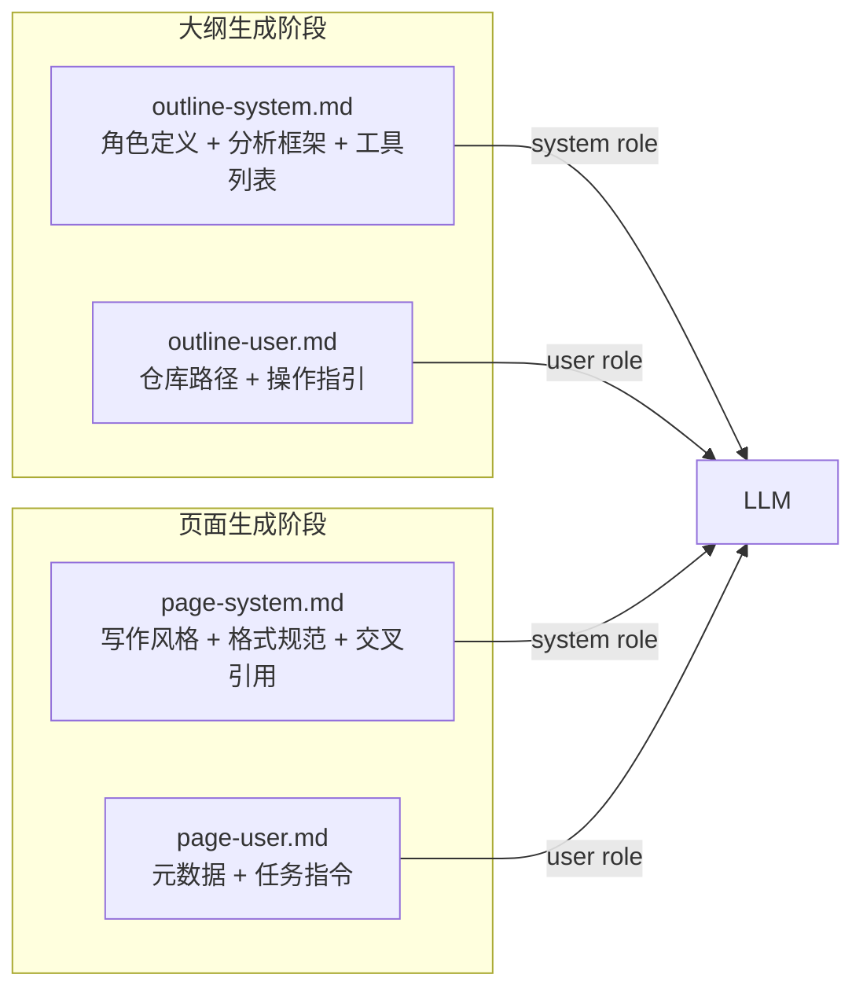
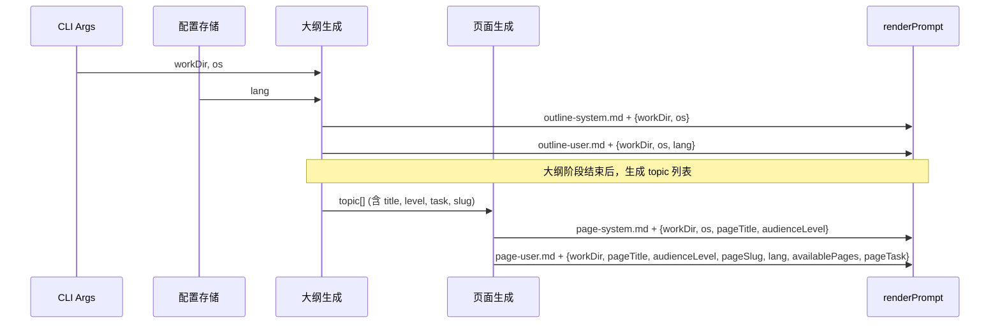

以下是为「提示词模板引擎」页面编写的完整内容：

---

# 提示词模板引擎

**提示词模板引擎**是 wiki-cli 与 LLM 对话的底层基础设施，它将系统提示词拆解为四份模板文件，通过变量插值机制将仓库元数据注入模板，生成最终的 LLM 提示词。该设计实现了**提示词内容**与**运行时数据**的关注点分离，使开发者可以独立修改 LLM 的行为指令而无需改动代码。

## 从代码到提示词：renderPrompt 的三层管道

整个引擎的核心是一个三层函数管道，定义在 [`src/ai/prompts.ts`](../src/ai/prompts.ts) 中：

```typescript
export async function renderPrompt(filename: string, vars: PromptVars): Promise<string> {
  const template = await loadPrompt(filename);
  return fillPrompt(template, vars);
}
```

### 第一层：loadPrompt — 文件系统读取

`loadPrompt` 从 `prompts/` 目录读取模板文件的原始内容。目录路径通过 `__dirname` 相对计算得到：

```typescript
const PROMPTS_DIR = resolve(__dirname, '..', '..', 'prompts');
```

这意味着无论你是在开发模式下运行 TypeScript 源码，还是从 `dist/` 运行编译后的 JavaScript，路径计算始终准确指向项目根目录下的 `prompts/` 文件夹。[来源](../src/ai/prompts.ts#L3-L10)

### 第二层：fillPrompt — 变量插值

`fillPrompt` 遍历 `PromptVars` 字典，对模板中所有 `{{变量名}}` 占位符执行全局正则替换：

```typescript
result = result.replace(new RegExp(`\\{\\{${key}\\}\\}`, 'g'), value);
```

正则模式使用了全局标记 `g`，因此同一变量在模板中出现多次时会全部替换。如果某个 `{{var}}` 在变量字典中不存在，它**保持原样**不替换 — 这种"静默跳过"的行为在设计上是有意为之，让模板可以包含仅在某些上下文中使用的可选变量。[来源](../src/ai/prompts.ts#L19-L25)

### 第三层：renderPrompt — 组合调用

`renderPrompt` 只是前两层的组合封装，一次调用即可完成"读取 → 填充"的完整流程。

## 四模板架构：System/User 的双轴拆分

`prompts/` 目录下的四份模板文件构成了一张 2×2 矩阵：

| | **System 模板**（定义角色与规则） | **User 模板**（给出具体任务） |
|---|---|---|
| **大纲阶段** | [`outline-system.md`](../prompts/outline-system.md) | [`outline-user.md`](../prompts/outline-user.md) |
| **页面阶段** | [`page-system.md`](../prompts/page-system.md) | [`page-user.md`](../prompts/page-user.md) |



### outline-system.md — 定义 LLM 的分析框架

这份模板在系统提示词层面塑造了 LLM 的**角色身份**：它被设定为"资深软件工程师兼技术文档专家"，并获得了完整的分析框架（高层愿景 → 架构剖析 → 受众分析 → 输出 JSON 目录）。模板中嵌入了完整的**可用工具列表**（`list_directory`、`read_file`、`search_in_files` 等），这是 LLM 在后续 Agent 循环中调用工具的权限依据。

**注入变量：** `{{workDir}}`、`{{os}}`（运行时传递仓库路径和操作系统信息）。[来源](../prompts/outline-system.md#L1-L72)

### outline-user.md — 给 LLM 的具体分析任务

这份 User 提示词以"请为以下仓库生成一份高质量的开发者文档目录"开头，直接向 LLM 下达操作指令。与 System 模板不同，User 模板的职责是告诉 LLM **"做什么"**，而 System 模板规定的是 **"你是谁"** 和 **"怎么做"**。

**注入变量：** `{{workDir}}`、`{{os}}`、`{{lang}}`。其中 `{{lang}}` 来自配置的 `config.lang`，控制输出文档的语言。[来源](../prompts/outline-user.md#L1-L16)

### page-system.md — 写作风格与格式规范

这份模板定义了**每一页 Wiki 内容的写作指南**：Diátaxis 内容组织框架、"吸引 → 兴趣 → 欲望 → 行动"的叙事节奏、Mermaid 图表的使用条件、证据标准要求来源标注、以及交叉引用的具体 Markdown 格式。

**注入变量：** `{{workDir}}`、`{{os}}`、`{{pageTitle}}`、`{{audienceLevel}}`。[来源](../prompts/page-system.md#L1-L24)

### page-user.md — 当前页的元数据和任务指令

这是变量最密集的模板，携带了完整的页面上下文：

| 变量 | 含义 | 来源 |
|---|---|---|
| `{{workDir}}` | 仓库工作目录 | CLI 参数 |
| `{{pageTitle}}` | 当前页面标题 | 大纲中的 topic.title |
| `{{audienceLevel}}` | 目标受众难度 | 大纲中的 topic.level |
| `{{pageSlug}}` | 页面标识符 | 由 title 生成的 slug |
| `{{projectSummary}}` | 项目简短概述 | 预留字段 |
| `{{lang}}` | 文档语言 | 配置 config.lang |
| `{{availablePages}}` | 所有页面的交叉引用数据 | 大纲生成的 topic 列表 |
| `{{pageTask}}` | 本页编写任务/指令 | 大纲中的 topic.task |

其中 `{{availablePages}}` 是**最复杂的变量**，它在代码中由所有 topic 拼接成一个 Markdown 列表，每行包含 slug、标题和简介，供 LLM 在写作时进行交叉引用。[来源](../src/commands/generate.ts#L395-L416)

## 两阶段调用序列

引擎在 wiki-cli 的两个生成阶段各调用两次（一次 System + 一次 User），共计四次 `renderPrompt` 调用：

### 大纲阶段 — `generateOutline` 函数

[`src/commands/generate.ts`](../src/commands/generate.ts#L125-L132) 中调用：

```typescript
const systemPrompt = await renderPrompt('outline-system.md', outlineSysVars);
const userPrompt = await renderPrompt('outline-user.md', outlineUserVars);
```

`outlineSysVars` 仅包含 `workDir` 和 `os`；`outlineUserVars` 额外包含 `lang`。这两条提示词组装后作为 LLM 消息数组的 system 和 user 角色发送，驱动 LLM 通过工具调用探索仓库并输出 JSON 格式的文档大纲。[来源](../src/commands/generate.ts#L125-L140)

关于这一阶段的完整流程，参见 [大纲生成：代码理解与结构化输出](大纲生成：代码理解与结构化输出.md)。

### 页面阶段 — `generateOne` 函数

[`src/commands/generate.ts`](../src/commands/generate.ts#L431-L432) 中调用：

```typescript
const systemPrompt = await renderPrompt('page-system.md', pageSysVars);
const userPrompt = await renderPrompt('page-user.md', pageUserVars);
```

`pageSysVars` 包含 `workDir`、`os`、`pageTitle`、`audienceLevel`；`pageUserVars` 则携带更丰富的元数据。每生成一个页面都会独立调用这两个 `renderPrompt`，因此每个页面获得的是定制化的提示词。[来源](../src/commands/generate.ts#L420-L432)

关于页面生成阶段的并行加速机制，参见 [页面生成：逐页输出与并行加速](页面生成：逐页输出与并行加速.md)。

## 变量注入全景图

以下时序图展示了变量从 CLI 参数到模板文件的完整流动路径：



注意 `availablePages` 是在页面阶段开始前，由所有 topic 拼接而成的 Markdown 列表字符串。这意味着每个页面在生成时，都能看到整个 Wiki 的完整目录信息，从而做出准确的交叉引用。[来源](../src/commands/generate.ts#L393-L398)

## 设计亮点

**关注点分离。** System 模板定义 LLM 的角色和能力边界，User 模板下发具体任务。大纲阶段的模板聚焦代码分析能力，页面阶段的模板聚焦文档写作规范。这种分离使得你可以独立修改任一模板而不会影响其他阶段。

**变量即契约。** 模板中出现的每个 `{{var}}` 都对应代码中一个明确的运行时值。这四份模板构成了隐式的"提示词契约"：只要模板和代码中的键名保持一致，整个管道就能正常工作。

**可选变量的容错性。** `fillPrompt` 对未提供的变量采取"保持原样"策略，这使得模板可以声明可选变量而不会出错。例如，`page-user.md` 中的 `{{projectSummary}}` 在当前的代码中被设置为空字符串。

## 下一步

- 如果你想修改 LLM 的角色定义或可用工具，编辑 [outline-system.md](../prompts/outline-system.md)
- 如果你想调整页面写作风格和格式规范，编辑 [page-system.md](../prompts/page-system.md)
- 完整了解模板定制的最佳实践，参见 [提示词定制与优化指南](提示词定制与优化指南.md)
- 想看整个生成流程如何串联，从 [命令调度与生命周期](命令调度与生命周期.md) 开始