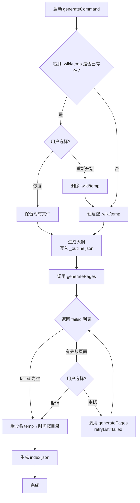

现在我已经完整阅读了 `generate.ts` 的代码以及相关的工具函数。以下是 Wiki 页面内容。

---

# 断点续传与失败重试

Wiki 生成是一个耗时操作——大纲阶段需要多轮 LLM 对话，页面生成阶段可能涉及数十个页面的逐一或并发调用。为了应对网络波动、API 限流或用户主动中断，系统内置了两层韧性机制：**检查点缓存**（防止重复劳动）和 **失败重试循环**（从错误中恢复）。

## 一、检查点机制：每页都是可恢复的

整个生成流程的工作目录是项目根目录下的 `.wiki/`。在页面生成阶段，所有产出的文件**并非直接写入最终目录**，而是先写入一个临时目录 `./wiki/temp/`。

### 1.1 写入时机

每成功生成一个页面，`generatePages` 函数立即将 Markdown 内容写入 `.wiki/temp/{slug}.md`：

```typescript
const pagePath = join(TEMP_DIR, `${slug}.md`);
// ...
await writeTextFile(pagePath, fullContent);
```

同时，大纲（outline）也会在解析成功后写入 `.wiki/temp/_outline.json`，作为整个生成计划的元数据存档。

[来源](../src/commands/generate.ts#L246-L246)
[来源](../src/commands/generate.ts#L404-L410)

### 1.2 恢复检测

当用户重新运行 `wiki-cli generate` 时，`generateCommand` 函数在启动阶段会检测 `.wiki/temp/` 是否已存在：

```typescript
if (existsSync(TEMP_DIR)) {
  const { action } = await inquirer.prompt([
    {
      type: 'list',
      name: 'action',
      message: 'Previous generation temp data found. What do you want to do?',
      choices: [
        { name: '🔄 Resume from last checkpoint', value: 'resume' },
        { name: '🗑️  Discard and start fresh', value: 'fresh' },
      ],
    },
  ]);
}
```

用户有两个选项：

| 选项 | 行为 |
|------|------|
| **恢复（Resume）** | 保留 `.wiki/temp/` 现有文件，继续生成流程。已生成的页面会被跳过。 |
| **重新开始（Fresh）** | 调用 `removeDir(TEMP_DIR)` 清空临时目录，从头开始完整生成。 |

[来源](../src/commands/generate.ts#L38-L57)

### 1.3 跳过已生成页面

恢复模式下，`generatePages` 在开始生成每个页面之前会检查文件是否存在。**仅当是首次生成（非重试）且文件已存在时**，才跳过该页面：

```typescript
if (!options.retryList && existsSync(pagePath)) {
  logInfo(`[${index}/${total}] Skipping already generated: ${topic.title}`);
  return;
}
```

这一判断的微妙之处在于：`retryList` 模式下，即使该页面之前已生成过（比如之前成功但后来又需要重试的场景），也会被强制重新生成。这种设计避免了"重试时跳过失败页面"的逻辑矛盾。

[来源](../src/commands/generate.ts#L402-L406)

### 1.4 生成完成：原子化提交

所有页面生成完成后（包括重试循环结束），系统执行最终的"提交"操作——将 `temp` 目录**重命名**为时间戳目录：

```typescript
const timestamp = getTimestamp();
const finalDir = join('.wiki', timestamp);
await moveDir(TEMP_DIR, finalDir);
logSuccess(`Wiki generated at ${finalDir}`);
```

`getTimestamp()` 生成格式为 `2025-01-15T10-30-00` 的字符串，确保每次生成的 Wiki 目录名称唯一且按时间排序。`moveDir` 底层使用 `rename` 系统调用，在同一个文件系统内是原子操作——要么全部成功，要么全部失败，不存在"目录中文件不完整"的中间状态。

[来源](../src/commands/generate.ts#L129-L133)
[来源](../src/utils/file.ts#L36-L44)
[来源](../src/utils/file.ts#L32-L34)

## 二、失败重试循环：可无限重试

检查点解决的是"中断后恢复"的问题，而重试循环解决的是"生成失败了怎么办"的问题。

### 2.1 失败收集

在 `generatePages` 函数内部，每次 LLM 调用失败（返回 `null`）时，对应的 Topic 会被推入 `failed` 数组：

```typescript
if (fullContent) {
  await writeTextFile(pagePath, fullContent);
  logSuccess(`Generated: ${topic.title}`);
} else {
  failed.push(topic);
  logError(`Failed: ${topic.title}`);
}
```

函数最终将这个 `failed` 数组返回给调用者。

[来源](../src/commands/generate.ts#L409-L417)
[来源](../src/commands/generate.ts#L420-L421)

### 2.2 主循环中的重试逻辑

回到 `generateCommand`，失败的页面会被循环处理：

```typescript
const failed = await generatePages(client, config, workDir, topics, { parallel, concurrency: concurrency || 3 });

while (failed.length > 0) {
  logWarning(`${failed.length} page(s) failed to generate.`);
  const { retry } = await inquirer.prompt([
    {
      type: 'confirm',
      name: 'retry',
      message: 'Retry failed pages?',
      default: true,
    },
  ]);

  if (!retry) break;

  logInfo(`Retrying ${failed.length} page(s)...`);
  const retryResult = await generatePages(client, config, workDir, topics, {
    parallel, concurrency: concurrency || 3, retryList: [...failed],
  });
  failed.length = 0;
  failed.push(...retryResult);
}
```

流程非常清晰：

1. `generatePages` 返回 `failed` 列表（首次调用无 `retryList`）。
2. 若 `failed` 非空，提示用户：是否重试？默认值为 `true`。
3. 用户选择**是**：用 `[...failed]` 作为 `retryList` 重新调用 `generatePages`。注意用扩展运算符创建**副本**，避免引用混淆。
4. 清空原 `failed` 数组（`failed.length = 0`），然后将新返回的失败结果填入（`failed.push(...retryResult)`）。
5. 返回第 2 步，循环直至用户选择**否**或 `failed` 为空。

这个循环没有重试次数上限，理论上用户可以无限重试，直到所有页面生成成功或用户主动取消。

[来源](../src/commands/generate.ts#L90-L115)

### 2.3 重试与检查点的交互

重试模式下，`retryList` 被传入 `generatePages`。如上文 1.3 节所述，这会导致**跳过"文件已存在则跳过"的检查**——每个重试页面都会重新调用 LLM 并覆盖临时目录中的同名文件。这意味着：

- 首次生成中已成功的页面不会被重试（它们不在 `failed` 中）。
- 重试的页面会得到全新的生成结果，旧的失败文件被覆盖。
- 如果重试依然失败，系统继续回到循环等待用户决策。

## 三、整体流程图

以下时序图概括了从启动到完成的完整韧性流程：



## 四、设计要点总结

1. **检查点是文件级别的，不是会话级别的**。每个 `.md` 文件独立存在，恢复时按文件粒度跳过，而非维护一个状态文件。这使得恢复逻辑极其简单——只需检查文件存在性。

2. **临时目录是"事务性"的**。用户中断时，`.wiki/temp/` 处于半完成状态；重命名提交一次完成，不存在不完整的最终结果。这种设计借鉴了数据库的"两阶段提交"思想：先写暂存区，再原子提交。

3. **重试循环是交互式的**。系统不会自动无限重试，而是每轮失败后征求用户意见。用户可以在网络恢复后重试，也可以接受部分失败的结果继续推进。

4. **重试与首次生成共享同一代码路径**。`generatePages` 通过 `retryList` 参数区分两种模式，核心的生成逻辑完全复用。这种设计降低了维护成本，也保证了两种模式下行为的一致性。

关于生成阶段的并行控制与串行流式输出，参见 [页面生成：逐页输出与并行加速](页面生成：逐页输出与并行加速.md)。关于配置与客户端通信的基础设施，参见 [LLM客户端通信协议](llm客户端通信协议.md)。

> **下一步：** 生成完成后如何使用 HTTP 服务器预览 Wiki？参见 [浏览生成的Wiki](浏览生成的wiki.md)。