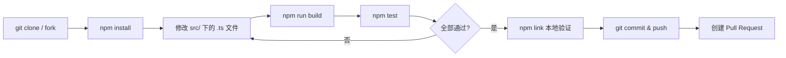

现在所有信息齐备，开始撰写页面。

---

# 贡献指南与开发工作流

本文面向希望参与 `wiki-cli` 开发的贡献者。你将了解从克隆仓库到提交 PR 的完整本地开发流程，包括环境搭建、编译、测试、本地调试以及 ESM 模块系统的关键注意事项。

---

## 前置条件

在开始之前，确保你的开发环境满足以下要求：

- **Node.js >= 18** — 项目 `package.json` 的 `engines` 字段显式声明了此下限，ESM 模块系统和依赖库（如 `chalk@^5`、`ora@^8`）均依赖较新的 Node.js 运行时。
- **npm** 或 **yarn** / **pnpm** — 包管理工具不限，锁定文件为 `package-lock.json`（npm 默认）。

[来源](package.json#L28-L29)

---

## 一、克隆与依赖安装

```bash
git clone <你的 fork 仓库地址>
cd wiki-cli
npm install
```

`npm install` 会安装两大类依赖：

| 类别 | 作用 |
|------|------|
| `dependencies`（运行时） | `commander`（CLI 路由）、`chalk`（彩色日志）、`ora`（进度动画）、`inquirer`（交互式配置）、`marked` + `highlight.js`（浏览模式渲染） |
| `devDependencies`（开发） | `typescript`（编译器）、`vitest`（测试框架）、`@types/node`（类型定义） |

[来源](package.json#L15-L27)

---

## 二、编译：TypeScript → JavaScript

### 构建命令

```bash
npm run build
```

该命令等效于 `tsc`，即直接调用 TypeScript 编译器。

### 源码映射关系

```
src/                    →    dist/
 ├── cli.ts             →     cli.js + cli.d.ts + cli.d.ts.map + cli.js.map
 ├── commands/          →     commands/
 ├── ai/                →     ai/
 ├── utils/             →     utils/
 └── config/            →     config/ (含 default-models.json 拷贝)
```

此映射由 `tsconfig.json` 中的 **rootDir**（`./src`）和 **outDir**（`./dist`）定义。编译器只编译 `src/` 下的 `.ts` 文件，`dist/` 输出目录已在 `.gitignore` 中排除，不纳入版本控制。

### 编译产物说明

`tsconfig.json` 开启了多项输出选项：

- **`declaration: true`** — 生成 `.d.ts` 类型声明文件，供外部消费方使用 TypeScript 时获取类型信息。
- **`declarationMap: true`** + **`sourceMap: true`** — 生成源码映射文件，调试时可定位到原始 `.ts` 代码行号。

[来源](tsconfig.json#L1-L18)

### CI/CD 自动编译

`prepublishOnly` 钩子确保发布前自动执行构建：

```json
"prepublishOnly": "npm run build"
```

当运行 `npm publish` 时，npm 会先触发 `prepublishOnly` 脚本，再执行打包发布。这意味着 `dist/` 目录始终与源码保持同步，无需手动维护。

[来源](package.json#L14)

---

## 三、运行测试

### 执行全部测试

```bash
npm test
```

等效于 `vitest run` — Vitest 以 **单次运行模式** 执行所有测试文件，输出测试结果摘要后退出。

### 监听模式（开发时使用）

```bash
npm run test:watch
```

等效于 `vitest`（无 `run` 参数）— 进入 Watch 模式，文件变更时自动重跑相关测试，适合 TDD 工作流。

### 测试配置

Vitest 配置在项目根目录的 `vitest.config.ts` 中：

```ts
export default defineConfig({
  test: {
    globals: true,           // 全局注入 describe/it/expect，无需手动 import
    environment: 'node',     // Node.js 环境
    include: ['tests/**/*.test.ts'],  // 测试文件匹配模式
  },
});
```

目前有 **6 个测试文件**，覆盖核心模块：

| 测试文件 | 覆盖模块 |
|----------|----------|
| `tests/config-store.test.ts` | 配置持久化逻辑 |
| `tests/file.test.ts` | 文件系统工具集 |
| `tests/llm-client.test.ts` | LLM 客户端通信 |
| `tests/outline-parser.test.ts` | 大纲解析与回退 |
| `tests/prompts.test.ts` | 提示词模板引擎 |
| `tests/tools.test.ts` | 工具调用与 Agent |

[来源](vitest.config.ts#L1-L9) ｜ [来源](tests/)

> 深入了解各测试文件的具体测试策略，参见 [测试策略与覆盖](测试策略与覆盖.md)。

---

## 四、本地运行与调试

构建完成后，你可以通过两种方式在本地测试修改：

### 方式一：使用 `node` 直接运行

```bash
node dist/cli.js --help
```

这种方式不依赖全局安装，适合快速验证编译产物的行为。

### 方式二：使用 `npm link`

```bash
npm link
```

这会将当前项目的 `dist/cli.js` 注册为全局命令 `wiki-cli`。此后在任何目录下运行：

```bash
wiki-cli --help
wiki-cli generate
```

都会执行本地编译后的代码。解除链接使用 `npm unlink -g wiki-cli`。

### 方式三：使用 `npm start`

```bash
npm start
```

等效于 `node dist/cli.js`，是与方式一等价的快捷方式。

[来源](package.json#L11)

> **注意**：修改源码后必须重新执行 `npm run build` 才能生效。建议在开发时开启 TypeScript 的监听编译：`npx tsc --watch`，这样每次保存 `.ts` 文件后自动增量编译到 `dist/`。

---

## 五、ESM 模块系统注意事项

项目 `package.json` 中声明了 `"type": "module"`，意味着整个项目采用 **ESM 模块系统**。这带来了几个与 CommonJS 不同的重要规则：

### 导入语句必须包含文件扩展名

查看 `src/cli.ts` 中的导入语句：

```ts
import { configCommand } from './commands/config.js';
import { generateCommand } from './commands/generate.js';
import { browseCommand } from './commands/browse.js';
import { loadConfig } from './config/config-store.js';
import { logError } from './utils/progress.js';
```

注意：所有**相对路径导入都显式地写明了 `.js` 后缀**，而不是 `.ts`。这是因为 TypeScript 编译后输出的是 `.js` 文件，而 ESM 解析器要求运行时文件路径指向实际存在的 `.js` 文件。TS 编译器在编译时自动保留导入路径中的 `.js` 后缀，不做重写。

[来源](src/cli.ts#L1-L6)

### 关键规则总结

| 场景 | 规则 |
|------|------|
| 导入自己项目中的 `.ts` 文件 | 写 `.js` 后缀（编译后的文件名） |
| 导入 npm 包（如 `commander`） | 写包名即可，无需后缀 |
| 导入 JSON 文件 | 需启用 `resolveJsonModule`（已开启），且注意 ESM 下 JSON 为默认导出 |

### 常见陷阱

- **忘记加 `.js` 后缀**：TypeScript 编译通过但运行时抛出 `ERR_MODULE_NOT_FOUND` 错误。
- **路径大小写不一致**：在 Linux/macOS 上会报错，Windows 有容错但不推荐依赖。
- **使用 `__dirname` 或 `__filename`**：ESM 中不提供这两个全局变量，需使用 `import.meta.url` 替代。

更多跨平台注意事项，参见 [跨平台兼容与路径处理](跨平台兼容与路径处理.md)。

---

## 六、提交流程与 PR 规范

### 开发工作流总览



### 提交指南

1. **分支命名**：使用 `feature/`、`fix/`、`docs/` 前缀，如 `feature/add-gemini-support`。
2. **提交信息**：建议使用 Conventional Commits 格式：`feat: xxx`、`fix: xxx`、`docs: xxx`、`test: xxx`。
3. **检查清单**：
   - [ ] `npm run build` 编译无错误
   - [ ] `npm test` 全部测试通过
   - [ ] 新增功能包含对应的测试用例
   - [ ] 已通过 `npm link` 在真实仓库中验证

---

## 七、发布流程（维护者）

如果你是项目维护者，发布新版本的步骤为：

```bash
# 1. 更新版本号
npm version patch   # 或 minor / major

# 2. 自动触发 prepublishOnly → npm run build
# 3. 发布到 npm registry
npm publish
```

`prepublishOnly` 钩子确保发布前 `dist/` 目录是最新的，避免遗漏编译步骤。

---

## 相关章节

- [项目结构与模块职责](项目结构与模块职责.md) — 深入了解 `src/` 各模块的分层设计
- [测试策略与覆盖](测试策略与覆盖.md) — 测试文件的组织方式与覆盖边界
- [跨平台兼容与路径处理](跨平台兼容与路径处理.md) — ESM + 跨平台开发的更多细节
- [命令行参考手册](命令行参考手册.md) — `wiki-cli` 全部子命令与选项