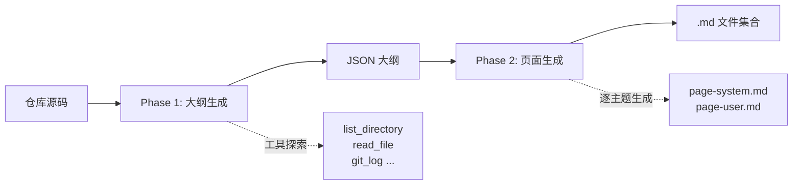
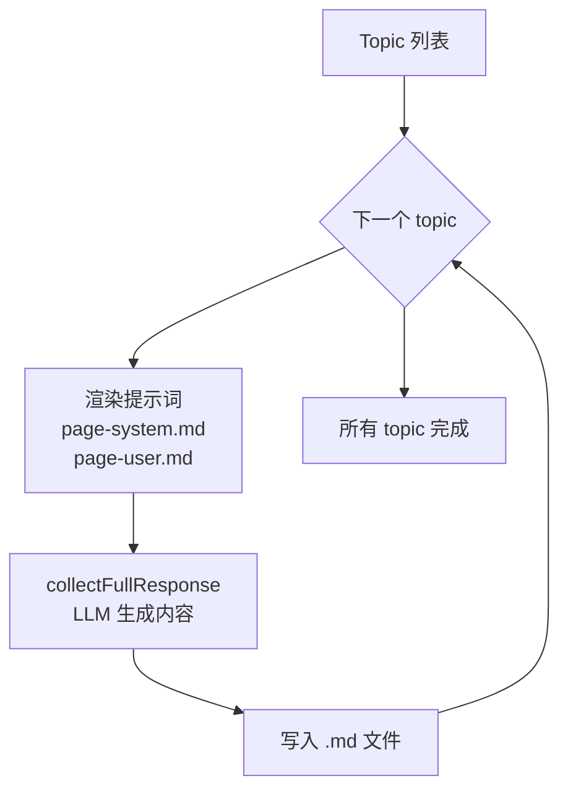

# 两阶段生成流程

Wiki-cli 的文档生成并非一步到位，而是拆解为两个泾渭分明的阶段：**大纲生成**（Phase 1）与 **页面生成**（Phase 2）。这种分离的设计，让 LLM 先在宏观层面理解仓库，再逐页深入实现细节。



---

## Phase 1：大纲生成（`generateOutline`）

### 流程概览

`generateOutline` 函数是入口（`src/commands/generate.ts`），它的核心任务是让 LLM 使用工具充分探索仓库，最终输出一个结构化的 JSON 大纲。

```mermaid
flowchart LR
    A[渲染提示词<br/>outline-system.md<br/>outline-user.md] --> B[LLM 多轮对话<br/>含工具调用]
    B --> C{找到有效 JSON?}
    C -->|是| D[解析为 Topic[]<br/>写入 _outline.json]
    C -->|否| B
```

### 提示词注入

函数首先渲染两个提示词模板：

- **`outline-system.md`**：为 LLM 设定角色（资深软件工程师 + 技术文档专家），提供分析框架（高层愿景 → 架构剖析 → 受众分析 → JSON 输出），并列出 10 个可用工具。
- **`outline-user.md`**：注入环境变量（`workDir`、`os`、`lang`），发出操作指令——使用工具探索项目，然后生成 JSON。

变量插值通过 `renderPrompt` 函数完成，详见 [提示词模板引擎](提示词模板引擎.md)。

[来源](src/commands/generate.ts#L70-L77)

### 多轮对话与工具调用

LLM 并非一次就输出最终 JSON。它可能需要多轮调用工具来充分理解仓库。具体流程：

1. 系统 + 用户消息送入 `collectFullResponse` 函数（下文详述）。
2. 该函数允许 LLM 发起最多 **25 轮** 对话（含工具调用）。
3. 每轮结果追加到 `messages` 数组，构成持续对话上下文。
4. 一旦 LLM 返回了不含工具调用的纯文本响应，`collectFullResponse` 返回该内容。

[来源](src/commands/generate.ts#L79-L108)

### JSON 解析

LLM 常将 JSON 包裹在代码块中（如 ` ```json`），或夹杂额外文字。`parseOutlineJson` 函数处理这些噪音：

1. 调用 `stripCodeFence` 剥离代码块标记。
2. 用正则 `/\{[\s\S]*\}/` 提取第一个 JSON 对象。
3. 解析后按 `sections[].topics[]` 结构遍历，每个 topic 生成一个 `Topic` 对象。

`Topic` 接口包含 `title`、`level`（初学/中级/高级）、`slug`、`section`、`description`、`task` 和可选的 `isGroup` 标记。`slug` 由 `toSlug` 函数从标题自动生成。

解析成功后，完整 JSON 写入 `.wiki/temp/_outline.json` 作为检查点。

[来源](src/commands/generate.ts#L110-L161)
[来源](tests/outline-parser.test.ts#L52-L108)

### 失败恢复

如果 LLM 未能在 25 轮内生成有效 JSON，函数会返回空数组，触发上层报错退出。但已累积的 `finalContent` 会作最终尝试解析。

[来源](src/commands/generate.ts#L100-L108)

---

## Phase 2：页面生成（`generatePages`）

### 流程概览

拿到大纲后，`generatePages` 遍历每个非 group 的 topic，为每个 topic 调用 LLM 生成独立 `.md` 文件。



### 提示词注入

每个 topic 的提示词由两部分组成：

**`page-system.md`**——系统提示词，定义作者角色（架构分析型技术作者）、内容原则（Diátaxis 框架、叙事节奏、证据标准）、视觉规范（Mermaid、表格、粗体）和工具使用策略。注入变量：`workDir`、`os`、`pageTitle`、`audienceLevel`。

**`page-user.md`**——用户提示词，注入全部上下文，包括：
- `workDir`、`pageTitle`、`audienceLevel`、`pageSlug`
- `lang`（文档语言）
- `projectSummary`（项目概述）
- **`availablePages`**：所有其他页面的交叉引用列表，格式为 `- slug: xxx.md | 标题: xxx | 简介: xxx`。这确保了生成的每个页面都知道其他页面的存在，从而实现交叉引用。
- **`pageTask`**：来自大纲中该 topic 的 `task` 字段，是 LLM 生成该页面的具体指令。

[来源](src/commands/generate.ts#L197-L216)
[来源](prompts/page-system.md)
[来源](prompts/page-user.md)

### 文件写入

LLM 返回的内容直接写入 `.wiki/temp/{slug}.md`。如果该文件已存在（来自之前的断点），则跳过——这是 [断点续传与并行生成](断点续传与并行生成.md) 的基础机制。

[来源](src/commands/generate.ts#L218-L228)

### 失败重试

生成失败的 topic 会被收集到 `failed` 数组。所有 topic 遍历完后，用户可选择重试失败项。重试时 `generatePages` 的 `retryList` 参数会传入失败列表，跳过已成功的页面。

[来源](src/commands/generate.ts#L40-L54)

---

## `collectFullResponse`：管理多轮工具调用的核心

无论是 Phase 1 还是 Phase 2，与 LLM 的交互都通过 `collectFullResponse` 函数进行。它的职责是：**在一个逻辑的"请求-响应"单元内，处理 LLM 可能发起的多轮工具调用**。

### 运作机制

```
1. 发送当前消息列表给 LLM
2. 接收响应（流式或非流式）
   ├─ 包含文本内容 → 累积到 currentContent
   ├─ 包含推理过程 → 累积到 currentReasoning（流式时实时输出）
   └─ 包含工具调用 → 解析并存入 toolCallsMap
3. 检查是否有工具调用
   ├─ 有 → 执行每个工具，结果追加到 messages，回到步骤 1
   └─ 无 → 返回累积的文本内容，结束循环
4. 最多迭代 30 轮（maxToolIterations），防止无限循环
```

[来源](src/commands/generate.ts#L163-L260)

### 流式 vs 非流式

参数 `stream` 控制两种模式：

| 维度 | 流式模式 | 非流式模式 |
|------|---------|-----------|
| 输出 | 实时输出 content/reasoning 到终端 | 等待完整响应后一次性返回 |
| 工具调用 | 分块累积（按 index 合并） | 一次性获取完整 tool_calls |
| 适用场景 | Phase 1 和串行 Phase 2 | 并行 Phase 2（无终端输出） |
| 错误处理 | 流中断返回 null | 网络异常走重试逻辑 |

在流式模式下，工具调用的参数可能被拆分成多个 chunk，函数通过 `toolCallsMap` 按 `index` 合并分块：

```typescript
// 按 index 或 id 合并分块
const key = tc.index !== undefined ? `_idx_${tc.index}` : tc.id;
if (toolCallsMap.has(key)) {
    const existing = toolCallsMap.get(key)!;
    existing.function.arguments += tc.function.arguments;
}
```

[来源](src/commands/generate.ts#L190-L199)

### 工具执行链路

当 LLM 发起工具调用时，`collectFullResponse` 依次：

1. 将带有 `tool_calls` 的 assistant 消息加入 `messages`。
2. 遍历每个工具调用，解析参数，调用 `executeToolCall` 执行。
3. 将工具执行结果作为 `role: 'tool'` 的消息加入 `messages`。
4. 继续下一轮循环，将累积的消息再次发送给 LLM。

`executeToolCall` 函数（定义在 `tools.ts`）维护了一个 `toolHandlers` 映射表，支持 10 个只读工具。详见 [工具调用系统](工具调用系统.md)。

[来源](src/commands/generate.ts#L233-L258)
[来源](src/ai/tools.ts#L258-L271)

### JSON Mode 支持

当配置中 `jsonMode` 为 `true` 时，`LLMClient` 会在请求体中附加 `response_format: { type: 'json_object' }`，要求 LLM 以 JSON 格式响应。Phase 1 的 `generateOutline` 使用此模式来提升 JSON 输出的可靠性。

[来源](src/commands/generate.ts#L83)
[来源](src/ai/llm-client.ts#L53-L55)

---

## 提示词模板对应关系

`prompts/` 目录下的 5 个模板文件分别服务于不同的生成阶段和模式：

| 模板文件 | 所属阶段 | 角色 | 注入变量 |
|---------|---------|------|---------|
| `outline-system.md` | Phase 1 大纲 | 系统提示词 | `workDir`, `os` |
| `outline-user.md` | Phase 1 大纲 | 用户提示词 | `workDir`, `os`, `lang` |
| `page-system.md` | Phase 2 页面 | 系统提示词 | `workDir`, `os`, `pageTitle`, `audienceLevel` |
| `page-user.md` | Phase 2 页面 | 用户提示词 | `workDir`, `pageTitle`, `audienceLevel`, `pageSlug`, `projectSummary`, `lang`, `availablePages`, `pageTask` |
| `ai-system.md` | AI 问答 | 系统提示词 | `workDir`, `os`, `wikiInfo`, `wikiTools` |

`ai-system.md` 专用于交互式 AI 问答模式（参见 [AI 问答交互](ai-问答交互.md)），与生成流程无关。

[来源](src/ai/prompts.ts#L7-L10)

---

## 最后产出

Phase 2 完成后，`generateCommand` 执行收尾工作：

1. 将 `.wiki/temp/` 目录重命名为时间戳目录（如 `.wiki/2025-01-15T14-30-00/`）。
2. 调用 `generateIndex` 基于原始 `topics` 数据生成 `index.json`，记录所有页面的标题、级别、描述、章节归属。
3. `index.json` 被 [本地 HTTP 服务器](本地-http-服务器实现.md) 和浏览器端用于构建导航菜单，同时也是 [多版本管理与索引](多版本管理与索引.md) 的数据基础。

[来源](src/commands/generate.ts#L56-L65)
[来源](src/commands/generate.ts#L278-L300)

---

## 推荐阅读

- [生成 Wiki 文档](生成-wiki-文档.md) —— 从用户视角看一键生成的完整流程
- [断点续传与并行生成](断点续传与并行生成.md) —— 生成中断恢复与并发控制机制
- [提示词模板引擎](提示词模板引擎.md) —— `renderPrompt` 的实现细节
- [LLM 客户端核心实现](llm-客户端核心实现.md) —— 流式与非流式通信的底层封装
- [工具调用系统](工具调用系统.md) —— 10 个只读工具的完整定义与实现