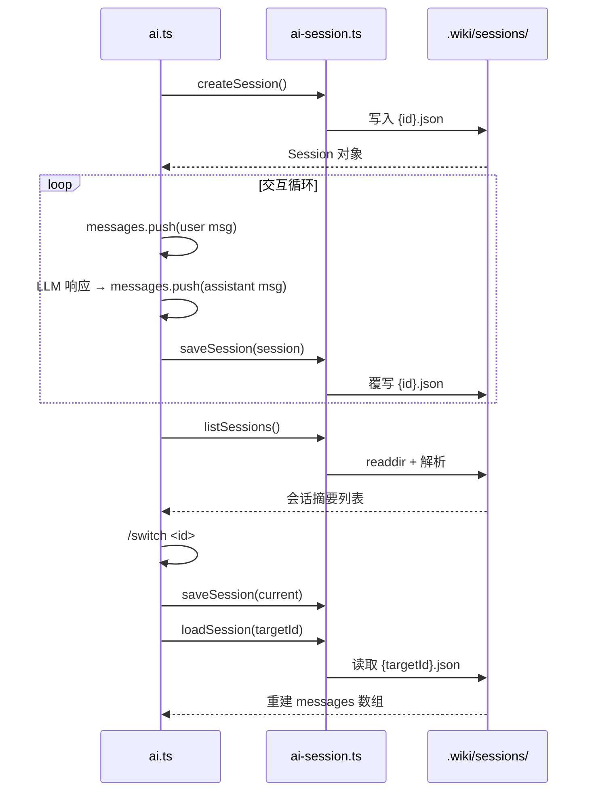

# 交互式 AI 会话管理

会话（Session）是 AI 问答交互的状态容器。在 `wiki-cli` 中，每个会话将用户与 LLM 的对话历史持久化为独立文件，支持多会话并行、切换与回溯。这一机制解耦了对话状态与 CLI 进程生命周期：即使进程退出，所有上下文仍保留在磁盘上，下一次 `wiki-cli ai` 可完整恢复。

---

## Session 接口：对话的原子单元

`Session` 定义在 `ai-session.ts` 中，是所有会话操作的统一数据契约：

```typescript
export interface Session {
  id: string;
  created: string;
  updated: string;
  summary: string;
  messages: ChatMessage[];
}
```

五个字段各司其职：

| 字段 | 类型 | 语义 |
|------|------|------|
| `id` | `string` | 8 字符唯一标识符，由 `generateSessionId` 生成 |
| `created` | `string` | ISO 8601 创建时间戳 |
| `updated` | `string` | ISO 8601 最后更新时间戳，每次 `saveSession` 自动刷新 |
| `summary` | `string` | 会话摘要，默认 "新会话"，交互中取第一条非命令用户消息的前 60 字符 |
| `messages` | `ChatMessage[]` | 对话历史，按时间顺序排列的完整消息数组 |

`ChatMessage` 接口定义在 `llm-client.ts` 中，涵盖 `system` / `user` / `assistant` / `tool` 四种角色，以及 `tool_calls` 和 `reasoning_content` 等扩展字段，完整支持 LLM Function Calling 与推理模型。

[来源](ai-session.ts#L3-L11) | [来源](llm-client.ts#L4-L12)

---

## 会话生命周期：从创建到销毁

会话管理围绕六个核心函数展开，构成一个完整的 CRUD 闭环。

### ensureSessionsDir —— 存储地基

```typescript
const SESSIONS_DIR = '.wiki/sessions';

export async function ensureSessionsDir(): Promise<void> {
  if (!existsSync(SESSIONS_DIR)) {
    await mkdir(SESSIONS_DIR, { recursive: true });
  }
}
```

所有会话文件存放于 `.wiki/sessions/` 目录，与 Wiki 文档的 `.wiki` 根目录共享同一位置。这保证了 `wiki-cli` 的多个子命令共享一致的工作区布局。[查看更多](多版本管理与索引.md)

该函数在每次写操作前被调用，具备幂等性——目录已存在时不做任何事。

[来源](ai-session.ts#L13-L17)

### createSession —— 会话的诞生

```typescript
export async function createSession(): Promise<Session> {
  await ensureSessionsDir();
  const id = generateSessionId();
  const now = new Date().toISOString();
  const session: Session = { id, created: now, updated: now, summary: '新会话', messages: [] };
  await writeFile(sessionPath(id), JSON.stringify(session, null, 2), 'utf-8');
  return session;
}
```

创建流程：确保目录存在 → 生成唯一 ID → 打时间戳 → 初始化为空消息列表 → 立即写盘。空的 `messages` 数组意味着创建时 LLM 还未收到任何提示词——system prompt 是在运行时动态注入的。

[来源](ai-session.ts#L25-L33)

### saveSession —— 状态的快照

```typescript
export async function saveSession(session: Session): Promise<void> {
  session.updated = new Date().toISOString();
  await ensureSessionsDir();
  await writeFile(sessionPath(session.id), JSON.stringify(session, null, 2), 'utf-8');
}
```

每次保存自动刷新 `updated` 时间戳。写盘使用 `JSON.stringify(session, null, 2)` 带缩进格式，方便人工阅读和调试。

[来源](ai-session.ts#L62-L66)

### loadSession —— 反序列化恢复

```typescript
export async function loadSession(id: string): Promise<Session | null> {
  try {
    const raw = await readFile(sessionPath(id), 'utf-8');
    return JSON.parse(raw) as Session;
  } catch {
    return null;
  }
}
```

文件不存或 JSON 损坏时返回 `null`，而非抛异常。调用方需处理 `null` 分支——如 `commands/ai.ts` 中检查 `!existing` 后打印错误并 return。

[来源](ai-session.ts#L57-L61)

### deleteSession —— 清理

```typescript
export async function deleteSession(id: string): Promise<boolean> {
  const p = sessionPath(id);
  if (!existsSync(p)) return false;
  await rm(p);
  return true;
}
```

删除操作返回布尔值表示是否实际删除了文件。CLI 层面通过 `--delete` 参数调用此函数，并据此显示成功或错误消息。

[来源](ai-session.ts#L68-L73)

### listSessions —— 枚举与排序

```typescript
export async function listSessions(): Promise<{ id: string; created: string; updated: string; summary: string }[]> {
  if (!existsSync(SESSIONS_DIR)) return [];
  const files = await readdir(SESSIONS_DIR);
  // ... 过滤 .json 文件，JSON.parse，跳过损坏文件
  sessions.sort((a, b) => new Date(b.updated).getTime() - new Date(a.updated).getTime());
  return sessions;
}
```

枚举时，返回值是 `Session` 的投影子集（不含 `messages`），避免将大量对话数据载入内存。按 `updated` 降序排列，最新会话排在最前。损坏文件静默跳过。

[来源](ai-session.ts#L35-L55)

---

## generateSessionId：8 字符 UUID 的设计权衡

```typescript
export function generateSessionId(): string {
  return randomUUID().slice(0, 8);
}
```

使用 Node.js `crypto.randomUUID()` 生成标准 UUID v4，取其前 8 字符作为会话 ID。

设计考虑：

1. **碰撞概率可接受**：8 字符十六进制 = 32 位，约 42.9 亿种组合。在个人使用场景下（通常数十到数百个会话），碰撞概率极低。
2. **可读性**：8 字符短 ID 方便人眼记忆和键盘输入，`/switch a3f8c2d1` 远优于粘贴完整 UUID。
3. **免依赖**：`crypto.randomUUID()` 自 Node.js 19+ 为内置 API，无需额外依赖。

**权衡**：32 位空间在分布式或多用户场景下不足，但 `wiki-cli` 是本地单用户工具，这一取舍合理。

[来源](ai-session.ts#L22-L24)

---

## printSession 与 showSessionsTable：两种展示策略

两个函数针对不同场景设计，分别服务于"回顾单次会话"和"浏览会话列表"。

### printSession —— 时序叙事

```typescript
export function printSession(session: Session): void {
  for (const msg of session.messages) {
    if (msg.role === 'user') {
      const text = msg.content || '';
      if (!text.startsWith('/')) {
        console.log(`\n  ${'─'.repeat(50)}`);
        console.log(`  You > ${text}`);
      }
    } else if (msg.role === 'assistant') {
      const text = msg.content || '';
      const preview = text.length > 200 ? text.slice(0, 200) + '...' : text;
      console.log(`  AI  > ${preview}`);
    }
  }
}
```

输出用户和助手的交替对话，构成"问题→回答"的时间线。三个细节：

- **过滤斜杠命令**：以 `/` 开头的用户消息被视为内部命令而非提问，不展示。这避免了 `/help`、`/save` 等命令污染回放视图。
- **AI 回答截断**：超过 200 字符的助手消息被截断并追加 `...`，让回放保持概要性。完整内容可查看 JSON 文件。
- **分隔线**：每条用户消息前输出 `─` 分隔线，视觉上区分对话轮次。

### showSessionsTable —— 紧凑列表

```typescript
export function showSessionsTable(sessions): void {
  for (const s of sessions) {
    const date = new Date(s.updated).toLocaleString('zh-CN', { month: '2-digit', day: '2-digit', hour: '2-digit', minute: '2-digit' });
    console.log(`  ${s.id}  ${date}  ${s.summary.slice(0, 40)}`);
  }
}
```

三列布局：ID | 更新时间（MM/DD HH:mm）| 摘要（前 40 字符）。时间格式使用 `zh-CN` locale，空会话列表时显示提示文字。不加载 `messages` 字段，适合快速列出数十甚至上百个会话。

[来源](ai-session.ts#L75-L92) | [来源](ai-session.ts#L94-L103)

---

## `/switch` 命令：messages 数组的重构逻辑

当用户在交互式终端中输入 `/switch <id>`，`commands/ai.ts` 中的 `interactiveLoop` 会执行会话切换。核心问题：**切换后 messages 数组如何重建？**

```typescript
// 简化自 commands/ai.ts 第 249 行附近
if (command === 'switch' && parts[1]) {
  const existing = await loadSession(parts[1]);
  if (!existing) {
    logError(`Session ${parts[1]} not found.`);
    continue;
  }
  await saveSession(session);   // ① 保存当前会话
  session = existing;           // ② 切换 Session 引用
  messages = [{ role: 'system', content: messages[0].content }, ...session.messages.slice(1)];
  //                    ↑ 保留当前 system prompt          ↑ 目标会话的历史（去掉第一条消息）
  logSuccess(`切换到会话 ${session.id} (${session.summary})`);
}
```

关键步骤：

1. **保存当前会话**：`saveSession(session)` 确保切换前当前进度不丢失。
2. **切换引用**：`session = existing` 将当前指针指向刚加载的旧会话。
3. **重构 messages 数组**：
   - 保留**当前** system prompt（`messages[0].content`），而非使用目标会话存储的旧 system prompt。
   - 取目标会话的 `session.messages.slice(1)`，即去掉其存储的第一条消息（通常是旧的 system prompt）。
   - 拼接结果：`[新system, 目标会话的历史...]`

这种设计意图明确：**system prompt 始终由当前运行环境动态生成**（包含项目路径、Wiki 版本信息、操作系统等变量），而对话历史属于上次中断的上下文，两者来自不同时空。保留当前 system prompt 确保 LLM 获得最新、最准确的上下文信息。[查看更多](提示词模板引擎.md)

同理，`/new` 命令也使用了相同的 system prompt 保留模式：

```typescript
if (command === 'new') {
  await saveSession(session);
  session = await createSession();
  messages = [{ role: 'system', content: messages[0].content }];  // 清空历史，保留 system
  logSuccess(`新会话已创建 (${session.id})`);
}
```

[来源](commands/ai.ts#L249-L263) | [来源](commands/ai.ts#L267-L273)

---

## 会话生命周期总览



---

## 推荐阅读

- [AI 问答交互](ai-问答交互.md) —— 了解会话如何在问答流程中运转
- [LLM 客户端核心实现](llm-客户端核心实现.md) —— `ChatMessage` 接口的底层通信细节
- [多版本管理与索引](多版本管理与索引.md) —— `.wiki` 目录的完整结构设计
- [提示词模板引擎](提示词模板引擎.md) —— system prompt 的动态渲染与变量注入
- [工具调用系统](工具调用系统.md) —— `tool_calls` 消息的生成与消费