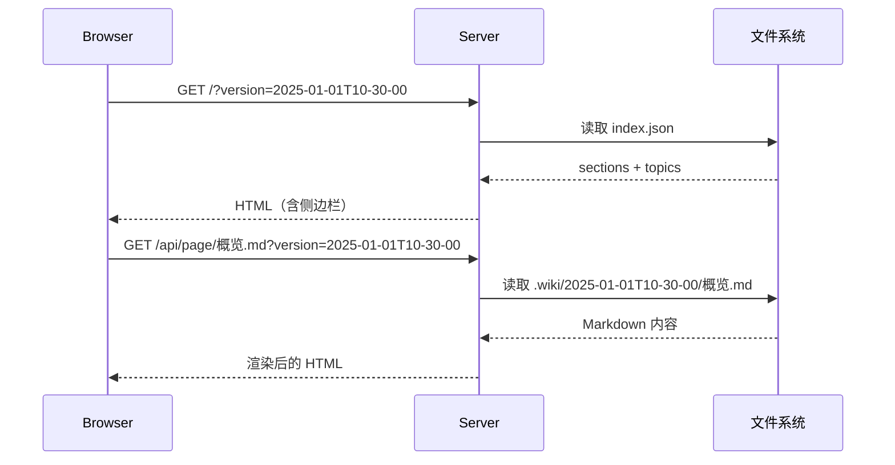

Wiki 的每一次生成都会创建一个独立的时间戳目录作为版本快照，配套的 `index.json` 文件记录文档结构，浏览器端通过 `?version=` 参数在不同版本间切换。这套机制让你既能**回溯历史**，又能**对比差异**。

---

## 时间戳目录

每次运行 `wiki-cli generate`，生成流程的最终阶段会调用 `getTimestamp()` 获取当前时间字符串，然后将临时目录 `.wiki/temp` 重命名为 `.wiki/YYYY-MM-DDThh-mm-ss/`。

### getTimestamp()

`getTimestamp()` 在 [file.ts](src/utils/file.ts#L46-L56) 中定义，返回格式化的本地时间：

```typescript
export function getTimestamp(): string {
  const now = new Date();
  const y = now.getFullYear();
  const M = String(now.getMonth() + 1).padStart(2, '0');
  const d = String(now.getDate()).padStart(2, '0');
  const h = String(now.getHours()).padStart(2, '0');
  const m = String(now.getMinutes()).padStart(2, '0');
  const s = String(now.getSeconds()).padStart(2, '0');
  return `${y}-${M}-${d}T${h}-${m}-${s}`;
}
```

关键设计细节：

- **`T` 作为日期与时间的分隔符**，源自 ISO 8601 标准，一眼可读。
- **`:` 被替换为 `-`**，因为 Windows 文件系统不允许冒号出现在文件名中。
- **字母序等同时间序**：`2025-01-01T10-30-00` 按字符串排序时，恰好与时间先后一致。这是浏览器端获取"最新版本"得以使用 `.sort().reverse()` 的前提。

### moveDir

生成完成后，以下代码将临时目录迁移为版本目录：

```typescript
const timestamp = getTimestamp();
const finalDir = join('.wiki', timestamp);
await moveDir(TEMP_DIR, finalDir);
logSuccess(`Wiki generated at ${finalDir}`);
```

`moveDir` 本质上是 `fs.rename` 的同名封装 [来源](src/utils/file.ts#L34-L36)：

```typescript
export async function moveDir(src: string, dest: string): Promise<void> {
  await rename(src, dest);
}
```

由于源和目标在同一文件系统（`.wiki` 目录内），`rename` 是 O(1) 操作——无论文件数量多少，瞬间完成。关于临时目录在生成过程中的作用，参见[](两阶段生成流程.md)和[](断点续传与并行生成.md)。

### 目录结构一览

多次生成后，`.wiki/` 下的布局如下：

```
.wiki/
├── 2025-01-01T10-30-00/
│   ├── index.json
│   ├── 概览.md
│   ├── 快速开始.md
│   └── ...
├── 2025-01-01T11-45-00/
│   ├── index.json
│   ├── 概览.md
│   ├── 快速开始.md
│   └── ...
└── 2025-01-01T13-20-00/
    ├── index.json
    ├── 概览.md
    ├── 快速开始.md
    └── ...
```

每个目录都是一个**完整的、自包含的快照**，包含该次生成的所有 Markdown 页面和索引文件。

---

## index.json：文档结构的序列化快照

每次生成的最后一步调用 `generateIndex()`，将大纲中的 `sections` 和 `topics` 序列化为 `index.json` [来源](src/commands/generate.ts#L274-L294)：

```typescript
async function generateIndex(wikiDir: string, topics: Topic[]): Promise<void> {
  const jsonOut: { sections: { name: string; topics: any[] }[] } = { sections: [] };
  const sections = [...new Set(topics.map(t => t.section).filter(Boolean))];

  for (const section of sections) {
    const sectionTopics = topics.filter(t => t.section === section);
    const items: any[] = [];

    for (const topic of sectionTopics) {
      if (topic.isGroup) {
        items.push({ type: 'group', title: topic.title });
      } else {
        const entry: any = { level: topic.level, title: topic.title };
        if (topic.description) entry.description = topic.description;
        if (topic.task) entry.task = topic.task;
        items.push(entry);
      }
    }

    jsonOut.sections.push({ name: section, topics: items });
  }

  await writeTextFile(join(wikiDir, 'index.json'), JSON.stringify(jsonOut, null, 2));
}
```

生成的 JSON 结构如下：

```json
{
  "sections": [
    {
      "name": "入门指南",
      "topics": [
        { "level": "初学", "title": "快速开始", "description": "..." },
        { "type": "group", "title": "高级主题" },
        { "level": "高级", "title": "架构设计", "description": "..." }
      ]
    }
  ]
}
```

设计要点：

| 要素 | 说明 |
|------|------|
| **sections** | 大纲中的章节划分，保持原有顺序 |
| **topics** | 章节内的文档条目，**不包含 slug**（由浏览器端通过 `slugify(title)` 实时计算） |
| **group** | 分组标记，在侧边栏渲染为灰色分组标题而非可点击链接 |
| **level** | 受众水平，浏览器端渲染为 🟢🟡🔴 徽章 |

浏览器启动时，`loadSidebar()` 优先读取 `index.json`，若不存在则回退解析 `index.md` [来源](src/commands/browse.ts#L163-L180)。关于侧边栏渲染细节，参见[](浏览器端-spa-体验.md)。

---

## 浏览时的版本切换

浏览器端通过两段逻辑实现版本管理：**启动时确定最新版本** 和 **运行时按参数切换**。

### 启动时读取版本列表

[`browseCommand()`](src/commands/browse.ts#L14-L19) 启动时扫描 `.wiki/` 目录：

```typescript
const entries = await readdir(wikiDir, { withFileTypes: true });
const timestamps = entries
  .filter(e => e.isDirectory() && e.name !== 'temp')
  .map(e => e.name)
  .sort()
  .reverse();

const latest = timestamps[0];
```

- `readdir` 列出所有子目录
- 过滤掉 `temp`（临时目录）
- `.sort().reverse()` 利用时间戳字符串的字典序与时间序一致的特性，取第一个作为最新版本

### ?version= 参数切换

服务器端通过 `getVersionFromUrl()` 解析请求中的版本参数 [来源](src/commands/browse.ts#L55-L63)：

```typescript
function getVersionFromUrl(reqUrl: string): string {
  const u = new URL(reqUrl, `http://localhost:${port}`);
  return u.searchParams.get('version') || latest;
}
```

所有 API 路由（如 `/api/page/概览.md`）都依赖 `version` 参数确定从哪个目录读取文件。核心链路如下：



### 前端版本切换 UI

浏览器端通过 `/api/versions` 接口获取所有版本列表，渲染为遮罩层 [来源](src/commands/browse.ts#L204-L209)：

```html
<!-- 服务器端渲染版本切换面板 -->
${buildVersionsHtml(allVersions, currentVersion)}
```

点击某个版本时触发全局跳转：

```javascript
function switchVersion(ts) {
  window.location.href = '/?version=' + ts;
}
```

版切换面板的 UI 实现在 `buildVersionsHtml()` 函数中，当前版本标记为高亮 [来源](src/commands/browse.ts#L241-L244)。关于浏览器端 SPA 的整体架构，参见[](浏览器端-spa-体验.md)。

### 版本不存在时的行为

服务器不会校验版本有效性——如果传入一个不存在的版本字符串，文件读取会返回 404，最终页面显示"Page not found"。

---

## 设计权衡

| 决策 | 理由 |
|------|------|
| **整个目录拷贝而非增量存储** | 每次生成快照完整，无需 diff 计算，读取路径简单 |
| **文件名中 `:` → `-`** | Windows 兼容性 |
| **index.json 不存 slug** | 减少索引体积，slug 由标题实时计算，避免冗余 |
| **不提供版本间 diff** | 保持服务器逻辑极简，用户可通过外部 diff 工具自行比较 |

---

## 下一步

- 了解生成流程如何产生这些文件：[](生成-wiki-文档.md)
- 了解浏览器端如何渲染侧边栏并加载页面：[](浏览器端-spa-体验.md)
- 了解大纲阶段如何产生 `sections` 和 `topics`：[](两阶段生成流程.md)