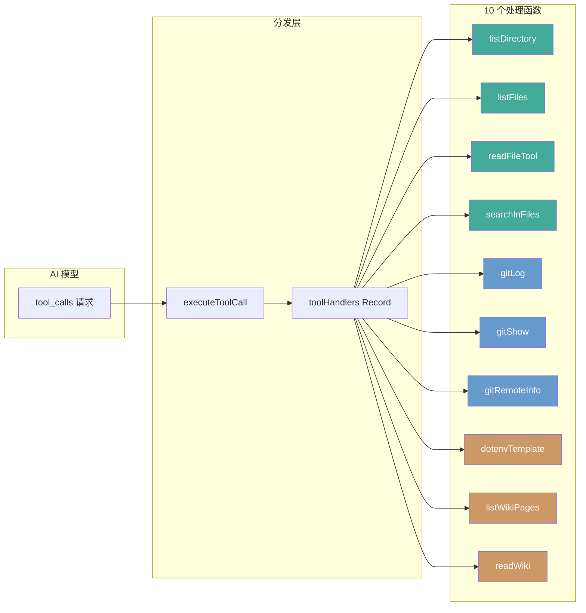

# 工具调用系统

工具调用系统是 wiki-cli 中 LLM Function Calling 的完整实现，它为 AI 模型提供了 **10 个只读代码探索工具**。这套系统以极小的代码表面定义了工具 Schema、实现了分发路由、并构建了多层安全屏障，是 AI 能够自主浏览仓库、阅读文件、查询 Git 历史和执行 Wiki 操作的能力基础。

---

## 工具定义：JSON Schema 格式

所有工具的元数据集中在 `toolDefinitions` 数组中，每个元素遵循 OpenAI 的 **Function Calling** 规范：

```typescript
interface ToolDefinition {
  type: 'function';
  function: {
    name: string;
    description: string;
    parameters: Record<string, any>;  // JSON Schema 对象
  };
}
```

`type` 固定为 `'function'`，`parameters` 采用 JSON Schema 子集描述参数结构，支持 `type`、`properties`、`required`、`nullable` 和 `items`（数组元素类型）。LLM 根据 description 语义决定何时调用哪个工具，系统按 `required` 数组校验入参完整性。

[来源](src/ai/tools.ts#L8-L20)

---

## 十个工具一览

| 工具名 | 用途 | 必填参数 | 可选参数 | 返回值 |
|--------|------|----------|----------|--------|
| `list_directory` | 获取目录结构树（递归） | `dir_path` | `max_depth`（默认 3） | 嵌套的 `{name, type, children}` 树 |
| `list_files` | 列出目录下所有文件（扁平） | `path` | `extensions`（如 `[".ts",".js"]`） | 文件路径数组 `string[]` |
| `read_file` | 读取文件内容，支持行范围切片 | `file_path` | `start_line`, `end_line` | 文件文本 `string` |
| `search_in_files` | 正则搜索文件内容（忽略大小写） | `path`, `pattern` | `extensions` | `{file, line, content}[]` |
| `git_log` | 获取 Git 提交历史（oneline 格式） | 无 | `max_count`（默认 20）, `path` | 提交列表文本 |
| `git_show` | 显示 Git 对象详情（commit/blob/tree/tag） | `object` | `path`（commit 内路径） | 对象内容文本 |
| `git_remote_info` | 获取远程仓库信息 | 无 | 无 | `{name, url, type}[]` |
| `dotenv_template` | 读取 `.env.example` 模板文件 | 无 | 无 | 文件文本 |
| `list_wiki_pages` | 列出所有 Wiki 页面 slug | 无 | 无 | 格式化页面列表 |
| `read_wiki` | 按 slug 读取 Wiki 页面内容 | `slug` | 无 | Markdown 文本 |

所有工具统一返回 `ToolResult` 对象：`{ type: 'success' | 'error', data: any }`，调用方通过 `type` 字段判断执行结果。

[来源](src/ai/tools.ts#L22-L143)

---

## 分发模式：toolHandlers Record

执行入口是 `executeToolCall(name, args)` 函数：

```typescript
export async function executeToolCall(name: string, args: any): Promise<ToolResult> {
  const handler = toolHandlers[name];
  if (!handler) {
    return { type: 'error', data: `Unknown tool: ${name}` };
  }
  return handler(args);
}
```

`toolHandlers` 是一个 **`Record<string, (args: any) => Promise<ToolResult>>`**，以工具名为键直接索引到对应的实现函数。这是一种**策略模式（Strategy Pattern）**的轻量实现——零分支的纯映射分发，新增工具只需在数组中追加定义和对应处理函数，无需修改任何条件逻辑。

[来源](src/ai/tools.ts#L409-L420)

### 调用链集成

两处消费方共享同一套工具系统：

- **`命令系统设计`(命令系统设计.md) —— 交互式 AI 会话**：`ai.ts` 根据是否已生成 Wiki 动态裁剪工具列表——无 Wiki 时隐藏 `list_wiki_pages` 和 `read_wiki`，避免模型误用。在 `interactiveLoop` 中，AI 每次回复若包含 `tool_calls`，系统逐个执行并将结果追加到消息列表，循环至模型主动回复或达到最大迭代次数。
- **`两阶段生成流程`(两阶段生成流程.md)**：`generate.ts` 在生成流程中同样调用 `executeToolCall`，将结果注入上下文供后续生成使用。

[来源](src/commands/ai.ts#L75-L78) | [来源](src/commands/ai.ts#L207-L214) | [来源](src/commands/generate.ts#L357-L367)

---

## 只读安全保障

整个工具系统被设计为 **纯只读（read-only）**，没有任何工具具备写入能力。安全策略分三层：

### 1. `resolve()` 路径验证

所有涉及文件路径的工具（`list_directory`、`list_files`、`read_file`、`search_in_files`）在操作前使用 `path.resolve()` 将用户输入解析为绝对路径。这防止了 **路径穿越攻击（Path Traversal）**——即使 LLM 被诱导传入 `../../etc/passwd` 这样的路径，`resolve()` 也会将其解析为文件系统上的实际路径，但系统并未做白名单限制（即不限定在项目目录内），这是当前设计的一个权衡点。

```typescript
const absPath = resolve(filePath);
if (!existsSync(absPath)) {
  return { type: 'error', data: `File not found: ${filePath}` };
}
```

[来源](src/ai/tools.ts#L157-L161)

### 2. `.gitignore` 风格过滤

遍历目录时硬编码跳过两类内容：

```typescript
if (item.name.startsWith('.') || item.name === 'node_modules') continue;
```

前缀 `.` 的文件/目录（隐藏文件）和 `node_modules` 被排除在 `list_directory`、`list_files`、`search_in_files` 之外。这是针对 Node.js 项目的务实安全策略——隐藏文件通常包含敏感配置（如 `.env`），而 `node_modules` 体积巨大且内容无架构分析价值。

[来源](src/ai/tools.ts#L92-L93) | [来源](src/ai/tools.ts#L126-L127) | [来源](src/ai/tools.ts#L227-L228)

### 3. Git 只读操作

三个 Git 工具全部使用 **纯读取命令**：

| 工具 | 执行的命令 | 只读保证 |
|------|-----------|----------|
| `git_log` | `git log --oneline --max-count=N` | 仅 `log`，无副作用 |
| `git_show` | `git show <object>:<path>` | 仅显示对象内容 |
| `git_remote_info` | `git remote -v` | 仅列出远程 URL |

命令通过 `execSync` 执行，`cwd` 固定为 `process.cwd()`。没有 `git commit`、`git push`、`git reset` 等写操作入口。

[来源](src/ai/tools.ts#L251-L253) | [来源](src/ai/tools.ts#L262-L265) | [来源](src/ai/tools.ts#L272-L278)

### 4. Wiki 读操作隔离

`list_wiki_pages` 和 `read_wiki` 操作仅限于 `.wiki/` 目录下的最新版本子目录，通过 `findLatestWikiDir()` 按文件名排序找到最大版本号目录，不会读取 `.wiki` 之外的文件。

```typescript
const WIKI_DIR = '.wiki';
const dirs = entries.filter(e => e.isDirectory() && e.name !== 'temp').map(e => e.name).sort().reverse();
return dirs.length > 0 ? join(WIKI_DIR, dirs[0]) : null;
```

[来源](src/ai/tools.ts#L291-L302) | [来源](src/ai/tools.ts#L307-L345)

---

## 错误边界设计

每个工具实现函数都被包裹在 `try/catch` 中，任何异常都不会向上传播，而是以标准 `ToolResult` 错误形式返回给 LLM：

```typescript
try {
  // 业务逻辑
  return { type: 'success', data: ... };
} catch (err: any) {
  return { type: 'error', data: err.message };
}
```

LLM 收到错误后可自主决定重试、调整参数或向用户报告。此模式避免了进程崩溃，也让 AI 具有了**容错与自愈能力**。

[来源](src/ai/tools.ts#L147-L153)

---

## 架构洞察



系统设计的核心原则是**最小暴露原则（Principle of Least Exposure）**——工具数量和参数设计刚好覆盖架构分析所需，不提供任何写能力，不暴露危险功能（如 shell 执行、文件写入、网络请求）。这使得 AI 可以在沙箱内安全地探索代码仓库。

---

## 下一步

- 查看 [`LLM 客户端核心实现`](llm-客户端核心实现.md) 了解工具定义如何传递给 OpenAI 兼容 API
- 阅读 [`流式通信与 SSE 解析`](流式通信与-sse-解析.md) 理解多轮工具调用的流式处理机制
- 探索 [`交互式 AI 会话管理`](交互式-ai-会话管理.md) 了解工具调用结果如何持久化到会话历史