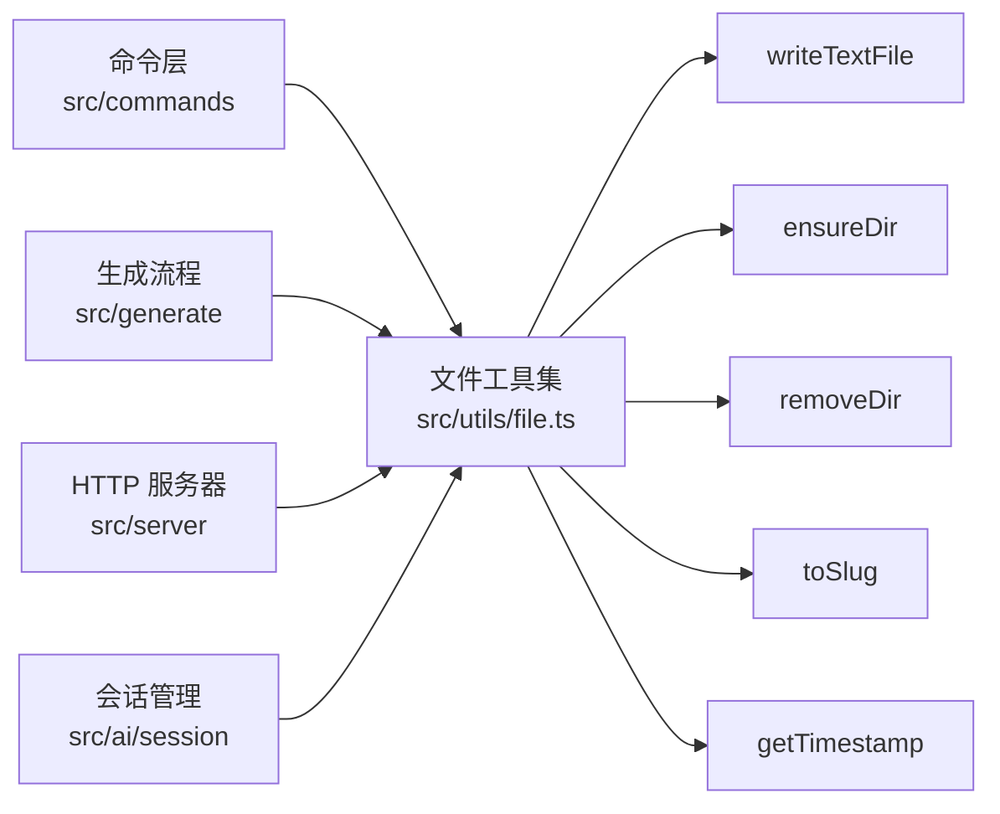

## 设计理念

文件操作是 CLI 工具的基础设施层。`src/utils/file.ts` 封装了 8 个异步函数和 2 个同步工具函数，覆盖了 wiki-cli 在[两阶段生成流程](两阶段生成流程.md)中涉及的所有文件操作场景：目录保障、文件读写、目录管理、路径转换。所有函数都基于 Node.js 原生的 `node:fs/promises` API，不做额外依赖，保持零外部开销。

[来源](../src/utils/file.ts#L1-L2)

---

## 函数全景

| 函数 | 类型 | 用途 | 底层 API |
|------|------|------|----------|
| `ensureDir` | async | 确保目录存在 | `mkdir({recursive:true})` |
| `fileExists` | async | 检查文件是否存在 | `existsSync` |
| `readTextFile` | async | 读取 UTF-8 文本 | `readFile` |
| `writeTextFile` | async | 写入 UTF-8 文本，自动创建父目录 | `writeFile` |
| `removeDir` | async | 递归删除目录 | `rm({recursive,force})` |
| `listDir` | async | 列出目录内容 | `readdir` |
| `moveDir` | async | 移动/重命名目录 | `rename` |
| `getTimestamp` | 同步 | 生成 ISO 风格时间戳 | `Date` |
| `toSlug` | 同步 | 生成 Slug，支持中文 | 正则替换 |

[来源](../src/utils/file.ts#L1-L47)

---

## 核心函数详解

### `writeTextFile` —— 自动创建父目录

这是项目中最常用的写文件函数。它的特别之处在于：写入前自动确保父目录存在。

```typescript
export async function writeTextFile(filePath: string, content: string): Promise<void> {
  await ensureDir(filePath.split(sep).slice(0, -1).join(sep));
  await writeFile(filePath, content, 'utf-8');
}
```

技巧在于 `filePath.split(sep).slice(0, -1).join(sep)` 这行：

1. **`split(sep)`** —— 按路径分隔符（Windows 为 `\`，POSIX 为 `/`）切分路径字符串为数组。例如 `"/a/b/c.md"` → `["", "a", "b", "c.md"]`。
2. **`slice(0, -1)`** —— 剔除最后一个元素（文件名），只保留目录部分。得到 `["", "a", "b"]`。
3. **`join(sep)`** —— 重构为路径字符串：`"/a/b"`。

这避免了每次写文件前手动检查目录存在性的样板代码。在[页面生成](生成-wiki-文档.md)和[断点续传](断点续传与并行生成.md)中，大量页面文件通过此函数写入，目录结构自动建立，无需预先规划。

[来源](../src/utils/file.ts#L13-L16)

### `removeDir` —— 安全递归删除

```typescript
export async function removeDir(dirPath: string): Promise<void> {
  if (existsSync(dirPath)) {
    await rm(dirPath, { recursive: true, force: true });
  }
}
```

先检查路径是否存在，再执行递归删除。`force: true` 确保即使目标不存在或权限不足也不会抛出异常。在[多版本管理与索引](多版本管理与索引.md)中，清理旧版本目录时依赖此函数的安全特性。

[来源](../src/utils/file.ts#L23-L27)

### `getTimestamp` —— ISO 风格时间戳

```typescript
export function getTimestamp(): string {
  // ...
  return `${y}-${M}-${d}T${h}-${m}-${s}`;
}
```

输出格式如 `2024-01-15T14-30-25`。与标准 ISO 8601 的区别在于**冒号被替换为连字符**（`T14-30-25` 而非 `T14:30:25`），这是为了兼容文件系统命名——Windows 和某些 Linux 文件系统不允许文件名中含有冒号。该时间戳用作 Wiki 版本标识符。

[来源](../src/utils/file.ts#L32-L39)

### `toSlug` —— 中文友好的 Slug 生成

```typescript
export function toSlug(title: string): string {
  return title
    .toLowerCase()
    .replace(/[^\w\u4e00-\u9fff]+/g, '-')
    .replace(/^-+|-+$/g, '')
    || 'untitled';
}
```

正则分两步解析：

1. **`/[^\w\u4e00-\u9fff]+/g`** —— 匹配一个或多个**非**单词字符（`\w` 等价于 `[a-zA-Z0-9_]`）**且非**中文字符（`\u4e00-\u9fff` 覆盖 CJK 统一表意文字区段）的连续片段，统一替换为单个连字符 `-`。例如 `"文件工具集.md"` → `"文件工具集-md"`。

2. **`/^-+|-+$/g`** —— 修剪首尾多余的连字符。如果连字符在开头或结尾，会被清除。例如 `"-hello-world-"` → `"hello-world"`。

3. `|| 'untitled'` —— 兜底方案：如果上述替换后结果为空字符串（例如输入全为特殊符号），返回 `'untitled'` 作为默认值。

这个函数生成的 Slug 就是 Wiki 页面文件名，用于[本地 HTTP 服务器](本地-http-服务器实现.md)的 URL 路由和[浏览器端 SPA](浏览器端-spa-体验.md)的导航链接。

[来源](../src/utils/file.ts#L41-L47)

---

## 与其他模块的协作关系



- 命令层使用 `writeTextFile` 保存[配置](配置存储与模型清单.md)，使用 `removeDir` 清理输出目录。
- [生成流程](两阶段生成流程.md)使用 `writeTextFile` 写入每个页面文件，使用 `ensureDir` 创建版本目录。
- [HTTP 服务器](本地-http-服务器实现.md)使用 `readTextFile` 加载 Markdown 页面，使用 `listDir` 列举版本列表。
- [会话管理](交互式-ai-会话管理.md)使用 `writeTextFile` 和 `readTextFile` 持久化对话历史。

[来源](../src/commands/generate.ts#L50-L81) | [来源](../src/server/index.ts#L30-L60)

---

## 下一步推荐

- 理解两阶段流程如何消费这些文件操作：[两阶段生成流程](两阶段生成流程.md)
- 了解版本目录如何组织：[多版本管理与索引](多版本管理与索引.md)
- 查看完整的测试覆盖：[测试策略与实践](测试策略与实践.md)