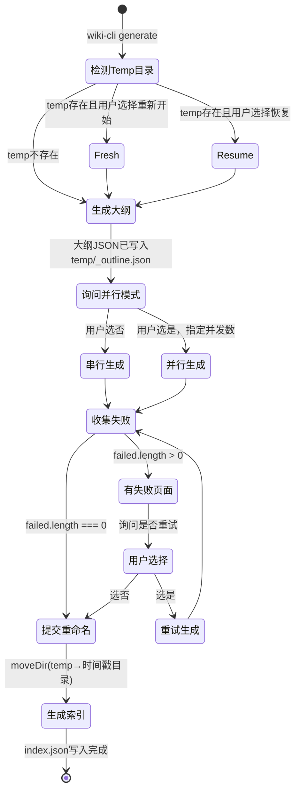

以下是用 Markdown 格式编写的页面内容。

---

# 断点续传与并行生成

生成一个完整 Wiki 通常涉及数十次 LLM 调用，每次调用耗时数秒到数十秒。当生成中途因网络波动、API 限流或用户主动中断而失败时，重新从头再来是不可接受的。为此，系统设计了两个相互配合的韧性机制：**检查点缓存**解决"中断后如何恢复"的问题，**并行生成**解决"速度太慢"的问题。

## 检查点：文件级断点续传

整个生成过程的工作目录是项目根目录下的 `.wiki/`。在页面生成阶段，所有产出的文件并不直接写入最终目录，而是先写入一个临时目录作为缓冲区：

```typescript
const TEMP_DIR = '.wiki/temp';
```

[来源](../src/commands/generate.ts#L12-L12)

### 恢复检测

每次运行 `wiki-cli generate` 时，`generateCommand` 函数在启动阶段第一条逻辑就是检测 `.wiki/temp/` 是否已存在：

```typescript
if (existsSync(TEMP_DIR)) {
  const { action } = await inquirer.prompt([...]);
}
```

用户面对两个选择：

| 选项 | 行为 | 适用场景 |
|------|------|----------|
| 🔄 **Resume** | 保留现有文件，继续生成。已生成的 `.md` 文件被跳过，不重新调用 LLM。 | 上次中断后大多数页面已完成，只想补完剩余的。 |
| 🗑️ **Fresh** | 调用 `removeDir(TEMP_DIR)` 递归删除整个临时目录，从头开始。 | 大纲已变更，或想用不同的 LLM 配置重新生成。 |

选择 Fresh 后，代码执行 `removeDir(TEMP_DIR)` 清空目录，随后 `ensureDir(TEMP_DIR)` 重建空目录。选择 Resume 则什么也不做——保留现有文件结构直接进入下一阶段。

[来源](../src/commands/generate.ts#L38-L60)

### 跳过已生成页面的逻辑

在 `generatePages` 内部，每个页面生成前都会检查文件是否已经存在于临时目录中：

```typescript
const pagePath = join(TEMP_DIR, `${slug}.md`);
if (!options.retryList && existsSync(pagePath)) {
  if (!options.parallel) {
    logInfo(`[${index}/${total}] Skipping already generated: ${topic.title}`);
  }
  return;
}
```

这个检查有两层含义：

1. **仅非重试模式才跳过**——`!options.retryList` 确保重试循环中即使文件已存在也会强制重新生成，因为文件可能来自上次失败的"残片"。
2. **跳过日志仅在串行模式下打印**——并行模式下为了避免输出混乱，静默跳过。

[来源](../src/commands/generate.ts#L402-L408)

### 原子化提交

所有页面生成完成（包括重试循环结束）后，系统执行最终的"提交"操作——将 `temp` 目录**重命名**为一个时间戳目录：

```typescript
const timestamp = getTimestamp();
const finalDir = join('.wiki', timestamp);
await moveDir(TEMP_DIR, finalDir);
```

`getTimestamp()` 生成 `2025-01-15T10-30-00` 格式的字符串，确保每次生成的目录名称唯一且按时间排序。`moveDir` 底层使用文件系统的 `rename` 系统调用——在同一个文件系统分区内，这是一个原子操作：要么全部移动成功，要么失败抛出异常，不存在目录中文件不完整的中间状态。

[来源](../src/commands/generate.ts#L129-L133)
[来源](../src/utils/file.ts#L32-L34)
[来源](../src/utils/file.ts#L48-L50)

## 并行生成：并发控制与流式取舍

在正式进入 Phase 2（页面生成）之前，`generateCommand` 会通过 `inquirer` 询问用户是否采用并行模式：

```typescript
const { parallel, concurrency } = await inquirer.prompt([
  {
    type: 'confirm',
    name: 'parallel',
    message: 'Generate pages in parallel? (faster, no streaming output)',
    default: false,
  },
  {
    type: 'number',
    name: 'concurrency',
    message: 'Number of concurrent page generations:',
    default: 3,
    when: (answers: any) => answers.parallel,
    validate: (input: any) =>
      (input as number) > 0 && (input as number) <= 10
        ? true
        : 'Enter a number between 1 and 10',
  },
]);
```

[来源](../src/commands/generate.ts#L76-L89)

### 串行 vs 并行的取舍

| 维度 | 串行模式 | 并行模式 |
|------|----------|----------|
| **流式输出** | 逐字流式输出到终端，可视化进度 | 无流式输出，仅完成时打一条日志 |
| **速度** | 慢，一次一个 LLM 调用 | 快，并发高达 10 个请求 |
| **并发限制** | 1 | 3–10（用户可配） |
| **错误可观测性** | 高，实时看到每步输出 | 低，只能看到最终成功/失败 |
| **适用场景** | 调试、观察 LLM 行为 | 批量生成，追求吞吐量 |

核心权衡是：**流式输出需要独占终端**，并行模式下多个流式输出会互相干扰，因此并行模式自动关闭流式，改为批量写入 + 完成后一次性打印成功消息。

### runConcurrent：轻量级并发池

并行模式下，`generatePages` 调用 `runConcurrent` 函数来控制并发上限：

```typescript
async function runConcurrent(
  tasks: (() => Promise<void>)[],
  concurrency: number
): Promise<void> {
  const running = new Set<Promise<void>>();
  const queue = [...tasks];

  while (queue.length > 0 || running.size > 0) {
    while (running.size < concurrency && queue.length > 0) {
      const task = queue.shift()!;
      const p = task().finally(() => running.delete(p));
      running.add(p);
    }
    if (running.size > 0) {
      await Promise.race(running);
    }
  }
}
```

这个实现是一个**经典的令牌桶模式**：

1. 用 `Set<Promise<void>>` 跟踪当前运行中的任务。
2. 当运行数 < 并发上限时，从队列头部取出任务并启动。
3. 每个任务完成后通过 `.finally()` 从 `Set` 中自动移除自己。
4. 当槽位满时，通过 `Promise.race(running)` 等待任意一个任务完成，释放一个槽位后继续填充。
5. 循环直到队列为空且所有运行中任务完成。

并发数的取值范围被限制在 **1 到 10** 之间。1 退化为串行但保留了并行模式的非流式特征；10 是上限，避免同时向 LLM API 发出过多请求导致限流（429 Too Many Requests）。

[来源](../src/commands/generate.ts#L429-L441)

## 生成过程的完整状态机

以下状态机图展示了一次 `wiki-cli generate` 从启动到完成的全部可能路径：



## 失败重试循环

检查点解决的是"中断后恢复"，而重试循环解决的是"调用失败后怎么办"。`generatePages` 每次调用都返回一个失败页面的列表：

```typescript
const failed = await generatePages(client, config, workDir, topics, {
  parallel,
  concurrency: concurrency || 3,
});

while (failed.length > 0) {
  logWarning(`${failed.length} page(s) failed to generate.`);
  const { retry } = await inquirer.prompt([
    {
      type: 'confirm',
      name: 'retry',
      message: 'Retry failed pages?',
      default: true,
    },
  ]);

  if (!retry) break;

  const retryResult = await generatePages(client, config, workDir, topics, {
    parallel,
    concurrency: concurrency || 3,
    retryList: [...failed],
  });
  failed.length = 0;
  failed.push(...retryResult);
}
```

重试时会用 `[...failed]` 创建副本传入 `retryList`，然后清空原数组并填入新的失败结果。这个循环**没有重试次数上限**——用户可以一直重试直到所有页面成功，或选择接受部分失败的结果。

[来源](../src/commands/generate.ts#L90-L115)

## 设计要点总结

1. **检查点是文件级的，不是会话级的**。每个 `.md` 文件独立存在，恢复时按文件粒度跳过，无需维护状态文件。这使得恢复逻辑极其简单——只需检查文件存在性。

2. **临时目录是"两阶段提交"式的缓冲区**。用户中断时，`.wiki/temp/` 处于半完成状态；重命名提交一次性完成，不存在不完整的最终结果。这是数据库事务思想在文件系统中的朴素应用。

3. **并行与重试的组合**。重试时复用同样的并行/串行配置——如果你首次生成选择了 5 并发，重试时也会用 5 并发重试失败的页面。这种一致性降低了认知负担。

4. **并发上限 10 是合理的安全边界**。大多数 LLM API（如 OpenAI、DeepSeek）的免费或标准 Tier 允许的并发请求数在 3–10 之间，超过这个范围容易触发 429 限流。详见 [LLM 客户端核心实现](llm-客户端核心实现.md) 中的指数退避重试策略。

---

> **推荐阅读：**[两阶段生成流程](两阶段生成流程.md) 详细解释了 `generateOutline` 和 `generatePages` 两个阶段的完整协作链路。[生成 Wiki 文档](生成-wiki-文档.md) 提供了从用户视角看生成流程的端到端说明。[多版本管理与索引](多版本管理与索引.md) 解释了生成完成后，`.wiki/<timestamp>/` 目录结构和 index.json 的生成逻辑。