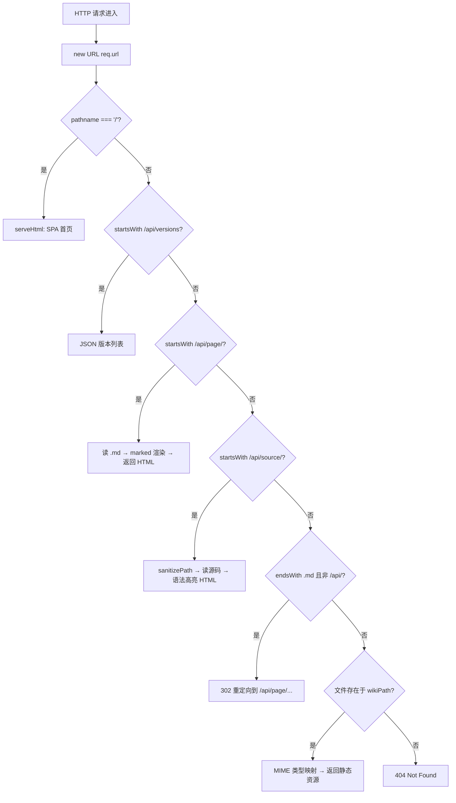

现在我将编写这个 Wiki 页面，聚焦于纯 Node.js HTTP 服务器的实现细节——路由分发、安全策略和端口探测。

---

# 本地 HTTP 服务器实现

整个 `browse` 命令的核心是一个**零依赖的 HTTP 服务器**——不依赖 Express、Koa 或 Fastify，直接使用 Node.js 原生 `http.createServer` 构建。这个决定看似朴素，却在本地预览场景中展现出清晰的工程合理性：无需处理中间件栈的编排，不需要 JSON body 解析，没有会话管理需求。六条路由以线性 `if-return` 链组织，每一个 `return` 都是对请求的终结。

```typescript
import { createServer, IncomingMessage, ServerResponse } from 'node:http';
```

[来源](src/commands/browse.ts#L4-L4)

---

## 路由表：线性分发与优先级排序

服务器创建在 `browseCommand` 函数内部（~L74），每次请求进入时先解析 `URL` 对象获取 `pathname`，然后以严格顺序逐一匹配。



这种结构的核心设计原则是**先精确后模糊、先 API 后静态**。`/api/versions`、`/api/page/`、`/api/source/` 三个路径以相同前缀开头，分别通过额外路径段区分；`.md` 重定向路由必须排在静态文件路由之前，确保 Markdown 文件不会直接被当作纯文本返回。

### `/` → SPA 首页

根路径是浏览入口。`serveHtml` 函数（~L191-L238）一次性完成三项工作：

1. **加载侧边栏**：调用 `loadSidebar`，先尝试 `index.json`（新格式），失败则回退到 `index.md`（XML 格式），具体解析流程详见 [](侧边栏导航与索引解析.md)
2. **渲染首屏内容**：读取侧边栏第一篇文章的 `.md` 文件，用 `marked.parse` 转为 HTML，调用 `fixContentReferences` 替换源码引用标记
3. **嵌入前端 SPA 逻辑**：将侧边栏 HTML、文章内容、版本列表、内联 CSS/JS 统一包裹在一个完整的 HTML 文档中返回。前端 JavaScript 包含 `loadPage()`、`switchVersion()`、URL hash 解析、内部链接点击拦截等逻辑

[来源](src/commands/browse.ts#L88-L95)

### `/api/versions` → JSON 版本列表

返回所有已生成 Wiki 版本的 JSON 数组，每个元素包含时间戳和当前版本标记：

```json
[
  { "ts": "20250101_123456", "current": true },
  { "ts": "20241231_235959", "current": false }
]
```

前端 `showVersions()` 函数调用此 API 渲染版本切换覆盖层。用户点击某个旧版本时，`switchVersion(ts)` 通过 `window.location.href = '/?version=' + ts` 触发整页刷新，服务器根据 `version` 查询参数切换 `wikiPath`。

[来源](src/commands/browse.ts#L97-L104)

### `/api/page/<slug>` → Markdown 渲染

此路由负责将单个 Wiki 页面渲染为 HTML。路径解析逻辑为 `decodeURIComponent(pathname.slice(10)).replace(/\.md$/, '')`——先去掉 `/api/page/` 前缀（10 个字符），解码 URL 编码，再去除文件扩展名，最终得到 slug。

```
请求         /api/page/本地-HTTP-服务器实现.md
解码后       pathname.slice(10)           → "本地-HTTP-服务器实现.md"
去扩展名     replace(/\.md$/, '')         → "本地-HTTP-服务器实现"
文件路径     join(wikiPath, "本地-HTTP-服务器实现.md")
```

读取到的 Markdown 内容经 `marked.parse` 转为 HTML，再调用 `fixContentReferences` 将 `[来源：路径]` 文本替换为指向 `/api/source/` 的可点击链接。若文件不存在，返回 404。

**注意**：`decodeURIComponent` 确保中文 slug 和空格（如 `安装与配置详解`）能正确解码；显式 `.md` 扩展名的剥离意味着 `/api/page/slug` 和 `/api/page/slug.md` 都能命中同一文件。

[来源](src/commands/browse.ts#L105-L117)

### `/api/source/<path>` → 源码浏览

此路由暴露的是项目源码，而非 Wiki 内容。路径解析为 `decodeURIComponent(pathname.slice(12))`（去掉 `/api/source/` 前缀），然后执行 `sanitizePath` 防穿越校验（见下文安全分析）。校验通过后读取文件内容，包裹在语法高亮 HTML 模板中返回。

语言自动检测由 `extToLang` 函数（~L246-L254）完成，建立从扩展名到 Highlight.js `language-*` 类的映射：

```typescript
const map: Record<string, string> = {
  '.ts': 'typescript', '.js': 'javascript', '.json': 'json',
  '.md': 'markdown',   '.yml': 'yaml',      '.yaml': 'yaml',
  '.html': 'html',     '.css': 'css',       '.sh': 'bash', '.bash': 'bash',
};
```

未映射的扩展默认使用 `plaintext`。

[来源](src/commands/browse.ts#L119-L132)

### `.md` 结尾路径 → 302 重定向

对于以 `.md` 结尾但不在 `/api/` 前缀下的路径（如用户直接访问 `/本地-HTTP-服务器实现.md`），服务器返回 **302 临时重定向**到规范的 API 路径：

```
302 → /api/page/encodeURIComponent(slug).md?version=...
```

此设计的目的是兼容性：当 Wiki 页面内引用了其他 `.md` 文件的相对路径时（例如 Markdown 原生链接 `[参考](其他页面.md)`），服务器自动将其导向渲染后的 HTML 页面。

[来源](src/commands/browse.ts#L134-L139)

### 静态文件兜底

对于以上路由均未匹配且存在于 `wikiPath` 下的文件（如图片、CSS 等），使用 MIME 类型映射表提供静态服务。关键约束是**排除了 `.md`**——所有 `.md` 文件已被前一条路由拦截。

[来源](src/commands/browse.ts#L141-L149)

### 404 兜底

六条路由均未奏效，返回纯文本 `Not found`，状态码 404。

[来源](src/commands/browse.ts#L151-L153)

---

## MIME 类型映射：轻量级内容协商

`mimeTypes` 定义在服务器创建前，是一个简单的记录类型（Record）对象：

```typescript
const mimeTypes: Record<string, string> = {
  '.html': 'text/html; charset=utf-8',
  '.css':  'text/css',
  '.js':   'application/javascript',
  '.md':   'text/markdown; charset=utf-8',
  '.png':  'image/png',
  '.jpg':  'image/jpeg',
  '.svg':  'image/svg+xml',
};
```

[来源](src/commands/browse.ts#L55-L64)

设计上的几个观察点：

- **仅 7 种类型**：覆盖 Wiki 页面所需的全部静态资源。没有引入 `mime-types` npm 包，因为本项目生成的静态资源类型是确定的。未知扩展名默认使用 `application/octet-stream`。
- **`.md` 在表中但永不生效**：如前所述，`.md` 文件在静态服务之前已被重定向路由拦截。这条记录的存在更多是语义完整性。
- **显式指定 `charset=utf-8`**：仅对文本类 MIME 设置了字符集，二进制资源（图片）不需要。

这种做法在泛用性上有局限——如果 `.wiki` 目录下出现了 `.webp` 或 `.woff2` 文件，服务器仍可返回，但 MIME 类型会错误地标记为 `application/octet-stream`。考虑到 Wiki 生成流程不产出此类资源，这个取舍是合理的。

---

## sanitizePath：纵深防御防目录穿越

`/api/source/` 接受任意路径作为输入，这是**攻击面最大的一条路由**。恶意用户或存在跨站脚本漏洞的外部页面可能构造 `../../etc/passwd` 之类的路径，试图读取项目根目录之外的文件。

`sanitizePath` 函数位于源码末尾（~L239-L244），采用两层安全校验：

```typescript
function sanitizePath(rawPath: string): string | null {
  const cleaned = rawPath.replace(/^[/\\]+/, '');
  const normalized = normalize(cleaned).replace(/^(\.\.(\/|\\))+/g, '');
  const resolved = resolve(PROJECT_ROOT, normalized);
  if (!resolved.startsWith(PROJECT_ROOT + sep) && resolved !== PROJECT_ROOT) return null;
  return normalized;
}
```

### 第一层：首字符清理

```
rawPath:   "//../../etc/passwd"
cleaned:   "../../etc/passwd"        // remove leading slashes
```

`replace(/^[/\\]+/, '')` 移除路径开头的斜杠或反斜杠序列。这一步防止空路径元素导致的 `resolve` 行为异常——`resolve('/usr', '//foo')` 在某些系统上的行为与预期不同。

### 第二层：规范化与 `../` 前缀清除

```
cleaned:     "../../etc/passwd"
normalized:  "../../../../etc/passwd"    // normalize resolves ".." but keeps leading ones
             → "etc/passwd"              // after regex replace leading ../
```

`normalize` 将路径规范化（消除 `.` 和多余分隔符）。但 `normalize` 不会消除开头的 `../` 序列——`path.normalize('../../foo')` 返回 `'../../foo'`。因此需要额外的 `replace(/^(\.\.(\/|\\))+/g, '')` 移除所有连续的前导 `../`。

**这层是不够的**：如果输入是 `foo/../../etc/passwd`，`normalize` 会先解析为 `../etc/passwd`，然后 `replace` 移除前导 `../`，最终变成 `etc/passwd`——这正是期望的安全行为。但如果输入是 `foo/../../../etc/passwd`，`normalize` 会返回 `../../etc/passwd`，`replace` 移除前导 `../` 后变成 `etc/passwd`。所以对于这类通过目录先上升再下降的路径，这层保护是有效的。

### 第三层：绝对路径边界校验（核心防线）

```
normalized:  "etc/passwd"
resolved:    resolve("/home/user/project", "etc/passwd") 
             → "/home/user/project/etc/passwd"
校验:        startsWith("/home/user/project/") → true ✅
             
normalized:  "../../etc/passwd"
经过 replace → "etc/passwd"  
resolved:    "/home/user/project/etc/passwd" ✅  // 同上了
```

真正的安全屏障在 `startsWith` 检查。`resolve(PROJECT_ROOT, normalized)` 将相对路径与项目根拼接为绝对路径，然后验证结果是否以 `PROJECT_ROOT + sep` 开头（或在极少数情况下等于 `PROJECT_ROOT` 本身）。只要文件系统没有符号链接导致 `resolve` 路径偏离 `PROJECT_ROOT`，任何越界尝试都会被挡回。

**边界情况**：`resolved !== PROJECT_ROOT` 的存在是为了允许根路径自身（不带子路径）的访问。由于安全函数返回 `null` 时调用方返回 403 Forbidden，而非试图读取文件，这个校验是严格且安全的。

[来源](src/commands/browse.ts#L239-L244)

---

## findFreePort：递归端口探测

端口探测使用了一个经典技巧：创建一个临时 `http.Server` 实例尝试监听目标端口，根据 `listening` 和 `error` 事件决定成功或重试。

```typescript
async function findFreePort(preferred: number): Promise<number> {
  return new Promise((resolve) => {
    const srv = createServer();
    srv.listen(preferred, () => {                    // 尝试监听
      const addr = srv.address();
      if (addr && typeof addr === 'object') {
        srv.close(() => resolve(addr.port));          // 成功 → 关闭并返回端口
      } else {
        srv.close(() => resolve(preferred));
      }
    });
    srv.on('error', () => {
      resolve(findFreePort(preferred + 1));           // 失败 → 端口 +1 递归
    });
  });
}
```

[来源](src/commands/browse.ts#L173-L186)

### 工作原理

1. 创建临时 `http.Server`（不带 request 回调，仅用于端口探测）
2. 调用 `srv.listen(preferred)` 尝试监听
3. 若 `listening` 事件触发：读取 `server.address().port`（确保 `addr` 是 `AddressInfo` 对象而非字符串），关闭服务器后 resolve 该端口
4. 若 `error` 事件触发（通常是 `EADDRINUSE`）：递归调用自身，端口号 +1

### 设计取舍

| 维度 | 评估 |
|------|------|
| **可靠性** | 高。`EADDRINUSE` 是 POSIX 标准错误，Node.js 在所有平台都可靠触发 |
| **性能** | 低影响。在本地预览场景中，端口探测仅发生在 `browse` 命令启动时，递归深度通常为 1-3 层 |
| **竞态条件** | 微小的 TOCTOU 窗口——`close()` 后到正式 `server.listen()` 之间端口可能被抢占。实际概率极低，本地环境端口释放后通常不会被立即占用 |
| **无外部依赖** | 不引入 `portfinder` 等第三方库，整个逻辑 14 行 |

递归深度没有硬限制。在极端情况下（3000~65535 全被占用），函数会递归约 62535 次直至系统抛出 `RangeError: Maximum call stack size exceeded`。每次递归通过 Promise 异步链调用，不占用同步调用栈，因此理论上可达 JavaScript 的堆栈限制。但实际使用中不会发生——普通开发机不可能占用整个端口范围。

### 跨平台自动打开浏览器

端口确定后，服务器正式 `listen`，然后通过 `execSync` 调用系统命令打开浏览器：

```typescript
const start = process.platform === 'win32' ? 'start'
  : process.platform === 'darwin' ? 'open'
  : 'xdg-open';
execSync(`${start} ${url}`, { stdio: 'ignore' });
```

`stdio: 'ignore'` 避免浏览器进程的输出污染终端。跨平台路径处理细节见 [](跨平台兼容与路径处理.md)。

[来源](src/commands/browse.ts#L163-L171)

---

## 版本路由：动态 wikiPath 切换

服务器在每个请求处理开始时从 URL 查询参数 `version` 中提取目标版本：

```typescript
const version = url.searchParams.get('version') || latest;
const wikiPath = join(wikiDir, version);
```

[来源](src/commands/browse.ts#L82-L84)

`getVersionFromUrl` 辅助函数（~L66-L72）用于需要在路由处理之外获取版本的场景。如果未指定 `version`，默认使用 `timestamps` 排序后的第一个（即最新版本）。所有路由（`/api/page/`、`/api/source/`、首页加载）都使用同一个 `wikiPath` 实例，确保同一个请求内视图的一致。

---

## 错误处理：全局 try-catch

整个 `createServer` 回调包裹在 try-catch 块中（~L76，L155-L158）。任一子路由抛出异常（如 `readFile` 读取权限不足的文件、`marked.parse` 处理损坏的 Markdown），都会被最外层 catch 捕获，返回 500 状态码和错误消息。

这种"全局兜底"策略在本地开发服务器中足够——用户可以通过浏览器直接看到错误信息。对于生产级服务器，更精细的错误分类（区分客户端错误 4xx 和服务器错误 5xx）和日志审计是必要的，而本地预览场景不需要引入这一复杂度。

[来源](src/commands/browse.ts#L155-L158)

---

## 设计决策总结

| 决策 | 选择 | 权衡 |
|------|------|------|
| HTTP 框架 | Node.js 原生 `http` 模块 | 零依赖，无中间件开销；无路由 DSL，需手动解析 URL |
| Markdown 渲染 | `marked` 库 | 同步 API，速度快；不支持自定义渲染器扩展 |
| 端口探测 | 临时 server + 递归重试 | 简单可靠；极端端口耗尽场景无硬限制保护 |
| 路径安全 | `normalize` + `resolve` + `startsWith` 三层 | 纵深防御；符号链接可能导致绕过（需确保项目目录无符号链接） |
| MIME 类型 | 手写 Record 对象 | 轻量高效；扩展未知类型时需手动补充 |
| 前端集成 | 服务端内联 HTML 模板 | 一次往返加载完整页面；模板字符串不易维护 |

---

## 下一步

- 了解侧边栏数据如何从索引文件解析到 DOM：[侧边栏导航与索引解析](侧边栏导航与索引解析.md)
- 了解前端 SPA 的完整交互逻辑：[浏览器端 SPA 体验](浏览器端-spa-体验.md)
- 了解源码浏览功能的完整渲染：[源代码浏览功能](源代码浏览功能.md)
- 了解跨平台路径与编码处理：[跨平台兼容与路径处理](跨平台兼容与路径处理.md)