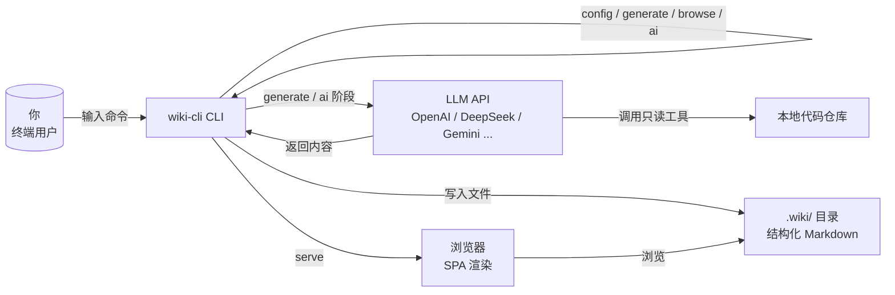

# 概览

## wiki-cli 是什么？

**wiki-cli** 是一个命令行工具，它能自动分析你的代码仓库，借助 **大语言模型（LLM）** 生成结构化的 Wiki 文档。你无需手动编写任何文档，只需运行一条命令，就能获得一份完整的、可本地浏览的项目知识库。

[来源](../README.md#L1-L3)

---

## 四条命令，一条命令一个职责

| 命令 | 用途 | 一句话说明 |
|------|------|-----------|
| `wiki-cli config` | 交互式配置 LLM 提供商、模型、API Key 和文档语言 | 首次使用时的"初始化"步骤 |
| `wiki-cli generate` | 分析当前仓库，生成完整 Wiki | 核心功能，一键生成 |
| `wiki-cli browse` | 在浏览器中打开已生成的 Wiki | 本地浏览，无需搭建服务器 |
| `wiki-cli ai` | 与 AI 对话，深入探索代码仓库 | 问答式代码理解 |

这四条命令都注册在 Commander.js 框架上，每个命令独立一个源文件。详见 [命令系统设计](命令系统设计.md)。

[来源](src/cli.ts#L1-L80) | [来源](../README.md#L22-L56)

---

## 核心价值：LLM 自动生成 Wiki

传统写文档的痛点——写完就过时、没人愿意写、维护成本高——wiki-cli 用一条路径解决：

```
你的代码仓库 → LLM 分析 → 结构化 Wiki 文档
```

生成过程分为两个阶段：

1. **大纲生成**：LLM 先扫描仓库结构，理解代码模块之间的关系，输出一份主题大纲。
2. **页面生成**：对大纲中的每个主题，LLM 逐一阅读源码并撰写完整页面。

两个阶段均支持**断点续传**和**并行生成**，即使中途中断，重新运行 `wiki-cli generate` 也会从上一次进度继续。

[两阶段生成流程](两阶段生成流程.md) 详细解释了每一步。  
[断点续传与并行生成](断点续传与并行生成.md) 说明了中断恢复机制。

---

## 安全性：只读工具，绝不修改代码

LLM 在生成文档时需要了解你的代码。wiki-cli 为 LLM 提供了 **10 个只读工具**（Read-Only Tools），包括：

- 浏览目录结构 (`list_directory`)
- 列出文件 (`list_files`)
- 读取文件内容 (`read_file`)
- 搜索文件内容 (`search_in_files`)
- 查看 Git 提交历史 (`git_log`, `git_show`, `git_remote_info`)
- 读取环境模板 (`dotenv_template`)
- 读取已生成的 Wiki 页面 (`list_wiki_pages`, `read_wiki`)

所有工具都是**只读**的，不存在写入、删除或执行代码的能力。LLM 只能"看"不能"改"，你的代码仓库绝对安全。

[来源](src/ai/tools.ts#L1-L175)

---

## 数据流：一条从终端到 Wiki 的管道



流程的每一步都有对应的 Wiki 页面深入讲解：

- [配置你的 LLM 提供商](配置你的-llm-提供商.md) — 如何选择模型和设置 API Key
- [生成 Wiki 文档](生成-wiki-文档.md) — 一键生成全过程
- [本地浏览 Wiki](本地浏览-wiki.md) — 在浏览器中阅读 Wiki
- [AI 问答交互](ai-问答交互.md) — 与 AI 对话探索代码库
- [LLM 客户端核心实现](llm-客户端核心实现.md) — 与 LLM API 通信的底层封装
- [工具调用系统](工具调用系统.md) — 10 个只读工具的实现细节

---

## 适用场景

- **接手遗留项目**：面对陌生代码库，一条命令生成入门文档
- **团队知识沉淀**：为内部仓库自动生成 Wiki，降低文档维护成本
- **开源项目**：为贡献者提供清晰的代码导航文档
- **个人学习**：分析自己写的项目，发现架构上的盲点

---

## 下一步

如果你是第一次使用，请先阅读 [快速开始](快速开始.md)，10 分钟内完成从安装到浏览的完整体验。