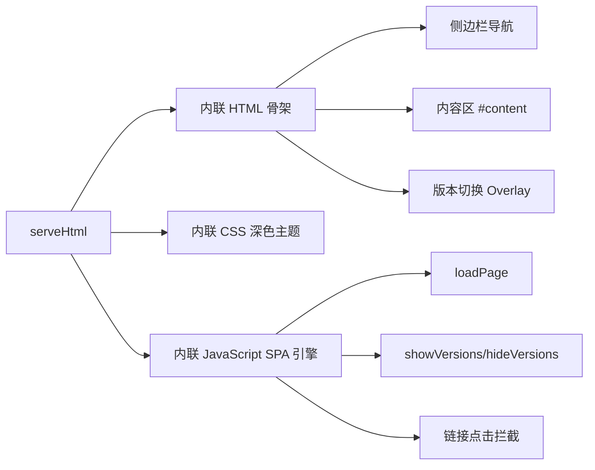
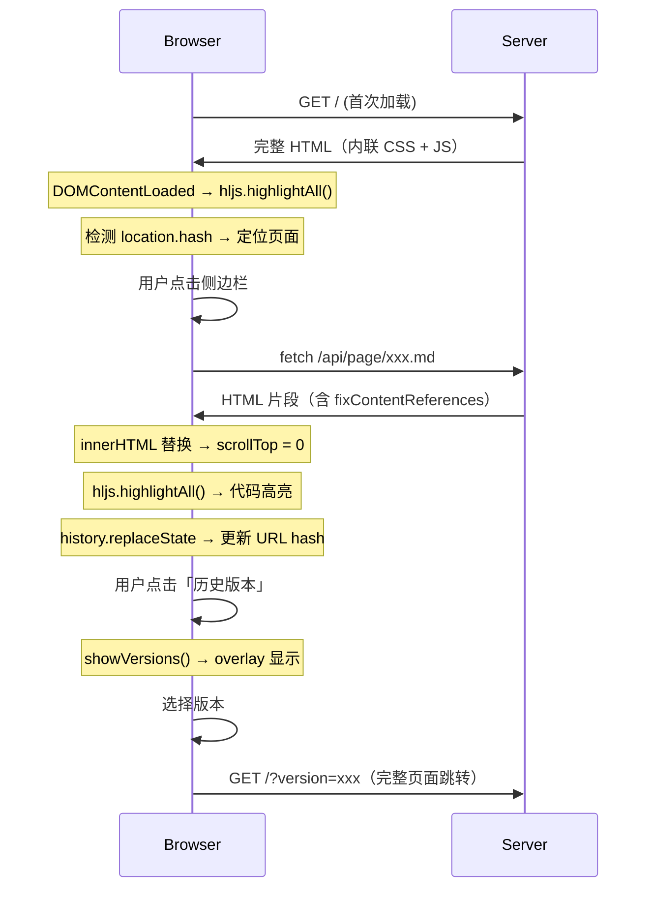

现在我们已经有足够的上下文来撰写这篇深入 SPA 架构的文档了。

---

# 浏览器端 SPA 体验

当 `wiki-cli browse` 启动时，服务器生成的不只是一堆 HTML 片段——它返回的是一个完整的**单页应用（SPA）**。所有 HTML、CSS、JavaScript 都内联在一个文件中，由 `serveHtml` 函数统一产出。这一设计决策意味着：**零构建步骤、零外部依赖（除了 CDN 加载的 Highlight.js）、即开即用**。



[来源](src/commands/browse.ts#L233-L302)

---

## 一、serveHtml：SPA 的「编译时」

`serveHtml` 函数在服务器端执行一次，输出的却是一个**可交互的客户端应用**。它的签名如下：

```typescript
async function serveHtml(
  res: ServerResponse,
  wikiPath: string,
  sidebarItems: SidebarItem[],
  firstPage: string | null,
  allVersions: string[],
  currentVersion: string
): Promise<void>
```

六个参数决定了首次渲染的内容：
- `wikiPath` — 当前版本的 Wiki 目录路径
- `sidebarItems` — 经 `loadSidebar` 解析后的导航数据结构
- `firstPage` — 侧边栏第一篇文章的 Markdown 文件路径，若存在则预先渲染为首页内容
- `allVersions` — 所有可用版本的时间戳列表，用于版本切换
- `currentVersion` — 当前选中的版本标识

函数的核心工作流：读取 `firstPage` → `marked.parse()` 渲染为 HTML → `fixContentReferences()` 替换引用标记 → 将侧边栏 HTML、版本列表 HTML、首屏内容拼接进一个完整的 HTML 模板。最终通过 `res.end(html)` 一次性发送给浏览器。

[来源](src/commands/browse.ts#L233-L268)

---

## 二、内联 CSS：GitHub Dark 主题的深度复刻

整个页面的样式全部内嵌在 `<style>` 标签中，无任何外部 CSS 文件加载。配色方案借鉴了 **GitHub Dark（#0d1117 背景 + #c9d1d9 文字）**，但并非简单的复制，而是针对 Wiki 阅读场景做了定制。

### 布局系统

```
┌─────────────────────────────────────────────┐
│  .wrapper (max-width: 1280px, flex)         │
│  ┌──────────────┬──────────────────────────┐ │
│  │  .sidebar    │  .content                │ │
│  │  (280px)     │  (flex: 1, max-w: 900px) │ │
│  │              │                          │ │
│  │  ┌────────┐  │  h1/h2/h3 标题          │ │
│  │  │  📖 Wiki│  │  p 正文段落             │ │
│  │  │历史版本 │  │  pre/code 代码块        │ │
│  │  └────────┘  │  blockquote 引用         │ │
│  │  🟢 快速开始 │  table 表格              │ │
│  │  🟡 配置详解 │                          │ │
│  └──────────────┴──────────────────────────┘ │
└─────────────────────────────────────────────┘
```

关键布局参数：
- **外层**：`body` 使用 `display: flex; justify-content: center;`，`wrapper` 限制 `max-width: 1280px`，在大屏幕上保持内容居中
- **侧边栏**：固定 `280px` 宽度，独立滚动（`overflow-y: auto`），带 `border-right` 与内容区分隔
- **内容区**：`flex: 1` 占满剩余空间，`max-width: 900px` 限制阅读宽度，内部 `padding: 40px` 保证呼吸感

[来源](src/commands/browse.ts#L271-L288)

### 组件级配色

| 元素 | 背景色 | 文字色 | 边框色 |
|------|--------|--------|--------|
| 页面背景 | `#0d1117` | `#c9d1d9` | — |
| 侧边栏 | `#161b22` | — | `#30363d` |
| 导航链接默认 | — | `#8b949e` | — |
| 导航链接悬停 | `#1c2333` | `#58a6ff` | — |
| 分组标题 | — | `#484f58` | — |
| 代码块 | `#161b22` | — | `#30363d` |
| 内联代码 | `#1c2333` | — | — |
| 表格表头 | `#161b22` | `#f0f6fc` | `#30363d` |

配色系统的设计目标是**降低眼睛疲劳**的同时保持**高对比度可读性**。主色 `#58a6ff`（亮蓝）用于所有交互元素（链接、悬停态），形成统一的视觉锚点。

[来源](src/commands/browse.ts#L289-L311)

### 源码引用链接的视觉样式

`a.source-ref` 是一个特别的样式类，专门用于 `[来源]` 链接：

```css
.content a.source-ref {
  color: #8b949e;
  font-size: 13px;
  text-decoration: none;
  border: 1px solid #30363d;
  border-radius: 3px;
  padding: 1px 6px;
  margin-left: 4px;
}
```

相比普通链接，源码引用链接以**标签化按钮**的形式呈现：带边框、小字号、不占文本空间，视觉上类似 GitHub 上的「引用徽章」。悬停时变为主色 `#58a6ff`，暗示其可点击性。

[来源](src/commands/browse.ts#L305-L311)

---

## 三、JavaScript SPA 引擎：四步页面加载

页面的核心交互——点击侧边栏条目加载新内容——完全由前端 JavaScript 驱动，不刷新页面。这一行为的引擎是 `loadPage` 函数：

```javascript
async function loadPage(encodedSlug) {
  const slug = decodeURIComponent(encodedSlug);
  const res = await fetch('/api/page/' + slug + '.md?version=' + currentVersion);
  const html = await res.text();
  document.getElementById('content').innerHTML = html;
  document.getElementById('content').scrollTop = 0;
  hljs.highlightAll();
  history.replaceState(null, '', '#' + slug);
}
```

每一步的职责：

### 1. `fetch('/api/page/' + slug + '.md?version=' + currentVersion)`

向服务器请求 HTML 片段，而非完整的页面。服务器端收到请求后，在 `/api/page/` 路由中执行三步：[来源](src/commands/browse.ts#L45-L57)
- **读取**对应 slug 的 `.md` 文件
- **调用 `marked.parse(content)`** 将 Markdown 渲染为 HTML
- **调用 `fixContentReferences(html)`** 将 `[来源：...]` 替换为可点击链接

返回的只是内容区所需的 HTML 片段，不含侧边栏、header 等框架元素。这是 SPA 的核心优化：**只传输变化的部分**。

### 2. `innerHTML` 替换与滚动重置

```javascript
document.getElementById('content').innerHTML = html;
document.getElementById('content').scrollTop = 0;
```

将内容区的 DOM 内容完全替换为新 HTML，同时将滚动位置重置到顶部。`scrollTop = 0` 保证了切换页面后的用户体验一致性——不会停留在旧页面的滚动位置。

### 3. `hljs.highlightAll()`

新插入的 HTML 中可能包含 `<pre><code>` 代码块，但这些代码块尚未被 Highlight.js 着色。`hljs.highlightAll()` 扫描整个 DOM 中的 `code` 元素，为每个代码块检测语言并应用语法高亮。这一步之所以必要，是因为 `innerHTML` 替换抹掉了之前高亮引擎注入的 DOM 结构和类名。

Highlight.js 的 CSS 文件来自 CDN：
```html
<link rel="stylesheet" href="https://cdnjs.cloudflare.com/ajax/libs/highlight.js/11.9.0/styles/github-dark.min.css">
```

与页面本身的深色主题无缝融合。

[来源](src/commands/browse.ts#L48)

### 4. `history.replaceState(null, '', '#' + slug)`

```javascript
history.replaceState(null, '', '#' + slug);
```

将当前页面的 slug 写入 URL hash，不触发页面刷新。这一行代码使 SPA 具备了**浏览器历史感知**能力：

- 用户可以使用浏览器的「后退/前进」按钮导航
- 直接访问 `http://localhost:3000/#快速开始` 可直达特定页面
- `loadPage` 调用结束后，URL 变化但页面不闪烁

**页面初始化时的 hash 路由**由 `DOMContentLoaded` 事件处理：

```javascript
document.addEventListener('DOMContentLoaded', function() {
  hljs.highlightAll();
  if (location.hash) {
    const slug = decodeURIComponent(location.hash.slice(1));
    loadPage(slug);
  }
  // ...
});
```

初次加载时检测 URL hash，若存在则自动加载对应页面。这意味着**刷新页面后，用户会回到之前浏览的页面**，而非首页。

[来源](src/commands/browse.ts#L284-L291)

---

## 四、全局链接拦截：SPA 式内部导航

页面注册了一个**事件委托**监听器，捕获内容区内所有 `<a>` 标签的点击事件，实现 SPA 风格的内部导航：

```javascript
document.getElementById('content').addEventListener('click', function(e) {
  const anchor = e.target.closest('a');
  if (!anchor) return;
  const href = anchor.getAttribute('href');
  if (!href || href.startsWith('http') || href.startsWith('/api/')
      || href.startsWith('#') || href.startsWith('mailto:')) return;
  e.preventDefault();
  if (href.endsWith('.md')) {
    loadPage(href.replace(/\.md$/, ''));
  } else {
    window.open('/api/source/' + href, '_blank');
  }
});
```

**拦截策略**：

| 链接类型 | 行为 | 示例 |
|----------|------|------|
| 外部链接（`http` 开头） | 放行 | `https://example.com` → 正常跳转 |
| API 链接（`/api/` 开头） | 放行 | `/api/source/xxx` → 正常跳转 |
| 锚点链接（`#` 开头） | 放行 | `#快速开始` → 正常锚点跳转 |
| 邮件链接 | 放行 | `mailto:xx@xx.com` → 正常跳转 |
| `.md` 结尾的内部链接 | **拦截 → loadPage** | `快速开始.md` → SPA 加载 |
| 其他路径（源码引用） | **拦截 → 新标签打开** | `src/utils/file.ts` → 源码页 |

这一设计保证了 Wiki 页面中的所有 Markdown 内部链接（生成阶段 LLM 写入的 `[概览](概览.md)` 等）都能以 SPA 方式无刷新加载，而源码引用路径（`[来源](src/commands/browse.ts#L33-L34)` 中的相对路径）则在新标签打开源码浏览页面。

[来源](src/commands/browse.ts#L293-L306)

---

## 五、版本切换 Overlay

SPA 的版本切换功能通过一个**模态遮罩层（Overlay）**实现，由三个函数协作驱动：

### 显示与隐藏

```javascript
function showVersions() {
  document.getElementById('versionOverlay').classList.add('show');
}

function hideVersions() {
  document.getElementById('versionOverlay').classList.remove('show');
}
```

`show` 类控制 overlay 的可见性：

```css
.overlay {
  display: none;           /* 默认隐藏 */
  position: fixed;         /* 覆盖全屏 */
  background: rgba(0,0,0,0.6);
  z-index: 100;
}
.overlay.show {
  display: flex;           /* 显示时使用 flex 居中子元素 */
}
```

Overlay 内部是一个白色圆角盒子（`.overlay-box`），以 `flex` 居中定位，背景半透明黑色产生遮罩效果。

### 三种关闭方式

1. **点击 ✕ 按钮**：`onclick="hideVersions()"`
2. **点击遮罩背景**：判断事件目标是否为 overlay 自身（`event.target === this`），防止点击内部弹框时误关闭
3. **按下 ESC 键**：全局键盘事件监听

```javascript
document.addEventListener('keydown', function(e) {
  if (e.key === 'Escape') hideVersions();
});
```

[来源](src/commands/browse.ts#L292)

### 版本切换触发

```javascript
function switchVersion(ts) {
  window.location.href = '/?version=' + ts;
}
```

`switchVersion` 执行完整的页面跳转（非 SPA 方式），因为版本切换意味着需要重新加载整个侧边栏和内容区——这是全量页面变更，不适合用局部 DOM 替换来处理。

### Overlay 列表的生成

版本列表的 HTML 由服务器端 `buildVersionsHtml` 函数生成：

```typescript
function buildVersionsHtml(versions: string[], current: string): string {
  return versions.map(v =>
    `<a href="#" class="${v === current ? 'current' : ''}" 
        onclick="switchVersion('${v}')">${v}</a>`
  ).join('');
}
```

每个版本条目都是一个带 `onclick` 的 `<a>` 元素，当前版本额外添加 `current` 类名，在前端被样式化为高亮态（`color: #58a6ff; background: #1c2333; font-weight: 600`）。

[来源](src/commands/browse.ts#L224-L228)

---

## 六、fixContentReferences：从标记到链接

这是连接 Wiki 生成与浏览体验的**关键桥梁**。生成阶段 LLM 在 Markdown 中插入 `[来源：路径]` 标记，而 `fixContentReferences` 在浏览阶段将其替换为可点击的 HTML 链接。

### 正则替换

```typescript
function fixContentReferences(html: string): string {
  return html.replace(
    /\[来源：([^\]]+)\]/g,
    '<a href="/api/source/$1" target="_blank" class="source-ref">[来源]</a>'
  );
}
```

- **匹配模式**：`\[来源：([^\]]+)\]` — 匹配以 `[来源：` 开头、以 `]` 结尾、中间不含 `]` 的内容
- **捕获组**：`$1` 捕获路径部分，嵌入到 `/api/source/$1` URL 中
- **输出属性**：`target="_blank"` 新标签打开，`class="source-ref"` 应用标签式样式

### 调用时机

`fixContentReferences` 在两个关键路径上被调用：

| 调用路径 | 位置 | 作用 |
|----------|------|------|
| 首页渲染 | `serveHtml` 中处理 `firstPage` | 确保首页的引用链接可点击 |
| 页面 API | `/api/page/:slug` 路由中 `marked.parse` 之后 | 确保 SPA 加载的每个片段都有引用链接 |

这意味着无论是首次加载还是 SPA 动态加载，所有 `[来源：...]` 标记都会被正确处理。

[来源](src/commands/browse.ts#L188-L191)

### 一个完整的请求链路示例

```
Markdown 中的标记：
  [来源：src/commands/browse.ts#L33-L34]

↓ fixContentReferences 替换

HTML 中的链接：
  <a href="/api/source/src/commands/browse.ts#L33-L34" 
     target="_blank" class="source-ref">[来源]</a>

↓ 用户点击

服务器收到 /api/source/src/commands/browse.ts#L33-L34

↓ sanitizePath 安全校验 ↓ 读取文件

返回带语法高亮的源码页面
```

[来源](src/commands/browse.ts#L59-L77)

---

## 七、完整的 SP A 生命周期

从浏览器输入 URL 到用户离开，整个 SPA 的生命周期可以归纳为四个阶段：



---

## 与服务器端架构的关系

SPA 体验依赖于服务器端提供的三条 API 路由协同工作：

| 路由 | 角色 | 调用方 |
|------|------|--------|
| `/api/page/:slug` | 返回 Markdown 渲染后的 HTML 片段 | `loadPage` 的 fetch 目标 |
| `/api/source/:path` | 返回语法高亮后的源码页面 | `[来源]` 链接的目标 |
| `/api/versions` | 返回版本列表 JSON | 可扩展用于动态版本加载 |

服务器端的路由分发和路径安全校验在 [HTTP 服务器与路由分发](http服务器与路由分发.md) 中有完整分析；侧边栏的索引解析与 slugify 机制在 [侧边栏导航与索引解析](侧边栏导航与索引解析.md) 中有深入讨论。

[来源](src/commands/browse.ts#L39-L87)

---

## 下一步

- 了解服务器端如何安全地提供源码文件：[](源代码浏览功能.md)
- 理解侧边栏索引的两种解析格式：[](侧边栏导航与索引解析.md)
- 查看完整的 HTTP 路由分发流程：[](http服务器与路由分发.md)
- 追溯多版本存储结构的底层设计：[](多版本管理与索引.md)