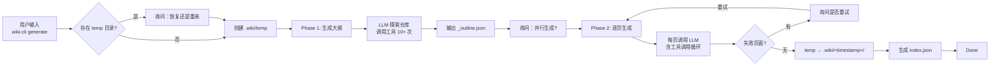

两分钟之内输入 `wiki-cli generate`，你的项目就会拥有一套结构完整、深度分析的技术 Wiki。这背后是一次 LLM 驱动的自动化探索与写作过程。理解它的两阶段设计，能帮你更好地驾驭生成结果，或在需要时手动干预。

## 全链路概览

从用户输入到最终 Wiki 的完整链路如下：



生成过程的实现位于 `src/commands/generate.ts`。[来源](src/commands/generate.ts#L1-L14)

## Phase 1：生成大纲

第一阶段的目标不是写文章，而是让 LLM **理解你的代码库**。它拿到两条提示词——一条系统级指令 `outline-system.md` 和一条用户级指令 `outline-user.md`——然后开始自主探索。[来源](src/commands/generate.ts#L31-L35)

### 工具驱动的代码探索

LLM 通过 **Function Calling** 调用一组只读工具来探索仓库。这些工具覆盖了代码理解所需的全部维度：

| 工具 | 用途 |
|------|------|
| `list_directory` | 获取目录结构树 |
| `list_files` | 按扩展名过滤文件 |
| `read_file` | 读取文件内容，可限行 |
| `search_in_files` | 关键字或正则搜索 |
| `git_log` | 查看提交历史 |
| `git_show` | 查看某次提交的变更 |
| `git_remote_info` | 获取远程仓库信息 |
| `dotenv_template` | 读取环境变量模板 |

[来源](prompts/outline-system.md#L9-L19)

LLM 会先调用 `list_directory` 了解项目骨架，然后 `read_file` 阅读关键文件（入口点、核心模块），必要时用 `search_in_files` 定位特定模式。整个过程是一个多轮迭代：LLM 根据前一次工具调用的结果，决定下一步探索什么。同一次生成中最多迭代 25 轮。[来源](src/commands/generate.ts#L42-L44)

### 输出格式

最终 LLM 必须输出一个严格 JSON 结构，包含 `sections`（分为"入门指南"和"深入探索"两部分），每个 `topic` 含标题、难度等级、描述和写作任务。这个 JSON 被保存到 `.wiki/temp/_outline.json` 作为后续阶段的输入。[来源](src/commands/generate.ts#L62-L64)

关于提示词的变量插值与渲染机制，详见 [提示词模板引擎](提示词模板引擎.md)。

## Phase 2：逐页生成

拿到大纲后，第二阶段开始逐页生成。每个 `topic`（排除 `isGroup` 分组节点）独立经历一次完整的 LLM 调用周期。[来源](src/commands/generate.ts#L159-L165)

### 一页一世界

每页的提示词由 `page-system.md` 和 `page-user.md` 模板渲染而成，其中注入了：

- 该页的标题、难度等级、slug
- 项目摘要
- **所有其他页面的交叉引用列表**（`availablePages`），使当前页能正确链接到兄弟页面
- 该页专属的 `task` 指令

[来源](src/commands/generate.ts#L172-L192)

这意味着每个页面在生成时就已经知道整个 Wiki 的邻居是谁，从而自动建立交叉引用网络。

### 流式与非流式

生成时，LLM 客户端支持两种模式：**流式**（streaming）输出字符到终端，让用户看到实时进展；**非流式**则一次性获取完整响应。用户可以在命令行选择并行生成（非流式，更快）或串行生成（流式，可观察过程）。[来源](src/commands/generate.ts#L91-L109)

每页的生成同样包含工具调用循环——LLM 可能需要再次查阅源码来核实细节。关于流式分块解析的底层实现，参阅 [流式通信与 SSE 解析](流式通信与-sse-解析.md)。

### 失败重试

生成完毕后，如果有页面失败，系统会询问是否重试。重试时只重新生成失败的页面，已成功的不受影响。[来源](src/commands/generate.ts#L113-L126)

更详细的恢复机制与并行策略见 [断点续传与并行生成](断点续传与并行生成.md)。

## 输出目录结构

生成完成后，临时目录 `.wiki/temp` 被重命名为带时间戳的目录：

```
.wiki/
├── 2025-01-15T14-30-00/    ← 时间戳目录
│   ├── index.json           ← 索引文件
│   ├── 概览.md
│   ├── 快速开始.md
│   ├── 配置你的-llm-提供商.md
│   ├── 生成-wiki-文档.md
│   └── ...                  ← 其余页面
├── 2025-01-14T10-22-05/    ← 历史版本
│   ├── index.json
│   └── ...
└── temp/                    ← 仅生成过程中存在
```

时间戳由 `getTimestamp()` 函数生成，格式为 `YYYY-MM-DDTHH-mm-ss`。[来源](src/utils/file.ts#L28-L36)

每次生成都创建一个新的版本目录，旧版本保留。关于版本切换与浏览，详见 [多版本管理与索引](多版本管理与索引.md) 和 [本地浏览 Wiki](本地浏览-wiki.md)。

## index.json 格式

每个版本目录下的 `index.json` 是整个 Wiki 的导航骨架，由 `generateIndex()` 函数生成：

```json
{
  "sections": [
    {
      "name": "入门指南",
      "topics": [
        { "level": "初学", "title": "概览", "description": "项目定位与核心功能概述" },
        { "level": "初学", "title": "快速开始", "description": "从零开始完整流程" },
        { "type": "group", "title": "核心功能" },
        { "level": "中级", "title": "生成 Wiki 文档", "description": "..." }
      ]
    },
    {
      "name": "深入探索",
      "topics": [
        { "type": "group", "title": "AI 引擎" },
        { "level": "高级", "title": "LLM 客户端核心实现", "description": "..." }
      ]
    }
  ]
}
```

`type: "group"` 的条目作为视觉分隔符（侧边栏中的分组标题），不生成独立页面。每个普通条目记录 `level`、`title`、`description` 和可选的 `task`。[来源](src/commands/generate.ts#L237-L258)

浏览器在加载 Wiki 时首先读取 `index.json`，据此构建侧边栏导航树。参见 [浏览器端 SPA 体验](浏览器端-spa-体验.md)。

## 看什么

- 深入理解两阶段协同机制：[两阶段生成流程](两阶段生成流程.md)
- 了解生成中断后的恢复策略：[断点续传与并行生成](断点续传与并行生成.md)
- LLM 调用工具的技术细节：[工具调用系统](工具调用系统.md)
- 提示词模板如何工作：[提示词模板引擎](提示词模板引擎.md)
- 版本化存储与导航：[多版本管理与索引](多版本管理与索引.md)