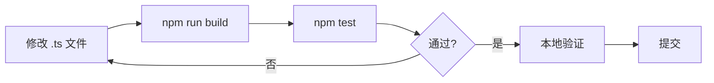

我通读了现有页面。现有版本内容完整，但作为**架构分析型技术作者**，我需要从第一性原理出发，解释每个技术决策的"为什么"——不仅仅是罗列事实，更要揭示设计意图。以下是重写版本。

---

# 贡献指南与开发环境

本文将带你深入 `wiki-cli` 的开发者工作台：从 TypeScript 编译策略到测试循环，从每个外部依赖的架构定位到 PR 提交流程。你不仅会知道"怎么做"，还会理解"为什么这么做"。

---

## 环境前置要求

**Node.js >= 18** 是硬性门槛。这一限制不是随意选择的：

- `package.json` 的 `engines` 字段明确声明 `"node": ">=18"` [来源](package.json#L28-L29)
- 运行时依赖 `chalk@^5.4.1` 和 `ora@^8.1.1` 均为纯 ESM 包，需要 Node 18+ 的原生 ESM 支持
- TypeScript 编译目标的 `ES2022` 特性（如顶层 `await`、`Error.cause`）在 Node 18 中才完全可用

---

## 构建系统：TypeScript 编译策略

### 编译命令

```bash
npm run build    # 等效于 tsc
```

此命令将 `src/` 下的 TypeScript 文件编译到 `dist/` 目录。[来源](package.json#L10)

### TypeScript 配置深度解读

```json
{
  "compilerOptions": {
    "target": "ES2022",
    "module": "ESNext",
    "moduleResolution": "bundler",
    "outDir": "./dist",
    "rootDir": "./src",
    "strict": true,
    "esModuleInterop": true,
    "skipLibCheck": true,
    "forceConsistentCasingInFileNames": true,
    "resolveJsonModule": true,
    "declaration": true,
    "declarationMap": true,
    "sourceMap": true
  }
}
```
[来源](tsconfig.json#L3-L18)

三个核心选项决定了项目的编译形态：

**`target: "ES2022"`** — 编译输出使用 ES2022 语法。这意味着 TypeScript 不会降级 `async/await`、类字段、`Array.fromAsync` 等 ES2022 特性。选择 ES2022 而非更低的 ES2020 或 ES6，是因为运行时已锁定 Node 18+，完全原生支持这些语法，无需 polyfill。编译产物更简洁，运行时无额外性能开销。

**`module: "ESNext"`** — 输出保持 ESM 模块格式。这是关键决策：产物 `dist/cli.js` 使用 `import`/`export` 语句，而非 CommonJS 的 `require()`。这与 `package.json` 中的 `"type": "module"` 声明一致，确保 Node.js 以 ESM 模式加载产物。

**`moduleResolution: "bundler"`** — 这是 TypeScript 5.x 引入的解析策略。传统上，TypeScript 支持 `node`（模仿 CommonJS 解析）和 `node16`/`nodenext`（模仿 Node.js ESM 解析）。`bundler` 策略介于两者之间：它允许省略导入路径中的文件扩展名（开发时便利），同时兼容 `node_modules` 的扁平查找。配合 `"esModuleInterop": true`，确保默认导入（`import x from 'pkg'`）在 ESM 上下文中正确工作。

**辅助选项**：
- `declaration: true` + `declarationMap: true` — 生成 `.d.ts` 类型声明文件和映射，供外部库消费者获得类型推断
- `sourceMap: true` — 生成 `.js.map`，调试时 IDE 可映射回原始 `.ts` 源码
- `resolveJsonModule: true` — 允许 `import models from './default-models.json'`，[配置存储与模型清单](配置持久化与模型注册表.md) 依赖此能力

### 输出映射结构

```
src/                    →    dist/
 ├── cli.ts             →     cli.js + cli.d.ts + cli.d.ts.map + cli.js.map
 ├── commands/          →     commands/
 ├── ai/                →     ai/
 ├── utils/             →     utils/
 └── config/            →     config/ (含 default-models.json 拷贝)
```

`rootDir: "./src"` 和 `outDir: "./dist"` 定义了源到产物的目录镜像关系。`exclude: ["node_modules", "dist", "tests"]` 确保测试文件不被编译进产物。[来源](tsconfig.json#L20-L21)

---

## 开发循环：编码 → 编译 → 测试

开发工作流的核心循环是：



### 持续编译（推荐）

每次修改后手动 `npm run build` 很快会变得繁琐。推荐开启 TypeScript 的监听模式：

```bash
npx tsc --watch
```

它会监视 `src/` 下的文件变更，增量编译到 `dist/`，通常在 200ms 内完成。配合 `npm run test:watch` 可形成即时反馈闭环。

### 临时运行验证

```bash
npm start    # 等效于 node dist/cli.js
```
[来源](package.json#L11)

或使用 `npm link` 将本地构建注册为全局命令：

```bash
npm link
wiki-cli --help
```

---

## 测试体系

### 两种运行模式

| 命令 | 等效 | 用途 |
|------|------|------|
| `npm test` | `vitest run` | 一次性运行所有测试，CI 环境使用 |
| `npm run test:watch` | `vitest` | 监听模式，文件变更自动重跑，开发时使用 |

[来源](package.json#L12-L13)

### Vitest 配置

```ts
export default defineConfig({
  test: {
    globals: true,          // 全局注入 describe/it/expect，无需 import
    environment: 'node',    // Node 运行时环境
    include: ['tests/**/*.test.ts'],
  },
});
```
[来源](vitest.config.ts#L1-L9)

`globals: true` 是一个便利设计——测试文件中可以直接使用 `describe`、`it`、`expect`，无需每文件手动 import。这减少了样板代码，但代价是 IDE 的类型推断需要 `vitest/globals` 类型引用。

### 测试文件覆盖矩阵

| 测试文件 | 覆盖模块 | 对应架构文档 |
|----------|----------|--------------|
| `config-store.test.ts` | 配置持久化、模型清单加载 | [配置持久化与模型注册表](配置持久化与模型注册表.md) |
| `file.test.ts` | 文件系统工具（读写、路径、Slug） | [文件系统工具集](文件系统工具集.md) |
| `llm-client.test.ts` | LLM 客户端通信、重试、流式解析 | [LLM客户端通信协议](llm客户端通信协议.md) |
| `outline-parser.test.ts` | 大纲 JSON 解析与回退 | [大纲生成：代码理解与结构化输出](大纲生成-代码理解与结构化输出.md) |
| `prompts.test.ts` | 提示词模板渲染 | [提示词模板引擎](提示词模板引擎.md) |
| `tools.test.ts` | 工具调用逻辑 | [工具调用与Agent循环](工具调用与Agent循环.md) |

[来源](tests/)

深入测试策略细节，参见 [测试策略与覆盖](测试策略与覆盖.md)。

---

## 外部依赖：每个包的架构定位

项目的运行时依赖有 6 个，每个在架构中扮演特定角色：

| 包 | 版本 | 架构层 | 核心用途 |
|----|------|--------|----------|
| **commander** | ^12.1.0 | CLI 层 | 子命令注册、参数解析、`--help` 自动生成 |
| **inquirer** | ^12.3.0 | CLI 层 | `wiki-cli config` 的交互式问答界面 |
| **marked** | ^15.0.4 | 浏览层 | Markdown → HTML 渲染，生成 Wiki 页面内容 |
| **chalk** | ^5.4.1 | 表现层 | 终端彩色输出，区分信息/警告/错误 |
| **ora** | ^8.1.1 | 表现层 | 旋转进度动画，`generate` 和 `ai` 命令的等待指示 |
| **highlight.js** | ^11.11.0 | 浏览层 | 代码块语法高亮，[源代码浏览功能](侧边栏导航与索引解析.md) 的依赖 |

### 各依赖的架构分析

**commander** — CLI 的骨架。`src/cli.ts` 中，`program.command('config')`、`.command('generate')` 等调用注册了四条子命令，每个命令绑定到独立的 action 处理器。参数解析、类型转换、帮助文本自动生成均由 commander 处理。[来源](src/cli.ts#L1-L6)

**inquirer** — 唯一面向交互流程的依赖。`config` 命令使用 `inquirer.prompt()` 创建逐步问答界面，引导用户选择 provider、model、输入 API key。如果用不到交互流程（如 CI 环境传参），也可以通过命令行标志跳过。[来源](package.json#L19)

**marked** + **highlight.js** — 两者在浏览模式下协作：marked 将 `.md` 文件渲染为 HTML，highlight.js 在渲染后的代码块上着色。注意 marked 在服务端（Node.js）执行，而非浏览器端——这与许多静态站点生成器不同。[浏览生成的Wiki](浏览生成的wiki.md) 的架构细节见此。

**chalk** — 贯穿所有命令的终端着色工具。`logError()` 使用 `chalk.red` 输出错误信息，`logInfo()` 使用 `chalk.cyan` 输出状态。[日志与进度显示系统](日志与进度显示系统.md) 一文详述了其使用模式。

**ora** — 提供 spinner 动画，在 `generate` 的 LLM 调用阶段和 `ai` 的等待响应期间使用。其 `succeed()`/`fail()` 方法统一了成功/失败的终端反馈风格。

---

## 发布流程

### 标准发布步骤

```bash
# 1. 更新版本号
npm version patch   # 1.0.0 → 1.0.1（补丁）
npm version minor   # 1.0.0 → 1.1.0（小功能）
npm version major   # 1.0.0 → 2.0.0（破坏性变更）

# 2. 发布到 npm registry
npm publish
```

[来源](package.json#L14) — `prepublishOnly` 钩子

### `prepublishOnly` 的作用

```json
"prepublishOnly": "npm run build"
```

当执行 `npm publish` 时，npm 的生命周期钩子会按以下顺序触发：

1. **prepublishOnly** → 执行 `npm run build`，确保 `dist/` 是最新编译产物
2. **pack** → npm 根据 `package.json` 的 `files` 字段（或默认规则）打包
3. **publish** → 上传到 npm registry

这意味着开发者**无需手动执行 `npm run build` 再 `npm publish`**。`prepublishOnly` 钩子将编译步骤自动化，防止发布过时的产物。

### 版本号策略

当前版本为 `1.0.0`，遵循语义化版本（SemVer）：
- **patch** — bug 修复、文档改进、测试补充
- **minor** — 新功能（向后兼容）
- **major** — API 破坏性变更（如命令签名变化、配置格式变更）

---

## 代码贡献：PR 工作流

### 标准流程

```bash
# 1. Fork 并克隆
git clone https://github.com/YOUR_USERNAME/wiki-cli.git
cd wiki-cli

# 2. 创建功能分支
git checkout -b feature/your-feature-name

# 3. 开发、编译、测试
# 修改 src/ 下的文件
npm run build
npm test

# 4. 提交
git add .
git commit -m "feat: 简洁描述你的改动"

# 5. 推送并创建 PR
git push origin feature/your-feature-name
```

### Commit Message 规范

项目使用 **Conventional Commits** 风格的提交信息。从提交历史可见典型模式：

| 提交 | 类型 | 说明 |
|------|------|------|
| `Add wiki-cli ai: interactive AI chat...` | `feat` | 新功能 |
| `Fix source reference paths with leading slash` | `fix` | bug 修复 |
| `Add MIT license, copyright Epheia 2026` | `chore` | 杂项 |
| `Centered layout, history version switcher` | `feat` | 新功能 |
| `Split brief into description + task...` | `refactor` | 重构 |

[来源](git_log)

推荐格式：

```
<type>: <简短描述>

<可选：详细说明>
```

- **type**: `feat`（功能）、`fix`（修复）、`docs`（文档）、`test`（测试）、`refactor`（重构）、`chore`（构建/工具）
- **描述**: 祈使句、英文、首字母大写、不超过 72 字符

### PR 检查清单

提交 PR 前请确认：

- [ ] `npm run build` 编译无错误
- [ ] `npm test` 全部测试通过
- [ ] 新功能包含对应测试用例（参见 [测试策略与覆盖](测试策略与覆盖.md)）
- [ ] 已通过 `npm link` 在真实仓库中验证
- [ ] 代码风格与现有代码一致（`strict: true` 模式下无类型错误）

---

## ESM 模块注意事项

项目使用 `"type": "module"`，这是决定导入语法的根本约束。

### 关键规则

```typescript
// ✅ 正确：相对路径导入需写 .js 后缀（编译后文件名）
import { configCommand } from './commands/config.js';

// ✅ 正确：npm 包直接写包名
import { Command } from 'commander';

// ❌ 错误：写 .ts 后缀
import { configCommand } from './commands/config.ts';  // 运行时 ERR_MODULE_NOT_FOUND
```
[来源](src/cli.ts#L1-L6)

**为什么写 `.js` 而不是 `.ts`？** TypeScript 编译器不会重写导入路径。如果源文件写 `./commands/config.js`，编译后 `dist/commands/config.js` 中保留相同的相对路径。Node.js 运行时会按 `.js` 查找文件。这是 ESM 解析器的工作方式。

### `__dirname` 替代方案

ESM 模块中没有 `__dirname` 全局变量。项目中使用 `import.meta.url` 替代：

```typescript
import { fileURLToPath } from 'node:url';
import { dirname } from 'node:path';

const __filename = fileURLToPath(import.meta.url);
const __dirname = dirname(__filename);
```
[来源](tests/config-store.test.ts#L5-L8)

更多跨平台注意事项参见 [跨平台兼容与路径处理](跨平台兼容与路径处理.md)。

---

## 下一步

- [项目结构与模块职责](项目结构与模块职责.md) — 理解 `src/` 各模块的分层架构
- [命令调度与生命周期](命令调度与生命周期.md) — 深入 CLI 命令的注册与执行链
- [测试策略与覆盖](测试策略与覆盖.md) — 测试文件的组织方式与 Mock 策略