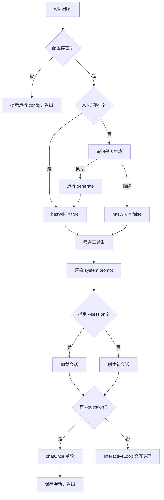

现在开始撰写页面。

# AI 交互命令：`wiki-cli ai`

`wiki-cli ai` 不是生成文档的工具——它是你与代码库之间的对话界面。当你想深入理解一个函数为何这样写、某个模块的边界在哪、或者追踪一段逻辑的演变历史时，这条命令让你以自然语言提问，LLM 则借助**只读工具**实时探查源码和已生成的 Wiki，给出有证据支撑的回答。

## 两种入口：交互式与单次问答

### 交互式终端

不带任何参数运行，进入持久化的交互循环：

```bash
wiki-cli ai
```

终端出现 `You >` 提示符，进入类似 REPL 的对话环境。每次提问后，LLM 的响应会实时流式输出到终端，同时对话历史自动持久化。输入 `/exit` 或按 `Ctrl+C` 退出。

[来源](commands/ai.ts#L97-L101)

### 单次问答

传递 `--question` 参数，执行单轮对话后自动退出：

```bash
wiki-cli ai --question "这个项目的依赖注入是如何实现的？"
```

适用于脚本集成或快速查询。流程与交互模式共用同一个 `chatOnce` 函数：构造消息 → 流式输出 → 保存会话 → 退出。会话摘要取问题文本的前 60 字符。

[来源](commands/ai.ts#L89-L96) | [来源](commands/ai.ts#L36-L44)

### 会话管理

```bash
wiki-cli ai --list-sessions    # 列出所有会话
wiki-cli ai --delete-session <id>  # 删除指定会话
wiki-cli ai --session <id>     # 恢复指定会话后进入交互模式
```

[来源](commands/ai.ts#L17-L32)

---

## `/help` 斜杠命令系统

交互模式下，所有以 `/` 开头的输入被解释为内部命令而非 LLM 提问。这是整个交互体验的"控制面板"。

```mermaid
flowchart LR
    Input[用户输入] --> IsSlash{以 / 开头？}
    IsSlash -->|是| Command[斜杠命令处理器]
    IsSlash -->|否| Chat[LLM 问答]
    Command --> Help[/help] --> Print[打印命令列表]
    Command --> Save[/save] --> Disk[写入 .wiki/sessions/]
    Command --> Switch[/switch] --> Load[加载目标会话]
    Command --> Wiki[/wiki] --> Gen[运行 generate]
    Command --> Exit[/exit] --> SaveAndQuit[保存并退出]
```

| 命令 | 作用 | 实现要点 |
|------|------|----------|
| `/exit` / `/quit` | 保存当前会话并退出 | 先调 `saveSession` 再 `break` 循环 |
| `/save` | 手动保存当前对话 | 将 `messages.slice(1)`（不含 system）写入磁盘 |
| `/clear` | 清屏 | 调用 `console.clear()` |
| `/session` | 显示当前会话 ID 和摘要 | 打印 `session.id` 和 `session.summary` |
| `/sessions` | 列出所有保存的会话 | 调 `listSessions` → `showSessionsTable` |
| `/switch <id>` | 切换到另一个会话 | 保存当前 → 加载目标 → 重建 messages 数组 |
| `/new` | 创建新会话（保留 system prompt） | 保存当前 → `createSession` → 重置 messages |
| `/wiki` | 运行 `generate` 生成 Wiki | 动态 `import('./generate.js')` |
| `/help` | 打印所有命令 | 硬编码的帮助文本 |

其中 `/switch` 的 messages 重构值得注意：它保留**当前**运行时生成的 system prompt（包含最新项目路径、Wiki 版本等信息），拼接目标会话的对话历史（`session.messages.slice(1)`），确保 LLM 获得最新上下文。详见[交互式 AI 会话管理](交互式-ai-会话管理.md)。

[来源](commands/ai.ts#L126-L166) | [来源](commands/ai.ts#L85-L93)

---

## 会话持久化：每次问答自动保存

交互循环中，每轮问答结束后自动执行一次保存：

```
用户输入 → LLM 流式响应 → 更新 session.messages → saveSession(session)
```

这是 `interactiveLoop` 中 `chatOnce` 调用后的固定流程。单次问答模式（`--question`）也在返回前执行同样的保存逻辑。

保存路径固定为 `.wiki/sessions/{id}.json`，文件内容为带缩进的 JSON，包含完整对话历史、时间戳和摘要。这意味着：

- **进程退出不丢数据**：即使终端崩溃，已完成的问答轮次已写入磁盘。
- **跨会话恢复**：`/switch` 或 `--session` 参数加载的会话，可精确恢复到上次中断的上下文。
- **人工可读**：JSON 文件可直接用文本编辑器打开查阅。

[来源](commands/ai.ts#L292-L296) | [来源](交互式-ai-会话管理.md)

---

## 工具集动态切换：有 Wiki 与无 Wiki 两种模式

`ai` 命令启动时，会扫描工作目录下是否存在 `.wiki/` 目录且包含至少一个版本子目录。这一检查结果决定了 LLM 可用的工具集：

```typescript
// 检查 .wiki/ 目录是否存在有效版本
if (existsSync(wikiDir)) {
  const dirs = entries.filter(e => e.isDirectory() && e.name !== 'temp');
  if (dirs.length > 0) {
    hasWiki = true;
    wikiInfo = `该项目有 Wiki 文档...`;
  }
}

// 根据 hasWiki 筛选工具
const allToolDefs = hasWiki
  ? toolDefinitions                                    // 全部 10 个工具
  : toolDefinitions.filter(t =>                        // 排除 Wiki 工具
      t.function.name !== 'list_wiki_pages' &&
      t.function.name !== 'read_wiki'
    );
```

[来源](commands/ai.ts#L46-L60) | [来源](commands/ai.ts#L63-L68)

### 有 Wiki 时（默认 10 工具）

LLM 获得完整的 10 个只读工具，包括两个 Wiki 专用工具：

- `list_wiki_pages`：列出所有 Wiki 页面及其标题、章节、难度
- `read_wiki`：按 slug 读取单个 Wiki 页面内容

系统提示词中会注入 Wiki 工具的说明，并强调**优先使用 Wiki 工具获取项目全貌，再探源码获取精确答案**。同时提示"Wiki 可能落后于代码，以代码为准"。

[来源](prompts/ai-system.md#L11-L17)

### 无 Wiki 时（8 工具，引导生成）

如果检测到没有 Wiki，流程会：

1. 询问用户"该项目没有 Wiki 文档。要先生成吗？(Y/n)"
2. 若用户同意，动态导入 `generateCommand` 并执行生成
3. 若用户拒绝，`wikiInfo` 设为"该项目没有 Wiki 文档"，LLM 仅凭源码探索工具回答问题
4. 两种情况下，`list_wiki_pages` 和 `read_wiki` 都从工具列表中移除，LLM 不会尝试调用不存在的功能

[来源](commands/ai.ts#L53-L60) | [来源](commands/ai.ts#L63-L68)

系统提示词中的 `{{wikiTools}}` 变量也会随之切换为 Wiki 工具说明或"（该项目没有 Wiki）"。

[来源](commands/ai.ts#L70-L78) | [来源](prompts/ai-system.md#L11-L17)

### 工具执行与多轮迭代

`chatOnce` 函数实现了 LLM 响应 → 工具调用 → 结果注入 → 再次请求 LLM 的循环，最多 50 轮迭代：

```typescript
for (let iter = 0; iter < maxIterations; iter++) {
  const streamIter = client.chatStream(messages, tools, false);
  // 流式消费：收集 content / reasoning / tool_call
  // 如果本轮有 tool_calls → 执行工具 → 注入结果 → 继续下一轮
  // 如果本轮无 tool_calls → 返回最终 content
}
```

这保证了 LLM 可以"先查 Wiki，再读源码，再综合回答"的多步推理链。每步工具执行结果都会以 `role: 'tool'` 消息注入对话历史，让 LLM 感知到自己刚刚读取了什么。

[来源](commands/ai.ts#L107-L166) | 详细工具定义见[工具调用系统](工具调用系统.md)

---

## 流式输出：实时可见的思考过程

无论是交互式还是单次问答，LLM 的响应都通过 `LLMClient.chatStream` 以 AsyncGenerator 方式流式输出到终端。`chatOnce` 函数消费三种类型的流块：

| 块类型 | 触发条件 | 终端表现 |
|--------|----------|----------|
| `reasoning` | `delta.reasoning_content` 存在 | 黄色斜体文本，前缀 `Thinking:` |
| `content` | `delta.content` 存在 | 正常白色文本 |
| `tool_call` | `delta.tool_calls` 存在 | 不输出文本，执行完成后打印 `Using tool: xxx` |
| `error` | API 返回错误 | 红色错误信息 |

处理逻辑中有两个细节：

1. **工具调用流式累积**：由于 SSE 中工具调用的 `arguments` 可能分多次到达（每个 chunk 携带部分 JSON 字符串），代码使用 `toolCallsMap` 按 `index` 或 `id` 归并同一工具调用的参数片段。

2. **reasoning 与 content 的切换**：首次收到 reasoning 块时打印 `Thinking: ` 前缀，首次收到 content 块且之前有 reasoning 时插入换行，实现"推理 → 回答"的视觉分隔。

```typescript
// 归并流式 tool_call 参数
const key = tc.index !== undefined ? `_idx_${tc.index}` : tc.id;
if (toolCallsMap.has(key)) {
  const existing = toolCallsMap.get(key)!;
  existing.function.arguments += tc.function.arguments;
} else {
  toolCallsMap.set(key, { ...tc });
}
```

[来源](commands/ai.ts#L117-L153) | 流式通信底层实现见[流式通信与 SSE 解析](流式通信与-sse-解析.md)

---

## 启动流程全景



[来源](commands/ai.ts#L10-L101)

---

## 推荐阅读

- [交互式 AI 会话管理](交互式-ai-会话管理.md) — Session 的 CRUD 实现、`/switch` 与 `/new` 的 messages 重构逻辑
- [工具调用系统](工具调用系统.md) — 10 个只读工具的定义、实现和动态分发机制
- [LLM 客户端核心实现](llm-客户端核心实现.md) — `chatStream` 的 SSE 解析、重试机制与请求构建
- [流式通信与 SSE 解析](流式通信与-sse-解析.md) — 流式 chunk 的底层解析原理
- [提示词模板引擎](提示词模板引擎.md) — `ai-system.md` 模板的变量注入机制
- [快速开始](快速开始.md) — 从零体验完整流程