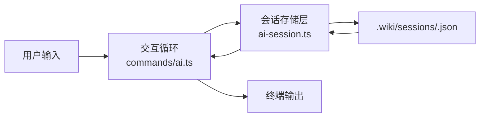

# AI 会话管理

会话（Session）是 AI 问答交互的状态容器。在 `wiki-cli` 中，每个会话将用户与 LLM 的对话历史持久化为独立 JSON 文件，支持创建、加载、列表、保存和删除五个原子操作。这一机制将对话状态与 CLI 进程生命周期解耦——进程退出后，所有上下文仍在磁盘上，下次 `wiki-cli ai` 可完整恢复。



[来源](src/ai/ai-session.ts#L1-L11) | [来源](src/commands/ai.ts#L1-L11)

---

## Session 接口：数据契约

`Session` 是五个字段的纯数据对象，定义在 `ai-session.ts` 中，是所有会话操作的统一数据契约：

```typescript
export interface Session {
  id: string;
  created: string;
  updated: string;
  summary: string;
  messages: ChatMessage[];
}
```

| 字段 | 类型 | 语义 |
|------|------|------|
| `id` | `string` | 8 字符唯一标识符，由 `generateSessionId` 生成 |
| `created` | `string` | ISO 8601 创建时间戳，仅赋值一次 |
| `updated` | `string` | ISO 8601 最后更新时间戳，每次 `saveSession` 自动刷新 |
| `summary` | `string` | 会话摘要，初始值 `"新会话"`，交互中取第一条非命令用户消息的前 60 字符 |
| `messages` | `ChatMessage[]` | 完整对话历史，按时间顺序排列 |

`ChatMessage` 接口定义在 `llm-client.ts` 中，涵盖 `system` / `user` / `assistant` / `tool` 四种角色。其中 `assistant` 消息还可携带 `tool_calls` 数组和 `reasoning_content` 字段，完整支持 LLM 的 Function Calling 与推理模型。[详见](llm-客户端实现.md)

注意 `summary` 字段的更新策略：在 `commands/ai.ts` 的 `interactiveLoop` 中，每次普通对话后，系统取第一条 `role === 'user'` 且不以 `/` 开头的消息内容的前 60 字符作为新的摘要：

```typescript
session.summary = session.messages
  .find(m => m.role === 'user' && !m.content?.startsWith('/'))
  ?.content?.slice(0, 60) || session.summary;
```

这意味着摘要始终反映最近一次提问的概要，而不是累积所有消息。

[来源](src/ai/ai-session.ts#L3-L11) | [来源](src/commands/ai.ts#L288-L289)

---

## 会话文件存储：`.wiki/sessions/<id>.json`

所有会话文件存放在项目根目录下的 `.wiki/sessions/` 目录，与 Wiki 文档共享 `.wiki` 根目录。

```typescript
const SESSIONS_DIR = '.wiki/sessions';

export function sessionPath(id: string): string {
  return join(SESSIONS_DIR, `${id}.json`);
}
```

每个会话对应一个独立 JSON 文件，例如 `.wiki/sessions/a3f8c2d1.json`。文件内容为 `JSON.stringify(session, null, 2)` 格式化输出，方便人工阅读和调试。

目录创建由 `ensureSessionsDir` 函数负责，它是幂等的——目录已存在时不做任何事：

```typescript
export async function ensureSessionsDir(): Promise<void> {
  if (!existsSync(SESSIONS_DIR)) {
    await mkdir(SESSIONS_DIR, { recursive: true });
  }
}
```

**与 Wiki 文档的关系**：会话存储独立于 Wiki 的版本管理。`.wiki/sessions/` 不会出现在版本切换中，它是用户个人交互数据，与生成的文档分离。[详见](生成结果说明.md)

[来源](src/ai/ai-session.ts#L13-L20)

---

## 六个核心函数：完整的 CRUD 闭环

会话管理围绕六个导出函数展开，覆盖从创建到销毁的完整生命周期。

### createSession：8 字符 UUID 的诞生

```typescript
export async function createSession(): Promise<Session> {
  await ensureSessionsDir();
  const id = generateSessionId();
  const now = new Date().toISOString();
  const session: Session = { id, created: now, updated: now, summary: '新会话', messages: [] };
  await writeFile(sessionPath(id), JSON.stringify(session, null, 2), 'utf-8');
  return session;
}
```

关键细节：
- **立即写盘**：创建后立刻将空会话写入文件，即使未发生任何对话，磁盘上也有记录。
- **空 messages**：创建的会话没有消息内容。system prompt 在运行时由 `commands/ai.ts` 动态注入，不持久化到会话文件中。[详见](提示词模板引擎.md)

ID 生成使用 `crypto.randomUUID()` 的前 8 字符：

```typescript
export function generateSessionId(): string {
  return randomUUID().slice(0, 8);
}
```

设计权衡：
- 32 位十六进制空间（约 42.9 亿种组合），在本地单用户场景下碰撞概率极低。
- 8 字符短 ID 方便终端输入：`/switch a3f8c2d1` 远优于粘贴完整 UUID v4。

[来源](src/ai/ai-session.ts#L22-L33)

### saveSession：自动刷新的时间戳

```typescript
export async function saveSession(session: Session): Promise<void> {
  session.updated = new Date().toISOString();   // ① 原地修改 updated
  await ensureSessionsDir();                     // ② 保障目录存在
  await writeFile(sessionPath(session.id),       // ③ 全量覆写
    JSON.stringify(session, null, 2), 'utf-8');
}
```

每次保存都会 **原地修改** 传入的 `session` 对象的 `updated` 字段（副作用），然后全量覆写文件。这种设计意味着：
- 两次 `saveSession` 如果参数是同一个对象引用，时间戳会依次递增。
- 保存是 **全量写入** 而非增量追加——整个 messages 数组被完整序列化。

在 `commands/ai.ts` 中，`saveSession` 在以下时机被调用：
- 每次普通对话结束后
- `/exit` / `/quit` 退出时
- `/switch` 切换会话前
- `/new` 创建新会话前
- 非交互模式（`--question`）单次问答后

[来源](src/ai/ai-session.ts#L62-L66) | [来源](src/commands/ai.ts#L163)

### loadSession：容错的反序列化

```typescript
export async function loadSession(id: string): Promise<Session | null> {
  try {
    const raw = await readFile(sessionPath(id), 'utf-8');
    return JSON.parse(raw) as Session;
  } catch {
    return null;  // 文件不存在或 JSON 损坏，均返回 null
  }
}
```

容错设计：无论是文件不存在、权限错误还是 JSON 格式损坏，统一返回 `null`。调用方必须处理 `null` 分支——`commands/ai.ts` 中检查后打印错误并 return：

```typescript
const existing = await loadSession(options.session);
if (!existing) {
  logError(`Session ${options.session} not found.`);
  return;
}
```

[来源](src/ai/ai-session.ts#L57-L61) | [来源](src/commands/ai.ts#L86-L91)

### listSessions：按更新时间降序排列

```typescript
export async function listSessions(): Promise<{ id: string; created: string; updated: string; summary: string }[]> {
  if (!existsSync(SESSIONS_DIR)) return [];
  const files = await readdir(SESSIONS_DIR);
  const sessions = [];
  for (const f of files) {
    if (!f.endsWith('.json')) continue;
    try {
      const raw = await readFile(join(SESSIONS_DIR, f), 'utf-8');
      const s = JSON.parse(raw);
      sessions.push({ id: s.id, created: s.created, updated: s.updated, summary: s.summary });
    } catch { /* skip corrupt */ }
  }
  sessions.sort((a, b) => new Date(b.updated).getTime() - new Date(a.updated).getTime());
  return sessions;
}
```

三个关键设计：
1. **投影子集**：返回值只包含 `id/created/updated/summary` 四个字段，不加载 `messages` 数组。这在有大量长对话时避免了不必要的内存和 I/O 开销。
2. **降序排序**：`b.updated - a.updated` 确保最近更新的会话排在最前。
3. **静默容错**：读取或解析失败的文件被跳过，不中断整个列表过程。

[来源](src/ai/ai-session.ts#L35-L55)

### deleteSession：存在性检查

```typescript
export async function deleteSession(id: string): Promise<boolean> {
  const p = sessionPath(id);
  if (!existsSync(p)) return false;
  await rm(p);
  return true;
}
```

返回值表示是否实际执行了删除操作。CLI 层通过 `--delete <id>` 参数调用，并根据返回值显示相应消息。

[来源](src/ai/ai-session.ts#L68-L73)

---

## 终端输出：两种展示模式

### printSession：对话回放

```typescript
export function printSession(session: Session): void {
  for (const msg of session.messages) {
    if (msg.role === 'user') {
      const text = msg.content || '';
      if (!text.startsWith('/')) {
        console.log(`\n${chalk.green('You >')} ${text}`);
      }
    } else if (msg.role === 'assistant') {
      console.log(`${msg.content || ''}`);
    }
  }
}
```

输出结果示例：

```
You > 这个项目的核心架构是什么？
项目采用四层架构：CLI 入口层、命令层、AI 层和工具层...
You > 如何添加新 LLM 提供商？
遵循三步扩展法...
```

三个过滤规则：
- 仅输出 `user` 和 `assistant` 角色的消息，跳过 `system` 和 `tool`。
- 用户消息中以 `/` 开头的命令（如 `/help`、`/save`）被过滤，不污染回放视图。
- **不截断**助手消息，完整输出（区别于 `showSessionsTable` 的摘要截断）。

### showSessionsTable：紧凑列表

```typescript
export function showSessionsTable(sessions: { id: string; created: string; updated: string; summary: string }[]): void {
  if (sessions.length === 0) {
    console.log('  (无保存的会话)');
    return;
  }
  for (const s of sessions) {
    const date = new Date(s.updated).toLocaleString('zh-CN',
      { month: '2-digit', day: '2-digit', hour: '2-digit', minute: '2-digit' });
    console.log(`  ${s.id}  ${date}  ${s.summary.slice(0, 40)}`);
  }
}
```

输出格式为三列布局：

```
  a3f8c2d1  05/03 14:30  这个项目的核心架构是什么？
  b7e91f4a  05/02 09:15  如何添加新 LLM 提供商
  c2d5e8f1  05/01 18:42  新会话
```

每行：ID（8 字符）| 更新时间（MM/DD HH:mm，zh-CN 格式）| 摘要（前 40 字符）。空列表时显示提示文字。

[来源](src/ai/ai-session.ts#L75-L103)

---

## 与会话管理 vs 断点续传 checkpoint 机制

两个机制的共同点是"持久化状态"，但目标和实现方式有本质差异：

| 维度 | 会话管理 | 断点续传 checkpoint |
|------|---------|-------------------|
| **存储位置** | `.wiki/sessions/<id>.json` | `.wiki/temp/<slug>.md` |
| **粒度** | 整个对话的 messages 数组 | 单个 Markdown 页面文件 |
| **用途** | 延续 AI 问答对话上下文 | 恢复中断的 Wiki 生成流程 |
| **数据结构** | 结构化 JSON（Session 接口） | 纯文本 Markdown |
| **驱动场景** | `wiki-cli ai` 交互式问答 | `wiki-cli generate` 批量生成 |
| **用户交互** | 终端中 `/switch`、`/new` 切换 | 启动时 inquirer 选择 Resume/Fresh |
| **恢复机制** | 加载 JSON → 重建 messages 数组 | 检查文件存在性 → 跳过已生成页面 |
| **写入策略** | 每次对话后全量覆写 | 每个页面生成后独立写入 |
| **容错处理** | JSON 损坏时返回 null | 文件不完整时强制重新生成 |

核心差异在于 **数据模型不同**：
- 会话管理维护的是 **线性对话历史**（有序消息序列），恢复时需要精确重建 LLM 的上下文窗口。
- 断点续传维护的是 **文件集合**（独立页面的集合），恢复时只需跳过已存在的文件。

Checkpoint 的"文件级存在性检查"逻辑如下：

```typescript
// generate.ts 中页面生成前的跳过检查
if (!options.retryList && existsSync(pagePath)) {
  return;  // 串行模式下跳过日志
}
```

而会话管理的"恢复"是显式的——通过 `loadSession(id)` 读取 JSON 并在内存中重建 messages 数组，再通过 `session.messages.slice(1)` 剥离旧 system prompt，注入当前环境动态生成的 system prompt。

[来源](src/commands/generate.ts#L402-L408) | [断点续传与并行生成](断点续传与并行生成.md)

---

## 推荐阅读

- [AI 交互命令：wiki-cli ai](ai-交互命令-wiki-cli-ai.md) —— 会话如何嵌入完整的 AI 问答工作流
- [LLM 客户端实现](llm-客户端实现.md) —— `ChatMessage` 接口的底层通信细节
- [断点续传与重试机制](断点续传与重试机制.md) —— 深入对比会话管理与生成 checkpoint 的差异
- [提示词模板引擎](提示词模板引擎.md) —— system prompt 的动态渲染与变量注入机制
- [配置存储与高级选项](配置存储与高级选项.md) —— `.wiki` 目录的完整结构设计