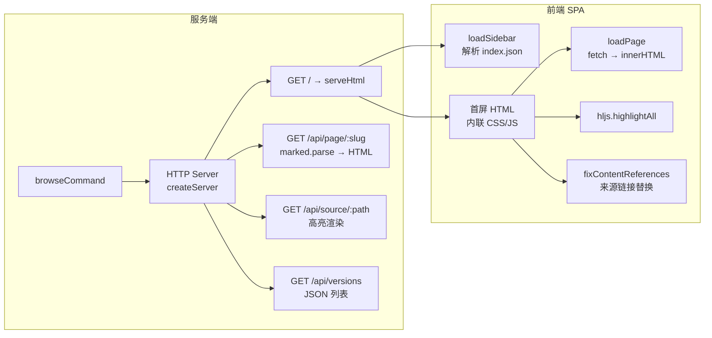
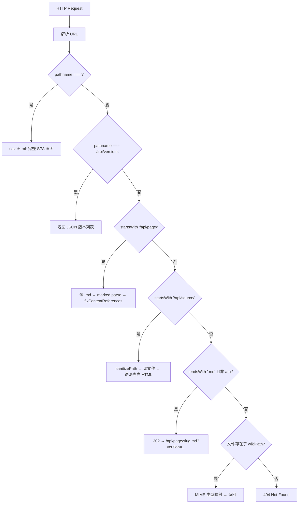

# HTTP 服务与前端渲染

`browse` 命令是 wiki-cli 的**可视层**。它将零散生成的 Markdown 文件组织为一个可交互的本地 Web 应用——不需要构建工具、不需要前端框架、不需要安装任何额外运行时。`browseCommand` 是这个过程的入口：它启动一个纯 Node.js HTTP 服务器，在内存中构建 SPA HTML 模板返回给浏览器，并通过三条 API 路由实现页面的按需加载。



[来源](src/commands/browse.ts#L1-L171)

---

## browseCommand：服务的完整生命周期

`browseCommand` 的执行路径可以分解为五个阶段：

### 阶段 1：校验与版本发现

```typescript
const wikiDir = join(PROJECT_ROOT, '.wiki');
if (!existsSync(wikiDir)) {
  logError('No .wiki directory found. Run "wiki-cli generate" first.');
  process.exit(1);
}
```

检查 `.wiki` 目录是否存在，不存在则直接退出——这是**防御式编程**的典型实践：在启动服务器前终止，而不是在用户访问时返回 404。接着扫描 `.wiki` 下的所有子目录（排除 `temp`），按名称降序排列，取第一个作为最新版本：

```typescript
const entries = await readdir(wikiDir, { withFileTypes: true });
const timestamps = entries
  .filter(e => e.isDirectory() && e.name !== 'temp')
  .map(e => e.name)
  .sort()
  .reverse();
const latest = timestamps[0];
```

`sort().reverse()` 将时间戳字符串（如 `2025-01-15T14-30-00`）按字典序降序排列，确保最新版本在首位。这种排序方式对 ISO 8601 格式的时间戳天然有效——字符序与时间序一致。如果所有生成版本被删除，则退出并提示用户运行 [生成命令：wiki-cli generate](生成命令-wiki-cli-generate.md)。

[来源](src/commands/browse.ts#L12-L40)

### 阶段 2：端口探测

```typescript
const port = await findFreePort(3000);
```

`findFreePort` 以 3000 为起点，利用临时 `http.Server` 实例尝试监听，失败时递归递增端口号。详见 [浏览命令：wiki-cli browse](浏览命令-wiki-cli-browse.md) 中的端口探测机制分析。

[来源](src/commands/browse.ts#L173-L186)

### 阶段 3：版本参数的透传

`getVersionFromUrl` 辅助函数从 URL 查询参数提取版本标识：

```typescript
function getVersionFromUrl(reqUrl: string): string {
  try {
    const u = new URL(reqUrl, `http://localhost:${port}`);
    return u.searchParams.get('version') || latest;
  } catch {
    return latest;
  }
}
```

这个函数在边界情况下的行为值得注意：当 `reqUrl` 为 `null` 或畸形时，`new URL` 构造会抛出异常，catch 分支回退到 `latest`——保证服务器在任何异常输入下都不会崩溃。

[来源](src/commands/browse.ts#L66-L72)

### 阶段 4：服务启动与浏览器打开

```typescript
server.listen(port, () => {
  logSuccess(`Wiki server started at ${url}`);
  const start = process.platform === 'win32' ? 'start'
    : process.platform === 'darwin' ? 'open' : 'xdg-open';
  execSync(`${start} ${url}`, { stdio: 'ignore' });
});
```

`execSync` 调用系统命令自动打开浏览器，`stdio: 'ignore'` 抑制浏览器进程的输出污染终端。如果自动打开失败（如无图形界面的远程终端），静默降级为用户手动打开。

[来源](src/commands/browse.ts#L163-L171)

---

## HTTP 路由表：六条规则，严格优先级

服务器以 `if-return` 链处理请求，每条规则匹配后立即结束响应，不存在回退到下一个匹配的"瀑布流"行为。



### 规则 1：`/` — SPA 首页

根路径返回完整 SPA 页面。调用 `serveHtml` 之前，先执行 `loadSidebar` 解析导航树、找到第一篇文章的路径。`serveHtml` 函数接收六个参数，将所有内容合并为一个完整的 HTML 文档返回。

### 规则 2：`/api/versions` — 版本列表 API

```typescript
const list = allVersions.map(v => ({
  ts: v,
  current: v === version,
}));
```

返回 JSON 数组，每个元素包含时间戳 `ts` 和当前版本标记 `current`。此 API 供前端版本切换覆盖层使用——但当前实现中版本列表是服务器端在 `serveHtml` 中直接内联生成的，前端并未实际调用此 API。这属于**预留接口**，为后续动态加载版本列表提供扩展点。

[来源](src/commands/browse.ts#L97-L104)

### 规则 3：`/api/page/:slug` — 页面内容 API

```typescript
const slug = decodeURIComponent(pathname.slice(10).replace(/\.md$/, ''));
const mdPath = join(wikiPath, `${slug}.md`);
if (existsSync(mdPath)) {
  const content = await readFile(mdPath, 'utf-8');
  const html = await marked.parse(content);
  const fixed = fixContentReferences(html);
  // ...
}
```

这是 SPA 的核心数据接口。路径解析有三个关键细节：

1. **`pathname.slice(10)`** — 精确去掉 `/api/page/` 的 10 个字符，而非使用正则匹配。这是一种微优化，避免正则引擎的编译开销
2. **`decodeURIComponent`** — 确保中文 slug（如 `HTTP-服务与前端渲染`）正确解码
3. **`.replace(/\.md$/, '')`** — 兼容带和不带扩展名的请求，`/api/page/slug` 和 `/api/page/slug.md` 指向同一文件

`marked.parse` 将 Markdown 同步渲染为 HTML 字符串。`marked` 是少数支持同步 API 的主流 Markdown 渲染库，这简化了代码流程——不需要 await 回调。

[来源](src/commands/browse.ts#L105-L117)

### 规则 4：`/api/source/:path` — 源码 API

此路由将源码路径映射到高亮 HTML 页面。路径参数经过 `sanitizePath` 防穿越校验后，读取文件内容，包裹在独立的 HTML 文档中返回。渲染过程详见 [版本切换与源代码预览](版本切换与源代码预览.md) 中对源码浏览的完整分析。

[来源](src/commands/browse.ts#L119-L132)

### 规则 5：`.md` 结尾 → 302 重定向

```typescript
if (pathname.endsWith('.md') && !pathname.startsWith('/api/')) {
  res.writeHead(302, {
    Location: '/api/page/' + encodeURIComponent(slug) + '.md?version=...'
  });
  res.end();
}
```

兼容 Markdown 原生链接引用。当 Wiki 内容中的 `[参考](其他页面.md)` 被点击时，浏览器请求直接指向 `.md` 文件，服务器将其重定向到渲染后的 HTML 页面。`302`（临时重定向）而非 `301`（永久）是因为 URL 中的 `.md` 扩展并非规范路径，浏览器不应缓存此跳转。

[来源](src/commands/browse.ts#L134-L139)

### 规则 6：静态文件兜底

对于存在于 `wikiPath` 下的非 `.md` 文件（图片、资源文件），通过 MIME 类型映射表返回。`.md` 文件被规则 5 先行拦截，不会进入此分支。

[来源](src/commands/browse.ts#L141-L149)

---

## loadSidebar：从 index.json 到导航树

侧边栏的导航数据在 `serveHtml` 之前就已经准备好了——`loadSidebar` 函数负责从磁盘加载并解析索引文件。

```typescript
async function loadSidebar(wikiPath: string): Promise<SidebarItem[]> {
  const jsonPath = join(wikiPath, 'index.json');
  if (existsSync(jsonPath)) {
    try { return parseIndexJson(content); } catch { /* fall through */ }
  }
  const mdPath = join(wikiPath, 'index.md');
  if (existsSync(mdPath)) {
    try { return parseIndexXml(content); } catch { /* ignore */ }
  }
  return [];
}
```

### 索引格式优先级：JSON > XML

`index.json` 是**主格式**，由 [生成命令：wiki-cli generate](生成命令-wiki-cli-generate.md) 的 Phase 2 产出。如果不存在（如旧版本或手动创建的 Wiki），回退到 `index.md` 的 XML 格式。

### parseIndexJson：解析 JSON 索引

```typescript
function parseIndexJson(content: string): SidebarItem[] {
  const cleaned = stripCodeFence(content);
  const jsonMatch = cleaned.match(/\{[\s\S]*\}/);
  let parsed = JSON.parse(jsonMatch[0]);

  const items: SidebarItem[] = [];
  for (const section of parsed.sections) {
    for (const topic of section.topics) {
      if (topic.type === 'group') {
        items.push({ title: topic.title, slug: '', level: 'group' });
      } else if (topic.title) {
        items.push({
          title: topic.title,
          slug: slugify(topic.title),
          level: topic.level || '中级'
        });
      }
    }
  }
  return items;
}
```

三步解析流程：

1. **`stripCodeFence`** — 移除 LLM 生成时可能包裹的 ```json 代码标记。`stripCodeFence` 来自 `llm-client.ts`，其正则 `^```(?:json)?\s*\n?` 和 `\n?```\s*$` 精确匹配开头和结尾的围栏代码块 [来源](src/ai/llm-client.ts#L52-L53)

2. **JSON 提取** — `match(/\{[\s\S]*\}/)` 找到最外层大括号包围的内容。使用 `[\s\S]`（匹配任意字符包括换行）而非 `.`（不匹配换行），确保跨行 JSON 被正确捕获

3. **导航树构建** — 遍历 `sections[].topics[]`，区分两种类型：
   - `type === 'group'` → 生成**分组标题**（`level: 'group'`），在侧边栏中渲染为灰色大写字母的分类标签
   - 普通 topic → 生成**页面条目**，slug 通过 `slugify` 函数从标题转换而来

`slugify` 的实现如下：

```typescript
function slugify(title: string): string {
  return title.toLowerCase()
    .replace(/[^\w\u4e00-\u9fff]+/g, '-')
    .replace(/^-+|-+$/g, '') || 'untitled';
}
```

这个函数兼容中英文标题：`\u4e00-\u9fff` 保留中文字符，所有非字母数字中文的字符替换为 `-`，最后修剪首尾的连字符。空标题回退为 `'untitled'`。注意此处的 slugify 与 [整体架构与模块划分](整体架构与模块划分.md) 中文件工具集的 `toSlug` 函数在逻辑上完全一致，但两处代码是**重复实现**，而非复用同一函数。

[来源](src/commands/browse.ts#L197-L235)

### buildSidebarHtml：从数据到 DOM

```typescript
function buildSidebarHtml(items: SidebarItem[]): string {
  const parts = items.map(item => {
    if (item.level === 'group')
      return `<li class="nav-group">${item.title}</li>`;
    const badge = item.level === '初学' ? '🟢'
      : item.level === '中级' ? '🟡' : '🔴';
    return `<li><a href="#" onclick="loadPage('...')">${badge} ${item.title}</a></li>`;
  });
  return parts.join('\n');
}
```

三条规则：
- **分组条目** (`level === 'group'`) → 不可点击的 `<li class="nav-group">`，仅显示标题文本
- **普通页面** → 可点击的 `<a>`，`onclick` 绑定 `loadPage` 调用，slug 经 `encodeURIComponent` 编码
- **难度徽章** → 根据 `level` 字段（初学/中级/高级）显示不同颜色的圆点图标，作为页面复杂度的视觉暗示

[来源](src/commands/browse.ts#L256-L263)

---

## serveHtml：SPA 模板的完整构成

`serveHtml` 函数是整个浏览体验的**编译时**——它在服务器端完成所有模板拼接，输出一个自包含的 HTML 文档。

```typescript
async function serveHtml(
  res: ServerResponse,
  wikiPath: string,
  sidebarItems: SidebarItem[],
  firstPage: string | null,
  allVersions: string[],
  currentVersion: string
): Promise<void> {
  // 1. 渲染首屏内容
  let firstContent = '';
  if (firstPage && existsSync(firstPage)) {
    const md = await readFile(firstPage, 'utf-8');
    firstContent = fixContentReferences(await marked.parse(md));
  }
  // 2. 构建侧边栏和版本列表 HTML
  const sidebarHtml = buildSidebarHtml(sidebarItems);
  const versionsHtml = buildVersionsHtml(allVersions, currentVersion);
  // 3. 拼接完整 HTML 模板
  const html = `<!DOCTYPE html>...`;
  res.writeHead(200, { 'Content-Type': 'text/html; charset=utf-8' });
  res.end(html);
}
```

[来源](src/commands/browse.ts#L191-L312)

### 主题系统：暗色 GitHub 风格的配色架构

CSS 全部内嵌在 `<style>` 标签中，配色体系围绕 GitHub Dark 主题构建：

| CSS 变量 / 选择器 | 值 | 作用域 |
|---|---|---|
| `body` 背景 | `#0d1117` | 全局背景 |
| `body` 文字 | `#c9d1d9` | 正文默认色 |
| `.sidebar` 背景 | `#161b22` | 导航面板 |
| `.sidebar a:hover` | `#58a6ff` / `#1c2333` | 导航链接悬停态 |
| `.content h1/h2/h3` | `#f0f6fc` | 标题高亮色 |
| `.content pre` | `#161b22` / `#30363d` | 代码块背景与边框 |
| `.content a.source-ref` | `#8b949e` / `border` | 来源引用标签 |

[来源](src/commands/browse.ts#L271-L311)

### 双栏 Flexbox 布局

布局的核心结构是三层 `display: flex` 嵌套：

```
body (display: flex, justify-content: center)
  └── .wrapper (display: flex, max-width: 1280px)
       ├── .sidebar (width: 280px, overflow-y: auto, flex-shrink: 0)
       │    ├── .sidebar-header (h2 + 历史版本按钮)
       │    └── <ul> (nav-group + 页面条目)
       └── .content (flex: 1, padding: 40px, max-width: 900px, overflow-y: auto)
```

关键设计参数：
- **wrapper 限制 1280px 宽度** — 在大屏上保持内容居中，避免极端宽屏下的阅读疲劳
- **sidebar 固定 280px** — 足够容纳中英文标题而不换行
- **content 限制 900px 阅读宽度** — 符合 Web 排版的最佳阅读宽度（66-75 字符/行）
- **两栏独立滚动** — 侧边栏和内容区各自 `overflow-y: auto`，长导航列表不会影响内容区的滚动位置

[来源](src/commands/browse.ts#L274-L280)

### Highlight.js 语法高亮

CDN 加载 highlight.js 11.9.0 的 GitHub Dark 主题：

```html
<link rel="stylesheet"
  href="https://cdnjs.cloudflare.com/ajax/libs/highlight.js/11.9.0/styles/github-dark.min.css">
<script src="https://cdnjs.cloudflare.com/ajax/libs/highlight.js/11.9.0/highlight.min.js"></script>
```

CSS 主题文件与页面背景 `#0d1117` 一致，代码块获得与 GitHub 相同的着色方案：关键字蓝色、字符串绿色、注释灰色。固定版本号 `11.9.0` 防止 CDN 破坏性更新导致高亮失效。

[来源](src/commands/browse.ts#L269-L270)

---

## 前端交互引擎：loadPage 与 SPA 导航

`serveHtml` 内联的 JavaScript 构成了一个微型 SPA 引擎。核心是 `loadPage` 函数：

```javascript
async function loadPage(encodedSlug) {
  const slug = decodeURIComponent(encodedSlug);
  const res = await fetch('/api/page/' + slug + '.md?version=' + currentVersion);
  const html = await res.text();
  document.getElementById('content').innerHTML = html;
  document.getElementById('content').scrollTop = 0;
  hljs.highlightAll();
  history.replaceState(null, '', '#' + slug);
}
```

### 五步执行流

1. **`fetch('/api/page/...')`** — 异步请求服务器端渲染的 HTML 片段，不包含侧边栏等框架元素

2. **`innerHTML` 替换** — 直接写入 `#content` 元素的 DOM 内容。`innerHTML` 比 `DOM 解析 + 插入` 快，但会丢失原 DOM 中的事件监听器和状态（如 highlight.js 注入的高亮 DOM）

3. **`scrollTop = 0`** — 重置滚动位置到顶部，避免旧页面的滚动偏移残留

4. **`hljs.highlightAll()`** — 扫描整个 DOM 中所有 `<pre><code>` 元素，为其注入语法高亮着色。这是必须的——`innerHTML` 替换后，新插入的代码块尚未经历 highlight.js 的 DOM 操作

5. **`history.replaceState(null, '', '#' + slug)`** — 将当前 slug 写入 URL hash，不触发页面刷新。使得浏览器后退/前进按钮可感知 SPA 导航，页面刷新后通过 `location.hash` 恢复浏览状态

[来源](src/commands/browse.ts#L286-L290)

### 全局链接拦截

内容区的所有 `<a>` 点击通过事件委托被拦截：

```javascript
document.getElementById('content').addEventListener('click', function(e) {
  const anchor = e.target.closest('a');
  const href = anchor.getAttribute('href');
  // 外部链接、API 链接、锚点、mailto → 放行
  if (!href || href.startsWith('http') || href.startsWith('/api/')
      || href.startsWith('#') || href.startsWith('mailto:')) return;
  e.preventDefault();
  if (href.endsWith('.md')) {
    loadPage(href.replace(/\.md$/, ''));
  } else {
    window.open('/api/source/' + href, '_blank');
  }
});
```

核心逻辑：**放行外部和 API 链接，拦截内部链接**。内部链接的判断逻辑是二分法——以 `.md` 结尾的视为页面引用（SPA 加载），否则视为源码引用（新标签打开源码浏览页面）。

[来源](src/commands/browse.ts#L293-L306)

---

## fixContentReferences：来源标记的链接转换

这是连接 Wiki 生成与浏览的**汇合点**。生成阶段 LLM 在 Markdown 中插入 `[来源：路径]` 标记，`fixContentReferences` 在浏览阶段将其渲染为可点击的链接。

```typescript
function fixContentReferences(html: string): string {
  return html.replace(
    /\[来源：([^\]]+)\]/g,
    '<a href="/api/source/$1" target="_blank" class="source-ref">[来源]</a>'
  );
}
```

### 正则分析

| 部分 | 含义 |
|---|---|
| `\[来源：` | 匹配字面量 `[来源：` |
| `([^\]]+)` | 捕获组，匹配一个或多个非 `]` 字符——即路径 |
| `\]` | 匹配字面量 `]` |
| `g` | 全局匹配，替换文档中所有出现 |

### 替换效果

```
[来源：src/commands/browse.ts#L33-L34]
→ <a href="/api/source/src/commands/browse.ts#L33-L34"
     target="_blank" class="source-ref">[来源]</a>
```

### 调用时机

`fixContentReferences` 在两个路径上被调用：

- **首次加载**（`serveHtml` 中处理 `firstPage`）— 确保首页的引用链接可点击
- **动态加载**（`/api/page/:slug` 路由中 `marked.parse` 之后）— 确保 SPA 按需加载的每个页面片段都被处理

两端覆盖意味着用户无论以何种方式进入页面，所有 `[来源：...]` 标记都会转换为可交互的链接。

[来源](src/commands/browse.ts#L250-L253)

---

## 完整请求链路：从点击到源码显示

```
┌─────────────────────────────────────────────────────┐
│  Markdown 中的标记                                    │
│  [来源：src/commands/browse.ts#L33-L34]              │
│         │                                            │
│         ▼ fixContentReferences                       │
│  <a href="/api/source/src/commands/browse.ts#L33-L34"│
│     target="_blank" class="source-ref">[来源]</a>    │
│         │                                            │
│         ▼ 用户点击                                   │
│  浏览器 fetch /api/source/src/commands/browse.ts     │
│         │                                            │
│         ▼ 服务器收到请求                              │
│  sanitizePath → 安全校验                              │
│  readFile → 读取文件内容                              │
│  extToLang → 语言检测 (.ts → typescript)            │
│  escapeHtml → HTML 转义                              │
│  拼接完整 HTML 文档 ← 返回带高亮的源码页面             │
└─────────────────────────────────────────────────────┘
```

[来源](src/commands/browse.ts#L119-L132)

---

## 推荐阅读

- [浏览命令：wiki-cli browse](浏览命令-wiki-cli-browse.md) — `browse` 命令的 CLI 层面用法与参数说明
- [整体架构与模块划分](整体架构与模块划分.md) — browse 模块在项目四层架构中的位置
- [版本切换与源代码预览](版本切换与源代码预览.md) — 源码 API 的渲染模板与路径安全纵深防御
- [生成结果说明](生成结果说明.md) — `index.json` 索引文件的结构定义与生成规则
- [生成命令：wiki-cli generate](生成命令-wiki-cli-generate.md) — 理解 LLM 如何在生成阶段插入 `[来源：路径]` 标记