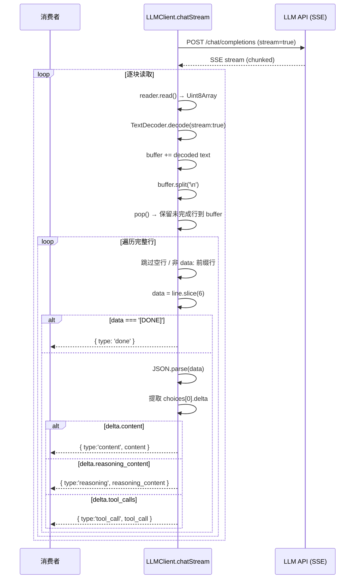

# LLM 客户端实现

`LLMClient` 是与所有兼容 OpenAI API 的 LLM 提供商交互的核心模块。它封装了流式（SSE）和非流式两种调用模式，内置指数退避重试机制，并原生支持推理内容（reasoning_content）和工具调用（Function Calling）。整个类只有 150 行左右，职责单一且边界清晰。

## 核心类型体系

客户端定义了一组接口，构成与 LLM 对话的类型骨架：

| 接口 | 用途 |
|---|---|
| `ChatMessage` | 描述对话消息，含 `role`、`content`、`reasoning_content`、`tool_calls`、`tool_call_id`、`name` |
| `ToolCall` | OpenAI 标准的 Function Call 结构，`id`、`type: 'function'`、`function: { name, arguments }` |
| `StreamChunk` | 流式输出的最小单元，type 为 `'content' | 'reasoning' | 'tool_call' | 'done' | 'error'` |
| `LLMResponse` | 非流式一次返回的结果，`content` + `reasoning_content` + `tool_calls` |

特别值得注意的是 `ChatMessage.content` 声明为 `string | null | undefined` 三重态。这在后续的 `serializeMessage` 中被精细处理。

[来源](src/ai/llm-client.ts#L1-L26)

## `buildRequest`：请求组装函数

`buildRequest` 接收配置、消息列表和三个可选开关（tools、stream、jsonMode），返回 URL、请求头和序列化的请求体。

```typescript
function buildRequest(config, messages, tools?, stream?, jsonMode?)
```

其内部逻辑可分解为以下条件分支：

```mermaid
flowchart TD
    A[config.baseUrl] --> B[拼接 /chat/completions]
    B --> C{stream?}
    C -->|true| D[body.stream = true]
    C -->|false| E[不设置 stream]
    D --> F{tools?.length > 0?}
    E --> F
    F -->|true| G[body.tools = tools]
    F -->|false| H[不设置 tools]
    G --> I{jsonMode?}
    H --> I
    I -->|true| J[body.response_format = {type:'json_object'}]
    I -->|false| K[不设置 response_format]
    J --> L[headers: Content-Type + Authorization Bearer]
    K --> L
```

**关键细节**：

- `baseUrl` 尾部的斜杠被统一去除：`config.baseUrl.replace(/\/+$/, '')`，确保 URL 拼接不出现双斜杠。
- `stream` 参数只控制请求体中是否添加 `"stream": true`，不干预读取方式——读取方式由调用者（`chatStream` vs `chat`）决定。
- `jsonMode` 对应 OpenAI 的 `response_format: { type: 'json_object' }`，仅在部分提供商中生效。关于哪些提供商支持此特性，参见 [配置存储与高级选项](配置存储与高级选项.md) 中的 `JSON_MODE_PROVIDERS` 集合。

[来源](src/ai/llm-client.ts#L63-L84)

## `serializeMessage`：消息序列化与 null content 删除

```typescript
function serializeMessage(m: ChatMessage): Record<string, any>
```

这个函数负责将 `ChatMessage` 对象转换为发送给 API 的纯对象。其特殊之处在于最后一行的防御性处理：

```typescript
if (msg.content === null) delete msg.content;
```

**为什么需要这行？** 在工具调用场景中，当模型返回 `tool_calls` 时，其 `content` 字段往往为 `null`。但某些 LLM 提供商（如 DeepSeek）在收到 `"content": null` 时会报错，要求要么不传 `content`，要么传有效字符串。这行代码确保 `content` 为 `null` 时被完全从对象中移除，兼容了更严格的 API 实现。

此外，`reasoning_content` 仅在非 undefined 且非 null 时才写入——这是为了防止在对话历史中回传空的 reasoning 字段。

[来源](src/ai/llm-client.ts#L38-L49)

## `stripCodeFence`：代码围栏清理工具

```typescript
export function stripCodeFence(text: string): string
```

这个导出的工具函数用于从 LLM 返回的文本中移除 Markdown 代码围栏，特别是在 `json_object` 模式下——模型虽然承诺返回纯 JSON，但偶尔仍会包裹在 ` ```json ` 中。

正则逻辑：
1. `^```(?:json)?\s*\n?` — 匹配开头的 ` ``` ` 或 ` ```json `（全局多行模式）
2. `\n?```\s*$` — 匹配结尾的 ` ``` `
3. `.trim()` — 去除首尾空白

注意使用了 `g` 和 `m` 双重标志，`m` 让 `^` 和 `$` 匹配每行的首尾，但实际的围栏上下文是文档级的。

[来源](src/ai/llm-client.ts#L51-L53)

## `chatStream`：SSE 流式解析引擎

`chatStream` 是一个 `AsyncGenerator<StreamChunk>`，它内部的 SSE 解析是整个客户端中最精妙的部分。

### SSE 行级解析回路



### 缓冲区边界处理

SSE 数据通过 TCP 分块到达，`data:` 行可能在任意位置被截断。缓冲区策略是：

1. 将新到达的字节通过 `TextDecoder.decode(value, { stream: true })` 解码——这个标志告诉解码器保留不完整的多字节字符在内部状态中。
2. 将解码后的文本追加到 `buffer`。
3. 按 `\n` 切分：`lines = buffer.split('\n')`。
4. **关键**：`buffer = lines.pop() || ''` — 最后一段可能是不完整的行，留在 buffer 中等待下一次 read。

这种写法保证了即使 SSE 数据包以任意边界切割，也不会丢失或损坏数据。

### 事件分发

对于每个有效的 `data: ` 行，解析出 JSON 后提取 `choices[0].delta`，根据存在的字段分发三种事件：

- `delta.content` → `{ type: 'content', content }` — 普通文本 token
- `delta.reasoning_content` → `{ type: 'reasoning', reasoning_content }` — 推理链 token（用于 DeepSeek-R1、QwQ 等推理模型）
- `delta.tool_calls` → `{ type: 'tool_call', tool_call }` — 函数调用片段

注意 `delta.content` 检查的是**真值**而非非 null。这意味着空字符串 `""` 不会被 yield。这与 OpenAI SSE 规范一致：空 content 表示该 delta 没有文本变更。

[来源](src/ai/llm-client.ts#L98-L188)

## `chat`：非流式一次性调用

与 `chatStream` 形成互补，`chat` 方法走非流式路径：`buildRequest(..., false, jsonMode)` 不设置 `stream` 标志，API 返回完整的 JSON 响应体后一次解析。

```typescript
const result = await response.json();
const choice = result.choices?.[0]?.message;
return {
  content: choice?.content || null,
  reasoning_content: choice?.reasoning_content || null,
  tool_calls: choice?.tool_calls || [],
};
```

它和 `chatStream` 共用同一套重试逻辑（见下文），区别仅在于错误处理方式：`chat` 在非重试性错误或重试耗尽时 **throw Error**，而 `chatStream` **yield `{ type: 'error' }`**。这是生成器 vs Promise 的自然差异。

[来源](src/ai/llm-client.ts#L192-L225)

## 重试策略：3 次 + 指数退避

```typescript
const MAX_RETRIES = 3;

function isRetryable(status: number): boolean {
  return status >= 500 || status === 429;
}
```

### 条件判断

`isRetryable` 只对两类状态码返回 true：

| 状态码 | 含义 | 重试 |
|---|---|---|
| 429 | Too Many Requests | 是 |
| 5xx | 服务端错误（500/502/503/504...） | 是 |
| 4xx 非 429 | 客户端错误（401/403/404...） | **否** |

对于 401（认证失败）或 404（端点不存在），重试毫无意义，直接 fail fast。

### 退避算法

```typescript
const wait = Math.pow(2, attempt - 1) * 1000;
```

- 第 1 次重试（attempt=1）：`2^0 * 1000 = 1000ms`
- 第 2 次重试（attempt=2）：`2^1 * 1000 = 2000ms`
- 第 3 次重试（attempt=3）：`2^2 * 1000 = 4000ms`

总最长等待时间 ≈ 7 秒。对于需要更快响应的场景，这个退避窗足够短不至于让用户等待过久，又足够长让瞬时故障有机会恢复。

### 流式重试的特殊之处

`chatStream` 在重试前会 yield 一条 `reasoning` 消息：

```typescript
yield { type: 'reasoning', reasoning_content: `\n[retry ${attempt}/${MAX_RETRIES} in ${wait}ms]` };
```

这让消费方能将重试状态展示给用户（例如在 [AI 交互命令](ai-交互命令-wiki-cli-ai.md) 的终端界面上打印重试提示），而不是静默卡死。

[来源](src/ai/llm-client.ts#L86-L96)

## 类层面的设计决策

`LLMClient` 只持有一个 `config: WikiCliConfig` 引用，无状态。这意味着：

- 实例可以在不同调用间复用
- 线程安全（JS 单线程模型下自然成立）
- 测试时只需 mock `globalThis.fetch`，无需实例化任何基础设施

构造函数仅做赋值，无副作用。

[来源](src/ai/llm-client.ts#L98-L102)

## 与周边模块的关系

```mermaid
flowchart LR
    A[config-store.ts] -->|WikiCliConfig| B[LLMClient]
    B -->|ToolDefinition[]| C[tools.ts]
    B -->|fetch API| D[LLM Provider]
    E[generate.ts] -->|调用 chat/chatStream| B
    F[ai.ts] -->|调用 chatStream| B
    B -->|StreamChunk| E
    B -->|LLMResponse| E
```

- [整体架构与模块划分](整体架构与模块划分.md) 将 `LLMClient` 归类为"AI 层"的核心
- [工具系统与函数调用](工具系统与函数调用.md) 提供了 `ToolDefinition` 的具体定义和 10 个只读工具的实现
- [配置存储与高级选项](配置存储与高级选项.md) 解释了 `WikiCliConfig` 的来源和 JSON 模式开关

[来源](src/ai/llm-client.ts#L1-L2)

## 下一步

- 查看 [添加新 LLM 提供商](添加新-llm-提供商.md) 了解如何扩展 `LLMClient` 以支持更多后端
- 查看 [测试策略与单元测试](测试策略与单元测试.md) 了解 `llm-client.test.ts` 中覆盖的边界场景（含 mock SSE 流、重试验证、错误路径）
- 查看 [提示词模板引擎](提示词模板引擎.md) 了解发送给 LLM 的消息内容是如何通过模板系统组装的