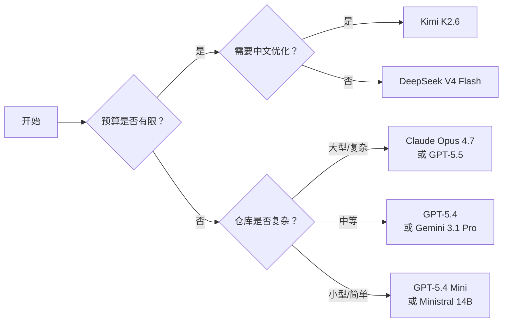

好，所有数据已收集完毕。现在我拥有 `src/config/default-models.json` 中 7 家提供商 21 个模型的完整数据，以及 `config-store.ts` 中关于 JSON 模式支持和 Custom 模式的逻辑。开始撰写页面。

---

# LLM 提供商与模型选择

wiki-cli 内置了 7 家 LLM 提供商的预配置模型清单，你无需手动填写 API 地址和模型名，只需在交互式配置中选择即可开始使用。

## 为什么需要选择模型？

不同模型在 **推理能力、响应速度、成本和上下文窗口** 上差异巨大。选择适合的模型直接决定了：

- **代码分析质量** —— 复杂仓库需要强推理模型
- **生成速度** —— 简单任务可用轻量模型加速
- **使用成本** —— 高频使用时选择性价比模型更经济

[来源](src/config/default-models.json)

---

## 全部提供商一览

下表汇总了 7 家内置提供商的基本信息：

| 提供商 | 预置模型数 | API 兼容格式 | JSON 模式支持 |
|--------|-----------|-------------|:------------:|
| OpenAI | 5 | OpenAI | ✅ |
| Google Gemini | 3 | Google API | ❌ |
| Anthropic | 3 | Anthropic API | ❌ |
| xAI Grok | 3 | OpenAI | ✅ |
| DeepSeek | 2 | OpenAI | ✅ |
| Kimi (Moonshot) | 2 | OpenAI | ✅ |
| Mistral | 3 | OpenAI | ✅ |

> **JSON 模式** 指模型是否原生支持 `response_format: json_object`，这会影响生成结构化数据的可靠性。如果选了不支持 JSON 模式的提供商，配置时会提示手动确认。[来源](src/config/config-store.ts#L27-L37)

---

## OpenAI — 旗舰模型系列

OpenAI 提供了从旗舰到轻量的完整模型梯队，适合各类场景。

| 模型 | 描述 | 定价提示 | API 地址 |
|------|------|---------|---------|
| `gpt-5.5` | OpenAI GPT-5.5（最新旗舰） | 最贵，质量最高 | `https://api.openai.com/v1` |
| `gpt-5.4` | OpenAI GPT-5.4 | 高质量，成本低于 5.5 | 同上 |
| `gpt-5.4-mini` | OpenAI GPT-5.4 Mini | 性能/成本均衡 | 同上 |
| `gpt-5.4-nano` | OpenAI GPT-5.4 Nano | 最快，最便宜 | 同上 |
| `gpt-5-mini` | OpenAI GPT-5 Mini（旧版） | 旧款轻量模型 | 同上 |

**推荐场景：**
- **GPT-5.5** — 复杂代码库分析、生成高质量文档的首选
- **GPT-5.4** — 日常生成任务，平衡质量与成本
- **GPT-5.4 Mini / Nano** — 快速预览、简单仓库的快速生成

[来源](src/config/default-models.json#L1-L30)

---

## Google Gemini — 性价比之选

Gemini 系列以低价格和强推理能力著称，适合大规模使用。

| 模型 | 描述 | 定价提示 | API 地址 |
|------|------|---------|---------|
| `gemini-3.1-pro` | Google Gemini 3.1 Pro | 定价有竞争力，推理能力强 | `https://generativelanguage.googleapis.com/v1beta` |
| `gemini-3-flash` | Google Gemini 3 Flash | 快速，低成本 | 同上 |
| `gemini-3.1-flash-lite` | Google Gemini 3.1 Flash Lite | 最便宜的 Gemini 模型 | 同上 |

**推荐场景：**
- **Gemini 3.1 Pro** — 需要强推理但预算有限的中型仓库
- **Gemini 3 Flash** — 快速迭代、原型验证
- **Gemini 3.1 Flash Lite** — 大规模批量生成，极致省钱

[来源](src/config/default-models.json#L31-L42)

---

## Anthropic Claude — 深度分析专家

Claude 系列以深度推理和长上下文见长，适合复杂任务。

| 模型 | 描述 | 定价提示 | API 地址 |
|------|------|---------|---------|
| `claude-opus-4-7` | Claude Opus 4.7 | 最适合复杂分析 | `https://api.anthropic.com/v1` |
| `claude-sonnet-4-6` | Claude Sonnet 4.6 | 质量与速度的良好平衡 | 同上 |
| `claude-haiku-4-5` | Claude Haiku 4.5 | 快速，低成本 | 同上 |

**推荐场景：**
- **Claude Opus 4.7** — 大型复杂仓库、需要深入理解架构的高质量文档生成
- **Claude Sonnet 4.6** — 日常开发文档，兼顾速度与质量
- **Claude Haiku 4.5** — 轻量任务、高频调用

[来源](src/config/default-models.json#L43-L54)

---

## xAI Grok — 推理增强系列

Grok 模型强调推理能力，提供标准与推理增强两种路线。

| 模型 | 描述 | 定价提示 | API 地址 |
|------|------|---------|---------|
| `grok-4.3` | xAI Grok 4.3 | 定价有竞争力 | `https://api.x.ai/v1` |
| `grok-4.20-reasoning` | xAI Grok 4.20 Reasoning | 增强推理 | 同上 |
| `grok-4-1-fast-reasoning` | xAI Grok 4.1 Fast Reasoning | 快速推理变体 | 同上 |

**推荐场景：**
- **Grok 4.20 Reasoning** — 需要深度推理的分析任务
- **Grok 4.3** — 通用文档生成
- **Grok 4.1 Fast Reasoning** — 快速推理场景

[来源](src/config/default-models.json#L55-L66)

---

## DeepSeek — 高性价比黑马

DeepSeek 以极低的价格提供接近旗舰的质量，适合成本敏感场景。

| 模型 | 描述 | 定价提示 | API 地址 |
|------|------|---------|---------|
| `deepseek-v4-pro` | DeepSeek V4 Pro | 高质量，价格有竞争力 | `https://api.deepseek.com` |
| `deepseek-v4-flash` | DeepSeek V4 Flash | 快速，性价比高 | 同上 |

**推荐场景：**
- **DeepSeek V4 Pro** — 高质量文档生成，成本约为 OpenAI 旗舰的几分之一
- **DeepSeek V4 Flash** — **性价比之王**，适合大多数日常生成任务

[来源](src/config/default-models.json#L67-L74)

---

## Kimi (Moonshot) — 中文友好

Kimi 模型对中文代码仓库有良好支持，适合中文项目。

| 模型 | 描述 | 定价提示 | API 地址 |
|------|------|---------|---------|
| `kimi-k2.6` | Moonshot Kimi K2.6 | 最新 Kimi 模型 | `https://api.moonshot.cn/v1` |
| `kimi-k2.5` | Moonshot Kimi K2.5 | 上一代 Kimi 模型 | 同上 |

**推荐场景：**
- **Kimi K2.6** — 中文项目文档生成的首选
- **Kimi K2.5** — 备用选项，成本更低

[来源](src/config/default-models.json#L75-L82)

---

## Mistral — 开发者生态

Mistral 提供从旗舰到轻量的多尺寸模型，Devstral 系列专为开发者优化。

| 模型 | 描述 | 定价提示 | API 地址 |
|------|------|---------|---------|
| `mistral-large-3` | Mistral Large 3 | Mistral 最强模型 | `https://api.mistral.ai/v1` |
| `devstral-2` | Mistral Devstral 2 | 面向开发者 | 同上 |
| `ministral-14b` | Mistral Ministral 14B | 小巧、快速、便宜 | 同上 |

**推荐场景：**
- **Mistral Large 3** — 高要求的分析任务
- **Devstral 2** — 代码开发相关文档生成
- **Ministral 14B** — 资源受限环境或快速测试

[来源](src/config/default-models.json#L83-L97)

---

## Custom 模式：对接任意第三方服务

除了 7 家内置提供商，wiki-cli 还支持 **Custom 模式**。选择此项后，你可以手动输入：

- **Base URL** — 任意兼容 OpenAI API 格式的第三方服务地址
- **Model 名称** — 该服务提供的模型标识

这意味着你可以对接：
- 自托管的开源模型（如通过 Ollama、vLLM 部署的 Llama、Qwen 等）
- 国内镜像服务
- 企业内部 LLM 网关

选择 Custom 模式时，配置向导会询问是否支持 JSON 模式，因为系统无法自动判断。[来源](src/config/config-store.ts#L35-L36)

---

## 如何选择？快速决策指南

---

## 配置方式

选定提供商和模型后，通过 `wiki-cli config` 命令进行交互式配置即可。详见 [配置命令：wiki-cli config](配置命令-wiki-cli-config.md)。

如果你想了解配置文件的存储结构和高级选项（如 JSON 模式开关），参考 [配置存储与高级选项](配置存储与高级选项.md)。

如果你是开发者，想为 wiki-cli 添加新的 LLM 提供商，请阅读 [添加新 LLM 提供商](添加新-llm-提供商.md)。

---

## 数据来源

以上所有模型信息直接来源于项目的预置配置文件，随版本更新而更新：

- 模型清单：[src/config/default-models.json](src/config/default-models.json)
- JSON 模式支持判断逻辑：[src/config/config-store.ts#L27-L37](src/config/config-store.ts#L27-L37)
- Custom 模式交互流程：[src/commands/config.ts#L42-L62](src/commands/config.ts#L42-L62)