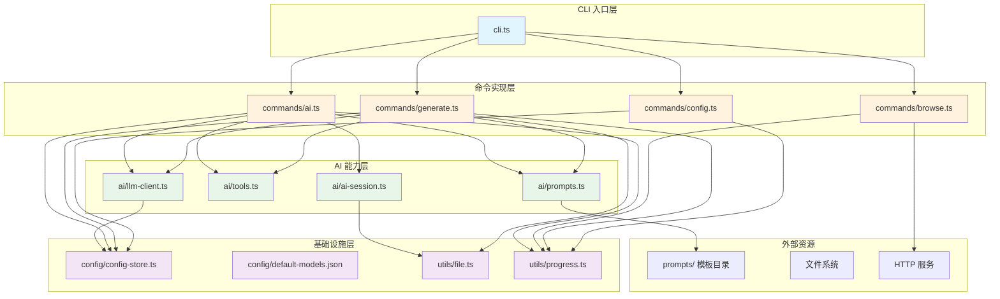

# 整体架构与模块划分

## 一眼看透：四层同心圆

`wiki-cli` 的代码组织遵循清晰的分层原则，从外到内依次是 **CLI 入口层 → 命令实现层 → AI 能力层 → 基础设施层**。每一层只依赖内层，绝不反向引用。



图表中日久运行发现的事实：`commands/browse.ts` 依赖 `ai/llm-client.ts`（仅使用 `stripCodeFence` 工具函数），这是一个轻微的反向依赖，后面会谈到。

[来源](src/cli.ts#L1-L65) | [来源](src/commands/generate.ts#L1-L15) | [来源](src/commands/browse.ts#L10-L10)

## 文件级职责一览

`src/` 目录下 12 个 TypeScript 源文件 + 1 个 JSON 配置文件，每个文件都有明确且单一的职责。

| 文件 | 所属层 | 职责 | 关键导出 |
|------|--------|------|----------|
| `cli.ts` | CLI 入口 | Commander.js 注册 4 条命令、参数解析、顶层错误处理 | 无（`#!/usr/bin/env node` 入口） |
| `commands/config.ts` | 命令实现 | 交互式/命令行参数配置 LLM 提供商、模型、API 密钥、语言 | `configCommand()` |
| `commands/generate.ts` | 命令实现 | 两阶段 Wiki 生成（大纲 + 逐页）、断点续传、并行控制 | `generateCommand()` |
| `commands/browse.ts` | 命令实现 | 启动本地 HTTP 服务浏览生成的 Wiki | `browseCommand()` |
| `commands/ai.ts` | 命令实现 | 交互式 AI 问答模式、会话管理、单轮回答模式 | `aiCommand()` |
| `ai/llm-client.ts` | AI 能力 | 兼容 OpenAI API 的流式/非流式客户端、重试机制 | `LLMClient`, `ChatMessage`, `StreamChunk`, `stripCodeFence` |
| `ai/tools.ts` | AI 能力 | 10 个只读工具的 Function Calling 定义与动态分发 | `toolDefinitions`, `executeToolCall()` |
| `ai/prompts.ts` | AI 能力 | 从 `prompts/` 目录加载 Mustache 风格模板并渲染 | `renderPrompt()`, `loadPrompt()`, `fillPrompt()` |
| `ai/ai-session.ts` | AI 能力 | AI 问答会话的持久化（创建/加载/保存/列表/删除） | `createSession()`, `saveSession()`, `listSessions()` 等 |
| `config/config-store.ts` | 基础设施 | 配置文件的 JSON 读写、默认模型列表加载、JSON 模式支持检测 | `loadConfig()`, `saveConfig()`, `loadDefaultModels()` |
| `config/default-models.json` | 基础设施 | 7 家提供商 21 个模型的预定义清单 | JSON 数组 |
| `utils/file.ts` | 基础设施 | 文件系统操作：目录创建、文件读写、目录移动、时间戳、slug 化 | `ensureDir()`, `writeTextFile()`, `moveDir()`, `toSlug()` 等 |
| `utils/progress.ts` | 基础设施 | 终端日志与进度显示：彩色日志、转圈动画、流式输出 | `logInfo()`, `logSuccess()`, `logError()`, `createSpinner()` |

[来源](src/cli.ts#L1-L4) | [来源](src/ai/llm-client.ts#L1-L17) | [来源](src/ai/tools.ts#L1-L23) | [来源](src/ai/prompts.ts#L1-L28) | [来源](src/ai/ai-session.ts#L1-L22) | [来源](src/config/config-store.ts#L1-L22) | [来源](src/utils/file.ts#L1-L60) | [来源](src/utils/progress.ts#L1-L42)

## 三层核心架构解读

### 第一层：CLI 入口层 — 薄薄的调度者

`cli.ts` 是整个应用的唯一入口，由 `package.json` 的 `"bin"` 字段指向编译产物 `dist/cli.js`。它的工作极其简单：使用 **Commander.js** 注册四条命令 `config` / `generate` / `browse` / `ai`，每个命令的 `action` handler 只是一个 `try/catch` 包裹的异步调用，将控制权完全交给命令实现层。

```typescript
// cli.ts 中的典型模式
program
  .command('generate')
  .description('Analyze current repository and generate Wiki documentation')
  .action(async () => {
    try {
      await generateCommand();  // ← 全权委托
    } catch (err: any) {
      logError(err.message);    // ← 仅处理顶层未捕获异常
      process.exit(1);
    }
  });
```

如果用户没有传入任何参数，自动调用 `program.outputHelp()` 显示帮助信息。

[来源](src/cli.ts#L1-L65)

### 第二层：命令实现层 — 流程的编排者

四条命令各自对应一个 `commands/*.ts` 文件，它们不包含"智能"逻辑，而是**编排**：调用 AI 能力层获取结果，调用基础设施层做持久化，用进度工具向用户反馈状态。

以 `generateCommand()` 为例，它的流程清晰得可以直接读出：

1. 调用 `loadConfig()` 检查配置 → 未配置则报错退出
2. 检测 `.wiki/temp` 目录 → 询问用户恢复还是重新开始（[断点续传与重试机制](断点续传与重试机制.md)）
3. 实例化 `LLMClient` → 调用 `generateOutline()`（Phase 1，即[大纲生成阶段](大纲生成阶段.md)）
4. 用户选择并行/串行 → 遍历大纲逐页生成（Phase 2，即[页面生成与并行控制](页面生成与并行控制.md)）
5. 临时目录重命名为时间戳版本目录 → 完成

`commands/ai.ts` 的编排更为复杂：它需要同时协调 `LLMClient`、`toolDefinitions`、`executeToolCall`、`renderPrompt` 和 `ai-session.ts` 中的全套会话管理函数。这正是编排者的角色 — 把积木搭成产品。

[来源](src/commands/generate.ts#L30-L80) | [来源](src/commands/ai.ts#L1-L25)

### 第三层：AI 能力层 — 真正的核心

这一层是 `wiki-cli` 区别于普通文档生成工具的**技术护城河**。四个文件各司其职：

**`llm-client.ts`** 封装了与任意兼容 OpenAI API 的 LLM 服务通信的完整逻辑。它支持流式（SSE）和非流式两种模式，内置最多 3 次重试机制（针对 429/500/502/503 等可重试状态码），还能识别 `reasoning_content` 字段（如 DeepSeek-R1 的思维链输出）。

**`tools.ts`** 定义了 10 个只读工具（如 `list_directory`、`read_file`、`search_in_files`、`git_log`、`git_show` 等），每个都包含完整的 JSON Schema 参数定义。`executeToolCall()` 根据 LLM 返回的 `function.name` 动态分发到对应实现，这是 **OpenAI Function Calling** 模式的完整实现。

**`prompts.ts`** 实现了模板引擎：从 `prompts/` 目录加载 `.md` 文件，用 `{{variable}}` 占位符替换实现变量注入。这是 `prompts/` 目录解耦设计的代码侧支撑。

**`ai-session.ts`** 管理 `.wiki/sessions/` 目录下的 JSON 会话文件，支持创建、加载、列表和删除操作，专为交互式问答场景设计。

[来源](src/ai/llm-client.ts#L1-L50) | [来源](src/ai/tools.ts#L1-L23) | [来源](src/ai/prompts.ts#L1-L28) | [来源](src/ai/ai-session.ts#L1-L22)

### 第四层：基础设施层 — 沉默的支撑者

**`config/config-store.ts`** 是配置中心：从 `~/.wiki-cli/config.json` 读写配置，从 `default-models.json` 加载预定义模型列表，检测提供商是否支持 JSON 模式。

**`utils/file.ts`** 是文件操作工具箱，提供 `ensureDir`、`writeTextFile`、`moveDir`、`removeDir`、`toSlug`（将中文标题转为 URL 友好的 slug）等函数。

**`utils/progress.ts`** 是终端 UI 工具箱，提供彩色日志（`logInfo`/`logSuccess`/`logWarning`/`logError`）和 `createSpinner`（基于 `ora` 库的转圈动画），以及用于流式输出的 `logStreamContent`。

[来源](src/config/config-store.ts#L1-L40) | [来源](src/utils/file.ts#L1-L60) | [来源](src/utils/progress.ts#L1-L42)

## 跨层调用方向：单向依赖的守护

整个代码库的依赖规则只有一条：**外层可以调内层，内层绝不调外层**。

```
CLI 入口层 → 命令实现层 → AI 能力层 → 基础设施层
                                        ↑
                               config/ + utils/ 同级互调
```

一个例外值得注意：`commands/browse.ts` 从 `ai/llm-client.ts` 导入了 `stripCodeFence` 工具函数。这是一个从 Markdown 代码块中提取纯内容的简单字符串函数，放在 `llm-client.ts` 中更多是历史原因而非设计选择。如果严格重构，它应该下沉到 `utils/`。

另一个微妙之处：`ai/llm-client.ts` 引用了 `ai/tools.ts` 中的 `ToolDefinition` 类型，以及 `config/config-store.ts` 中的 `WikiCliConfig` 类型。这是类型引用，不是运行时依赖 — 编译后会消失，不影响分层纯净性。

[来源](src/commands/browse.ts#L10) | [来源](src/ai/llm-client.ts#L1-L2) | [来源](src/ai/llm-client.ts#L227-L232)

## prompts/ 目录：解耦设计的样板

`prompts/` 目录位于项目根目录，不属于 `src/` 中的任何一层。它包含 5 个 Markdown 模板文件：

```
prompts/
├── ai-system.md       # AI 问答模式的系统提示词
├── outline-system.md  # 大纲生成阶段的系统提示词
├── outline-user.md    # 大纲生成阶段的用户提示词模板
├── page-system.md     # 页面生成阶段的系统提示词
└── page-user.md       # 页面生成阶段的用户提示词模板
```

代码与提示词之间的桥梁只有 `ai/prompts.ts` 中的 `renderPrompt(filename, vars)` 函数。它加载模板文件，用 `{{variable}}` 占位符注入变量，返回渲染后的字符串。

这种设计的核心价值：**修改提示词不需要修改 TypeScript 代码**。你可以直接编辑 `prompts/` 下的 `.md` 文件来调整 LLM 行为，无需重新编译。具体模板格式见[编写自定义提示词模板](编写自定义提示词模板.md)。

[来源](src/ai/prompts.ts#L1-L28) | [来源](prompts/)

## 从目录结构读懂设计哲学

整个 `src/` 目录只有 12 个 `.ts` 文件，没有深层的子目录嵌套。这种"扁平的模块化"传递了几个信息：

1. **模块边界清晰** — 每个文件就是一个独立的能力单元，没有模糊的"公共工具库"目录
2. **新人友好** — 5 分钟就能看完所有源文件，理解全貌
3. **单一职责强制** — 如果一个文件变得臃肿，唯一的解法是拆出新文件，而不是加内部段

这种结构非常适合中型 CLI 工具：足够简单让单人开发者全盘掌握，又足够结构化支持多人协作。

## 下一步阅读

- 深入了解 CLI 入口层的命令注册细节：[CLI 入口点与命令注册](cli-入口点与命令注册.md)
- 深入 AI 能力层的核心实现：[LLM 客户端实现](llm-客户端实现.md) 和[工具系统与函数调用](工具系统与函数调用.md)
- 了解编排者如何工作：[生成命令：wiki-cli generate](生成命令-wiki-cli-generate.md) 和 [AI 交互命令：wiki-cli ai](ai-交互命令-wiki-cli-ai.md)
- 探索基础设施：[配置存储与高级选项](配置存储与高级选项.md) 和[测试策略与单元测试](测试策略与单元测试.md)