现在我已掌握了全部代码细节。以下是聚焦于**重试机制**的页面——与已有的[断点续传与并行生成](断点续传与并行生成.md)互补，深入剖析失败收集、传播与重试的完整链路。

---

# 断点续传与重试机制

生成数十页 Wiki 的过程中，网络波动、API 限流、服务端超时几乎是必然事件。系统的韧性不在于避免失败——那不可能——而在于失败发生后如何以最小代价恢复。本章聚焦两个层次：**断点续传**解决进程级中断（用户按 Ctrl+C、终端关闭）后的恢复，**重试循环**解决单次 LLM 调用失败后的局部重试。

## 第一道防线：检查点恢复

每次运行生成命令时，`generateCommand` 的第一条逻辑就是检测临时目录是否存在：

```typescript
const TEMP_DIR = '.wiki/temp';

if (existsSync(TEMP_DIR)) {
  const { action } = await inquirer.prompt([
    {
      type: 'list',
      name: 'action',
      message: 'Previous generation temp data found. What do you want to do?',
      choices: [
        { name: '🔄 Resume from last checkpoint', value: 'resume' },
        { name: '🗑️  Discard and start fresh', value: 'fresh' },
      ],
    },
  ]);

  if (action === 'fresh') {
    await removeDir(TEMP_DIR);
  }
}
```

[来源](../src/commands/generate.ts#L38-L58)

这里的判断逻辑是纯文件系统层面的：`.wiki/temp/` 是否存在。它不依赖任何状态文件、PID 文件或锁文件。这种设计的优势在于：

- **零状态维护**——不需要记录"当前生成到第几页"，目录中存在几个 `.md` 文件就是几页。
- **原子性判定**——目录存在即表示有未完成的生成，不存在即表示干净状态。不存在"部分创建"的中间状态让判断失效。
- **用户手动清理也兼容**——如果用户删除了 `.wiki/temp/` 下的部分文件，恢复时自动跳过已删除的文件（因为文件不存在，会重新生成）。

选择 **Fresh** 时执行 `removeDir(TEMP_DIR)` 递归删除整个临时目录，随后 `ensureDir(TEMP_DIR)` 重建空目录。选择 **Resume** 则什么都不做——保留现有文件结构直接进入大纲生成阶段。

### 文件级跳过逻辑

在页面生成阶段，`generatePages` 内部的 `generateOne` 函数在每个页面生成前执行文件存在性检查：

```typescript
const pagePath = join(TEMP_DIR, `${slug}.md`);
if (!options.retryList && existsSync(pagePath)) {
  if (!options.parallel) {
    logInfo(`[${index}/${total}] Skipping already generated: ${topic.title}`);
  }
  return;
}
```

[来源](../src/commands/generate.ts#L401-L408)

这个条件有两个关键设计点：

1. **`!options.retryList`**——仅当**不是重试**模式时才跳过。重试时即使文件已存在也要重新生成，因为前一次生成的内容可能是不完整的"残片"（例如 LLM 中途返回了截断内容）。
2. **串行模式才打日志**——并行模式下多个跳过日志会交错输出，干扰阅读，因此静默跳过。

恢复时的跳过粒度是一个页面一个文件。如果 20 页中已生成了 15 页，恢复时只生成缺失的 5 页，每页节省一次 LLM 调用（通常耗时 5–30 秒）。

## 第二道防线：失败重试循环

检查点解决的是"进程中断后恢复"，但更常见的情况是进程持续运行、个别页面调用失败。`generateCommand` 在 Phase 2 之后直接进入一个 while 循环专门处理局部失败：

```typescript
const failed = await generatePages(client, config, workDir, topics, {
  parallel, concurrency: concurrency || 3,
});

while (failed.length > 0) {
  logWarning(`${failed.length} page(s) failed to generate.`);
  const { retry } = await inquirer.prompt([
    {
      type: 'confirm',
      name: 'retry',
      message: 'Retry failed pages?',
      default: true,
    },
  ]);

  if (!retry) break;

  logInfo(`Retrying ${failed.length} page(s)...`);
  const retryResult = await generatePages(client, config, workDir, topics, {
    parallel,
    concurrency: concurrency || 3,
    retryList: [...failed],
  });
  failed.length = 0;
  failed.push(...retryResult);
}
```

[来源](../src/commands/generate.ts#L90-L115)

### 重试循环的状态流转

```mermaid
flowchart TD
    A[首次 generatePages] --> B{返回 failed 列表}
    B -->|failed.length === 0| C[成功，进入提交阶段]
    B -->|failed.length > 0| D[日志警告 + 用户确认]
    D -->|用户选否| C
    D -->|用户选是| E[generatePages<br/>retryList = failed]
    E --> F{返回新的 failed 列表}
    F -->|仍有失败| D
    F -->|全部成功| C
```



这个循环没有硬编码的重试次数上限——用户可以通过不断确认"重试"来反复尝试，直到所有页面成功，或主动选择接受部分失败的结果。循环结束后的处理：

```typescript
if (failed.length > 0) {
  logWarning(`${failed.length} page(s) were not generated successfully.`);
}
```

[来源](../src/commands/generate.ts#L117-L119)

剩余失败页面不会被写入最终目录——后续的 `moveDir` 迁移时临时目录中不存在这些文件，最终版本目录中自然也不会有。

### retryList 的传播机制

`generatePages` 内部根据 `options.retryList` 决定本次要处理的页面集合：

```typescript
const pageTopics = options.retryList || allTopics.filter(t => !t.isGroup);
```

[来源](../src/commands/generate.ts#L396-L396)

这个分支决定了两个模式：

| 模式 | `pageTopics` 来源 | 跳过已存在文件？ | 适用场景 |
|------|------------------|-----------------|---------|
| **首次生成** | `allTopics`（过滤掉 group） | 是（`!options.retryList && existsSync(pagePath)`） | 正常全量生成，文件已存在说明是检查点恢复 |
| **重试** | `retryList`（只含失败页） | 否（条件中的 `!options.retryList` 为 false） | 强制重新生成失败页面，覆盖可能不完整的旧文件 |

首次生成时，跳过检查依赖于 `existsSync(pagePath)`——这正是检查点机制在起效。重试时，跳过检查被禁用，每个失败页面都会强制调用 LLM，无论文件是否已存在于临时目录。

需要注意的是 `retryList` 使用了**浅拷贝** `[...failed]` 来传入。这确保了重试调用期间 `failed` 数组不会因引用问题被外部篡改，保持了数据流的纯净。

### 并发模式下的错误收集

当采用并行模式时，错误收集的逻辑与串行模式相同，但传播路径有微妙差异。在 `generateOne` 函数中：

```typescript
if (fullContent) {
  await writeTextFile(pagePath, fullContent);
  if (options.parallel) {
    logSuccess(`[${index}/${total}] Generated: ${topic.title}`);
  } else {
    logSuccess(`Generated: ${topic.title}`);
  }
} else {
  failed.push(topic);
  logError(`Failed: ${topic.title}`);
}
```

[来源](../src/commands/generate.ts#L418-L428)

`failed` 数组在 `generatePages` 的闭包中定义，被所有并发执行的 `generateOne` 实例共享写入：

```typescript
async function generatePages(...): Promise<Topic[]> {
  const pageTopics = options.retryList || allTopics.filter(t => !t.isGroup);
  const failed: Topic[] = [];
  // ...
  // failed 被 generateOne 闭包捕获
  // ...
  return failed;
}
```

[来源](../src/commands/generate.ts#L393-L395]

多个并发任务同时 `failed.push(topic)` 在 JavaScript 的**单线程事件循环**中是安全的——`push` 操作不会被中断。但需要留意：如果两个页面同时失败，`logError` 的输出可能在终端交错。这是纯展示层面的问题，不影响逻辑正确性。

### 与 LLM 客户端重试的关系

这里的重试循环是**应用层重试**，与 `LLMClient` 内部的**传输层重试**形成两层防御：

| 层级 | 位置 | 重试对象 | 策略 | 处理结果 |
|------|------|---------|------|---------|
| 传输层 | `llm-client.ts` | 单次 HTTP 请求 | 指数退避，最多 4 次尝试（1+3次重试） | 成功 → 返回内容；失败 → 抛异常或 yield error |
| 应用层 | `generate.ts` | 整个页面生成链路 | 用户确认后整页重来 | 成功 → 写入文件；失败 → 累加 failed 列表 |

[来源](../src/ai/llm-client.ts#L93-L96)

传输层重试解决的是 HTTP 级别的瞬态错误（5xx、429），退避后通常能自行恢复。如果传输层重试耗尽仍失败（例如 API Key 无效、模型持续超时），异常传导到 `collectFullResponse`，返回 `null`，应用层将该页面归入 `failed` 列表，等待用户决定是否重试。

这种两层设计避免了**两种极端**：既不会因为一次网络抖动就中断整个生成（传输层自动恢复），也不会在根本性错误（如认证失败）上做无意义的重复尝试（应用层需要用户确认）。

## 提交阶段：temp 到 final 的迁移

所有页面生成完毕（包括重试循环结束）后，系统执行最终的"提交"操作：

```typescript
const timestamp = getTimestamp();
const finalDir = join('.wiki', timestamp);
await moveDir(TEMP_DIR, finalDir);
```

[来源](../src/commands/generate.ts#L129-L133)

`moveDir` 的实现异常简洁：

```typescript
export async function moveDir(src: string, dest: string): Promise<void> {
  await rename(src, dest);
}
```

[来源](../src/utils/file.ts#L48-L50)

底层使用了文件系统的 `rename` 系统调用。在同一个文件系统分区内，`rename` 是一个**原子操作**——要么全部移动成功，要么不动。不存在目录中文件不完整的中间状态。这意味着：

- **不需要先拷贝再删除**——`rename` 只修改文件系统的目录项指针，不涉及数据拷贝，即使目录中有数百个 `.md` 文件也瞬间完成。
- **不存在不一致的最终结果**——`.wiki/2025-01-15T10-30-00/` 要么存在且完整，要么不存在。临时目录 `.wiki/temp/` 在 `rename` 成功后自动消失。
- **与检查点机制形成闭环**——如果生成中途崩溃，`.wiki/temp/` 残留下来。下次运行检测到它，触发断点续传选择。如果生成成功，`.wiki/temp/` 被原子地转为时间戳目录。

`getTimestamp` 生成 `2025-01-15T10-30-00` 格式的字符串，确保每次生成的目录名称唯一且按字典序排序。多个版本在 `.wiki/` 下并存，构成多版本管理的基础——详见[多版本管理与索引](多版本管理与索引.md)。

## 设计权衡

1. **文件级 vs 状态文件级检查点**。选择文件存在性作为检查点信号，放弃了进度粒度（无法在页面内部中断恢复），但换来了极致的简单性——没有序列化/反序列化状态的开销，没有状态文件损坏的风险。对于单次生成 10–50 页的场景，页面级粒度恰好合适。

2. **无限重试 vs 固定次数**。重试循环没有上限次数，因为失败的原因可能是外部不可控的（API 限流、网络波动），设上限反而可能让用户陷入"就差最后两页但次数耗尽"的窘境。代价是用户需要手动判断是否应放弃——但这是 LLM 调用场景的合理设计，因为每次重试都有金钱成本（token 消耗）。

3. **并行模式下的错误可见性**。串行模式下每页的 LLM 输出实时可见，错误一目了然。并行模式下输出被抑制，用户只能看到最终的"成功/失败"二元结果。这是一个刻意的取舍：吞吐量的提升以错误诊断能力为代价。详见[断点续传与并行生成](断点续传与并行生成.md)中的串行/并行对比表。

---

> **推荐阅读：**[断点续传与并行生成](断点续传与并行生成.md)详细分析了并行并发控制与流式取舍。[两阶段生成流程](两阶段生成流程.md)解释了大纲生成与页面生成两个阶段的完整协作链路。[LLM 客户端核心实现](llm-客户端核心实现.md)分析了传输层的指数退避重试策略。[生成结果说明](生成结果说明.md)解释了最终目录结构及 index.json 的生成逻辑。