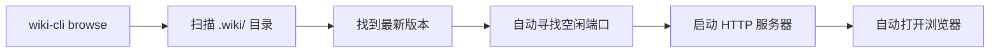

现在我已经掌握了全部信息，可以编写这个页面了。

---

# 浏览命令：wiki-cli browse

当你运行 `wiki-cli browse` 时，工具会启动一个本地 HTTP 服务器，把你生成的 Wiki 文档变成一个可以在浏览器中浏览的网站。你不需要安装 Nginx、Apache 或其他 Web 服务器——整个过程由一条命令完成。

本文从用户视角讲解 `browse` 命令的完整流程和所有交互功能。

---

## 启动流程：从终端到浏览器

执行 `wiki-cli browse` 后，后台发生了四件事：



### 第 1 步：扫描 `.wiki/` 目录

命令首先检查当前项目根目录下是否存在 `.wiki/` 文件夹。**如果不存在**，说明你还没有运行过 `wiki-cli generate`，程序会直接报错退出，并提示你先执行生成命令。

> `.wiki/` 是 `generate` 命令的产物，包含所有已生成的 Markdown 文档和索引文件。详见 [](生成命令-wiki-cli-generate.md)。

### 第 2 步：找到最新版本

`.wiki/` 目录下可能有多个版本——每次运行 `generate` 都会创建一个以时间戳命名的子目录（例如 `2025-01-15T14-30-00`）。程序会读取所有子目录，按时间倒序排列，自动选择**最新的那个**作为当前浏览对象。

### 第 3 步：自动寻找空闲端口

启动服务器时，程序会从 **3000 端口**开始探测。如果 3000 被其他程序占用，它会自动尝试 3001、3002……直到找到一个可用端口。你不需要手动指定端口号。

### 第 4 步：启动服务器并打开浏览器

端口确定后，HTTP 服务器正式启动。终端会看到一行成功提示：

```
✓ Wiki server started at http://localhost:3000
```

同时，**浏览器会自动打开**，直接进入你刚刚生成的 Wiki 首页。

[来源](../src/commands/browse.ts#L13-L107)

---

## 左侧导航栏：浏览所有文档

浏览器打开后，你会看到一个分为两栏的页面：

```
┌──────────────────────────────────────────────┐
│  📖 Wiki     [历史版本]                       │
│                                              │
│  🟢 概览                                      │
│  🟢 快速开始                                  │
│  🔶 配置命令                                  │
│  🔶 生成命令                                  │
│  —— 深入探索 ——                               │
│  🔶 整体架构与模块划分                         │
│  🔴 LLM 客户端实现                            │
│                          ↓                    │
└──────────────────────────────────────────────┘
```

左侧导航栏的层级结构和章节划分，来自 `index.json` 文件。这个文件在生成阶段由 LLM 自动创建，记录了整个 Wiki 的目录结构。

### 导航栏的三种元素

| 元素 | 外观 | 含义 |
|------|------|------|
| 🟢 **绿色标题** | `🟢 概览` | 适合**初学**者阅读 |
| 🟡 **黄色标题** | `🟡 生成命令` | 适合有基础的**中级**读者 |
| 🔴 **红色标题** | `🔴 LLM 客户端实现` | **高级**主题，需较多背景知识 |
| `—— 深入探索 ——` | 灰色大写文字 | 章节**分组标题**，不可点击 |

点击任意一个页面标题，右侧内容区会立即切换显示对应的文档内容——**无需刷新页面**。

[来源](../src/commands/browse.ts#L163-L177)

---

## [来源] 链接：点击查看源码

在 Wiki 页面中，你会经常看到这样的标记：

```
[来源：src/commands/browse.ts#L33-L34]
```

这不是普通的文本——它是一个**可点击的链接**。点击后，浏览器会打开一个新标签页，直接显示对应源码文件的内容，并带有语法高亮：

```
┌──────────────────────────────────────────────┐
│  ← Wiki  |  src/commands/browse.ts    [ts]   │
├──────────────────────────────────────────────┤
│  import { readFile, readdir }                │
│  import { join, extname, resolve }           │
│  ...                                         │
│  function sanitizePath(rawPath) { ... }      │
│                                              │
└──────────────────────────────────────────────┘
```

这实现了**文档与源码的双向引用**：读文档时可以一键跳转到源码核实细节，看源码时又能返回文档理解上下文。

[来源](../src/commands/browse.ts#L188-L191)

---

## 页面间的交叉引用：智能跳转

Wiki 页面之间通过 Markdown 链接相互引用，例如：

```
[快速开始](快速开始.md)
[整体架构与模块划分](整体架构与模块划分.md)
```

点击这类链接时，浏览器**不会刷新整个页面**——它只替换右侧内容区的内容，加载速度极快。这种体验称为**SPA（单页应用）**，让你感觉像是在浏览一个精心设计的文档网站。

你还可以通过浏览器的**前进/后退按钮**在已访问过的页面之间导航。

[来源](../src/commands/browse.ts#L293-L306)

---

## 版本切换：回看历史文档

每次运行 `wiki-cli generate` 都会生成一个完整的文档快照，保存在独立的目录中。要查看历史版本，只需两步：

1. 点击侧边栏顶部的 **「历史版本」** 按钮
2. 在弹出的面板中，点击你想要查看的版本时间戳

```
┌──────────────────────────────────┐
│  ✕  历史版本                      │
│                                  │
│  2025-01-15T14-30-00  ← 当前     │
│  2025-01-14T10-15-22             │
│  2025-01-13T09-00-11             │
│                                  │
└──────────────────────────────────┘
```

点击旧版本后，页面会**整体刷新**，侧边栏和内容区都会切换为对应版本的内容。这是合理的设计——不同版本的文档结构可能不同，侧边栏的章节和页面列表也会变化。

关闭版本面板有三种方式：
- 点击右上角的 **✕** 按钮
- 点击面板之外的**半透明遮罩层**
- 按下键盘的 **ESC** 键

[来源](../src/commands/browse.ts#L97-L104)

---

## 📝 总结

`wiki-cli browse` 的核心设计哲学是**零配置即开即用**：

| 特性 | 你不需要做什么 |
|------|---------------|
| 端口选择 | 自动探测空闲端口，无需手动指定 |
| 最新版本 | 自动加载最新生成的文档 |
| 侧边栏导航 | 从 `index.json` 自动构建目录树 |
| 源码引用 | 点击 `[来源]` 自动打开语法高亮页面 |
| 版本切换 | 内置「历史版本」面板一键切换 |

所有功能都内建在一条命令中，没有外部依赖。

---

## 下一步

- 想要知道生成文档时发生了什么？看 [](生成命令-wiki-cli-generate.md)
- 想了解侧边栏索引文件的格式细节？看 [](生成结果说明.md)
- 想深入学习 HTTP 服务器和前端渲染的实现？看 [](http-服务与前端渲染.md) 和 [](版本切换与源代码预览.md)
- 想了解整个项目的命令体系？看 [](cli-入口点与命令注册.md)