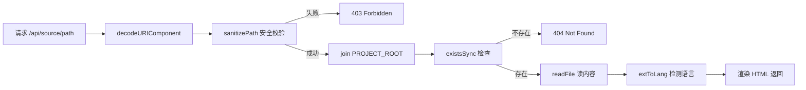

# 版本切换与源代码预览

`browse` 命令启动的 HTTP 服务不仅渲染 Wiki 文档，还内置了两个与代码仓库深度关联的功能：**多版本 Wiki 的历史切换** 和 **源码文件的在线预览**。前者让你回溯文档的每一次生成快照，后者让文档中的 `[来源：...]` 引用变成可点击的跳转链接。两者共享同一个服务器实例，却服务于不同的浏览场景。

---

## 版本发现：从文件系统到版本列表

### 扫描与排序

服务器启动时，`browseCommand` 函数第一件事就是扫描 `.wiki/` 目录，列举所有子目录作为候选版本：

```typescript
const entries = await readdir(wikiDir, { withFileTypes: true });
const timestamps = entries
  .filter(e => e.isDirectory() && e.name !== 'temp')
  .map(e => e.name)
  .sort()
  .reverse();

const latest = timestamps[0];
```

[来源](src/commands/browse.ts#L14-L24)

四个步骤构成了版本发现的核心逻辑：

| 步骤 | 操作 | 目的 |
|------|------|------|
| `readdir` | 列出 `.wiki/` 下所有条目 | 获取目录快照 |
| `filter` | 仅保留目录，排除 `temp` | 临时目录不视为版本 |
| `sort().reverse()` | 按名称字典序降序排列 | 最新版本排在最前 |
| `timestamps[0]` | 取第一个 | 即最新版本 |

**关键前提**：时间戳目录的命名格式为 `YYYY-MM-DDThh-mm-ss`（如 `2025-01-01T10-30-00`），该格式的字符串字典序与时间先后顺序完全一致。这意味着 `sort()` 等价于按时间排序，`reverse()` 后第一个就是最新版本。这一设计在 [多版本管理与索引](多版本管理与索引.md) 中有完整阐述。

若没有找到任何版本目录（或 `.wiki/` 不存在），服务器打印错误并退出进程，引导用户先执行 `wiki-cli generate`。[来源](src/commands/browse.ts#L26-L29)

### `/api/versions`：版本列表的 JSON 接口

`/api/versions` 是服务器暴露的第二个路由，返回所有可用版本的结构化数据：

```typescript
if (pathname === '/api/versions') {
  const list = allVersions.map(v => ({
    ts: v,
    current: v === version,
  }));
  res.writeHead(200, { 'Content-Type': 'application/json; charset=utf-8' });
  res.end(JSON.stringify(list));
  return;
}
```

[来源](src/commands/browse.ts#L97-L104)

响应示例：

```json
[
  { "ts": "2025-01-01T13-20-00", "current": true },
  { "ts": "2025-01-01T11-45-00", "current": false },
  { "ts": "2025-01-01T10-30-00", "current": false }
]
```

每个版本对象包含两个字段：`ts` 为时间戳目录名，`current` 为布尔值标记是否当前选中的版本。当前版本的判定依据是 URL 中的 `?version=` 参数——如果请求 `/api/versions` 的 URL 中携带了 `?version=2025-01-01T10-30-00`，则该版本的 `current` 为 `true`。

该接口目前已内嵌在首页 HTML 的版本切换面板中（见下文），同时为未来前端进行动态版本加载提供了扩展点。关于 HTTP 服务的整体路由设计，参见 [HTTP 服务与前端渲染](http-服务与前端渲染.md)。

---

## 版本切换 UI：Overlay 弹窗

版本切换的交互入口位于侧边栏顶部的「历史版本」按钮，点击后弹出模态遮罩层（Overlay），展示所有版本列表。

### Overlay 的 HTML 结构

Overlay 的 DOM 由 `serveHtml` 函数在服务器端内联生成：

```html
<div class="overlay" id="versionOverlay" onclick="if(event.target===this)hideVersions()">
  <div class="overlay-box">
    <span class="close-btn" onclick="hideVersions()">✕</span>
    <h3>历史版本</h3>
    ${versionsHtml}
  </div>
</div>
```

[来源](src/commands/browse.ts#L304-L310)

Overlay 默认隐藏（`display: none`），通过 `.show` 类控制可见性（`display: flex`）。背景使用半透明黑色 `rgba(0,0,0,0.6)`，内容盒子居中定位，`z-index: 100` 确保位于所有页面元素之上。[来源](src/commands/browse.ts#L314-L315)

### 版本列表的生成

`buildVersionsHtml` 函数将版本数组渲染为可点击的链接列表：

```typescript
function buildVersionsHtml(versions: string[], current: string): string {
  return versions.map(v =>
    `<a href="#" class="${v === current ? 'current' : ''}" onclick="switchVersion('${v}')">${v}</a>`
  ).join('');
}
```

[来源](src/commands/browse.ts#L241-L245)

当前版本额外获得 `current` CSS 类，渲染为蓝色高亮背景（`#58a6ff` 色值 + `#1c2333` 背景），与其他版本形成视觉区分。

### 三种关闭方式与版本切换

用户可以通过三种方式关闭 Overlay：

| 方式 | 实现 |
|------|------|
| 点击 ✕ 按钮 | `onclick="hideVersions()"` |
| 点击遮罩背景 | `onclick` 判断 `event.target === this` |
| 按 ESC 键 | 全局 `keydown` 监听器，检测 `e.key === 'Escape'` |

[来源](src/commands/browse.ts#L321、L330)

版本切换触发完整页面跳转：

```javascript
function switchVersion(ts) {
  window.location.href = '/?version=' + ts;
}
```

[来源](src/commands/browse.ts#L323)

注意这里使用的是 **整页加载而非 SPA 局部刷新**。因为版本切换意味着侧边栏、内容区、版本列表本身都需要重新渲染——`serveHtml` 需要重新读取目标版本的 `index.json` 和首篇文章。用局部 DOM 替换来处理这种全量变更过于复杂，全页跳转是最直接可靠的方案。关于 SPA 内部页面切换的策略，参见 [浏览器端 SPA 体验](浏览器端-spa-体验.md)。

### 版本参数的传递链路

每次请求进入时，服务器从 URL 中提取 `version` 参数：

```typescript
const version = url.searchParams.get('version') || latest;
const wikiPath = join(wikiDir, version);
```

[来源](src/commands/browse.ts#L82-L84)

所有后续路由（`/api/page/`、`/api/source/`、静态文件）都基于 `wikiPath` 读取文件。如果没有指定 `version`，默认使用 `latest`——即版本发现中排序后的第一个。

---

## 源码预览：`/api/source/` 路由

源码预览功能让文档中的 `[来源：路径]` 标记变成可点击的链接，点击后在新标签页打开一个完整的、带语法高亮的源码展示页面。

### 请求处理流程

路由入口位于 `pathname.startsWith('/api/source/')` 分支：

```typescript
const rawPath = decodeURIComponent(pathname.slice(12));
const safePath = sanitizePath(rawPath);
if (!safePath) {
  res.writeHead(403);
  res.end('Forbidden');
  return;
}
const fullPath = join(PROJECT_ROOT, safePath);
if (!existsSync(fullPath)) {
  res.writeHead(404);
  res.end('Source file not found');
  return;
}
const content = await readFile(fullPath, 'utf-8');
const ext = extname(fullPath);
const lang = extToLang(ext);
```

[来源](src/commands/browse.ts#L119-L132)

流程可归纳为五步：



### sanitizePath：三层防御防穿越

作为接受用户路径输入的路由，`/api/source/` 是攻击面最大的端点。`sanitizePath` 函数使用三层防护确保路径不会逃逸项目根目录：

```typescript
function sanitizePath(rawPath: string): string | null {
  const cleaned = rawPath.replace(/^[/\\\\]+/, '');
  const normalized = normalize(cleaned)
    .replace(/^(\\.\\.(\\/|\\\\))+/g, '');
  const resolved = resolve(PROJECT_ROOT, normalized);
  if (!resolved.startsWith(PROJECT_ROOT + sep)
      && resolved !== PROJECT_ROOT) return null;
  return normalized;
}
```

[来源](src/commands/browse.ts#L239-L244)

| 层级 | 代码 | 对抗的攻击 |
|------|------|-----------|
| **前缀清理** | `replace(/^[/\\\\]+/, '')` | 移除开头的 `/` 或 `\\`，防止绝对路径被 `resolve` 解析为系统根目录 |
| **归一化剥离** | `normalize` + 剥离前导 `../` | 将 `foo/../../etc` 解析为 `../etc` 再剥离为 `etc` |
| **边界校验** | `startsWith(PROJECT_ROOT + sep)` | 最终确认绝对路径仍在项目根内 |

**纵深防御**的哲学体现在：每一层都假设上一层可能被绕过。即使前两层因某种 edge case 失效，第三层的绝对路径边界检查仍然是最后一道不可逾越的屏障。若校验失败，函数返回 `null`，服务器立即响应 403 Forbidden，不会尝试读取任何文件。

### extToLang：扩展名到代码语言映射

```typescript
function extToLang(ext: string): string {
  const map: Record<string, string> = {
    '.ts': 'typescript', '.js': 'javascript', '.json': 'json',
    '.md': 'markdown', '.yml': 'yaml', '.yaml': 'yaml',
    '.html': 'html', '.css': 'css', '.sh': 'bash', '.bash': 'bash',
  };
  return map[ext] || 'plaintext';
}
```

[来源](src/commands/browse.ts#L246-L254)

映射表覆盖了项目中最常见的文件类型。未覆盖的扩展名（如 `.svg`、`.txt`）默认回退为 `plaintext`，Highlight.js 对纯文本不做着色渲染。这个映射在两个位置发挥作用：一是设置 `<code class="language-${lang}">` 供 Highlight.js 识别语言，二是在页面头部的语言徽章中显示语言名称。

### 源码页面布局

返回的 HTML 是一个独立完整的文档，通过内联字符串模板在服务器端拼接生成：

```html
<!DOCTYPE html>
<html lang="zh-CN">
<head>
  <link rel="stylesheet" href="...highlight.js/.../github-dark.min.css">
</head>
<body>
  <div class="header">
    <a href="/?version=${version}">← Wiki</a>
    <span class="path">${escapeHtml(fileName)}</span>
    <span class="lang-badge">${lang}</span>
  </div>
  <pre><code class="language-${lang}">${escapeHtml(content)}</code></pre>
  <script src="...highlight.js/.../highlight.min.js"></script>
  <script>hljs.highlightAll();</script>
</body>
</html>
```

[来源](src/commands/browse.ts#L133-L151)

布局分三个区域：

| 区域 | 样式 | 作用 |
|------|------|------|
| 头部 | `position: sticky; top: 0` | 显示返回链接、文件路径、语言徽章，滚动时固定 |
| 代码块 | `<pre><code>` | 内容经 `escapeHtml` 转义后嵌入，防止 HTML 注入 |
| 脚本 | CDN 加载 highlight.js | 页面加载完成后自动执行语法着色 |

**HTML 转义**是安全的关键环节：`escapeHtml` 将 `&`、`<`、`>`、`"` 分别替换为 HTML 实体，确保源码中的 HTML 标签不被浏览器解析。[来源](src/commands/browse.ts#L256-L260)

CDN 资源使用固定版本号 `11.9.0`，避免未来发布破坏性更新导致页面异常。关于源码浏览功能的更多细节，参见 [源代码浏览功能](源代码浏览功能.md)。

---

## findFreePort：递增式端口探测

服务器启动前需要确定一个可用的端口。`findFreePort` 函数从 3000 开始尝试，若被占用则逐次递增：

```typescript
async function findFreePort(preferred: number): Promise<number> {
  return new Promise((resolve) => {
    const srv = createServer();
    srv.listen(preferred, () => {
      const addr = srv.address();
      if (addr && typeof addr === 'object') {
        srv.close(() => resolve(addr.port));
      } else {
        srv.close(() => resolve(preferred));
      }
    });
    srv.on('error', () => resolve(findFreePort(preferred + 1)));
  });
}
```

[来源](src/commands/browse.ts#L173-L186)

### 工作原理

1. **创建临时服务器**：不带 request 回调的 `http.createServer()` 实例，仅用于端口探测，不处理任何请求
2. **监听目标端口**：调用 `srv.listen(preferred)`，触发操作系统的端口分配
3. **成功则关闭并返回**：`listening` 事件触发后，读取 `server.address().port` 确认端口号，关闭服务器后 resolve
4. **失败则递归重试**：`error` 事件（通常是 `EADDRINUSE`）触发后，递归调用自身，端口号 +1

### 设计取舍

| 维度 | 评估 |
|------|------|
| **可靠性** | 高。`EADDRINUSE` 是 POSIX 标准错误，Node.js 在所有平台可靠触发 |
| **竞态条件** | 存在微小的 TOCTOU 窗口——`close()` 后到正式 `server.listen()` 之间端口可能被抢占。本地开发环境概率极低 |
| **递归深度** | 递归通过 Promise 异步链实现，不占用同步调用栈。极端情况下（3000~65535 全被占用）会递归约 62535 次，实际不会发生 |
| **零依赖** | 不引入 `portfinder` 等第三方库，整个逻辑 14 行 |

端口确定后，服务器正式启动，并通过 `execSync` 自动打开浏览器：

```typescript
const start = process.platform === 'win32' ? 'start'
  : process.platform === 'darwin' ? 'open'
  : 'xdg-open';
execSync(`${start} ${url}`, { stdio: 'ignore' });
```

[来源](src/commands/browse.ts#L163-L171)

`stdio: 'ignore'` 避免浏览器进程的输出污染终端。关于 HTTP 服务器启动流程的完整描述，参见 [HTTP 服务与前端渲染](http-服务与前端渲染.md)。

---

## 设计总结

| 功能 | 核心机制 | 安全考量 |
|------|----------|----------|
| 版本发现 | `readdir` + `sort().reverse()` 利用字典序 | 排除 `temp` 临时目录 |
| 版本切换 | `window.location.href = '/?version=' + ts` 全页跳转 | 版本参数不校验有效性（404 兜底） |
| 源码预览 | `sanitizePath` 三层防护 + `escapeHtml` 转义 | 纵深防御防穿越 + XSS 防护 |
| 端口探测 | 临时 server 监听 + 递归重试 | 无竞态保护，本地场景可接受 |

---

## 下一步

- 了解时间戳版本目录的生成过程：[多版本管理与索引](多版本管理与索引.md)
- 了解 SPA 内部页面加载与链接拦截：[浏览器端 SPA 体验](浏览器端-spa-体验.md)
- 了解服务器的完整路由分发与错误处理：[HTTP 服务与前端渲染](http-服务与前端渲染.md)
- 了解源码浏览功能的视觉细节与 CDN 策略：[源代码浏览功能](源代码浏览功能.md)