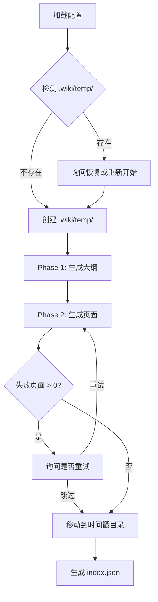
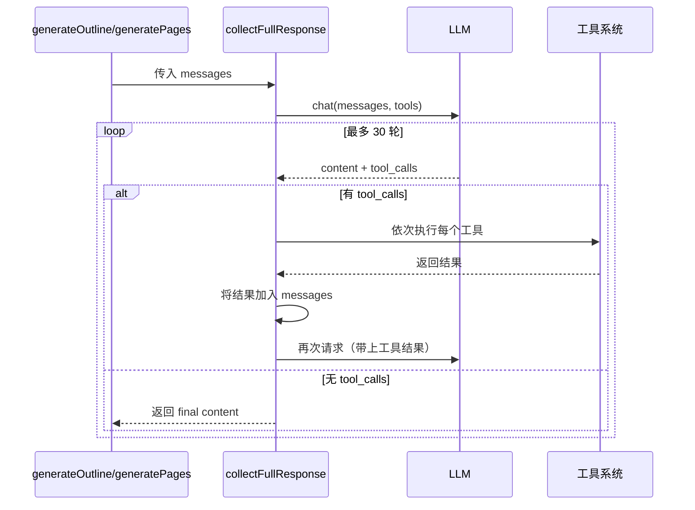

# 生成命令：wiki-cli generate

`wiki-cli generate` 是整个工具的核心命令。它将代码库转化为结构化 Wiki 文档，完全由 LLM 驱动，无需人工编写一行文档。整个流程被划分为两个清晰的阶段，由 `generateCommand` 函数统一编排。

---

## 两阶段流水线概览

生成的本质是一个 **AI 流水线**：先由 LLM 分析仓库结构产出大纲（JSON），再遍历大纲逐页生成 Markdown 内容。主流程位于 `src/commands/generate.ts`。



配置加载是第一步——若无有效配置，命令直接退出并提示用户先运行 `wiki-cli config`。[来源](../src/commands/generate.ts#L40-L46)

---

## Phase 1：大纲生成

`generateOutline` 函数（L132-191）是第一阶段的核心。它向 LLM 发送两条提示词：

- **系统提示**（`outline-system.md`）：为 LLM 设定角色——资深软件工程师兼技术文档专家，提供分析框架和 JSON 输出格式约束
- **用户提示**（`outline-user.md`）：告知工作目录、操作系统和文档语言，指示 LLM 使用工具探索仓库

LLM 收到提示后，通过 `collectFullResponse` 函数（详见下文）与工具系统交互，调用 `[工具系统与函数调用](工具系统与函数调用.md)` 中定义的 10 个只读工具（如 `list_directory`、`read_file`、`git_log` 等）来探索仓库。

整个过程最多迭代 **25 轮**（`maxIterations = 25`）。每轮 LLM 响应后，`parseOutlineJson`（L193-238）尝试从中提取 JSON 对象并解析为 `Topic[]` 数组。一旦解析成功（`topics.length > 0`），立即将大纲写入 `.wiki/temp/_outline.json` 并返回。若 25 轮后仍未解析出有效 JSON，函数返回空数组，导致 `generateCommand` 报错退出。[来源](../src/commands/generate.ts#L132-L191)

大纲的 JSON 结构包含 `sections` 数组，每个 section 包含 `name` 和 `topics` 数组。每个 topic 携带 `title`、`level`（初学/中级/高级）、`description`（页面摘要）和 `task`（生成指令）四个字段。Group 类型的 topic 用于章节分组，不参与页面生成。[来源](../src/commands/generate.ts#L193-L238)

> Phase 1 的迭代逻辑在 `[大纲生成阶段](大纲生成阶段.md)` 中有更详细的拆解。

---

## Phase 2：页面生成

大纲就绪后，`generatePages` 函数（L342-407）遍历 `Topic[]` 数组，对每个非 group 类型的 topic 生成一篇 Markdown 文件。

每篇页面复用同一套模板机制：

- **系统提示**（`page-system.md`）：设定页面写作风格——架构分析型技术作者，使用 Diátaxis 框架
- **用户提示**（`page-user.md`）：注入页面标题、受众水平、slug、可用页面列表、task 指令等变量

提示词模板的变量注入由 `[提示词模板引擎](提示词模板引擎.md)` 处理，采用 `{{varName}}` 的 Mustache 风格替换。[来源](../src/commands/generate.ts#L368-L382)

生成前会检查临时目录中是否已存在同名 `.md` 文件。若存在（且非重试模式），则跳过该页面，实现断点续传。[来源](../src/commands/generate.ts#L356-L361)

### 串行 vs 并行

用户可在 Phase 2 开始前选择生成模式：

| 模式 | 输出方式 | 速度 | 适用场景 |
|------|---------|------|---------|
| **串行**（默认） | 流式输出，实时查看 | 较慢 | 调试、观察生成过程 |
| **并行** | 无流式，静默生成 | 较快 | 大批量页面、生产环境 |

并行模式下，`runConcurrent` 函数（L409-420）实现了一个 **信号量风格的并发控制器**：维护一个 `Set<Promise<void>>` 作为运行池，始终保证池中任务数不超过 `concurrency`（默认 3，上限 10）。每完成一个任务，立即从队列中取出下一个加入池中。[来源](../src/commands/generate.ts#L79-L96)

> 并行控制的详细实现和调度策略见 `[页面生成与并行控制](页面生成与并行控制.md)`。

---

## `collectFullResponse`：工具调用循环

`collectFullResponse` 函数（L240-336）是连接 LLM 与工具系统的核心桥梁，同时服务于 Phase 1 和 Phase 2。它实现了 **最多 30 轮的 Tool Calling 循环**。



循环的退出条件：LLM 响应中不包含任何 `tool_calls`——这意味着 LLM 认为已经收集到足够信息，可以输出最终结果。[来源](../src/commands/generate.ts#L280-L284)

每轮循环中，函数支持两种通信模式：

- **流式模式**（`stream = true`）：使用 `client.chatStream()`，逐 chunk 解析 `content`、`reasoning_content` 和 `tool_call` 三种类型的数据块，实时输出到终端。工具调用结果也会实时打印，形成完整的"思考→行动→观察"闭环。
- **非流式模式**（`stream = false`）：使用 `client.chat()`，一次性获取完整响应。

工具调用参数解析失败时容错为空对象 `{}`，保证单工具错误不会阻塞整个循环。[来源](../src/commands/generate.ts#L307-L309)

若 30 轮后仍未得到无工具调用的响应，函数返回累积的 `accumulatedContent` 或 `null`。[来源](../src/commands/generate.ts#L326-L335)

> LLM 客户端的流式实现细节见 `[LLM 客户端实现](llm-客户端实现.md)`。

---

## Checkpoint 与断点续传

所有中间产物（大纲 JSON、已生成的页面 Markdown）都存放在 `.wiki/temp/` 目录下。

当 `generateCommand` 启动时，检测到 `TEMP_DIR`（即 `.wiki/temp/`）已存在时，会弹出交互式询问：[来源](../src/commands/generate.ts#L48-L63)

```
? Previous generation temp data found. What do you want to do?
  🔄 Resume from last checkpoint
  🗑️  Discard and start fresh
```

- **Resume**：直接进入 Phase 2，`generatePages` 会跳过已存在的文件
- **Discard**：删除整个 `TEMP_DIR`，从 Phase 1 重新开始

生成成功后，`TEMP_DIR` 被重命名为时间戳格式（如 `.wiki/2024-01-15T14-30-00`），成为最终的 Wiki 版本。`[生成结果说明](生成结果说明.md)` 描述了最终目录结构的完整形态。[来源](../src/commands/generate.ts#L122-L129)

> Checkpoint 系统的完整恢复策略和边界情况见 `[断点续传与重试机制](断点续传与重试机制.md)`。

---

## 重试机制

Phase 2 结束后，若存在失败页面（`failed.length > 0`），会进入 **重试循环**：询问用户是否重试，若确认则重新调用 `generatePages` 并传入 `retryList` 参数，只针对失败页面重新生成。[来源](../src/commands/generate.ts#L101-L119)

```typescript
const retryResult = await generatePages(client, config, workDir, topics, {
  parallel,
  concurrency: concurrency || 3,
  retryList: [...failed]  // 仅重试失败页面
});
```

重试循环可以反复执行，直到用户选择放弃或所有页面生成成功。最终仍失败的页面会以警告形式列出，不阻塞整体流程。[来源](../src/commands/generate.ts#L117-L119)

---

## 最终输出

全部生成完成后，`generateIndex` 函数（L422-441）在目标目录中创建 `index.json` 文件。它从 `Topic[]` 中提取 section 分组信息和每个 topic 的元数据（标题、难度、描述），供浏览命令和服务端渲染使用。

输出的目录结构示例：

```
.wiki/
  ├── 2024-01-15T14-30-00/
  │   ├── index.json          ← 导航索引
  │   ├── 概览.md
  │   ├── 快速开始.md
  │   ├── 配置命令-wiki-cli-config.md
  │   └── ...                 ← 其余页面
  └── temp/                   ← 本次生成被重命名后消失
```

> `[浏览命令：wiki-cli browse](浏览命令-wiki-cli-browse.md)` 可启动 HTTP 服务浏览生成的 Wiki。
>
> `[生成结果说明](生成结果说明.md)` 详细说明了 `index.json` 的 JSON 结构和版本管理机制。