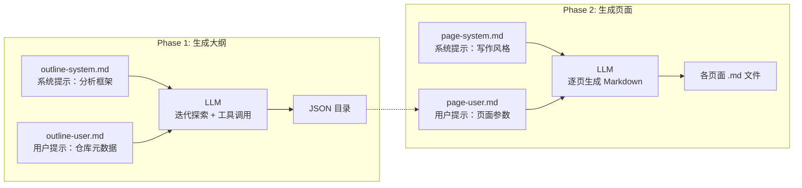

# 编写自定义提示词模板

修改 `prompts/` 目录下的五份 Markdown 模板，是影响 LLM 输出风格与内容深度的最直接途径。提示词与代码逻辑完全解耦，修改模板**不需要重新编译**，纯文本编辑即可生效。本文从变量语法、模板设计意图、优化策略三个层次展开。

[来源](../src/ai/prompts.ts#L27-L30)

---

## 变量语法：`{{var}}` 与正则替换

模板引擎的核心语法是 **Mustache 风格的双花括号占位符** `{{var}}`。运行时由 `fillPrompt` 函数执行全局正则替换：

```typescript
export function fillPrompt(template: string, vars: PromptVars): string {
  let result = template;
  for (const [key, value] of Object.entries(vars)) {
    result = result.replace(new RegExp(`\\{\\{${key}\\}\\}`, 'g'), value);
  }
  return result;
}
```

[来源](../src/ai/prompts.ts#L19-L25)

关键行为：

| 场景 | 行为 | 设计意图 |
|------|------|----------|
| 提供变量 | 所有 `{{key}}` 被替换为对应的 `value` | 注入运行时上下文 |
| 同一变量出现多次 | **全部**替换（`g` 标志） | 支持系统提示同一变量多处使用 |
| 未提供变量 | 保持 `{{var}}` **原样**不变 | 宽容设计，方便调试模板遗漏 |
| 值为中文 | 正常替换 | 国际化支持 |

[来源](../tests/prompts.test.ts#L5-L40)

调用方通常使用 **`renderPrompt`** 函数——同步加载文件并完成替换的一步封装：

```typescript
export async function renderPrompt(filename: string, vars: PromptVars): Promise<string> {
  const template = await loadPrompt(filename);
  return fillPrompt(template, vars);
}
```

[来源](../src/ai/prompts.ts#L27-L30)

需要了解底层文件加载与路径推导机制的读者，参见 [提示词模板引擎](提示词模板引擎.md)。

---

## 五个模板逐个分析

`prompts/` 目录的五份文件对应三个不同的 LLM 交互场景。理解每份模板的设计意图是自定义的基础。

### outline-system.md：定义分析框架

**用途**：在大纲生成阶段（Phase 1）作为 LLM 的**系统提示**。它定义了 LLM 的角色身份和分析方法论。

**设计意图**：

1. **限定角色**：要求 LLM 扮演"资深软件工程师兼技术文档专家"，并强调其工作方式——"不仅阅读代码，更能洞察设计哲学"。
2. **定义分析四步框架**：
   - 第 1 步：高层愿景与价值（项目解决什么核心问题）
   - 第 2 步：架构深度剖析（核心模块及其交互）
   - 第 3 步：受众分析（前端 / 后端 / 算法 / 学习者）
   - 第 4 步：生成 JSON 格式目录（严格模式）
3. **注入可用工具**：声明 8 个只读工具的用途（`list_directory`、`read_file`、`git_log` 等），配合 Function Calling 使 LLM 具备探索能力。
4. **约束输出格式**：规定严格的 JSON Schema——两段式结构（`入门指南` + `深入探索`）、`description` 和 `task` 字段、不超过 30 个主题，且明确要求"不要添加任何额外文字"。

**变量注入点**：`{{workDir}}` 和 `{{os}}` 告知 LLM 当前工作环境。

**修改影响**：
- 调整分析框架 = 改变 LLM 分析仓库的视角和深度
- 修改输出格式要求 = 改变大纲的 JSON 结构
- 增减可用工具 = 限制或扩展 LLM 的探索能力

[来源](../prompts/outline-system.md#L1-L61)

### outline-user.md：传入仓库元数据

**用途**：大纲生成阶段的**用户提示**，即向 LLM 布置具体任务。

**设计意图**：

1. **提供项目上下文**：通过 `{{workDir}}`、`{{os}}`、`{{lang}}` 变量告知 LLM 当前仓库的物理位置和配置。
2. **指令明确**：要求"先探索项目布局，阅读关键文件，按框架分析，然后生成 JSON 目录"。
3. **强制纯 JSON 输出**：与系统提示配合，反复强调"仅输出 JSON，不要添加任何额外文字"。

**变量注入点**：`{{workDir}}`、`{{os}}`、`{{lang}}`。

**修改影响**：
- 调整任务指令措辞 = 改变 LLM 探索仓库的方式和顺序
- 添加更多上下文说明 = 帮助 LLM 理解项目特殊需求
- 修改输出约束语言 = 改变 JSON 输出的纯净度

[来源](../prompts/outline-user.md#L1-L15)

### page-system.md：定义写作风格

**用途**：页面生成阶段（Phase 2）的**系统提示**，每生成一页都会渲染一次。

**设计意图**：

1. **塑造高度一致的写作风格**：要求 LLM 扮演"架构分析型技术作者"，工作原则是"从代码中提炼设计意图"。
2. **植入 Diátaxis 框架**：这是文档领域的经典内容组织理论，要求按主题类型组织内容而非随意写作。
3. **硬性格式规范**：
   - 叙事节奏：`吸引 → 兴趣 → 欲望 → 行动`
   - 段落自然，只在认知边界处分段
   - **禁止元注释**：不得以"以下是..."开头
   - 关键概念首次出现用 **粗体**
   - 适当使用 Mermaid 图表和表格
4. **证据标准**：每段末尾必须标注源代码行号，只描述可验证信息。
5. **交叉引用机制**：告知 LLM 已知的可用页面列表。

**变量注入点**：`{{workDir}}`、`{{os}}`、`{{pageTitle}}`、`{{audienceLevel}}`。

**修改影响**：
- 修改角色描述 = 彻底改变文档的写作口吻和技术深度
- 调整格式规范 = 控制输出的结构复杂度（如是否使用 Mermaid、表格）
- 更改证据标准 = 影响文档的可信度和引用密度
- 修改叙事节奏要求 = 改变文档的可读性和营销感

[来源](../prompts/page-system.md#L1-L28)

### page-user.md：传入具体页面参数

**用途**：页面生成阶段的**用户提示**，每个页面独立渲染，携带该页面的专属任务。

**设计意图**：

1. **提供完整页面上下文**：通过 `{{pageTitle}}`、`{{audienceLevel}}`、`{{pageSlug}}`、`{{pageTask}}` 精确描述该页面的定位和编写要求。
2. **注入交叉引用数据**：`{{availablePages}}` 变量包含本 Wiki 所有其他页面的 slug、标题和简介，使 LLM 能在写作中建立页面间链接。
3. **传递需求约束**：要求匹配受众水平、交叉引用必须链接、长度适中、每段标注来源。

**变量注入点**：`{{workDir}}`、`{{pageTitle}}`、`{{audienceLevel}}`、`{{pageSlug}}`、`{{projectSummary}}`、`{{lang}}`、`{{availablePages}}`、`{{pageTask}}`。

**修改影响**：
- 添加或修改 `{{pageTask}}` 中的指令 = 调整该页面的具体写作方向
- 调整 `{{availablePages}}` 的格式 = 改变 LLM 生成交叉引用的准确度
- 修改需求约束 = 改变页面质量标准的严格程度

[来源](../prompts/page-user.md#L1-L18)

### ai-system.md：定义对话助手角色

**用途**：`wiki-cli ai` 交互式问答模式的**系统提示**。

**设计意图**：

1. **角色设定为"资深代码分析师"**：面向开发者的代码库深度问答场景。
2. **双通道信息源**：优先使用 Wiki 工具快速获取上下文，但最终答案必须基于实际代码验证。这是一个关键设计——平衡了 Wiki 的便利性和源码的精确性。
3. **行为准则**：先读 Wiki 再查源码、标注来源、不元注释、支持持续对话追问。

**变量注入点**：`{{workDir}}`、`{{os}}`、`{{wikiInfo}}`、`{{wikiTools}}`。

**修改影响**：
- 调整工具使用优先级 = 改变 LLM 回答的信息获取路径
- 修改行为准则 = 改变对话的风格和质量控制
- 增加或减少可用工具 = 限制或扩展回答的深度

[来源](../prompts/ai-system.md#L1-L35)

---

## 模板间的协作文档关系

使用 Mermaid 图展示两阶段流程中的模板调用关系：



[来源](../src/commands/generate.ts#L131-L132)
[来源](../src/commands/generate.ts#L431-L432)

---

## 自定义提示词的实战建议

### 1. 从 page-system.md 入手，效果最明显

如果要调整**所有页面的写作风格**，修改 `page-system.md` 是投入产出比最高的切入点。例如：
- 在角色描述中添加"侧重性能分析" → 所有页面将强调性能视角
- 删除"适当时使用 Mermaid 图表" → 减少图表输出，适合纯文本文档
- 添加"每段不超过 200 字" → 控制页面长度，适合快速浏览型文档

### 2. 用 page-user.md 中的 `{{pageTask}}` 控制单页深度

不同页面可能需要不同的写作深度。在 `{{pageTask}}` 变量中注入针对性指令（如"重点分析错误处理机制""对比与其他方案的区别"），可以精细控制每一页的内容聚焦点。这些指令来自 Phase 1 大纲中每个 topic 的 `task` 字段。

### 3. 修改证据标准的严格程度

`page-system.md` 中的"每节末尾标注来源"是质量上限的关键杠杆：
- **宽松版**：改为"关键论断标注来源即可" → 输出更流畅，但可验证性下降
- **严格版**：要求"每句话标注来源" → 输出更严谨，但可能影响可读性

### 4. 利用 `{{availablePages}}` 增强 Wiki 内聚性

`{{availablePages}}` 变量的格式直接决定了 LLM 交叉引用的质量。如果要增强页面间链接密度，可以在 `page-user.md` 中添加"每个段落至少引用一个其他页面"的约束。

### 5. 为不同语言/文化定制模板

通过 `{{lang}}` 变量，可以让 LLM 知道文档语言。如果使用中文编写模板，效果最佳——系统提示的语言会引导 LLM 的思考语言。中英文混合时建议统一使用同一语言书写模板，避免混淆。

### 6. 关于 `ai-system.md` 的微调

如果 `wiki-cli ai` 的对话质量不理想，调试 `ai-system.md` 最有效：
- 调整"先读 Wiki 再查源码"的优先级 → 改变回答的速度和深度
- 修改角色描述 → 改变对话的亲和力（如"耐心的导师"vs"直击要害的代码审查员"）

---

## 下一步

- [提示词模板引擎](提示词模板引擎.md) — 了解 fillPrompt 的底层实现和模板加载机制
- [大纲生成阶段](大纲生成阶段.md) — 看 outline-system.md + outline-user.md 在 Phase 1 中的完整执行流程
- [页面生成与并行控制](页面生成与并行控制.md) — 看 page-system.md + page-user.md 在 Phase 2 中的渲染时机
- [整体架构与模块划分](整体架构与模块划分.md) — 了解提示词引擎在整体架构中的位置