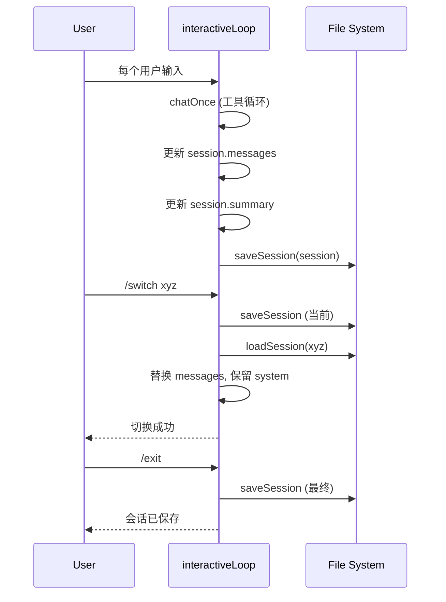

现在信息已经足够，让我开始编写页面。

---

# AI 会话与会话管理系统

## 会话即文件：持久化的对话单元

在 `wiki-cli ai` 的交互模式中，每一次对话都被建模为一个 **Session**（会话），通过文件系统持久化到磁盘。这意味着你可以在任意时刻中断对话、切换上下文、甚至在不同的 Shell 会话中恢复之前的思考脉络——所有历史都在 `.wiki/sessions/` 目录中以独立 JSON 文件的形式等待重新激活。

## Session 数据模型

核心接口定义在 `src/ai/ai-session.ts` 中：

```typescript
export interface Session {
  id: string;
  created: string;
  updated: string;
  summary: string;
  messages: ChatMessage[];
}
```

| 字段 | 类型 | 含义 |
|---|---|---|
| `id` | `string` | 8 字符 UUID 前缀，由 `randomUUID().slice(0, 8)` 生成，确保短且唯一 |
| `created` | `string` | ISO 8601 时间戳，会话创建时刻 |
| `updated` | `string` | ISO 8601 时间戳，每次 `saveSession()` 自动更新为当前时间 |
| `summary` | `string` | 会话摘要，默认值为 `'新会话'`，每次对话后自动取首条用户消息的前 60 字符 |
| `messages` | `ChatMessage[]` | 完整的对话消息数组，包含 `system`/`user`/`assistant`/`tool` 四种角色 |

[来源](src/ai/ai-session.ts#L8-L14)

`ChatMessage` 类型来自 [LLM 客户端](/llm-客户端-流式通信与重试机制.md) 模块，涵盖 `content`、`reasoning_content`、`tool_calls`、`tool_call_id` 等字段，支持流式推理和工具调用链。

## 文件存储策略：每会话一 JSON 文件

会话管理遵循极简的 **"每个会话独立文件"** 策略：

```
.wiki/sessions/
├── a1b2c3d4.json
├── e5f6g7h8.json
└── ...
```

- **目录常量** `SESSIONS_DIR = '.wiki/sessions'` 硬编码在模块顶层，相对于当前工作目录。这与 [生成命令](/生成命令-wiki-cli-generate.md) 的 `.wiki/temp` 检查点目录处于同一层级。
- **文件路径计算**：`sessionPath(id)` 返回 `join(SESSIONS_DIR, "${id}.json")`，保证每个会话文件与 ID 一一映射。
- **序列化格式**：`JSON.stringify(session, null, 2)`，人类可读，可直接用文本编辑器查看和修改。
- **目录惰性创建**：`ensureSessionsDir()` 在首次调用 `createSession()` 或 `saveSession()` 时自动创建目录，不占用启动时间。
- **损坏容忍**：`listSessions()` 在遍历目录时，对无法 `JSON.parse` 的文件静默跳过，保证单一文件损坏不影响其它会话。

[来源](src/ai/ai-session.ts#L16-L16)
[来源](src/ai/ai-session.ts#L24-L26)
[来源](src/ai/ai-session.ts#L44-L49)

对比关系型数据库或内存缓存方案，这种"文本文件即数据"的设计带来了两个关键收益：

1. **零运维**：无需数据库初始化、迁移脚本或连接管理。
2. **可审计**：每个会话文件就是完整的历史日志，可直接用 `diff` 工具比对。

## 核心 CRUD 操作

模块导出一组纯异步函数，构成了完整的会话生命周期管理：


- **`createSession()`**：生成 ID → 构建默认 Session 对象 → 写入磁盘 → 返回内存对象。注意 `messages` 初始为空数组，system prompt 由调用方（`aiCommand`）在后续拼装。
- **`saveSession(session)`**：将 `session.updated` 更新为当前时间，然后整体覆写文件。调用方负责在保存前将 `messages` 截取到最新状态（不含 system prompt）。
- **`loadSession(id)`**：按 ID 读取文件并反序列化，失败返回 `null`。
- **`deleteSession(id)`**：删除文件，返回布尔值表示是否存在。
- **`listSessions()`**：遍历 `.wiki/sessions/` 目录，读取每个 JSON 的元数据字段（`id`/`created`/`updated`/`summary`），按 `updated` 降序排列。不加载 `messages`，适合快速列出概览。

[来源](src/ai/ai-session.ts#L28-L60)
[来源](src/ai/ai-session.ts#L62-L70)

## `/switch` 切换会话：三步骤原子操作

会话切换是 `interactiveLoop` 中最关键的斜杠命令之一，其实现精确遵循三步模式：

```typescript
// src/commands/ai.ts 第 241-247 行
await saveSession(session);           // ① 保存当前会话
session = existing;                    // ② 加载目标会话
messages = [{ role: 'system',         // ③ 保留 system prompt
  content: messages[0].content },
  ...session.messages.slice(1)];
```

**步骤拆解**：

1. **保存当前**：将内存中的当前 `session` 写回磁盘，确保进度不丢失。
2. **加载目标**：从磁盘读取目标会话文件，替换 `session` 变量引用。
3. **保留 System Prompt + 替换 Messages**：这是关键设计——`messages[0]`（即 `[{ role: 'system', content: systemPrompt }]`）保持不变，但丢弃之后的所有历史消息，替换为已存储会话中 `messages.slice(1)` 的内容（即除 system prompt 外的所有对话轮次）。

这样做的意图是：**system prompt 绑定了当前工作目录、OS 信息、Wiki 状态等变量，属于当前执行上下文而非会话内容**。切换会话时，上下文变量保持不变，对话历史被替换，用户感觉是"换了一个对话线程"而非"换了一个工作区"。

同理，`/new` 命令也遵循相同的三段式：保存当前 → 创建新会话 → 保留 system prompt 重置 messages。区别在于 `/new` 的目标是一个全新的空会话。

[来源](src/commands/ai.ts#L236-L248)
[来源](src/commands/ai.ts#L251-L255)

## 显示逻辑

### `printSession(session)`——完整回放

遍历 `session.messages`，按角色格式化输出：

| 角色 | 输出格式 | 特殊处理 |
|---|---|---|
| `user` | `chalk.green('You > ')` + `content` | **跳过以 `/` 开头的消息**（斜杠命令不显示在回放中） |
| `assistant` | 直接输出 `content` | 无前缀，保持整洁 |
| 其他（`system`/`tool`） | 忽略 | 不出现在回放中 |

这种设计确保了恢复会话时，用户只看到有意义的问答对，命令交互痕迹和工具调用细节被过滤掉。

[来源](src/ai/ai-session.ts#L72-L81)

### `showSessionsTable(sessions)`——概览列表

以紧凑的三列格式展示会话元数据：

```
  a1b2c3d4  03/21 14:30  这个项目的核心架构是什么样的
  e5f6g7h8  03/21 13:15  如何添加一个新的 LLM 提供商
```

- 空列表时输出 `(无保存的会话)`。
- 日期使用 `toLocaleString('zh-CN')` 格式化，仅显示月/日/时/分。
- 摘要截断至 40 字符，超长部分自然省略。
- 不显示 `created` 字段，只显示 `updated`——因为用户更关心"最近什么时候用过"。

[来源](src/ai/ai-session.ts#L83-L90)

该函数由 `aiCommand` 在 `--list` 选项触发时调用，也由 `/sessions` 斜杠命令在交互模式中调用。

[来源](src/commands/ai.ts#L231-L234)

## 交互循环中的全生命周期管理

在 `interactiveLoop`（位于 `src/commands/ai.ts`）中，会话管理的完整流程如下：



关键要点：

- **每轮对话后自动保存**：每次用户输入完成后（包括工具调用链结束后），`session.messages` 被更新为 `messages.slice(1)`（排除 system prompt），`session.summary` 取首条用户消息，然后调用 `saveSession()` 写盘。
- **手动保存**：`/save` 命令提供显式保存入口。
- **退出保存**：`/exit` 或 `/quit` 同样先保存再退出，保证最后一轮对话不丢失。
- **非交互模式（`--question`）**：在 `chatOnce` 或 `answerOnly` 执行完毕后，同样进行一次保存，然后立即返回，不进入循环。

[来源](src/commands/ai.ts#L265-L280)
[来源](src/commands/ai.ts#L325-L328)

## 设计理念总结

会话管理系统的设计可以归纳为两条原则：

1. **文件即持久化，变量即状态**：`Session` 对象在内存中是一等公民，磁盘文件只是序列化副本。没有缓存层、没有连接池、没有事务。这种简单性使得 `loadSession` 和 `saveSession` 都是纯 I/O 函数，任何时刻重启进程都不会丢失超过一轮对话的数据。

2. **System Prompt 与会话解耦**：`/switch` 和 `/new` 都保留 system prompt 而替换 messages，这种设计区分了"对话上下文"和"工作区上下文"——前者属于会话可切换，后者属于执行环境不可变。这与 [提示词模板引擎](/提示词模板引擎-解耦的模板渲染.md) 中的"模板与数据分离"理念一脉相承。

---

**推荐阅读**

- [AI 交互命令：wiki-cli ai](/ai-交互命令-wiki-cli-ai.md) — 了解斜杠命令的完整列表和交互循环流程
- [LLM 客户端：流式通信与重试机制](/llm-客户端-流式通信与重试机制.md) — 理解 `ChatMessage` 类型的定义和流式处理
- [工作区管理与远程仓库克隆](/工作区管理与远程仓库克隆.md) — system prompt 中 `workDir` 变量的来源
- [文件系统工具集](/文件系统工具集.md) — 底层文件操作的工具函数封装