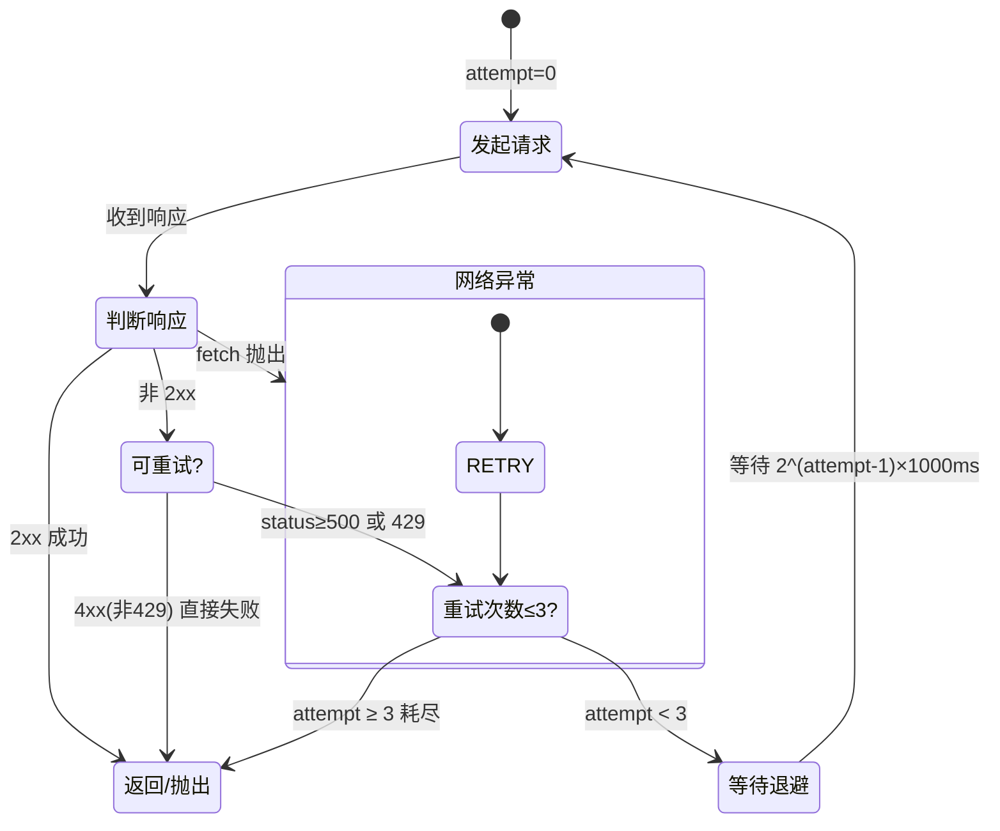

`src/ai/llm-client.ts` 是整个项目中与 LLM API 通信的唯一通道。它只有 150 行，但承担了**协议适配、流式解析、重试容错、工具调用、推理链透传**五重职责。本章深入代码层面拆解每一层。

## 核心类型骨架

客户端定义了四个接口，构成与 LLM 对话的完整类型系统：

| 接口 | 角色 | 关键字段 |
|---|---|---|
| `ChatMessage` | 对话消息单元 | `role`, `content?`, `reasoning_content?`, `tool_calls?`, `tool_call_id?` |
| `ToolCall` | Function Call 结构 | `id`, `index?`, `type: 'function'`, `function: { name, arguments }` |
| `StreamChunk` | 流式输出最小事件单元 | `type: 'content'\|'reasoning'\|'tool_call'\|'done'\|'error'` |
| `LLMResponse` | 非流式完整响应 | `content`, `reasoning_content?`, `tool_calls[]` |

`ChatMessage.content` 声明为 `string | null | undefined`——三重态设计为后续的 `serializeMessage` 留下了精细控制余地。

[来源](src/ai/llm-client.ts#L1-L30)

## `buildRequest`：请求组装的决策树

`buildRequest(config, messages, tools?, stream?, jsonMode?)` 是一个纯函数，将配置和开关参数映射为 `{ url, headers, body }` 三元组。

```mermaid
flowchart TD
    A[config.baseUrl] --> B[去除尾部斜杠 + '/chat/completions']
    B --> C[序列化 messages 到 body.messages]
    C --> D{stream?}
    D -->|true| E[body.stream = true]
    D -->|false| F[不设 stream]
    E --> G{tools?.length > 0?}
    F --> G
    G -->|true| H[body.tools = tools]
    G -->|false| I[不设 tools]
    H --> J{jsonMode?}
    I --> J
    J -->|true| K[body.response_format = {type:'json_object'}]
    J -->|false| L[不设 response_format]
    K --> M[headers: Content-Type + Authorization Bearer]
    L --> M
    M --> N[return {url, headers, body: JSON.stringify(body)}]
```

三个设计细节值得注意：

1. **`baseUrl` 尾部斜杠净化**：`config.baseUrl.replace(/\/+$/, '')` 确保 `https://api.openai.com/v1/` 和 `https://api.openai.com/v1` 得到一致结果，URL 拼接不会出现 `//chat/completions`。

2. **`stream` 只出现在请求体**：该参数仅控制请求体是否携带 `"stream": true`，不决定读取方式。读取方式是调用者选择的——`chatStream` 和 `chat` 各自决定如何解析响应。

3. **`jsonMode` 与提供商绑定**：`response_format: { type: 'json_object' }` 并非所有提供商支持。参见 [LLM 提供商与模型注册](llm-提供商与模型注册.md) 中 `supportsJsonMode` 的判断逻辑。

[来源](src/ai/llm-client.ts#L63-L84)

## `serializeMessage`：消息净化与 null content 删除

```typescript
function serializeMessage(m: ChatMessage): Record<string, any> {
  const msg: Record<string, any> = { role: m.role };
  if (m.content !== undefined) msg.content = m.content;
  if (m.reasoning_content !== undefined && m.reasoning_content !== null) {
    msg.reasoning_content = m.reasoning_content;
  }
  if (m.tool_calls) msg.tool_calls = m.tool_calls;
  if (m.tool_call_id) msg.tool_call_id = m.tool_call_id;
  if (m.name) msg.name = m.name;
  if (msg.content === null) delete msg.content;
  return msg;
}
```

**最后一行是关键**。当模型返回 `tool_calls` 时，OpenAI 规范中 `content` 常常为 `null`。但某些提供商（如 DeepSeek）的 API 在收到 `"content": null` 时会返回校验错误——它们要求要么 `content` 是有效字符串，要么完全不传。这行代码确保 `null` 被从对象中完全移除。

同样，`reasoning_content` 仅在非 `undefined` 且非 `null` 时才写入，防止对话历史中出现空的推理字段。

[来源](src/ai/llm-client.ts#L38-L49)

## `stripCodeFence`：围栏清理器

```typescript
export function stripCodeFence(text: string): string {
  return text.replace(/^```(?:json)?\s*\n?/gm, '').replace(/\n?```\s*$/g, '').trim();
}
```

设计动机：在 `jsonMode` 下，模型承诺返回纯 JSON，但偶尔仍会包裹在 Markdown 代码围栏中。这个函数清扫两种模式的围栏：

- 开头的 ` ``` ` 或 ` ```json `（带可选空白和换行）
- 结尾的 ` ``` `（带可选前置换行和尾随空白）

`g` 标志处理文档中可能出现的多次围栏（非标行为），`m` 标志确保 `^`/`$` 匹配每行。该函数被 [生成命令：wiki-cli generate](生成命令-wiki-cli-generate.md) 中的大纲/页面解析流程调用。

[来源](src/ai/llm-client.ts#L51-L53)

## `chatStream`：SSE 流式异步生成器

`chatStream` 是整个客户端中算法最密集的部分。它实现为 `AsyncGenerator<StreamChunk>`，外层通过 `for await...of` 消费。

### SSE 行级解析协议

```
data: {"choices":[{"delta":{"content":"Hello"}}]}
data: {"choices":[{"delta":{"content":" World"}}]}
data: [DONE]
```

SSE（Server-Sent Events）协议的核心是 `data: ` 前缀行，以空行 `\n\n` 分隔事件。OpenAI API 的简化实现省略了空行分隔符，每行单独构成一个事件。

### TCP 分块边界容错

```typescript
const { done, value } = await reader.read();
buffer += decoder.decode(value, { stream: true });   // (1)
const lines = buffer.split('\n');                      // (2)
buffer = lines.pop() || '';                            // (3)
```

这是流式解析的经典三行模式：

1. **`TextDecoder` 的 `stream: true` 标志**：告诉解码器保留不完整的多字节 UTF-8 序列在内部状态中，等待下一块数据补齐。
2. **按 `\n` 切分**：将累积的 buffer 切分为候选行。
3. **`lines.pop()` 回留**：最后一段可能是不完整的行，留在 buffer 中等待下一次 `reader.read()`。

这种处理保证了即使 SSE 数据在任意 UTF-8 字符边界被 TCP 分片切断，也不会出现乱码或丢行。

### 事件分发三叉戟

对于每个有效的 `data: ` 行，提取 `choices[0].delta` 后根据存在字段分岔：

```typescript
if (delta?.content)             → { type: 'content', content }
if (delta?.reasoning_content)   → { type: 'reasoning', reasoning_content }
if (delta?.tool_calls)          → { type: 'tool_call', tool_call }
```

**注意 `content` 检查的是真值而非非 null**。空字符串 `""` 不会 yield，这与 OpenAI SSE 规范一致——空 content 表示此 delta 无文本变更。`tool_calls` 是数组，每个元素独立封装为 `ToolCall`，携带 `index` 属性用于调用方按索引聚合增量片段。

`[DONE]` 哨兵行触发 `{ type: 'done' }` 并 `return`，终止生成器。

[来源](src/ai/llm-client.ts#L104-L183)

## `chat`：非流式整块响应

`chat` 是非流式对应方法，与 `chatStream` 共用同一套重试骨架，但在三处不同：

| 维度 | `chatStream` | `chat` |
|---|---|---|
| 请求体 `stream` | `true` | `false`（或不传） |
| 错误通知方式 | `yield { type: 'error' }` | `throw Error` |
| 响应提取 | 逐行 SSE 解析 | `await response.json()` 一次解析 |

响应提取逻辑：

```typescript
const choice = result.choices?.[0]?.message;
return {
  content: choice?.content || null,
  reasoning_content: choice?.reasoning_content || null,
  tool_calls: choice?.tool_calls || [],
};
```

`tool_calls` 缺省为 `[]` 而非 `undefined`，调用方可以安全迭代而不做判空。

[来源](src/ai/llm-client.ts#L192-L225)

## 重试机制：3 次指数退避 + 可重试性判断

### 完整状态机



### 可重试性判断

```typescript
function isRetryable(status: number): boolean {
  return status >= 500 || status === 429;
}
```

| 状态码 | 含义 | 是否重试 |
|---|---|---|
| 429 | Rate Limit | 是 |
| 5xx | 服务端错误（502/503/504...） | 是 |
| 4xx（非429） | 客户端错误（401/403/404...） | **否** |

401 认证失败或 404 端点不存在，重试毫无意义，直接 fail fast。

### 退避时间序列

```
attempt=0 → 立即请求（无等待）
attempt=1 → 等待 2^0 × 1000 = 1000ms
attempt=2 → 等待 2^1 × 1000 = 2000ms
attempt=3 → 等待 2^2 × 1000 = 4000ms
```

总最长等待 7 秒。这个退避窗在"让瞬时故障恢复"和"不让用户久等"之间取得平衡。

### 流式重试的可见性

`chatStream` 在重试前 yield 一条特殊的 reasoning 消息：

```typescript
yield { type: 'reasoning', reasoning_content: `\n[retry ${attempt}/${MAX_RETRIES} in ${wait}ms]` };
```

这使得消费方（如 [AI 交互命令：wiki-cli ai](ai-交互命令-wiki-cli-ai.md) 的终端界面）能将重试状态展示给用户，而非静默卡死。

### 网络错误 vs API 错误

- **网络错误**（fetch 抛出异常）：进入 `catch (fetchErr)` 分支，记录错误后 `continue` 重试
- **API 错误**（response.ok 为 false）：读 body 获取错误文本，可重试条件成立才 `continue`
- **流读取错误**（SSE 中途断流）：进入 `catch (streamErr)` 分支，`continue` 重试

[来源](src/ai/llm-client.ts#L86-L96)

## 类设计：无状态 + 可测试性

```typescript
export class LLMClient {
  private config: WikiCliConfig;
  constructor(config: WikiCliConfig) {
    this.config = config;
  }
}
```

`LLMClient` 仅持有一个配置引用，不持有任何可变状态。这带来三个好处：

1. **实例可复用**：同一实例可以安全地在多次对话调用间共享。
2. **天然可测试**：测试时只需 `vi.fn()` mock `globalThis.fetch`，无需要 mock 文件系统、网络栈或依赖注入容器。
3. **无副作用构造**：构造函数仅做赋值，无异步操作或资源分配。

测试覆盖见 [测试策略与 Vitest 配置](测试策略与-vitest-配置.md) 中的 `llm-client.test.ts` 章节。

[来源](src/ai/llm-client.ts#L98-L102)

## 集成关系

```mermaid
flowchart LR
    subgraph "配置层"
        CS[config-store.ts] -->|WikiCliConfig| LC[LLMClient]
    end
    subgraph "AI 核心"
        LC -->|ToolDefinition[]| T[tools.ts]
        LC -->|fetch| API[LLM Provider]
    end
    subgraph "命令层"
        GEN[generate.ts] -->|chat/chatStream| LC
        AI[ai.ts] -->|chatStream| LC
    end
    subgraph "模板层"
        P[prompts.ts] -->|ChatMessage[]| GEN
    end
```

- [生成命令：wiki-cli generate](生成命令-wiki-cli-generate.md) 调用 `chatStream` 进行大纲的迭代式工具循环，调用 `chat` 进行页面生成
- [AI 交互命令：wiki-cli ai](ai-交互命令-wiki-cli-ai.md) 调用 `chatStream` 实现流式输出对话
- [工具系统：LLM 只读探索工具的设计](工具系统-llm-只读探索工具的设计.md) 提供了 `ToolDefinition[]` 的具体定义
- [提示词模板引擎：解耦的模板渲染](提示词模板引擎-解耦的模板渲染.md) 负责组装发送给 LLM 的 system/user 消息

## 推荐阅读

- [添加新的 LLM 提供商](添加新的-llm-提供商.md) — 理解如何扩展客户端以适配非标准 API
- [测试策略与 Vitest 配置](测试策略与-vitest-配置.md) — 查看 `llm-client.test.ts` 中 mock SSE 流、重试验证、错误路径覆盖
- [生成管线：从大纲到页面的完整流程](生成管线-从大纲到页面的完整流程.md) — 看 `chatStream` 如何在工具循环中被消费