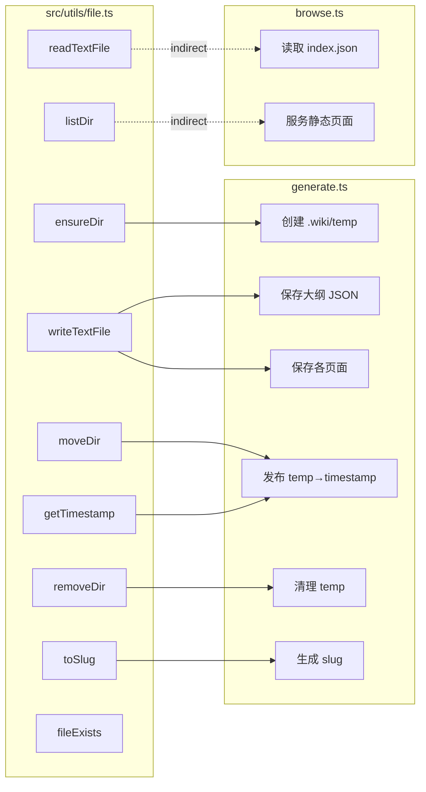

`src/utils/file.ts` 是一个仅有 52 行的轻量模块，封装了 8 个文件系统操作函数。它不追求完整的文件 API 覆盖，而是精确服务於 [生成命令：wiki-cli generate](生成命令-wiki-cli-generate.md) 和 [浏览命令：wiki-cli browse](浏览命令-wiki-cli-browse.md) 两条核心命令的实际需求。**所有函数都是 async 的**，但内部实现混合使用了 `fs/promises` 的异步 API 和 `fs.existsSync` 的同步 API——这是一个务实的折中，因为 `fs.promises.access` 的异常流程并不比同步检查更优雅。[来源](src/utils/file.ts#L1-L50)

---

## 函数一览

| 函数 | 签名 | 用途 |
|------|------|------|
| `ensureDir` | `(dirPath: string) => Promise<void>` | 递归创建目录 |
| `fileExists` | `(filePath: string) => Promise<boolean>` | 检查路径是否存在 |
| `readTextFile` | `(filePath: string) => Promise<string>` | 读取 UTF-8 文本文件 |
| `writeTextFile` | `(filePath: string, content: string) => Promise<void>` | 写入文件，自动创建父目录 |
| `removeDir` | `(dirPath: string) => Promise<void>` | 递归删除目录（安全） |
| `listDir` | `(dirPath: string) => Promise<string[]>` | 列出目录条目 |
| `moveDir` | `(src: string, dest: string) => Promise<void>` | 移动/重命名目录 |
| `getTimestamp` | `() => string` | 生成时间戳字符串 |
| `toSlug` | `(title: string) => string` | 生成 URL 安全的 slug |

[来源](src/utils/file.ts#L5-L50)

---

## 关键函数深度分析

### ensureDir：递归创建目录

实现仅一行：

```ts
await mkdir(dirPath, { recursive: true });
```

`recursive: true` 是 Node.js 18+ 的标准能力，它会像 `mkdir -p` 一样自动创建路径中所有不存在的父目录，且不报错。该函数被 [生成命令：wiki-cli generate](生成命令-wiki-cli-generate.md) 用于创建 `.wiki/temp` 临时工作目录。[来源](src/utils/file.ts#L7-L9)[来源](src/commands/generate.ts#L76)

### writeTextFile：自动创建父目录

实现比直接调用 `writeFile` 多了一步：

```ts
await ensureDir(filePath.split(sep).slice(0, -1).join(sep));
await writeFile(filePath, content, 'utf-8');
```

先提取文件路径的目录部分（去掉最后一个 `/` 后的文件名），调用 `ensureDir` 确保目录存在，再写入文件。这意味着调用者**无需**预先创建目录结构。该函数被 generate 命令用于三处写入：保存大纲 JSON、保存每个生成的页面 Markdown、保存索引文件。[来源](src/utils/file.ts#L17-L21)[来源](src/commands/generate.ts#L153-L155)

### moveDir：rename 的原子性

实现同样精简：

```ts
await rename(src, dest);
```

`rename` 系统调用在**同一文件系统**内是**原子操作**——目标路径会被一次性替换，不会出现"复制了一半"的中间状态。generate 命令利用这一特性将 `.wiki/temp` 重命名为 `.wiki/{timestamp}`，完成"发布"动作：

```ts
const timestamp = getTimestamp();
const finalDir = join('.wiki', timestamp);
await moveDir(TEMP_DIR, finalDir);
```

这保证了在重命名过程中，读取 `.wiki/` 目录的其他进程要么看到旧的目录结构，要么看到新的，绝不会看到不完整的状态。[来源](src/utils/file.ts#L31-L33)[来源](src/commands/generate.ts#L175-L177)

### getTimestamp：ISO-like 时间戳格式

输出格式如 `2024-01-15T14-30-00`。与标准 ISO 8601 的唯一区别是**冒号被替换为连字符**（`14:30:00` → `14-30-00`），这是为了兼容 Windows 文件系统——文件名中不允许出现冒号。该函数被用于两处：

1. 作为最终 Wiki 目录名：`.wiki/2024-01-15T14-30-00/`
2. 作为版本标识符被 browse 命令的 HTTP API 消费

[来源](src/utils/file.ts#L35-L42)[来源](src/commands/generate.ts#L175)

### toSlug：中英文字符清理逻辑

```ts
return title
  .toLowerCase()
  .replace(/[^\w\u4e00-\u9fff]+/g, '-')
  .replace(/^-+|-+$/g, '')
  || 'untitled';
```

三步处理链：

1. **`toLowerCase()`** — 英文字母转小写
2. **`replace(/[^\w\u4e00-\u9fff]+/g, '-')`** — **保留**三类字符：`\w`（字母、数字、下划线）、`\u4e00-\u9fff`（常用/生僻 CJK 汉字）；将其他所有字符（空格、标点、特殊符号）替换为连字符 `-`。连续多个非法字符被合并为一个 `-`
3. **`replace(/^-+|-+$/g, '')`** — 去除首尾多余的连字符
4. `|| 'untitled'` — 兜底值防止空 slug

关键设计在于 `\u4e00-\u9fff` 的范围，它覆盖了 Unicode 中从"一"到"龿"的所有 20992 个 CJK 统一汉字（含扩展区）。这意味着中文标题如"概览"会原样保留，不会被转换成拼音或移除。

generate 命令中 `parseOutlineJson` 函数使用 `toSlug(item.title)` 为每个主题生成页面文件名（如 `文件系统工具集.md`）。[来源](src/utils/file.ts#L44-L50)[来源](src/commands/generate.ts#L119)

---

## 依赖关系图



图中 **实线** 表示直接导入，**虚线** 表示 browse 命令使用原生 `fs/promises` 实现了等价功能而未引用 file 模块。

[来源](src/commands/generate.ts#L10)[来源](src/commands/browse.ts#L1-L4)

---

## 设计哲学：够用原则

这个文件里**没有**的功能比有的更值得注意：

- **没有文件复制** — `cp` / `copyFile` — 因为不需要
- **没有文件追加** — `appendFile` — 每个页面独立写入
- **没有流式读写** — `createReadStream` / `createWriteStream` — 单个页面文件小而完整
- **没有路径安全校验** — 路径遍历防护由 browse 命令自己实现 `sanitizePath`

模块只写 generate 和 browse 需要的操作，不多不少。这种"按需封装"的策略让测试覆盖率达到 100% 变得简单。[测试策略与 Vitest 配置](测试策略与-vitest-配置.md) 中 `tests/file.test.ts` 覆盖了全部 8 个函数的核心路径。[来源](tests/file.test.ts#L1-L67)

---

## 在生成管线中的角色

理解这些工具函数的最佳方式，是看它们在 [生成管线：从大纲到页面的完整流程](生成管线-从大纲到页面的完整流程.md) 中的具体位置：

1. **`ensureDir(TEMP_DIR)`** — 启动时创建 `.wiki/temp`
2. **`writeTextFile(outlinePath, json)`** — 大纲完成后持久化到磁盘
3. **`writeTextFile(pagePath, content)`** — 每生成一个页面即写入，支持[断点续传与并行生成策略](断点续传与并行生成策略.md)
4. **`moveDir(TEMP_DIR, finalDir)`** — 全部完成后原子化发布
5. **`getTimestamp()`** — 为每个生成版本生成唯一目录名
6. **`toSlug()`** — 将自然语言标题转为文件系统安全的文件名