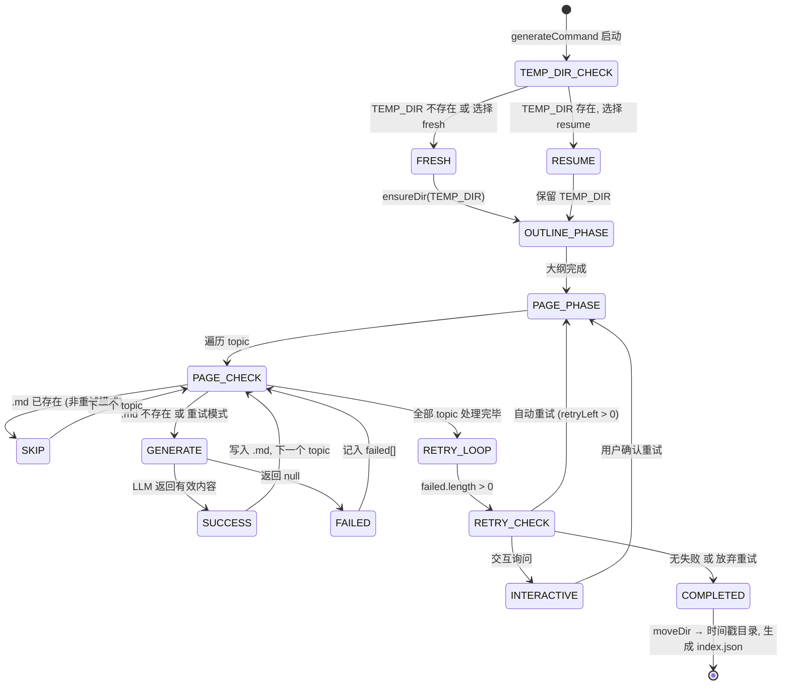

现在信息齐全，开始编写页面。

---

# 断点续传与并行生成策略

整个生成管线中，**容错**与**吞吐**是两个核心约束。LLM 调用昂贵且不可预测——网络抖动、API 限流、上下文窗口溢出都可能导致单页面生成失败。如果一次生成 30 个页面，中间任何失败都要求从头重来，这在工程上是不可接受的。

`src/commands/generate.ts` 通过 **三层容错机制** 解决了这个问题：进程级断点续传、页面级跳过检查、逐轮缩小的失败重试。同时用 **信号量风格的并发控制器** 在并行吞吐与 API 限流之间取得平衡。

---

## 三层容错架构

整个容错体系从上到下分为三个层次，每一层拦截不同粒度的失败场景。



### 第一层：进程断点续传（TEMP_DIR 检测）

`generateCommand` 启动后、进入任何生成阶段之前，首先检测 `TEMP_DIR`（`.wiki/temp`）是否存在：

```typescript
const TEMP_DIR = '.wiki/temp';
// ...
if (existsSync(TEMP_DIR)) {
    if (opts.silent) {
        await removeDir(TEMP_DIR);            // 静默模式：直接重置
    } else {
        const { action } = await inquirer.prompt([
            {
                type: 'list',
                name: 'action',
                message: 'Previous generation temp data found. What do you want to do?',
                choices: [
                    { name: '🔄 Resume from last checkpoint', value: 'resume' },
                    { name: '🗑️  Discard and start fresh', value: 'fresh' },
                ],
            },
        ]);
        if (action === 'fresh') await removeDir(TEMP_DIR);
    }
}
```

- **`silent` 模式**（CI 环境或自动化脚本）直接删除旧数据，从零开始，无需交互。[来源](src/commands/generate.ts#L49-L51)
- **交互模式**展示两个选项：`resume` 保留 Temp 目录、`fresh` 删除重建。[来源](src/commands/generate.ts#L52-L62)
- 无论哪种路径，最后都会确保 `TEMP_DIR` 存在——resume 本就存在，fresh 删除后重新创建。[来源](src/commands/generate.ts#L64-L67)

这个检测点位于 Phase 1（大纲生成）**之前**。选择 resume 意味着整个 Phase 1 被跳过——因为 `_outline.json` 和所有已生成的 `.md` 文件都保留在 TEMP_DIR 中。这与 [](生成命令-wiki-cli-generate.md) 中描述的两阶段流水线直接关联。

### 第二层：页面级跳过检查（文件存在性检测）

进入 Phase 2 后，`generatePages` 为每个 topic 调用内部函数 `generateOne`。生成前检查目标文件是否已存在：

```typescript
async function generateOne(topic: Topic, index: number, total: number): Promise<void> {
    const slug = topic.slug;
    const pagePath = join(TEMP_DIR, `${slug}.md`);
    if (!options.retryList && existsSync(pagePath)) {
        if (!options.parallel) {
            logInfo(`[${index}/${total}] Skipping already generated: ${topic.title}`);
        }
        return;   // ← 跳过，不执行 LLM 调用
    }
    // ... 后续生成逻辑
}
```

关键语义：**`!options.retryList`** 这个条件意味着——仅在**首次生成**（非重试模式）时跳过已存在文件。如果处于重试模式（`retryList` 有值），即使文件已存在也会覆盖重新生成，确保失败页面获得全新尝试机会。[来源](src/commands/generate.ts#L440-L446)

这层检查使得断点续传在页面粒度上精确生效。如果进程在生成了 15/30 个页面后崩溃，重启动后选择 resume，15 个已完成页面全部跳过，只生成剩余的 15 个。

### 第三层：retryList 逐轮缩小的失败重试

Phase 2 完成后，`generatePages` 返回一个 `failed: Topic[]` 数组——所有 LLM 调用返回 null 的页面列表。主函数中的重试循环据此展开：

```typescript
let failed = await generatePages(client, config, workDir, topics, { parallel, concurrency });

// 自动重试阶段
let retriesLeft = opts.retry ?? 0;
while (failed.length > 0 && retriesLeft > 0) {
    const retryResult = await generatePages(client, config, workDir, topics, {
        parallel,
        concurrency,
        retryList: [...failed],    // ← 仅重试失败页面
    });
    failed = retryResult;          // ← 替换失败列表，逐轮缩小
    retriesLeft--;
}

// 交互重试阶段
while (failed.length > 0) {
    const { retry } = await inquirer.prompt([...]);
    if (!retry) break;
    const r = await generatePages(/* ... retryList: [...failed] */);
    failed = r;
}
```

**重试范围逐轮缩小** 的机制极其简洁：每一轮只把当前 `failed` 数组中的页面传给 `retryList`。`generatePages` 内部通过一行代码决定处理哪些页面：

```typescript
const pageTopics = options.retryList || allTopics.filter(t => !t.isGroup);
```

[来源](src/commands/generate.ts#L426)

- 首次调用（无 `retryList`）：处理所有非 Group 页面
- 重试调用（有 `retryList`）：**只处理 retryList 中的页面**
- 每轮重试的失败列表覆盖上一轮的 `failed` 变量，集合自然缩小

**双阶段重试策略** 同时支持自动和交互两种模式：

| 阶段 | 驱动方式 | 条件 | 行为 |
|------|---------|------|------|
| 自动重试 | `opts.retry`（CLI 参数） | `failed.length > 0 && retriesLeft > 0` | 静默重试，最多 N 轮 |
| 交互重试 | inquirer 询问 | 自动重试耗尽后仍有失败 | 用户逐轮确认是否继续 |

[来源](src/commands/generate.ts#L100-L119)

最终，无论重试结果如何，所有页面（成功的已写入 TEMP_DIR）统一移动到时间戳命名的目录中完成发布——`moveDir(TEMP_DIR, join('.wiki', getTimestamp()))`。[来源](src/commands/generate.ts#L122-L124)

---

## 信号量并发控制器：runConcurrent

并行模式下，页面生成通过 `runConcurrent` 函数调度。它实现了一个**基于 `Set<Promise>` 的信号量**：

```typescript
async function runConcurrent(tasks: (() => Promise<void>)[], concurrency: number): Promise<void> {
    const running = new Set<Promise<void>>();
    const queue = [...tasks];

    while (queue.length > 0 || running.size > 0) {
        while (running.size < concurrency && queue.length > 0) {
            const task = queue.shift()!;
            const p = task().finally(() => running.delete(p));
            running.add(p);
        }
        if (running.size > 0) {
            await Promise.race(running);
        }
    }
}
```

[来源](src/commands/generate.ts#L508-L520)

### 调度机制分解

这个实现没有使用传统的 `Promise.all` 批量等待，而是采用**水线填充 + 竞速调度**模式：

1. **外循环** `while (queue.length > 0 || running.size > 0)`：只要还有任务未处理或正在运行，持续调度
2. **内循环** `while (running.size < concurrency && queue.length > 0)`：尽可能向运行池填充任务，直到满额或队列为空
3. **竞速等待** `await Promise.race(running)`：阻塞至任意一个任务完成
4. **自清理** `.finally(() => running.delete(p))`：任务完成后自动从运行池中移除

这种设计的优势在于**最小化空闲时间**。任何一个任务完成，外循环立即调度下一个入池，无需等待整批任务完成。对比 `Promise.all` 批量模式——后者必须等待最慢的任务才能释放下一批——信号量模式在任务执行时间差异较大时吞吐更高。

### 并发度控制

并发度来自用户选择，默认 3，上限 10：

```typescript
validate: (i: any) => (i as number) > 0 && (i as number) <= 10 ? true : 'Enter 1-10',
```

[来源](src/commands/generate.ts#L93)

上限 10 是一个设计决策：LLM API 通常有速率限制（RPM/TPM），并发度过高会导致 429 错误或上下文冲突。3 是经验上对大多数提供商（OpenAI、Claude、Gemini）安全的值。

### 与串行模式的行为差异

串行与并行模式通过 `options.parallel` 标志切换，直接影响 `generateOne` 的行为：

| 方面 | 串行 | 并行 |
|------|------|------|
| LLM 通信 | 流式（逐 chunk 输出） | 非流式（一次性返回） |
| 进度显示 | 实时输出内容 + 工具调用跟踪 | 仅生成完成后打印 `[i/n] Generated: title` |
| 并发 | 1（逐个 await） | concurrency（信号量控制） |
| 失败处理 | 边生成边失败 | 统一收集 failed 列表 |

[来源](src/commands/generate.ts#L395-L407)

串行模式下 `generateOne` 的 `stream = true`，每个页面的生成过程实时可见；并行模式下 `stream = false`，避免多个流式输出在终端上的混乱交错。[来源](src/commands/generate.ts#L393)（传参 `!options.parallel` 给 `collectFullResponse`）

### 与 runConcurrent 的集成

`generatePages` 中调用 `runConcurrent` 的代码：

```typescript
if (options.parallel) {
    const total = pageTopics.length;
    await runConcurrent(
        pageTopics.map((topic, i) => () => generateOne(topic, i + 1, total)),
        options.concurrency
    );
} else {
    for (let i = 0; i < total; i++) {
        await generateOne(pageTopics[i], i + 1, total);
    }
}
```

[来源](src/commands/generate.ts#L395-L407)

注意 `generateOne` 被包装为无参的 `() => Promise<void>` 工厂函数——`runConcurrent` 不关心任务的具体类型，只执行并追踪 Promise。这种抽象使并发控制器与生成逻辑完全解耦。

---

## resume → completed 的完整状态转换

将上述所有机制串联起来，一次完整的生成生命周期经历了这些状态：

```
START
  ↓
TEMP_DIR_CHECK ──exists──→ [silent? → removeDir / 交互询问 resume/fresh]
  │                            ├─ resume ──→ 保持 TEMP_DIR，跳过 Phase 1
  │                            └─ fresh ───→ removeDir + ensureDir，从 Phase 1 开始
  └──not exists──→ ensureDir，从 Phase 1 开始
  ↓
OUTLINE_PHASE (Phase 1: 生成 _outline.json)
  ↓
PAGE_PHASE (Phase 2: 逐页面生成)
  ├─ 串行: for 循环逐个 await
  └─ 并行: runConcurrent 信号量调度
     ↓ 每个 topic:
     ├─ 非重试 + .md exists → SKIP
     ├─ LLM 成功 → writeTextFile → SUCCESS
     └─ LLM 失败 → 加入 failed[] → FAILED
  ↓
RETRY_LOOP:
  ├─ failed.length === 0 → COMPLETED
  ├─ 自动重试 (retriesLeft > 0) → PAGE_PHASE(retryList=[...failed])
  ├─ 交互重试 (用户确认) → PAGE_PHASE(retryList=[...failed])
  └─ 放弃 → 记录警告，进入 COMPLETED
  ↓
COMPLETED:
  ├─ moveDir(TEMP_DIR → .wiki/{timestamp})   ← 原子化发布
  ├─ generateIndex(finalDir, topics)          ← 生成 index.json
  └─ cleanup()                                ← 清理临时工作区
  ↓
END
```

最终步骤 `moveDir` 将临时目录原子化更名为时间戳版本目录，这标志着一次生成会话的正式结束。此后 `TEMP_DIR` 不再存在，下次启动时不会触发 resume 询问——除非生成中途崩溃。[来源](src/commands/generate.ts#L122-L129)

---

## 设计权衡

**为什么用 `Set<Promise>` 而非 `Promise.all`？**
`Promise.all` 要求预先知道所有 Promise 且批量等待，无法在任务执行时间差异大时保持满负载。信号量模式以 `Promise.race` 驱动，任何任务完成立即调度下一个，吞吐上限只受并发度约束。

**为什么跳过检查放在 `generateOne` 内部而非外部？**
放在内部的好处是 skip 逻辑与生成逻辑紧耦合，保证任何调用路径（串行/并行/重试/首次）都能正确跳过。如果抽到 `generatePages` 外部，就需要在两种模式中重复实现同一逻辑。

**为什么 resume 不保留 Phase 1 的大纲重新生成？**
大纲（`_outline.json`）也存储在 `TEMP_DIR` 中。resume 时这些文件全部保留，`generateOne` 的文件存在性检查同时作用于大纲和页面。但注意：**resume 并不重新验证大纲的有效性**——如果用户修改了仓库但保留 TEMP_DIR resume，大纲可能与当前代码库不匹配。这是一种信任用户选择的权衡。

---

## 推荐阅读

- [](生成命令-wiki-cli-generate.md) — 生成命令的整体流程、两阶段流水线概述
- [](生成管线-从大纲到页面的完整流程.md) — Phase 1 和 Phase 2 的详细数据流、提示词注入逻辑
- [](进度显示与日志输出.md) — 串行/并行模式下终端输出系统的差异实现
- [](llm-客户端-流式通信与重试机制.md) — LLM 客户端内部的请求重试与流式解析
- [](工作区管理与远程仓库克隆.md) — `resolveWorkDir` 与 `cleanup` 的工作区生命周期管理