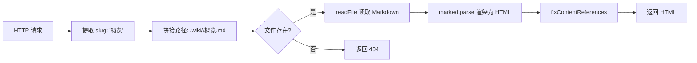
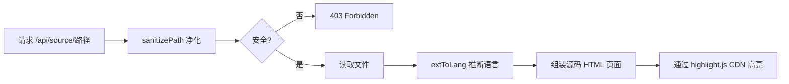

现在我对整个实现有了完整理解，开始编写页面。

---

# 本地 HTTP 服务器与前端

当你运行 `wiki-cli browse`，终端启动的不仅是一个静态文件服务器，而是一个完整的**单页应用（SPA）**——所有前端资源（HTML/CSS/JS）都内嵌在 `serveHtml` 函数中，无需任何外部构建工具或前端框架。本文深入拆解这个"服务器端渲染 + 客户端路由"的混合架构。

---

## 整体架构：一个文件，三层逻辑

`src/commands/browse.ts` 用单一文件实现了三层架构：

```mermaid
flowchart TB
    subgraph 服务器层
        A[Node.js HTTP Server] --> B[路由分发]
        B --> C[/api/page/ 渲染 Markdown]
        B --> D[/api/source/ 源码高亮]
        B --> E[/api/versions 版本列表]
        B --> F[静态文件]
    end

    subgraph 前端层
        G[serveHtml 内嵌 SPA] --> H[侧边栏导航]
        G --> I[内容区]
        G --> J[版本 Overlay]
    end

    subgraph 安全层
        K[sanitizePath 路径净化]
    end

    B --> K
    K --> D
```

服务器基于 Node.js 原生 `http.createServer`，监听自动探测的空闲端口。请求进入后按路径模式依次匹配并路由。整个服务器没有 Express、Koa 等第三方依赖。[来源](src/commands/browse.ts#L1-L10)

---

## `serveHtml`：内嵌完整的 SPA

`serveHtml` 函数是整个前端的入口。它接收侧边栏数据、首屏内容、版本列表，拼接成一段完整的 HTML 字符串后响应给浏览器。

```mermaid
flowchart LR
    A[serveHtml 调用] --> B[读取首屏 Markdown]
    B --> C[marked.parse → HTML]
    C --> D[fixContentReferences<br>处理[来源]链接]
    D --> E[buildSidebarHtml<br>生成侧边栏 DOM]
    E --> F[buildVersionsHtml<br>生成版本列表]
    F --> G[拼接完整 HTML 字符串]
    G --> H[res.end 响应]
```

关键流程：
1. 读取侧边栏第一个页面的 Markdown 文件，通过 `marked.parse` 转为 HTML
2. 调用 `fixContentReferences` 将 `[来源：路径]` 文本替换为指向 `/api/source/` 的链接
3. `buildSidebarHtml` 遍历 `SidebarItem[]`，为每个页面生成带难度徽标的导航项
4. 所有 HTML、CSS、JavaScript 一次性拼入字符串，响应 `Content-Type: text/html`

[来源](src/commands/browse.ts#L244-L260)

---

## 内嵌 CSS：GitHub Dark 主题配色体系

所有样式全部内嵌在 `<style>` 标签中，没有外部 CSS 文件。颜色体系模仿 GitHub Dark 主题：

| CSS 变量/颜色 | 用途 | GitHub 对应色 |
|--------------|------|--------------|
| `#0d1117` | 页面背景 | GitHub Dark `bg-canvas` |
| `#161b22` | 侧边栏/代码块背景 | GitHub Dark `bg-subtle` |
| `#1c2333` | 悬停高亮背景 | GitHub Dark `bg-hover` |
| `#30363d` | 分隔线/边框 | GitHub Dark `border-default` |
| `#c9d1d9` | 正文颜色 | GitHub Dark `text-primary` |
| `#f0f6fc` | 标题颜色 | GitHub Dark `text-heading` |
| `#58a6ff` | 链接/交互色 | GitHub Dark `text-link` |
| `#8b949e` | 次要文本颜色 | GitHub Dark `text-secondary` |

布局采用 `display: flex` 双栏结构：左侧 280px 固定宽度的侧边栏（`#161b22` 背景），右侧内容区最大 900px。内容区的标题、段落、表格、代码块、引用块均有独立的样式规则，保证 Markdown 渲染后的阅读体验。[来源](src/commands/browse.ts#L268-L325)

### 难度等级的颜色标识

导航栏中每个页面标题前有一个彩色徽标，直接映射 `index.json` 中配置的 `level` 字段：

| 难度 | 徽标 | CSS 选择器 |
|------|------|-----------|
| 初学 | 🟢 | `item.level === '初学'` |
| 中级 | 🟡 | `item.level === '中级'` |
| 高级 | 🔴 | 其他所有值 |

分组标题（`level === 'group'`）渲染为灰色大写文字，不可点击。[来源](src/commands/browse.ts#L201-L210)

---

## JavaScript SPA 引擎

所有前端逻辑在 `<script>` 标签中内联定义，核心函数有三个。

### `loadPage`：异步页面加载

```javascript
async function loadPage(encodedSlug) {
  const slug = decodeURIComponent(encodedSlug);
  const res = await fetch('/api/page/' + slug + '.md?version=' + currentVersion);
  const html = await res.text();
  document.getElementById('content').innerHTML = html;
  document.getElementById('content').scrollTop = 0;
  hljs.highlightAll();
  history.replaceState(null, '', '#' + slug);
}
```

每次点击导航栏或内部链接时调用。它通过 Fetch API 向 `/api/page/` 请求渲染好的 HTML，替换内容区的 `innerHTML`，然后调用 `hljs.highlightAll()` 对新插入的代码块应用语法高亮，最后用 `history.replaceState` 更新 URL 的 hash，实现**无刷新页面切换**。[来源](src/commands/browse.ts#L340-L347)

### 哈希路由与 DOMContentLoaded

页面启动时通过 `DOMContentLoaded` 事件初始化：

```javascript
document.addEventListener('DOMContentLoaded', function() {
  hljs.highlightAll();
  if (location.hash) {
    const slug = decodeURIComponent(location.hash.slice(1));
    loadPage(slug);
  }
  // ...键盘事件和链接拦截
});
```

这实现了两个重要功能：
1. **首次渲染高亮**：首屏内容中的代码块自动高亮
2. **哈希路由恢复**：如果 URL 包含 `#slug`（例如通过浏览器书签或前进/后退进入），自动加载对应页面

`history.replaceState` 的使用不压栈，避免 hash 变化产生多余的浏览器历史记录——因为用户的实际导航操作（点击链接）会通过 `popstate` 隐式管理，而 `loadPage` 触发的内容替换不应产生额外的历史条目。[来源](src/commands/browse.ts#L352-L361)

### 链接拦截与智能跳转

内容区的事件委托监听所有 `<a>` 标签点击：

```javascript
document.getElementById('content').addEventListener('click', function(e) {
  const anchor = e.target.closest('a');
  const href = anchor.getAttribute('href');
  if (!href || href.startsWith('http') || href.startsWith('/api/') 
      || href.startsWith('#') || href.startsWith('mailto:')) return;
  e.preventDefault();
  if (href.endsWith('.md')) {
    loadPage(href.replace(/\.md$/, ''));
  } else {
    window.open('/api/source/' + srcPath, '_blank');
  }
});
```

路由决策逻辑：

| 链接类型 | 行为 |
|---------|------|
| 外部链接（`http://`） | 正常跳转，不拦截 |
| `/api/` 开头的路径 | 不拦截（避免干扰 API 请求） |
| `#slug` 哈希链接 | 不拦截（保留页面内锚点） |
| `mailto:` | 不拦截 |
| `xxx.md` 结尾 | 调用 `loadPage` 在内容区加载 |
| 其他路径（如 `src/commands/browse.ts`） | 视为源码路径，在新标签打开 `/api/source/` |

这意味着 Wiki 页面中的交叉引用链接（如 `[快速开始](快速开始.md)`）点击后只替换内容区，而源码引用链接（如 `[来源](src/commands/browse.ts#L33-L34)`）会打开新标签展示带语法高亮的源码。[来源](src/commands/browse.ts#L362-L376)

---

## `/api/page/`：Markdown → HTML 渲染管线

当浏览器请求 `/api/page/概览.md?version=2025-01-15T14-30-00` 时，服务器端的处理流程：



**Markdown 渲染**使用 `marked` 库，这是目前 Node.js 生态中最流行的 Markdown 解析器之一。`marked.parse` 将 Markdown 文本直接转为 HTML 字符串，不经过中间 AST 表示。

**`fixContentReferences` 函数**在渲染后处理 HTML 字符串：用正则 `/\[来源：([^\]]+)\]/g` 匹配所有 `[来源：路径]` 模式，替换为带 `class="source-ref"` 的可点击链接。这个样式在 CSS 中定义为带边框的小型按钮，悬浮时变为蓝色。[来源](src/commands/browse.ts#L90-L101)

---

## `/api/source/`：源码高亮展示

`/api/source/` 路由用于在独立页面中展示源代码文件，附带语法高亮。



### 独立 HTML 页面结构

源码页面是一个完整的、自包含的 HTML 文档，包含：

- **粘性头部**（sticky header）：左侧是「← Wiki」返回链接（带 `?version=` 参数），中间显示文件路径，右侧显示语言标签
- **代码区域**：`<pre><code class="language-xxx">` 包裹转义后的源码内容
- **highlight.js**：通过 CDN 加载 `github-dark.min.css` 主题和 `highlight.min.js`，与主站风格统一

### 语言推断

`extToLang` 函数通过文件扩展名映射到 highlight.js 支持的语言标识符：

| 扩展名 | 语言标识 |
|--------|---------|
| `.ts` | `typescript` |
| `.js` | `javascript` |
| `.json` | `json` |
| `.md` | `markdown` |
| `.yml` / `.yaml` | `yaml` |
| `.html` | `html` |
| `.css` | `css` |
| `.sh` / `.bash` | `bash` |
| 其他 | `plaintext` |

[来源](src/commands/browse.ts#L146-L156)

---

## 版本切换 Overlay 组件

版本切换功能面向 `.wiki/` 目录下的多个时间戳版本，使用 overlay（覆盖层）组件实现。

### 数据来源

`/api/versions` 端点返回 JSON 格式的版本列表：

```typescript
// 响应示例
[
  { "ts": "2025-01-15T14-30-00", "current": true },
  { "ts": "2025-01-14T10-15-22", "current": false }
]
```

服务器端从 `.wiki/` 子目录按时间倒序排列，排除 `temp` 和 `sessions` 目录。[来源](src/commands/browse.ts#L78-L88)

### Overlay 交互

```
┌──────────────────────────────────────────┐
│  ✕  历史版本                              │
│                                          │
│  2025-01-15T14-30-00  ← 蓝底高亮          │
│  2025-01-14T10-15-22                     │
│                                          │
└──────────────────────────────────────────┘
```

- **打开**：点击侧边栏顶部的「历史版本」按钮，调用 `showVersions()` 为 overlay 添加 `show` 类（`display: flex`）
- **关闭**：点击 ✕ 按钮、点击遮罩层（`onclick` 检查 `event.target === this`）、按 ESC 键
- **切换**：点击某个版本调用 `switchVersion(ts)`，将 `window.location.href` 设为 `/?version=<ts>`，触发**全页刷新**——因为不同版本的侧边栏结构可能不同，必须重新加载

版本列表中当前版本用 `current` 类标记（蓝底高亮、加粗）。[来源](src/commands/browse.ts#L97-L104)

---

## `sanitizePath`：防御路径穿越攻击

`/api/source/` 路由接受用户提供的文件路径，如果不加处理，攻击者可能通过 `../../etc/passwd` 之类的方式读取服务器上的任意文件。`sanitizePath` 函数是这道防线的核心。

```typescript
function sanitizePath(rawPath: string): string | null {
  // 去掉开头的 / 或 \
  const cleaned = rawPath.replace(/^[/\\]+/, '');
  // 规范化路径，移除 .. 序列
  const normalized = normalize(cleaned).replace(/^(\.\.(\/|\\))+/g, '');
  // 解析为绝对路径
  const resolved = resolve(PROJECT_ROOT, normalized);
  // 检查是否仍位于项目根目录内
  if (!resolved.startsWith(PROJECT_ROOT + sep) && resolved !== PROJECT_ROOT) 
    return null;
  return normalized;
}
```

三层防护：

| 层级 | 操作 | 目的 |
|------|------|------|
| **第 1 层** | 移除开头斜杠 | 防止 `/` 开头被 `resolve` 当作绝对路径 |
| **第 2 层** | `path.normalize` + 正则清除 `../` | 折叠 `foo/../../bar` 为 `bar`，清除残余的 `../` 前缀 |
| **第 3 层** | `resolve` 后检查前缀 | 确保解析后的路径仍在 `PROJECT_ROOT` 内 |

如果任意一层检测到越权行为，函数返回 `null`，服务器响应 `403 Forbidden`。实战中，即使传入 `../../../../../etc/passwd`，经过 `normalize` 后变为 `/etc/passwd`（如果超出根目录），再通过 `resolve` 与 `PROJECT_ROOT` 比对，最终被拦截。[来源](src/commands/browse.ts#L138-L144)

---

## 侧边栏索引的两种格式

`loadSidebar` 函数优先读取 `index.json`（JSON 格式，结构化程度更高），若不存在则回退到 `index.md`（XML 风格标签）：

- **JSON 格式**：调用 `stripCodeFence` 去除可能的代码 fence 包裹，解析 JSON 后遍历 `sections[].topics[]`，提取 `title`、`level`，通过 `slugify` 生成 URL 友好的 slug
- **XML 格式**：逐行扫描 `<section>` 标签内的 `<topic level="...">` 和 `<group>` 标签，同样通过 `slugify` 生成 slug

两种格式最终统一为 `SidebarItem[]` 数组。[来源](src/commands/browse.ts#L113-L136)

---

## 核心设计权衡

| 决策 | 为什么这样做 | 代价 |
|------|-------------|------|
| HTML/CSS/JS 全部内嵌 | 零外部依赖，一条命令即用 | 每次请求传输完整 HTML，无法利用浏览器缓存 |
| `replaceState` 而非 `pushState` | 避免正常点击产生多余历史记录 | 前进/后退功能依赖隐式行为，不够直观 |
| 版本切换全页刷新 | 不同版本侧边栏结构不同，需重建 | 切换速度不如局部替换快 |
| CDN 加载 highlight.js | 减轻服务器负担，保持代码体积小 | 离线环境无法工作 |
| Node.js 原生 `http` 模块 | 无第三方依赖，启动速度快 | 缺少中间件生态，路由逻辑需手写 |

---

## 下一步

- 想了解浏览命令的用户操作流程？看 [浏览命令：wiki-cli browse](浏览命令-wiki-cli-browse.md)
- 想知道生成阶段如何创建 `index.json`？看 [生成命令：wiki-cli generate](生成命令-wiki-cli-generate.md)
- 想了解整个 CLI 入口和命令调度？看 [CLI 入口与命令调度机制](cli-入口与命令调度机制.md)