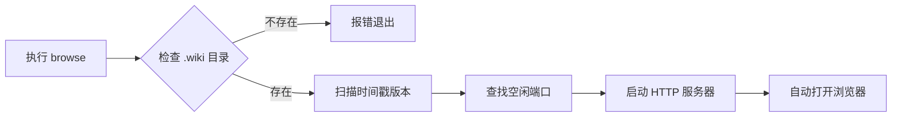

现在，开始写作正文。

---

# 浏览命令：wiki-cli browse

运行 `wiki-cli browse` 之后会发生什么？这一章从**最终用户视角**拆解这条命令的工作过程——从你按回车的那一刻起，到浏览器里出现一篇可交互的 Wiki 页面为止。

## 一句话概括

`wiki-cli browse` 启动一个**本地 HTTP 服务器**，把你之前用 `wiki-cli generate` 生成的 Markdown 文档渲染成可在浏览器中阅读的 HTML 页面。整个过程无需配置 Web 服务器、无需构建工具、无需安装额外依赖。

[来源](src/commands/browse.ts#L1-L8)

---

## 一条命令，六步启动

执行 `wiki-cli browse` 后，程序会在后台依次完成以下六个步骤：



### 第一步：检查 .wiki 目录

程序首先确认当前目录下是否存在 `.wiki` 文件夹。这个文件夹由 [生成命令：wiki-cli generate](生成命令-wiki-cli-generate.md) 创建，里面存放着所有生成的文档文件。如果不存在，终端会显示红色错误提示并退出：

```
✖ No .wiki directory found. Run "wiki-cli generate" first.
```

这是一种**防御式设计**——与其在用户访问页面时返回 404，不如在启动前就明确告知问题所在。

[来源](src/commands/browse.ts#L14-L18)

### 第二步：发现版本

扫描 `.wiki` 下的所有子目录（排除 `temp` 和 `sessions` 这两个特殊目录），将它们按名称降序排列。由于每次生成都会创建一个以时间戳命名的目录（如 `2025-01-15T14-30-22`），按字符串降序排就能自然得到"最新的在最前面"的效果。

```text
.wiki/
├── 2025-01-15T14-30-22/    ← 最新版本
├── 2025-01-14T10-15-00/    ← 历史版本
└── 2025-01-13T16-42-11/    ← 更早的版本
```

[来源](src/commands/browse.ts#L20-L31)

### 第三步：查找空闲端口

服务器默认尝试监听 **3000** 端口。如果被占用，会自动递增查找下一个可用端口（3001 → 3002 → ...）：

```typescript
async function findFreePort(preferred: number): Promise<number> {
  return new Promise((resolve) => {
    const srv = createServer();
    srv.listen(preferred, () => {
      // 端口可用 → 关闭测试服务器，返回端口号
      const addr = srv.address();
      srv.close(() => resolve(addr.port));
    });
    srv.on('error', () => resolve(findFreePort(preferred + 1)));
    // ↑ 端口被占用 → 递归尝试 +1
  });
}
```

这个函数的核心逻辑是**尝试-错误-重试**：先建一个临时服务器听一下，听成功了就关掉返回端口号，失败了就加一再试一次。整个过程对用户透明，你不需要手动指定端口。

[来源](src/commands/browse.ts#L312-L322)

### 第四步 ~ 第六步：启动服务器并打开浏览器

服务器启动后，终端显示绿色的成功消息：

```
✔ Wiki server started at http://localhost:3000
```

同时，程序会自动调用系统的默认浏览器打开这个地址。它会根据你的操作系统选择不同的命令：

| 操作系统 | 调用命令 |
|----------|----------|
| Windows  | `start http://localhost:3000` |
| macOS    | `open http://localhost:3000` |
| Linux    | `xdg-open http://localhost:3000` |

如果自动打开失败（比如在没有图形界面的远程服务器上），你只需手动复制终端中的 URL 到浏览器即可。

[来源](src/commands/browse.ts#L163-L171)

---

## 侧边栏是如何构建的？

浏览器左侧的导航栏不是手动编写的 HTML，而是由服务器从索引文件**动态生成**的。

### 数据来源：index.json

程序会优先读取 `index.json` 文件，它位于每个版本目录的根目录。这个文件由 `wiki-cli generate` 在生成阶段自动产出，结构大致如下：

```json
{
  "sections": [
    {
      "title": "入门指南",
      "topics": [
        { "title": "概览", "level": "初学" },
        { "title": "快速开始", "level": "初学" },
        { "type": "group", "title": "深入探索" },
        { "title": "整体架构", "level": "中级" }
      ]
    }
  ]
}
```

解析器会按照以下规则处理：

- **普通条目**（有 `title` 和 `level`）→ 生成可点击的导航链接，slug 由标题自动转换（中文标题 → 拼音式短链接）
- **分组条目**（`type: "group"`）→ 生成灰色的分组标题，作为目录的分类标签
- **难度标记** → `🟢 初学` / `🟡 中级` / `🔴 高级`，一眼看出每篇文档的复杂度

### 回退方案：index.md

如果 `index.json` 不存在（比如旧版本生成的文档），程序会退而求其次，尝试读取同目录下的 `index.md` 文件，使用 XML 格式解析。如果两个文件都不存在，侧边栏就是空的——不过这种情况在实际使用中很少出现。

[来源](src/commands/browse.ts#L196-L235)

---

## 两个核心 API，驱动整个前端

这个 SPA（单页应用）的前端通过两个 API 端点从服务器获取数据。理解它们就理解了全部交互逻辑。

### `/api/page/{slug}` — 获取页面内容

当你在左侧点击一个页面标题时，前端会向这个 API 发起请求：

```
请求: GET /api/page/浏览命令-wiki-cli-browse?version=2025-01-15T14-30-22
```

服务器找到对应的 `.md` 文件，用 **marked** 库把 Markdown 渲染成 HTML，然后返回给前端。前端收到后直接替换内容区：

```javascript
async function loadPage(encodedSlug) {
  const res = await fetch('/api/page/' + slug + '.md?version=' + currentVersion);
  const html = await res.text();
  document.getElementById('content').innerHTML = html;
  hljs.highlightAll();  // ← 重新对代码块应用语法高亮
  history.replaceState(null, '', '#' + slug);  // ← 更新地址栏
}
```

**marked** 是一个轻量级的 Markdown 渲染库，支持同步 API，所以代码写起来很简洁。而 **highlight.js** 负责给代码块着色——每次页面切换后都需要重新调用 `hljs.highlightAll()`，因为 `innerHTML` 替换会清除之前的高亮 DOM。

[来源](src/commands/browse.ts#L105-L117)

### `/api/source/{路径}` — 查看源代码

这是文档中"来源链接"的幕后引擎。当你点击页面中的 `[来源]` 标签时（或者点击一个非 `.md` 结尾的内部链接），会触发这个 API。

```
请求: GET /api/source/src/commands/browse.ts
```

服务器收到请求后会做三件事：

1. **路径安全检查** — 通过 `sanitizePath` 函数防止"路径穿越攻击"（即恶意使用 `../../` 跳出项目目录）
2. **读取文件内容** — 将文件内容读为文本
3. **返回高亮 HTML** — 将文件包裹在一个独立的 HTML 页面中返回，包含 highlight.js 的语法高亮

返回的页面包含一个"← Wiki"链接，点击即可回到文档，还有一个显示文件语言类型的小标签（如 `TypeScript`、`JavaScript`、`JSON`）。

```
┌──────────────────────────────────────────────────────┐
│ ← Wiki  |  src/commands/browse.ts          TypeScript │
├──────────────────────────────────────────────────────┤
│ import { readFile, readdir } from 'node:fs/promises';│
│ import { join, extname, resolve } from 'node:path';  │
│ ...                                                  │
│                                                      │
│ (语法高亮后的完整源码)                                 │
└──────────────────────────────────────────────────────┘
```

[来源](src/commands/browse.ts#L119-L132)

---

## 三种前端交互，构建浏览体验

### 1. 侧边栏导航

左侧面板列出了所有文档页面，按章节分组。点击任意页面标题：

- 右侧内容区**无缝切换**（不刷新整个页面）
- 浏览器地址栏的 hash 部分更新为 `#页面-slug`
- 你可以使用浏览器的"后退/前进"按钮在历史页面间跳转
- 直接访问 `http://localhost:3000/#快速开始` 也会加载对应页面

### 2. 版本切换

点击侧边栏顶部的"历史版本"按钮，会弹出一个覆盖层，列出所有已生成的 Wiki 版本（按时间从新到旧排列）。选择任意版本，整个页面会重新加载，展示那个时间点的文档内容。

这一功能基于每次生成创建的**时间戳目录**实现——每次运行 `wiki-cli generate` 都会生成一个独立目录，互不覆盖，因此你可以随时回溯到任意历史版本。

### 3. 源码查看

文档中的 `[来源]` 标记是生成阶段由 LLM 自动插入的。在浏览页面中，它们被转换为**可点击的链接**（蓝色外框标签，样式与正文链接不同），点击后在新标签页中打开源代码的高亮预览页。

```markdown
<!-- 生成阶段 LLM 写入的 Markdown -->
[来源：src/commands/browse.ts#L33-L34]

<!-- 浏览阶段渲染为 HTML -->
<a href="/api/source/src/commands/browse.ts#L33-L34"
   target="_blank" class="source-ref">[来源]</a>
```

这种设计让你在阅读文档时可以**一键跳转到对应的源码**进行验证，实现了"文档 ↔ 源码"的双向追溯。

[来源](src/commands/browse.ts#L250-L253)

---

## 一步到位：命令参数一览

`wiki-cli browse` 是目前唯一**不需要任何参数**的子命令。运行它，一切自动完成：

```bash
wiki-cli browse
```

它没有可选的 `--port` 参数（端口自动查找），没有 `--version` 参数（默认打开最新版本）。这种"零配置"设计的思路是：浏览是一个纯消费行为，用户不应该为启动阅读器而操心任何配置。

[来源](src/commands/browse.ts#L36-L37)

---

## 深入阅读

如果你想了解上述机制的**代码实现细节**，推荐阅读：

- [HTTP 服务与前端渲染](http-服务与前端渲染.md) — 路由表、HTML 模板、CSS 配色系统的完整源码分析
- [版本切换与源代码预览](版本切换与源代码预览.md) — 版本管理机制和源码 API 的安全纵深防御
- [生成结果说明](生成结果说明.md) — `index.json` 索引文件的结构定义
- [生成命令：wiki-cli generate](生成命令-wiki-cli-generate.md) — 理解 LLM 如何在生成阶段插入 `[来源]` 标记
- [快速开始](快速开始.md) — 从零到浏览的完整 5 分钟流程