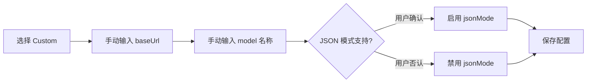

现在我已有全部所需信息。开始撰写。

---

# 添加新的 LLM 提供商

内置的 7 家提供商满足大多数场景，但你仍可能想接入私有部署的模型或不在列表中的云服务。扩展机制涉及三个步骤：修改 JSON 数据、维护 JSON 模式开关、验证测试。但更重要的是理解**哪些提供商能真正即插即用，哪些存在硬编码鸿沟**——后者是本文的核心价值。

## 数据结构：ModelEntry

每个条目对应 `ModelEntry` 接口的一个实例：

```typescript
export interface ModelEntry {
  provider: string;      // 提供商名称，同组条目必须完全一致（大小写敏感）
  model: string;         // 模型标识符，如 "gpt-5.5"
  baseUrl: string;       // API 端点基础 URL
  description: string;   // 人可读的描述
  pricingHint?: string;  // 定价提示（可选）
}
```

[来源](src/config/config-store.ts#L16-L23)

`provider` 字段是分组依据——`getProviders` 用 `Set` 去重提取所有唯一的提供商名，`getModelsByProvider` 则用 `filter` 按此字段筛选。**同一提供商的所有条目必须使用完全一致的 provider 字符串**，包括大小写和空格。例如 `"xAI Grok"` 和 `"xai grok"` 会被视为两个不同的提供商。 [来源](src/config/config-store.ts#L67-L73)

## 第一步：修改 default-models.json

打开 `src/config/default-models.json`，在数组末尾追加新条目。以添加虚构的 **NovaAI** 为例：

```json
{
  "provider": "NovaAI",
  "model": "nova-3-turbo",
  "baseUrl": "https://api.nova-ai.example/v1",
  "description": "NovaAI Turbo 3 (fictional)",
  "pricingHint": "Competitive pricing, fast inference"
}
```

可追加多条记录，保持 `provider` 字符串完全一致。测试会检查每个条目是否包含四个必填字段（`provider`、`model`、`baseUrl`、`description`）。 [来源](tests/config-store.test.ts#L30-L38)

## 第二步：维护 JSON_MODE_PROVIDERS Set

`JSON_MODE_PROVIDERS` 是 `src/config/config-store.ts` 中定义的一个硬编码 `Set<string>`，它决定了 `supportsJsonMode()` 的返回值：

```typescript
const JSON_MODE_PROVIDERS = new Set([
  'OpenAI',
  'DeepSeek',
  'xAI Grok',
  'Mistral',
  'Kimi (Moonshot)',
]);

export function supportsJsonMode(provider: string): boolean | undefined {
  if (provider === 'Custom') return undefined; // unknown, ask user
  return JSON_MODE_PROVIDERS.has(provider);
}
```

[来源](src/config/config-store.ts#L27-L38)

| 返回值 | 含义 | 行为 |
|---|---|---|
| `true` | 已知支持 JSON 模式 | 自动启用，不询问用户 |
| `false` | 已知不支持 JSON 模式 | 自动禁用，不询问用户 |
| `undefined` | 未知（Custom 模式） | 在 `wiki-cli config` 交互中询问用户 |

如果新提供商支持 `response_format: json_object`，在此 Set 中添加其名称。如果不确定，**不添加即可**——系统会回退到文本模式生成，通过提示词约束输出格式，稳定性略低但功能不受影响。

## 第三步：运行测试

```bash
npm test
```

`tests/config-store.test.ts` 中的测试会自动验证：所有条目包含必填字段、`getProviders` 返回无重复列表、`getModelsByProvider` 筛选正确。无需修改测试文件。 [来源](tests/config-store.test.ts#L1-L70)

## Custom 提供商的工作流

除了添加固定提供商，系统还内置了 **Custom** 模式——在 `wiki-cli config` 的交互式选择中选 `✏️ Custom (enter manually)` 即可进入。 [来源](src/commands/config.ts#L52-L66)

Custom 模式的工作流如下：



具体流程：
1. 用户选择 `__custom__` 后，`provider` 被设置为 `"Custom"`。 [来源](src/commands/config.ts#L53)
2. 交互式输入 `baseUrl` 和 `model`，无下拉列表，完全自由输入。 [来源](src/commands/config.ts#L54-L60)
3. 调用 `supportsJsonMode('Custom')` 返回 `undefined`，触发额外询问："Does this provider support JSON output mode?"。 [来源](src/commands/config.ts#L79-L83)
4. 配置保存后，所有运行时行为与其他提供商完全一致——请求仍通过 `buildRequest()` 发送。

Custom 模式的设计哲学是：**任何兼容 [OpenAI Chat Completions API](https://platform.openai.com/docs/api-reference/chat) 格式的 HTTP 端点都可以接入**。这意味着：
- 私有部署的 Ollama、vLLM、Text Generation WebUI 均可直接使用
- 国内镜像服务、企业内部 LLM 网关也适用
- 无需修改任何代码

## ⚠️ 非 OpenAI 兼容 API 的适配风险

这是本文最关键的警告。**当前客户端对所有提供商（包括 Custom）都使用同一套硬编码的请求格式**，这意味着并非所有出现在 `default-models.json` 中的提供商都能正常工作。

### 硬编码的请求格式

`llm-client.ts` 中的 `buildRequest()` 函数固定了三个要素： [来源](src/ai/llm-client.ts#L66-L88)

```typescript
function buildRequest(config, messages, tools?, stream?, jsonMode?) {
  // 1. URL 路径固定为 /chat/completions
  const url = `${config.baseUrl.replace(/\/+$/, '')}/chat/completions`;

  // 2. 请求体使用 OpenAI 结构
  const body = {
    model: config.model,
    messages: messages.map(serializeMessage),
    stream,
    tools,
    response_format: jsonMode ? { type: 'json_object' } : undefined,
  };

  // 3. 认证方式固定为 Bearer token
  const headers = {
    'Content-Type': 'application/json',
    'Authorization': `Bearer ${config.apiKey}`,
  };
}
```

### 哪些提供商能真正工作？

| 提供商 | API 兼容性 | 能否工作？ | 原因 |
|---|---|---|---|
| OpenAI | 原生 OpenAI | ✅ 完全工作 | 本身就是 OpenAI 格式 |
| xAI Grok | OpenAI 兼容 | ✅ | 端点、认证、体结构一致 |
| DeepSeek | OpenAI 兼容 | ✅ | 同上 |
| Kimi (Moonshot) | OpenAI 兼容 | ✅ | 同上 |
| Mistral | OpenAI 兼容 | ✅ | 同上 |
| **Anthropic** | **独立 API 格式** | **❌ 无法工作** | 见下方分析 |
| **Google Gemini** | **独立 API 格式** | **❌ 无法工作** | 见下方分析 |

### Anthropic 的差异

Anthropic 的 API 与 OpenAI 存在根本性差异： [来源](https://docs.anthropic.com/en/api/messages)

- **端点**：`/v1/messages` 而非 `/chat/completions`
- **认证头**：`x-api-key: {key}` 而非 `Authorization: Bearer {key}`
- **请求体**：使用 `max_tokens`（必需）、`anthropic_version`、`system`（单独字段）等，而非 OpenAI 的 `messages` 数组结构
- **流式响应**：SSE 事件类型为 `content_block_delta`、`message_delta` 等，而非 `choices[0].delta`

### Google Gemini 的差异

Gemini API 同样不兼容 OpenAI 格式： [来源](https://ai.google.dev/api/generate-content)

- **端点**：`/v1beta/models/{model}:generateContent` 而非 `/chat/completions`
- **请求体**：使用 `contents[]` 替代 `messages`，字段结构完全不同
- **认证**：通常通过 `x-goog-api-key` 头或 OAuth2，而非 Bearer token
- **流式**：SSE 事件格式与 OpenAI 也不相同

### 这意味着什么？

如果你尝试使用 Anthropic 或 Google Gemini，当前客户端会：
1. 向 `https://api.anthropic.com/v1/chat/completions` 或 `https://generativelanguage.googleapis.com/v1beta/chat/completions` 发送请求——**这两个 URL 在这些 API 中根本不存在**，会返回 404
2. 即使路径正确，请求体结构也是错误的，服务端无法解析

### 现实影响

`default-models.json` 中虽然列出了 Anthropic（3 个模型）和 Google Gemini（3 个模型），但**它们实际上无法通过当前客户端正常使用**。这些条目存在的主要价值是：
- **作为参考信息**：帮助用户了解支持的模型生态系统
- **为未来适配预留空间**：当客户端增加对非 OpenAI API 的支持时，可直接使用

如果你确实需要使用 Anthropic 或 Google Gemini，目前有两个选择：

1. **通过兼容网关代理**：使用 [LiteLLM](https://github.com/BerriAI/litellm)、[OpenRouter](https://openrouter.ai) 等服务，将 Anthropic/Gemini API 转换为 OpenAI 兼容格式
2. **等待社区适配**：在 `LLMClient` 中增加 `buildRequest` 的路由逻辑，根据不同 `provider` 构建不同的请求格式

## 局限性一览

| 维度 | 现状 | 建议 |
|---|---|---|
| API 格式支持 | 仅 OpenAI 兼容格式 | 需通过代理网关使用其他 API |
| 认证方式 | 仅 `Bearer` token | Anthropic 使用 `x-api-key` |
| JSON 模式判定 | 手动维护 Set | 自动化检测不可行 |
| 模型元数据 | 仅描述和定价提示 | 无法附加上下文窗口、速率限制等数据 |

## 完整示例：添加 NovaAI

**文件改动清单：**

| 文件 | 改动类型 | 说明 |
|---|---|---|
| `src/config/default-models.json` | 追加 2 条记录 | 添加 nova-3-turbo 和 nova-3-lite |
| `src/config/config-store.ts` | 追加 1 行 | 在 `JSON_MODE_PROVIDERS` 中添加 `'NovaAI'` |

**步骤：**
1. 在 `default-models.json` 末尾添加两条 NovaAI 条目，确保 `provider` 字段完全一致
2. 确认 NovaAI API 支持 `response_format: json_object`，在 `JSON_MODE_PROVIDERS` Set 中添加 `'NovaAI'`
3. 运行 `npm test` 验证所有测试通过
4. 运行 `npm run build` 重新编译 TypeScript
5. 运行 `wiki-cli config`，提供商列表中即可看到 **NovaAI** 选项

## 推荐阅读

- [LLM 提供商与模型选择](llm-提供商与模型选择.md) — 了解内置的 7 家提供商及其模型详情
- [配置命令：wiki-cli config](配置命令-wiki-cli-config.md) — 配置新提供商的交互式与命令行用法
- [配置存储与高级选项](配置存储与高级选项.md) — JSON 模式、配置文件的底层存储结构
- [LLM 客户端实现](llm-客户端实现.md) — 深入理解 `buildRequest()` 和流式通信的实现细节
- [测试策略与单元测试](测试策略与单元测试.md) — 了解 config-store 测试套件的覆盖范围