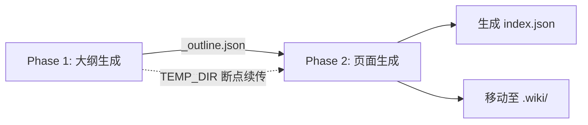

# 生成命令：wiki-cli generate

`wiki-cli generate` 是整个工具的核心流程：分析代码仓库→生成文档大纲→逐页生成 Wiki 页面。它是一条两阶段管线，中间通过 JSON 大纲串联。



[来源](src/commands/generate.ts#L16-L16)

---

## Phase 1：大纲生成（流式工具循环）

第一阶段的目标是让 LLM 理解代码仓库结构，产出结构化的 JSON 大纲。核心是 **`collectFullResponse`**——一个支持多轮工具调用的流式响应收集器。

### 工具调用循环

`collectFullResponse` 不是简单的一次 LLM 请求，而是一个 **最多 30 轮迭代的循环**：

```typescript
while (iteration < maxToolIterations) {
  // 1. 发起流式请求，消费 StreamChunk
  // 2. 区分 content / reasoning / tool_call 三种 chunk 类型
  // 3. 若本轮无工具调用 → 返回 content
  // 4. 若本轮有工具调用 → 执行 → 结果追加到 messages → 继续循环
}
```

[来源](src/commands/generate.ts#L158-L230)

每一轮迭代中，流式数据被拆解为三种类型：

| Chunk 类型 | 用途 | 终端表现 |
|---|---|---|
| `content` | LLM 生成的文本 | `process.stdout.write` 实时输出 |
| `reasoning` | 思维链过程（仅部分模型支持） | `chalk.dim.yellow` 灰色显示 |
| `tool_call` | 函数调用请求 | 累计参数后执行 |

[来源](src/commands/generate.ts#L174-L196)

关键设计：**工具调用参数的流式累加**。由于 `tool_call` 的 `arguments` 字段会以多块 chunk 形式到达，代码使用 `Map<string, ToolCall>` 按工具索引合并：

```typescript
const key = tc.index !== undefined ? `_idx_${tc.index}` : tc.id;
if (toolCallsMap.has(key)) {
  const existing = toolCallsMap.get(key)!;
  existing.function.arguments += tc.function.arguments;
}
```

[来源](src/commands/generate.ts#L184-L190)

每轮工具调用执行后，结果以 `{ role: 'tool' }` 消息追加回 `messages` 数组，然后进入下一轮迭代。这就是 LLM 与代码仓库交互的桥梁——LLM 通过"读文件""读目录"等工具获取代码信息，逐步建立对项目的理解。有关工具的具体定义见 [工具系统：LLM 只读探索工具的设计](工具系统-llm-只读探索工具的设计.md)。

[来源](src/commands/generate.ts#L218-L228)

### JSON 提取：parseOutlineJson

当 LLM 给出一个"我认为完成了"的响应（无工具调用），`generateOutline` 尝试用 **`parseOutlineJson`** 从中提取大纲。

```typescript
function parseOutlineJson(text: string): Topic[] {
  let cleaned = stripCodeFence(text);        // 移除 ```json 围栏
  const jsonMatch = cleaned.match(/\{[\s\S]*\}/); // 提取首个 JSON 对象
  const parsed = JSON.parse(jsonMatch[0]);   // 解析
  // 遍历 parsed.sections → 展开为 Topic[]
}
```

[来源](src/commands/generate.ts#L120-L152)

提取过程遵循三层容错：

1. **移除代码围栏**——`stripCodeFence` 去掉 ` ```json ` 和 ` ``` ` 包裹，因为 LLM 常将 JSON 放围栏内。
2. **正则提取 JSON 对象**——即使 LLM 在 JSON 前后加了闲聊文字，也能提取出第一个 `{}` 块。
3. **结构校验**——必须包含 `sections` 数组，否则返回空数组触发下一轮对话。

[来源](tests/outline-parser.test.ts#L76-L89)

如果提取失败且未超过 **25 轮**上限，`generateOutline` 将当前回复追加为 assistant 消息，继续对话：

```typescript
if (topics.length > 0) {
  // 成功！保存 _outline.json 并返回
  await writeTextFile(join(TEMP_DIR, '_outline.json'), fullContent);
  return topics;
}
// 未找到 JSON → 继续对话
messages.push({ role: 'assistant', content: fullContent });
```

[来源](src/commands/generate.ts#L95-L104)

提取到的每个 `Topic` 包含 `title`、`level`（受众级别，如"中级"）、`slug`（URL 友好标识）、`section`（所属章节）、`description` 和 `task`。其中 `description` 与 `task` 支持新旧两种字段名（`description`/`task` 和旧版 `brief`），向后兼容。

[来源](src/commands/generate.ts#L134-L148)

---

## Phase 2：页面生成

大纲生效后进入第二阶段：为每个 Topic 生成一篇独立的 Markdown 页面。

### 独立性约束

每页生成彼此**无依赖关系**——不共享上下文，不依赖前一页的结果。这种设计使并行成为可能，也简化了失败重试。

但页面需要知道"有哪些其他页面"来生成交叉引用。这通过将所有 Topic 汇总为 `availablePages` 字符串注入提示词实现：

```typescript
const availablePages = allTopics
  .filter(t => !t.isGroup && t.slug)
  .map(t => `- slug: ${t.slug}.md | 标题: ${t.title} | 简介: ${(t.description || '').slice(0, 80)}`)
  .join('\n');
```

[来源](src/commands/generate.ts#L244-L247)

这段字符串被传入 [page-user.md](自定义提示词模板.md) 模板，渲染到每个页面的 user prompt 中，使 LLM 能在生成时写出正确的交叉引用链接。

[来源](src/commands/generate.ts#L266-L268)

### 串行模式

默认模式。每页逐个生成，LLM 流式输出实时显示在终端：

```
[1/10] Generating: 生成命令 (中级)
<流式输出...>
[2/10] Generating: 配置命令 (中级)
```

串行模式下 `collectFullResponse` 的 `stream` 参数为 `true`，用户能看到每个页面的逐字生成过程。

[来源](src/commands/generate.ts#L288-L295)

### 并行模式与 runConcurrent

并行模式下，流式输出被关闭（`stream = false`），页面生成以并发任务形式调度。**`runConcurrent`** 是一个轻量级信号量实现：

```typescript
async function runConcurrent(tasks: (() => Promise<void>)[], concurrency: number): Promise<void> {
  const running = new Set<Promise<void>>();
  const queue = [...tasks];
  while (queue.length > 0 || running.size > 0) {
    while (running.size < concurrency && queue.length > 0) {
      const task = queue.shift()!;
      const p = task().finally(() => running.delete(p));
      running.add(p);
    }
    if (running.size > 0) {
      await Promise.race(running);  // 任一完成即释放槽位
    }
  }
}
```

[来源](src/commands/generate.ts#L321-L333)

工作原理：

- 维护一个 **正在运行集合** 和一个 **任务队列**。
- 只要运行中任务数 < 并发上限，就从队列取出新任务启动。
- `Promise.race(running)` 等待任意一个任务完成，释放槽位，拉取下一个。
- 默认并发数 3，可通过 `--concurrency` 参数调整，上限 10。

这种实现相比 `Promise.all`（全量并发）或 `p-limit` 库，没有额外依赖，行为等价于一个 **固定大小的线程池**。

[来源](src/commands/generate.ts#L40-L41)

### 生成后的收尾

页面生成完成后，管线做三件事：

1. **移动临时目录**——将 `TEMP_DIR`（`.wiki/temp`）重命名为带时间戳的目录 `.wiki/<timestamp>`。
2. **生成索引文件**——`generateIndex` 读取 Topics 并按 section 分组，写出 `index.json`。
3. **清理工作区**——如果是远程仓库临时克隆，执行 `cleanup()`。

[来源](src/commands/generate.ts#L79-L87)

`generateIndex` 是大纲 JSON 的简化版，去掉了 `slug` 和 `task`，保留 `level`、`title`、`description`，用于[浏览命令](浏览命令-wiki-cli-browse.md)渲染导航树。

[来源](src/commands/generate.ts#L337-L356)

---

## 断点续传：TEMP_DIR 机制

生成是一个耗时过程（尤其大项目），管线设计了**基于临时目录的检查点恢复**。

启动时，代码检查 `.wiki/temp` 是否存在：

```typescript
if (existsSync(TEMP_DIR)) {
  const { action } = await inquirer.prompt([
    { type: 'list', name: 'action', message: 'Previous generation temp data found. What do you want to do?',
      choices: [
        { name: '🔄 Resume from last checkpoint', value: 'resume' },
        { name: '🗑️  Discard and start fresh', value: 'fresh' },
      ],
    },
  ]);
  if (action === 'fresh') await removeDir(TEMP_DIR);
}
```

[来源](src/commands/generate.ts#L43-L57)

检查点有两个层面的含义：

- **Phase 1 检查点**：`_outline.json` 已生成则跳过大纲阶段（虽然当前实现中 resume 只保留文件，需手动恢复）。
- **Phase 2 跳过已生成页**：`generatePages` 在非重试模式下会检查 `slug.md` 是否已存在，若存在则跳过：

```typescript
if (!options.retryList && existsSync(pagePath)) {
  logInfo(`[${index}/${total}] Skipping already generated: ${topic.title}`);
  return;
}
```

[来源](src/commands/generate.ts#L257-L260)

这意味着如果 Phase 2 中途中断，重新运行并选择 resume，已成功的页面不会被重新生成。

---

## 失败重试与 Silent 模式

### 自动重试

`retry` 参数（对应 CLI 的 `--retry`）控制自动重试次数：

```typescript
let retriesLeft = opts.retry ?? 0;
while (failed.length > 0 && retriesLeft > 0) {
  logWarning(`${failed.length} page(s) failed. Retrying (${retriesLeft} left)...`);
  const retryResult = await generatePages(client, config, workDir, topics, {
    parallel, concurrency, retryList: [...failed]
  });
  failed = retryResult;
  retriesLeft--;
}
```

[来源](src/commands/generate.rs#L66-L74)

注意 `retryList` 参数：重试时只重新发送失败的那些 Topic，已成功的跳过，避免浪费 token。

### 交互式重试

如果 `--retry` 未指定或自动重试用完，且不在 silent 模式，工具会询问用户是否手动重试：

```typescript
while (failed.length > 0) {
  const { retry } = await inquirer.prompt([
    { type: 'confirm', name: 'retry', message: 'Retry failed pages?', default: true },
  ]);
  if (!retry) break;
  // 重新生成失败页面
}
```

[来源](src/commands/generate.rs#L76-L84)

### Silent 模式

`--silent` 参数用于 CI/CD 或脚本环境，做了三件事：

1. **丢弃旧临时文件**——不提示选择 resume/fresh，直接删除。
2. **跳过确认**——不询问并行/串行模式，直接根据 `--parallel` 参数决定。
3. **跳过交互重试**——自动重试用完后不再询问，直接输出失败数量。

```typescript
if (opts.silent) {
  await removeDir(TEMP_DIR);  // 无提示删除
  parallel = opts.parallel || false;
  concurrency = opts.concurrency || 3;
  // ... 结束后输出简洁结果
  console.log(`Result: ${topics.length} pages, ${failed.length} failed`);
}
```

[来源](src/commands/generate.rs#L44-L45)

[来源](src/commands/generate.rs#L59-L60)

[来源](src/commands/generate.rs#L89-L90)

---

## 关键数据流图

```
用户输入
  ┌──────────────────────────────────────┐
  │  opts: { dir, parallel, retry, ... }  │
  └────────────────┬─────────────────────┘
                   ▼
  Phase 1 ─────────────────────────────────────────────┐
  │  renderPrompt('outline-system.md')                 │
  │  renderPrompt('outline-user.md')                   │
  │  ┌─ collectFullResponse ──────────────────────┐    │
  │  │  loop (max 30):                             │    │
  │  │    chatStream → chunk(type)                 │    │
  │  │    if tool_call → executeToolCall → append  │    │
  │  │    if no tool_call → return content         │    │
  │  └─────────────────────────────────────────────┘    │
  │  parseOutlineJson → Topic[]                        │
  │  writeTextFile(TEMP_DIR/_outline.json)              │
  └──────────────────┬──────────────────────────────────┘
                     ▼ Topic[]
  Phase 2 ─────────────────────────────────────────────┐
  │  generatePages ───────────────────────────────┐    │
  │  for each Topic:                               │    │
  │    renderPrompt('page-system.md')              │    │
  │    renderPrompt('page-user.md')                │    │
  │    collectFullResponse(stream=!parallel)       │    │
  │    writeTextFile(TEMP_DIR/{slug}.md)           │    │
  │  retry loop on failed topics                   │    │
  └──────────────────┬──────────────────────────────────┘
                     ▼
  moveDir(TEMP_DIR → .wiki/<timestamp>)
  generateIndex(index.json)
```

---

## 下一步

- 了解整个生成管线的设计思想：[生成管线：从大纲到页面的完整流程](生成管线-从大纲到页面的完整流程.md)
- 深入并行与断点续传的实现细节：[断点续传与并行生成策略](断点续传与并行生成策略.md)
- 查看生成的 Wiki 如何浏览：[浏览命令：wiki-cli browse](浏览命令-wiki-cli-browse.md)
- 了解提示词模板如何控制文档风格：[自定义提示词模板](自定义提示词模板.md)
- 查看 LLM 客户端实时通信与重试的底层机制：[LLM 客户端：流式通信与重试机制](llm-客户端-流式通信与重试机制.md)