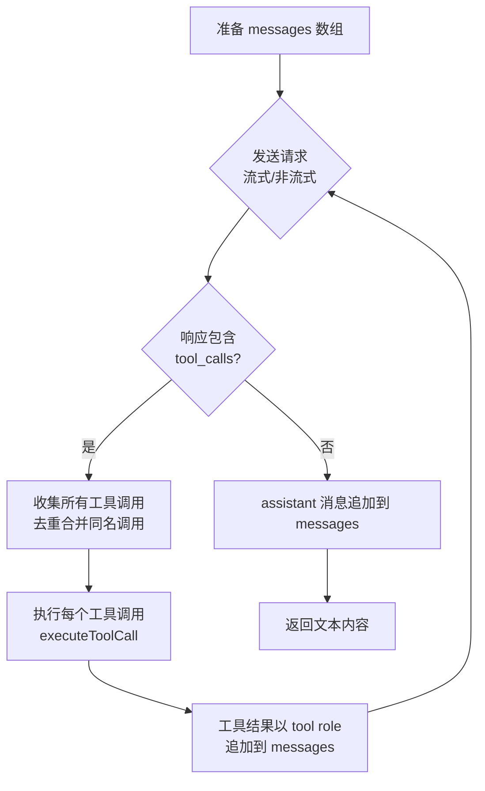

现在我已掌握全部代码细节，开始撰写页面。

# 生成管线：从大纲到页面的完整流程

生成管线是整个 `wiki-cli` 的核心价值所在——它接收一个代码仓库，经过两阶段的 LLM 驱动处理，产出结构化的 Wiki 文档集合。理解这条管线的设计，就等于理解了整个项目的本质。

## 两阶段架构

整个生成过程被严格划分为两个串行阶段，由 `generateCommand` 函数编排：

```
仓库目录 → [Phase 1: 大纲生成] → JSON 大纲文件 → [Phase 2: 页面生成] → .wiki/{timestamp}/ 中的 Markdown 文件 + index.json
```

两个阶段共享同一个核心机制——**工具循环**（Tool Loop），即 `collectFullResponse` 函数，它封装了 LLM 多轮调用的完整协议。但两个阶段在提示词结构、输出约束和独立性设计上存在本质差异。

[来源](src/commands/generate.ts#L47-L126)

---

## 工具循环：collectFullResponse 的协议设计

`collectFullResponse` 是生成管线最底层的 **LLM 通信引擎**，先理解它，再理解两阶段如何分别使用它。



该函数接受 `messages` 数组、`toolDefinitions`、`jsonMode` 标志和 `stream` 标志，内部最多迭代 30 轮（`maxToolIterations = 30`）。每轮处理逻辑如下：

1. **发送请求**：调用 `client.chatStream`（流式）或 `client.chat`（非流式），携带工具定义。
2. **收集响应**：流式模式下，逐 chunk 区分 `reasoning`、`content`、`tool_call`、`error` 四种类型，其中同名工具调用按 `index` 键去重合并（因流式 chunk 可能将同一工具调用的 arguments 分多次送达）。
3. **分支判断**：若无 `tool_calls`，则当前内容即为最终输出，追加 `assistant` 消息后返回；若有工具调用，则遍历执行 `executeToolCall`，并将结果以 `{ role: 'tool', tool_call_id, name, content }` 格式追加到 `messages` 数组，然后进入下一轮。

这种设计本质上是 **ReAct 模式**（Reasoning + Acting）的工程实现：LLM 输出推理文本和工具调用 → 系统执行工具 → 结果回注 → LLM 继续推理。循环持续直到 LLM 认为信息已足够，直接输出最终答案（而非工具调用）。

[来源](src/commands/generate.ts#L163-L268)

---

## Phase 1：大纲生成（generateOutline）

### 提示词结构

`generateOutline` 使用两段提示词：

- **系统提示**（`outline-system.md`）：注入 `workDir` 和 `os` 变量，定义 LLM 的角色（资深软件工程师兼技术文档专家），列出 8 个可用只读工具（`list_directory`、`list_files`、`read_file`、`search_in_files`、`git_log`、`git_show`、`git_remote_info`、`dotenv_template`），并提供分析框架（高层愿景 → 架构剖析 → 受众分析 → 输出 JSON）。
- **用户提示**（`outline-user.md`）：注入 `workDir`、`os`、`lang` 变量，指示 LLM "探索项目布局，阅读关键文件，按框架分析，输出 JSON"。

[来源](prompts/outline-system.md) | [来源](prompts/outline-user.md)

### 工具循环的触发

初始 `messages` 数组仅含 `system` 和 `user` 两条消息。LLM 的第一次响应几乎必然包含工具调用——因为它需要通过 8 个只读工具探索仓库。每次工具调用结果被注入后，LLM 继续推理，可能触发更多工具调用。本阶段的最大循环次数为 25 轮（`maxIterations = 25`），而非工具循环内部的 30 轮——两层循环形成双保险。

每轮结束后，`parseOutlineJson` 尝试从 LLM 的响应中解析出有效的 `Topic[]`。若成功，立即写入 `TEMP_DIR/_outline.json` 并返回结果；若失败，则将当前响应作为 `assistant` 消息追加到 `messages` 中继续下一轮。

[来源](src/commands/generate.ts#L127-L160)

### parseOutlineJson 的容错策略

```typescript
function parseOutlineJson(text: string): Topic[] {
  let cleaned = stripCodeFence(text);
  const jsonMatch = cleaned.match(/\{[\s\S]*\}/);
  if (!jsonMatch) return [];
  // ... JSON.parse + 字段提取
}
```

容错分三层：

1. **stripCodeFence**：移除 ` ```json ` 和 ` ``` ` 围栏标记，消除 LLM 最常见的多余修饰。正则：`/^```(?:json)?\s*\n?/gm` 匹配开头的围栏，`/\n?```\s*$/g` 匹配结尾围栏。若不存在围栏，原文本不变。
2. **正则提取 JSON 对象**：`/\{[\s\S]*\}/` 贪婪匹配第一个 `{` 到最后一个 `}`，从容应对 LLM 在 JSON 前后附加的解释文本（如 "Here is the result:\n\n{...}\n\nEnd."）。
3. **字段兼容**：遍历 `sections[i].topics[j]` 时，区分 `type === 'group'` 的目录分组与普通页面。对于普通页面，`description` 和 `task` 字段采用**回退链**：`description = item.description || item.brief || ''`，`task = item.task || item.brief || ''`。`brief` 是旧版单字段格式，新格式将其拆分为面向其他页面的 `description`（概括性简介）和面向本页生成 LLM 的 `task`（命令式指令）。`level` 默认为 `'中级'`。`slug` 通过 `toSlug(item.title)` 生成（中文保留、非字母数字符号转短横线、首尾修剪）[来源](src/utils/file.ts#L47-L53)。

[来源](src/commands/generate.ts#L240-L277) | [来源](src/ai/llm-client.ts#L52-L56) | [来源](tests/outline-parser.test.ts)

### 兜底机制

25 轮循环结束后若仍无有效 JSON，代码执行最终尝试 `parseOutlineJson(finalContent)`，将累积的最后一次响应内容作为最后机会。若仍失败，返回空数组，导致 `generateCommand` 以 `process.exit(1)` 终止。这意味着**零容错**——没有大纲就没有页面生成。

[来源](src/commands/generate.ts#L157-L160)

---

## Phase 2：页面生成（generatePages）

### 页面独立性设计

这是整个管线中最关键的设计决策：**每个页面的生成完全独立**。`generatePages` 为每个 `Topic` 构造隔离的提示词上下文：

```typescript
const pageSysVars = {
  workDir, os: osInfo,
  pageTitle: topic.title,
  audienceLevel: topic.level,
};
const pageUserVars = {
  workDir, pageTitle: topic.title,
  audienceLevel: topic.level,
  pageSlug: slug,
  projectSummary: '',
  lang: config.lang,
  availablePages,       // ← 所有其他页面的元信息
  pageTask: topic.task || '',
};
```

每个页面仅收到：
- **自身**的标题、难度级别、slug、任务描述（`topic.task`）
- **所有其他页面**的摘要元信息（`availablePages`），格式为 `- slug: xxx.md | 标题: xxx | 简介: xxx`——仅含标题和 80 字简介，不含内容
- **不依赖**任何其他页面的完整内容

这种设计带来了 **O(n) 的可并行性**：n 个页面可以完全并行生成，无需等待依赖。`generatePages` 通过 `runConcurrent` 函数实现信号量限流的并发控制，默认并发度 3（可配置 1-10）[来源](src/commands/generate.ts#L285-L348)。

### 断点续传的集成

在非重试模式下（`!options.retryList`），`generateOne` 在生成前检查 `TEMP_DIR/{slug}.md` 是否已存在，若存在则跳过。这与[断点续传与并行生成策略](断点续传与并行生成策略.md)中描述的 `TEMP_DIR` 检查点机制无缝集成。

### 失败重试

`generatePages` 返回失败页面列表 `Topic[]`，`generateCommand` 在主循环中处理重试——先自动重试（`opts.retry` 次），若仍有失败且非静默模式，进入交互式重试循环，由用户决定是否继续。重试时通过 `retryList` 参数只重新生成失败的页面，而非全部。

[来源](src/commands/generate.ts#L80-L100)

---

## Index 重建：generateIndex

页面生成完成后，`generateIndex` 从 `Topic[]` 数组中重建 `sections` 结构，写入 `index.json`：

```typescript
async function generateIndex(wikiDir: string, topics: Topic[]): Promise<void> {
  const sections = [...new Set(topics.map(t => t.section).filter(Boolean))];
  for (const section of sections) {
    const sectionTopics = topics.filter(t => t.section === section);
    // ... 按 Topic 原始顺序重组
  }
}
```

关键设计点：

1. **Section 去重保序**：`new Set(topics.map(...))` 利用 Set 的插入顺序特性，保证 sections 按在大纲中出现的第一顺序排列。
2. **Group 标记保留**：`isGroup` 标记在输出中恢复为 `{ type: 'group', title }` 格式，用于前端渲染分组标题。
3. **字段透传**：`description` 和 `task` 字段按存在性选择性地写入，`level` 和 `title` 始终写入。

生成的 `index.json` 与大纲阶段的 JSON 结构完全一致，作为前端浏览的导航数据源。详见[浏览命令：wiki-cli browse](浏览命令-wiki-cli-browse.md)。

[来源](src/commands/generate.ts#L350-L371)

---

## 全文数据流

```
generateCommand()
  │
  ├─ resolveWorkDir()          → 确定工作目录
  ├─ loadConfig()              → 加载 LLM 配置
  ├─ TEMP_DIR 检查             → 恢复/清除上一次的检查点
  │
  ├─ generateOutline()
  │    ├─ renderPrompt('outline-system.md')
  │    ├─ renderPrompt('outline-user.md')
  │    ├─ collectFullResponse()  ← 工具循环（最多 25 轮）
  │    │    ├─ LLM 调用 → 工具调用 → 执行 → 结果回注 → 循环
  │    │    └─ 每轮尝试 parseOutlineJson() 解析
  │    ├─ 写入 _outline.json
  │    └─ 返回 Topic[]
  │
  ├─ 用户交互：并行模式 & 并发度
  │
  ├─ generatePages()
  │    ├─ 为每个 Topic 构造独立提示词
  │    │    ├─ renderPrompt('page-system.md')
  │    │    └─ renderPrompt('page-user.md')
  │    ├─ 串行或并发执行（信号量限流）
  │    │    └─ collectFullResponse()  ← 每个页面独立工具循环
  │    ├─ 失败页面重试（自动 + 交互式）
  │    └─ 返回失败列表
  │
  ├─ moveDir(TEMP_DIR → .wiki/{timestamp})
  └─ generateIndex()
       └─ 从 Topic[] 重建 sections → 写入 index.json
```

整个管线从 `generateCommand` 的入口到最终的索引文件写入，所有阶段共享同一组基础设施——[LLM 客户端：流式通信与重试机制](llm-客户端-流式通信与重试机制.md)提供网络层，[提示词模板引擎：解耦的模板渲染](提示词模板引擎-解耦的模板渲染.md)提供提示词渲染，[工具系统：LLM 只读探索工具的设计](工具系统-llm-只读探索工具的设计.md)提供工具执行，[文件系统工具集](文件系统工具集.md)提供持久化。