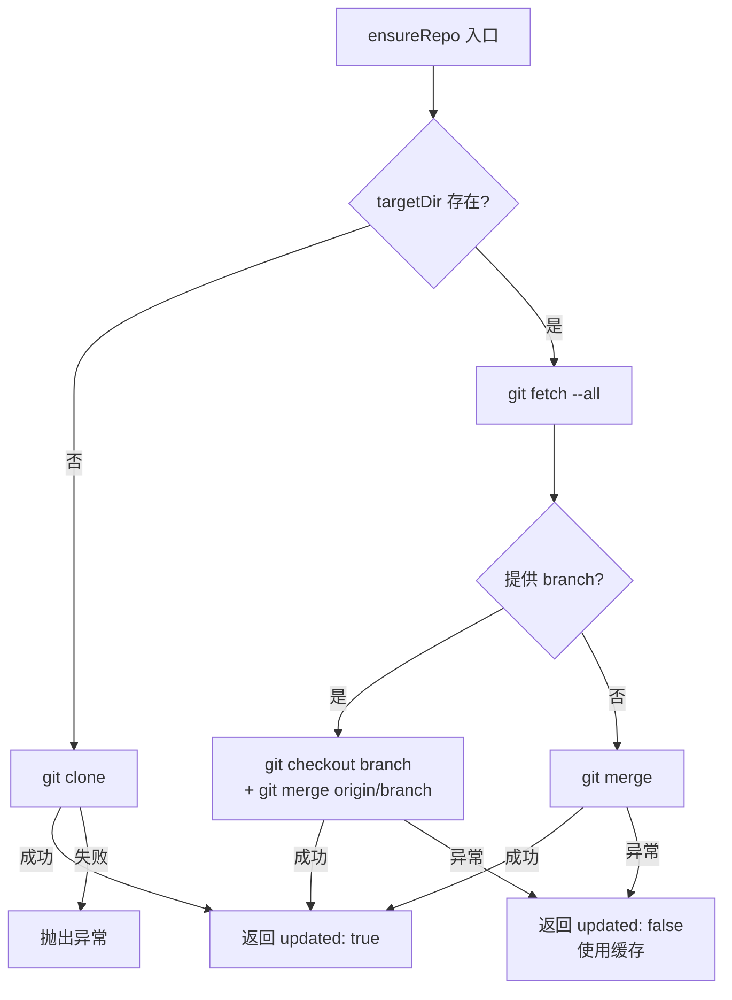

# 远程仓库支持：Git 集成细节

当你使用 `--url` 参数时，wiki-cli 会自动从远程 Git 仓库克隆代码，然后进行分析或对话。这层集成由两个模块协作完成：`src/utils/git.ts` 提供核心的 **ensureRepo** 函数，`src/utils/workspace.ts` 负责目录决议与生命周期管理。本文深入拆解它们的设计。

## 三条路径：ensureRepo 的三种场景

`ensureRepo(url, targetDir, branch?, depth?)` 是 Git 操作的单一入口，返回 `{ updated: boolean }`。它的逻辑按 **目标目录是否存在** 分叉为两条主路径，其中"已存在"路径再按网络可用性分叉为两种子情形。

**场景一：全新克隆（目录不存在）**

当 `targetDir` 在本地不存在时，直接执行 `git clone`。命令构造考虑了可选的两个参数：

- `depth` → `--depth <n>`：浅克隆，只拉取最新 N 次提交，加速大仓库操作。
- `branch` → `--branch <name>`：指定克隆的分支。

命令字符串经过 `replace(/\s+/g, ' ').trim()` 归一化，避免空标志产生多余空格。克隆失败直接抛出异常。

```typescript
const cmd = `git clone ${depthFlag} ${branchFlag} ${url} "${targetDir}"`
    .replace(/\s+/g, ' ').trim();
execSync(cmd, { stdio: 'inherit' });
```

[来源](src/utils/git.ts#L25-L29)

**场景二：已有仓库更新（目录存在，网络可达）**

如果 `targetDir` 已存在（例如上次克隆的持久缓存），执行三步更新：

1. `git fetch --all` — 拉取所有远程分支的最新引用。
2. `git checkout <branch>` — 切换到指定分支（如果提供了 `branch`），否则跳过。
3. `git merge origin/<branch>` 或 `git merge` — 将远程分支合并到当前分支。

这保证了本地缓存在不断更新，而无需每次重新克隆整个仓库。

[来源](src/utils/git.ts#L13-L21)

**场景三：缓存回退（目录存在，网络不可用）**

`fetch` 或后续操作如果抛出异常（网络超时、DNS 解析失败等），整个更新操作被 `try/catch` 包裹。捕获异常后仅记录一条警告信息：

```
Network unavailable, using cached repo at ${targetDir}
```

然后返回 `{ updated: false }`。调用方据此可知当前仓库是旧版本，但不中断工作流——缓存目录中的代码仍然可用。

[来源](src/utils/git.ts#L22-L24)



## URL 到目录名的转换

`urlToDirName(url)` 是一个纯字符串变换函数，将 Git URL 映射为[文件系统友好的目录名](src/utils/workspace.ts#L16-L20)：

```
https://github.com/Epheia/wiki-cli.git
  → 去除 https://
  → 去除 .git 后缀
  → 将 / 和 : 替换为 -
  → github.com-Epheia-wiki-cli
```

三个变换依次为：

| 步骤 | 正则 | 示例效果 |
|------|------|----------|
| 去掉协议 | `replace(/^https?:\/\//, '')` | `github.com/Epheia/wiki-cli.git` |
| 去掉 `.git` | `replace(/\.git$/, '')` | `github.com/Epheia/wiki-cli` |
| 分隔符替换 | `replace(/[\/:]/g, '-')` | `github.com-Epheia-wiki-cli` |

结果作为持久缓存目录的子目录名：`~/.wiki-cli/repos/github.com-Epheia-wiki-cli`。

[来源](src/utils/workspace.ts#L16-L25)

## 临时模式 vs 持久缓存

`resolveWorkDir()` 根据 `--temp` 和 `--output` 两个标志决定目标目录，形成三种路径：

| 条件 | 目标目录 | 生命周期 | 清理行为 |
|------|----------|----------|----------|
| `--temp` | `os.tmpdir()/wiki-cli-XXXXXX` | 临时 | 任务完成后 `rm -rf` |
| `--output <path>` | 用户指定的路径 | 用户管理 | 无自动清理 |
| 默认（无 `-t`、无 `-o`） | `~/.wiki-cli/repos/<url-dir>` | 持久缓存 | 无自动清理，可复用 |

**临时模式**使用 `mkdtempSync` 在系统临时目录创建唯一子目录，任务结束（`generate` 或 `ai` 命令完成）后执行 `cleanup` 删除整个目录树。适合一次性分析不打算保留的仓库。

**持久缓存模式**的目录位于 `~/.wiki-cli/repos/`，由 `urlToDirName` 导出的名称保持稳定。第二次对同一 URL 运行 `--url` 且不带 `-t` 时，`ensureRepo` 会命中"场景二"进行增量更新而非重新克隆。

[来源](src/utils/workspace.ts#L32-L68)

## `--url` 相关选项交互矩阵

`wiki-cli generate` 和 `wiki-cli ai` 两条命令共享同一套 `--url` 选项组。所有选项在 [src/cli.ts](src/cli.ts#L38-L49) 和 [src/cli.ts](src/cli.ts#L88-L97) 中注册，经 `resolveWorkDir` 统一处理。

```
wiki-cli generate --url <url> [-o <path>] [-b <branch>] [-d <depth>] [-t]
wiki-cli ai      --url <url> [-o <path>] [-b <branch>] [-d <depth>] [-t]
```

| 选项 | 别名 | 类型 | 传递目标 | 必须 | 说明 |
|------|------|------|----------|------|------|
| `--url` | `-u` | `string` | `ensureRepo(url)` | 触发 | 远程仓库地址，存在此选项才进入 Git 流程 |
| `--output` | `-o` | `string` | → `targetDir = resolve(output)` | 否 | 显式指定克隆目标路径，覆盖默认缓存目录 |
| `--branch` | `-b` | `string` | `ensureRepo(url, dir, branch)` | 否 | 分支名，克隆/更新时均生效 |
| `--depth` | `-d` | `number` | `ensureRepo(url, dir, branch, depth)` | 否 | 浅克隆深度，大仓库加速 |
| `--temp` | `-t` | `boolean` | → `mkdtempSync(...)` | 否 | 临时模式，完成后清理 |

**组合规则**：

- `--url` 与 `--dir`（`-C`）**互斥**。同时提供时 `resolveWorkDir` 优先处理 `--url`，忽略 `--dir`。[来源](src/utils/workspace.ts#L32-L33)
- `--output` 仅在 `--url` 存在时有效，否则不被使用。
- `--temp` 覆盖 `--output` 和默认缓存——若同时提供 `--temp` 和 `--output`，`--output` 被忽略，走临时目录。
- `--branch` 和 `--depth` 仅影响 Git 操作，不影响目录决议。

## 工作流程总览

```
用户输入 --url
       ↓
resolveWorkDir()  ──判断是否 --temp / --output / 默认
       ↓
创建目标目录（如果需要）
       ↓
ensureRepo() ──目录不存在？→ git clone
              ──目录存在？  → git fetch + checkout + merge
              ──网络失败？  → 缓存回退
       ↓
process.chdir(targetDir)
       ↓
执行 generate / ai 逻辑
       ↓
如果 --temp → cleanup() 删除临时目录
```

[来源](src/utils/workspace.ts#L30-L68)

## 下一步

- 了解 `resolveWorkDir` 如何与 `generate` 和 `ai` 命令集成，参见 [生成命令：wiki-cli generate](生成命令-wiki-cli-generate.md) 和 [AI 交互命令：wiki-cli ai](ai-交互命令-wiki-cli-ai.md)。
- 整体模块划分参见 [整体架构与模块划分](整体架构与模块划分.md)。
- 断点续传机制参见 [断点续传与重试机制](断点续传与重试机制.md)。