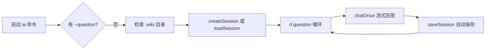

现在我已经掌握了所有必要信息，开始编写页面。

# AI 问答命令详解

`wiki-cli ai` 是四条核心命令中唯一支持**双向对话**的命令——你不是在触发一个固定流程，而是在和 LLM 就代码库展开问答。它支持三种使用方式、一套完整的斜杠命令系统，以及流式输出中的安全打断机制。

---

## 三种使用方式

### 1. 交互模式——`rl.question` 循环

不带任何参数直接启动，进入持续对话的交互 Shell：

```bash
wiki-cli ai
```

终端出现绿色 `You >` 提示符，这是由 `node:readline/promises` 的 `createInterface` 创建的输入循环 [来源](src/commands/ai.ts#L186-L188)。每次输入后，系统调用 `chatOnce()` 处理对话（含工具调用的多轮循环），对话结束后自动保存会话，然后等待下一次输入，直到用户键入 `/exit` 或 `Ctrl+C` 退出。



交互模式下每轮对话都会调用 `saveSession()` 写盘，这意味着即使进程因意外崩溃，最多也只丢失**当前正在回答的这一轮**对话 [来源](src/commands/ai.ts#L265-L280)。如果项目还没有 Wiki，启动时会先询问「要先生成吗？(Y/n)」——选 Y 则先调用 `generateCommand()` 生成文档再进入问答 [来源](src/commands/ai.ts#L51-L63]。

---

### 2. 一次性模式——`--answer-only`

通过在 `--question` 基础上叠加 `--answer-only`（简写 `-a`），命令执行一次问答后直接退出，且输出**仅包含纯文本答案**：

```bash
wiki-cli ai --question "这个项目用了什么框架？" --answer-only
wiki-cli ai -q "这个项目用了什么框架？" -a    # 简写等效
```

内部走的是 `answerOnly()` 函数，与交互模式的 `chatOnce()` 有两个关键区别 [来源](src/commands/ai.ts#L103-L108]：

| 特性 | `chatOnce()` | `answerOnly()` |
|---|---|---|
| 传输方式 | 流式（SSE 逐 chunk） | 非流式（一次性 await） |
| 终端输出 | 逐字渲染，显示推理过程 | 仅在函数返回后打印结果 |
| 打断能力 | 支持 `Ctrl+C` 打断 | 不支持中途打断 |
| 适用场景 | 交互对话 | 脚本调用、管道输出 |

两种函数都支持工具调用的多轮循环（上限 50 轮），工具调用结果自动注入消息列表，对用户完全透明 [来源](src/commands/ai.ts#L113-L139)。

---

### 3. 会话恢复——`--session`

`--session` 参数让对话可以跨越多个终端会话。你需要的是**会话 ID**——一个 8 字符的短标识符（如 `a1b2c3d4`）：

```bash
wiki-cli ai --session a1b2c3d4
```

实现机制 [来源](src/commands/ai.ts#L93-L100)：

```typescript
// ① 从磁盘加载指定 ID 的会话
const existing = await loadSession(options.session);
// ② 用已存储的消息替换当前消息列表，但保留当前 system prompt
messages = [
  { role: 'system', content: systemPrompt },  // 当前上下文
  ...session.messages.slice(1)                // 历史对话
];
```

这里的精妙之处在于 **system prompt 与会话历史解耦**：system prompt 绑定了当前工作目录、OS 信息、Wiki 状态等**运行环境变量**，属于执行上下文而非对话内容；`messages.slice(1)` 保留了历史问答。这意味着你可以在不同工作目录下恢复同一段对话，每次的 system prompt 都会根据当前环境重新生成。

退出交互模式时，终端会提示下一次恢复的命令 [来源](src/commands/ai.ts#L325-L328)：

```
✓ 会话已保存 (a1b2c3d4)
to continue, run: wiki-cli ai --session a1b2c3d4
```

除此之外，`--list-sessions` 参数列出所有已保存会话的概览表格，`--delete-session <id>` 删除指定会话 [来源](src/commands/ai.ts#L28-L38)。

---

## 斜杠命令速查表

交互模式下，所有以 `/` 开头的输入被识别为命令，由 `interactiveLoop()` 内部的命令调度器处理 [来源](src/commands/ai.ts#L195-L260]。

| 命令 | 功能 | 说明 |
|---|---|---|
| `/help` | 显示所有斜杠命令列表 | 内置纯文本帮助 |
| `/exit` 或 `/quit` | 保存当前会话后退出 | 退出前自动调用 `saveSession()` |
| `/save` | 手动保存当前会话 | 每轮对话已自动保存，此命令用于显式触发 |
| `/clear` | 清屏 | 调用 `console.clear()` |
| `/session` | 显示当前会话 ID 和摘要 | 格式：`当前会话: a1b2c3d4 (摘要)` |
| `/sessions` | 列出所有会话 | 调用 `listSessions()` + `showSessionsTable()` |
| `/switch <id>` | 切换至指定 ID 的会话 | 先保存当前 → 加载目标 → 保留 system prompt |
| `/new` | 新建会话 | 先保存当前 → 创建新空会话 |
| `/undo` | 撤回上一条用户消息及其之后的全部消息 | 从 `messages` 数组末尾向前查找最后一个 `role: 'user'`，截断其后所有内容 |
| `/wiki` | 调用生成命令生成 Wiki 文档 | 动态 `import('./generate.js')`，不中断当前会话状态 |

`/undo` 的实现值得注意——它不是简单的弹出最后一条消息，而是**找到最后一个用户消息的索引，截断从该索引开始之后的所有消息**。这意味着如果 LLM 返回了工具调用链（多轮 assistant + tool 消息），`/undo` 会一次撤回整个对话轮次，而不仅仅是最后一句 [来源](src/commands/ai.ts#L211-L220]。

`/switch` 和 `/new` 都遵循「先保存旧会话 → 再操作新会话 → 保留 system prompt」的三段式流程，保证任何切换操作都不会丢失对话历史 [来源](src/commands/ai.ts#L236-L255]。

---

## Ctrl+C 打断流式输出

交互模式下，当 LLM 正在流式生成回答时（即 `chatOnce()` 运行期间），按下 `Ctrl+C` 可以**立即中断**输出，而不是终止整个进程。

实现机制由 `SIGINT` 信号处理器 + `isCancelled` 回调函数构成 [来源](src/commands/ai.ts#L269-L275)：

```typescript
let streamingCancelled = false;

// ① 注册 SIGINT 处理器：将标志位置为 true
const sigHandler = () => { streamingCancelled = true; };
process.on('SIGINT', sigHandler);

try {
  // ② 将 isCancelled 回调传入 chatOnce
  await chatOnce(client, messages, tools, input, () => streamingCancelled);
} finally {
  // ③ 无论正常结束还是异常退出，都移除处理器
  process.removeListener('SIGINT', sigHandler);
}
```

整个流程分三层防守：

**第一层：`chatOnce()` 的流式循环**。每次从 `streamIter` 获取新 chunk 之后，立即检查 `isCancelled?.()` [来源](src/commands/ai.ts#L130-L135)：

```typescript
if (isCancelled?.()) {
  // 将当前已累积的内容存入消息列表
  messages.push({ role: 'assistant', content: currentContent || null });
  console.log(chalk.dim('\n⏹ (interrupted)'));
  return currentContent || null;
}
```

**第二层：`chatOnce()` 的工具调用循环**。即使在流接收阶段没有触发打断，下一次迭代开始之前也会再次检查 `isCancelled?.()` [来源](src/commands/ai.ts#L119-L121)。这意味着打断可以发生在「LLM 返回了工具调用，但工具尚未执行」的时刻。

**第三层：`interactiveLoop()` 的 `rl.question` 调用**。如果打断发生在等待用户输入时，`readline` 的 `question` 方法会抛异常，被外层 `try/catch` 捕获后调用 `exitSession()` 保存并退出 [来源](src/commands/ai.ts#L190-L194)。

打断后，当前已生成的内容会被保留到消息列表并保存到磁盘，下次恢复会话时可以继续——你不会因为一次打断而丢失整个对话的上下文。

---

## 会话的 CRUD 生命周期

会话数据的管理位于 `src/ai/ai-session.ts`，采用**每个会话一个 JSON 文件**的极简持久化方案 [来源](src/ai/ai-session.ts#L1-L90)。

### 数据模型

```typescript
interface Session {
  id: string;          // 8 字符 UUID 前缀，如 "a1b2c3d4"
  created: string;     // ISO 8601 创建时间戳
  updated: string;     // ISO 8601 更新时间戳（每次保存自动刷新）
  summary: string;     // 摘要，默认 "新会话"，每次对话后取首条用户消息前 60 字符
  messages: ChatMessage[];  // 完整的对话消息数组
}
```

文件存储在 `.wiki/sessions/` 目录，每会话对应一个 `{id}.json` 文件 [来源](src/ai/ai-session.ts#L16-L18)。目录在首次调用 `createSession()` 或 `saveSession()` 时自动创建。

### CRUD 函数

| 操作 | 函数 | 核心逻辑 | 来源 |
|---|---|---|---|
| **创建** | `createSession()` | 生成 8 位 ID → 构建 Session 对象 → 写入文件 | [来源](src/ai/ai-session.ts#L28-L33) |
| **读取** | `loadSession(id)` | 读取文件 → `JSON.parse` → 返回 `Session \| null` | [来源](src/ai/ai-session.ts#L55-L60) |
| **更新** | `saveSession(session)` | 更新 `updated` 时间戳 → 覆写文件 | [来源](src/ai/ai-session.ts#L62-L65) |
| **删除** | `deleteSession(id)` | 删除文件 → 返回布尔值 | [来源](src/ai/ai-session.ts#L67-L70) |
| **列表** | `listSessions()` | 遍历目录 → 读取元数据 → 按 `updated` 降序排列 | [来源](src/ai/ai-session.ts#L35-L53) |

`listSessions()` 的一个细节值得注意：它只读取每个文件的 `id`、`created`、`updated`、`summary` 四个字段，**不加载完整的 `messages` 数组**，因此即使会话历史很长，列表查询也始终是轻量的 [来源](src/ai/ai-session.ts#L40-L41)。对于损坏的 JSON 文件（比如手动编辑导致语法错误），它会静默跳过，不影响其他会话的访问 [来源](src/ai/ai-session.ts#L45-L46)。

### 在 ai 命令中的完整生命周期

```
┌─────────────────────────────────────────────────┐
│  启动                                             │
│  ├─ 有 --session → loadSession(id)               │
│  └─ 无 --session → createSession()               │
│                                                   │
│  对话中                                           │
│  ├─ 每轮 chatOnce 结束后 → saveSession()          │
│  ├─ /save 手动触发 → saveSession()                │
│  ├─ /switch → saveSession(旧) + loadSession(新)   │
│  └─ /new    → saveSession(旧) + createSession()   │
│                                                   │
│  退出                                             │
│  ├─ /exit /quit → saveSession() + 打印恢复命令    │
│  └─ Ctrl+C 中断 → exitSession() → saveSession()   │
└─────────────────────────────────────────────────┘
```

交互模式下，`session.messages` 始终保存 `messages.slice(1)`——即排除 system prompt 后的用户可见消息。system prompt 由 `aiCommand()` 的运行时上下文动态构建，不属于任何会话的持久化内容 [来源](src/commands/ai.ts#L265-L280)。

---

## 推荐阅读

- [会话管理系统](会话管理系统.md) —— 深入了解会话的持久化格式和文件组织
- [LLM 客户端设计与流式通信](llm-客户端设计与流式通信.md) —— 理解 `chatOnce()` 底层依赖的流式 SSE 解析和自动重试
- [Prompt 模板系统](prompt-模板系统.md) —— 了解 `ai-system.md` 模板的加载、渲染和变量注入
- [配置命令详解](配置命令详解.md) —— 在进入 AI 问答前，必须先完成 LLM 配置