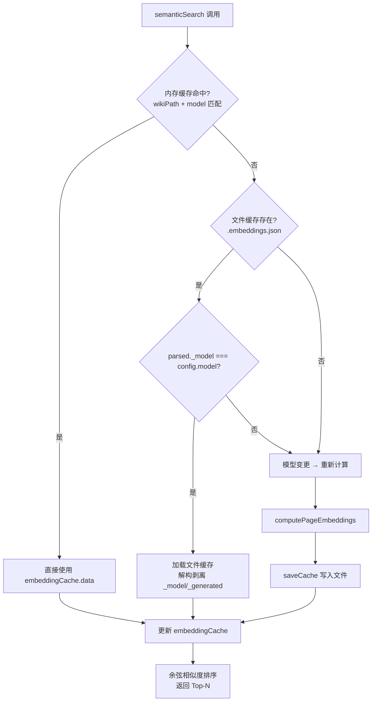

# Embedding 缓存与语义搜索

## 问题：每次搜索都调用 API？

Embedding 向量的计算成本高昂——一次 API 调用可能消耗数百 token，一个中等规模的 Wiki 动辄数十页。如果每次 `semantic_search` 工具调用都重新计算所有页面的嵌入向量，延迟和费用都将不可接受。解决方案是一个**三层缓存架构**：内存 → 文件 → 重新计算，配合模型版本校验确保缓存一致性。

[来源](src/ai/embeddings.ts#L1-L138)

---

## 数据结构：带版本标记的缓存

```typescript
interface CacheData {
  _model: string;
  _generated: string;
  [slug: string]: number[] | string;
}
```

`_model` 记录生成缓存时使用的模型名称（如 `text-embedding-3-small`），`_generated` 记录时间戳。这两个元数据字段是缓存的**版本锁**——文件缓存的有效性完全取决于 `_model` 是否与当前配置匹配。动态键名为页面 slug，值为对应的嵌入向量数组。

```typescript
let embeddingCache: { data: Record<string, number[]>; model: string; wikiPath: string } | null = null;
```

内存缓存 `embeddingCache` 是模块级私有变量，同时记录 `model` 和 `wikiPath`，确保切换工作目录或更改模型时自动失效。

[来源](src/ai/embeddings.ts#L16-L20)

---

## 三次缓存命中流程

`semanticSearch` 函数按照**最快优先**的策略逐级尝试，路径如下：



### 第一层：内存缓存

```typescript
if (embeddingCache && embeddingCache.wikiPath === wikiPath && embeddingCache.model === config.model) {
  pageEmbs = embeddingCache.data;
}
```

**条件**：`embeddingCache` 非空，且 `wikiPath` 与 `model` 同时匹配。这意味着即使在同一工作目录下更换了 Embedding 模型，内存缓存也会自动失效——不会返回旧模型产生的向量。这是最快的路径，零 I/O。

### 第二层：文件缓存

```typescript
else if (existsSync(cachePath)) {
  const parsed = JSON.parse(raw) as CacheData;
  if (parsed._model === config.model) {
    const { _model, _generated, ...embeddings } = parsed;
    pageEmbs = embeddings as Record<string, number[]>;
  }
}
```

文件路径为 `<wikiPath>/.embeddings.json`。读取后用 `_model` 字段校验版本——如果与当前配置的模型一致，则通过解构剥离元数据字段，得到纯向量字典。不一致则降级到重新计算。

### 第三层：重新计算

若两层缓存均未命中，调用 `computePageEmbeddings` 为每个页面生成嵌入，然后用 `saveCache` 同时写入文件并更新内存缓存。

[来源](src/ai/embeddings.ts#L86-L115)

---

## 分页策略：`content.slice(0, 8000)`

```typescript
result[slug] = await getEmbedding(content.slice(0, 8000), config);
```

`computePageEmbeddings` 对每个 `.md` 文件只取前 8000 字符。这一截断基于两个考量：

1. **Token 限制**：大多数 Embedding 模型有输入长度上限（如 OpenAI 的 `text-embedding-3-small` 为 8191 token）。8000 字符约合 2000-3000 token，留出足够的安全余量。
2. **语义覆盖**：Wiki 页面前 8000 字符通常包含标题、摘要和关键段落，足以构建有区分度的语义表示。深层细节的丢失对相似度排序影响有限。

[来源](src/ai/embeddings.ts#L50-L64)

---

## 缓存持久化的时间戳格式

`saveCache` 函数生成 `_generated` 字段的代码是内联的，且与 `src/utils/file.ts` 中的 `getTimestamp()` 函数采用**完全相同的格式**：

```
2024-06-15T14-30-45
```

关键设计细节：用 `-` 替代标准 ISO 8601 中的 `:` 作为时分秒分隔符。原因是冒号在 Windows 文件路径中是非法字符——虽然 `_generated` 是 JSON 字段而非文件名，但统一格式便于在文件名场景复用。

```typescript
const data: CacheData = {
  _model: model,
  _generated: (() => {
    const d = new Date();
    return `${d.getFullYear()}-${String(d.getMonth()+1).padStart(2,'0')}-${String(d.getDate()).padStart(2,'0')}T${String(d.getHours()).padStart(2,'0')}-${String(d.getMinutes()).padStart(2,'0')}-${String(d.getSeconds()).padStart(2,'0')}`;
  })(),
  ...embeddings,
};
```

写入使用 `JSON.stringify` 全量覆写 `.embeddings.json` 文件，采用 `try/catch` 静默处理失败——缓存写入被认为是非关键操作。

[来源](src/ai/embeddings.ts#L127-L136)

---

## 工具系统集成

`s`emanticSearch` 通过 `src/ai/tools.ts` 中的工具处理函数暴露给 LLM：

```typescript
semantic_search: (args) => semanticSearch(args.query, args.max_results),
```

这使其成为 `executeToolCall` 路由表中的第 13 个工具。调用链路为：LLM 选择 `semantic_search` 工具 → `executeToolCall` 路由 → `semanticSearch(query, maxResults)` → 动态导入 `./embeddings.js` 的 `semanticSearch` → 执行三层缓存逻辑。

值得注意的是，工具层额外做了一层**标题映射**：搜索结果中的 slug 通过 `index.json` 的解析转换为可读标题，提升 LLM 消费结果时的可理解性。

[来源](src/ai/tools.ts#L540-L663)

---

## 缓存清理

```typescript
export function clearEmbeddingCache(): void {
  embeddingCache = null;
}
```

将内存缓存置为 `null`，下次调用 `semanticSearch` 时会跳过第一层，直接从文件缓存或重新计算获取。此函数可用于配置变更后的缓存刷新场景。

[来源](src/ai/embeddings.ts#L137-L139)

---

## 推荐阅读

- [Embedding 语义搜索配置](embedding-语义搜索配置.md) — 如何配置 Embedding 提供商、模型与 API Key
- [工具系统：12 个只读工具](工具系统-12-个只读工具.md) — `semantic_search` 在 14 个工具中的定位与调度
- [LLM 提供商与模型](llm-提供商与模型.md) — 支持的 Embedding 模型列表与兼容性
- [项目架构全景](项目架构全景.md) — AI 层在整个项目中的位置