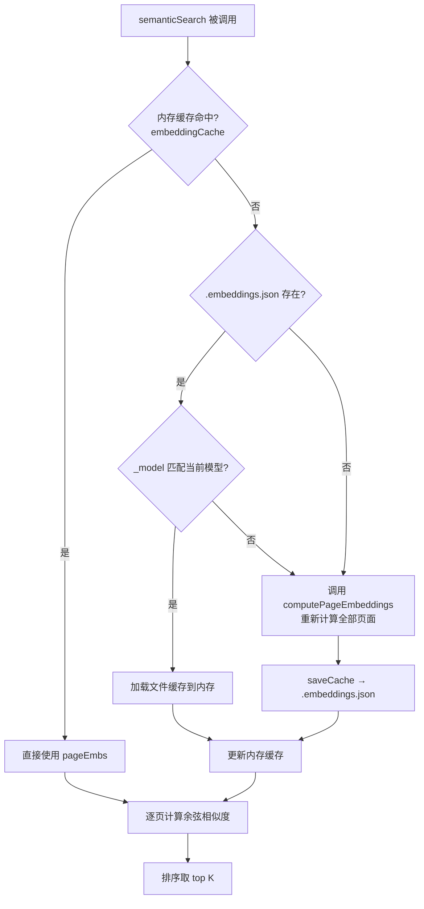

现在我已获取所有必要的源代码信息，可以撰写页面了。

---

# Embedding 语义搜索配置

语义搜索是 Wiki CLI 区别于传统关键词搜索的核心能力：它用 **向量嵌入（Embedding）** 表征每个页面的语义，然后基于 **余弦相似度** 找出与查询意图最匹配的页面。整个系统从配置、计算、缓存到 API 网关，全部集成在 300 行代码内。

## Embedding 提供商与模型一览

Wiki CLI 内置了 **6 个提供商、9 个模型**，定义在 `EMBEDDING_MODELS` 常量数组中：

| 提供商 | 模型 | 维度 | 定价参考 (Pricing Hint) | 定位 |
|--------|------|------|-------------------------|------|
| OpenAI | `text-embedding-3-large` | 3072 | ~$0.13/MT | 最佳通用，MTEB ~64.6 |
| OpenAI | `text-embedding-3-small` | 1536 | ~$0.02/MT | 日常 RAG 首选，性价比高 |
| OpenAI | `text-embedding-ada-002` | 1536 | ~$0.10/MT | 遗留模型，建议迁移 |
| Google Gemini | `gemini-embedding-2` | 3072 | ~$0.006–0.15/MT | MTEB 领先，支持跨模态 |
| Cohere | `embed-v4` | 4096 | ~$0.10/MT | 100+ 语言多语言旗舰 |
| Voyage AI | `voyage-4-large` | 2048 | ~$0.12/MT | 代码/技术文档最佳 |
| Voyage AI | `voyage-4-lite` | 2048 | ~$0.02/MT | 高吞吐轻量版 |
| Jina AI | `jina-embeddings-v3` | 1024 | ~$0.02/MT | 长上下文/多语言 |
| Mistral | `mistral-embed` | 1024 | ~$0.10/MT | Mistral 官方嵌入 |

**维度** 直接决定了向量的信息密度和存储成本：3072 维向量比 1024 维携带更丰富的语义信息，但计算余弦相似度时开销也更大。`pricingHint` 中的 "MT" 指 **百万 Token**（Million Tokens），是 Embedding API 的通用计价单位。

[来源](src/config/config-store.ts#L22-L39)

每个模型都有对应的 `baseUrl`，指向各提供商的 REST API 端点。系统会向 `${baseUrl}/embeddings` 发送 POST 请求，携带 `model` 和 `input` 参数。[来源](src/ai/embeddings.ts#L30-L45)

## 配置流程

Embedding 配置是 [配置命令详解](配置命令详解.md) 中的独立环节。在 `config.ts` 中，当用户选择启用 Embedding 后，系统会：

1. 调用 `getEmbeddingProviders()` 从 `EMBEDDING_MODELS` 提取去重提供商列表
2. 用户选择提供商后，调用 `getEmbeddingModelsByProvider(provider)` 过滤出该提供商下的模型
3. 用户选择模型，系统自动填充 `baseUrl`
4. 用户输入 API Key（默认回退到 LLM 配置中的主 API Key）

[来源](src/commands/config.ts#L140-L201)

四组配置字段保存到 `~/.wiki-cli/config.json` 的对应键：

```
embeddingProvider → embeddingModel → embeddingBaseUrl → embeddingApiKey
```

当需要对接不在内置列表中的服务时，选择 **Custom** 提供商，手动输入 Base URL 和模型名称。[来源](src/config/config-store.ts#L4-L16)

## 三层缓存架构

每次语义搜索都需要先计算所有 Wiki 页面的向量。为避免重复调用 Embedding API（既花钱又耗时），系统设计了三层缓存：



**第一层：内存缓存（最快）**

`embeddingCache` 是一个模块级变量，缓存了当前 `wikiPath` + `model` 组合下的所有页面向量：

```
embeddingCache = { data: Record<string, number[]>, model: string, wikiPath: string } | null
```

命中条件：`wikiPath` 和 `model` 同时匹配，跳过所有 I/O。[来源](src/ai/embeddings.ts#L86-L87)

**第二层：文件缓存（.embeddings.json）**

存储在 Wiki 目录根下的 `.embeddings.json` 文件，结构如下：

```json
{
  "_model": "text-embedding-3-small",
  "_generated": "2025-01-15T10-30-45",
  "概览": [0.0123, -0.0456, ...],
  "快速开始": [0.0789, 0.0123, ...],
  ...
}
```

- `_model`：**版本锁**，标识这批向量由哪个模型生成
- `_generated`：生成时间戳，用于调试和追溯
- 其余字段：`slug → 向量` 的映射

当模型切换时（用户修改配置并重新生成），`_model` 不匹配，文件缓存被视为过期，自动重新计算。[来源](src/ai/embeddings.ts#L93-L105)

**第三层：API 调用（最终保底）**

`computePageEmbeddings` 按需调用 Embedding API。它遍历所有 Markdown 文件，截取前 **8000 字符** 发送给 `/embeddings` 端点，跳过失败页面。这是唯一产生 API 费用的路径。[来源](src/ai/embeddings.ts#L52-L67)

### clearEmbeddingCache()

```typescript
export function clearEmbeddingCache(): void {
  embeddingCache = null;
}
```

这个函数将内存缓存置空，强制下次 `semanticSearch` 从 `.embeddings.json` 文件重新加载。它在模块导出中暴露，供外部调用方（如测试环境或配置变更时）使用。[来源](src/ai/embeddings.ts#L137-L139)

## 核心算法：余弦相似度

```typescript
function cosineSimilarity(a: number[], b: number[]): number {
  let dot = 0, na = 0, nb = 0;
  for (let i = 0; i < a.length; i++) {
    dot += a[i] * b[i];
    na += a[i] * a[i];
    nb += b[i] * b[i];
  }
  return dot / (Math.sqrt(na) * Math.sqrt(nb));
}
```

这是向量的余弦相似度 **单次扫描实现**：一次循环同时计算点积（dot）和两个向量的 L2 范数平方（na, nb），最后做一次除法。返回值范围 `[-1, 1]`，越接近 1 表示语义越接近。

注意这里没有对零向量做保护——如果某个页面向量全为零（极不可能发生），除数为零会导致 `Infinity`。但在实际使用中，Embedding API 返回的向量不可能为零向量。[来源](src/ai/embeddings.ts#L16-L23)

## semanticSearch 完整执行流程

```
semanticSearch(query, wikiPath, config, pageFiles, maxResults=5)
```

1. **计算查询向量**：调用 `getEmbedding(query, config)` 获取查询文本的向量 `queryEmb`
2. **加载页面向量**：走三层缓存逻辑（内存 → 文件 → API），得到 `pageEmbs: Record<string, number[]>`
3. **更新内存缓存**：将 `pageEmbs` 写入 `embeddingCache`
4. **逐页评分**：遍历 `pageEmbs`，每页计算 `cosineSimilarity(queryEmb, emb)`
5. **排序截取**：按 score 降序排列，取前 `maxResults` 条

返回结果类型：

```typescript
interface SearchResult {
  slug: string;   // 页面标识
  score: number;  // 余弦相似度 (0~1)
}
```

[来源](src/ai/embeddings.ts#L76-L131)

## 作为工具集成到 AI 问答

`sematic_search` 是 [工具系统：12 个只读工具](工具系统-12-个只读工具.md) 中的第 11 个工具，提供给 LLM 在对话中调用：

```typescript
{
  name: 'semantic_search',
  description: 'Semantic search across Wiki using embeddings (if configured). Use when keyword search fails or for conceptual questions.',
  parameters: {
    query: { type: 'string', description: 'Search query' },
    max_results: { type: 'number', description: 'Maximum results (default 5)', nullable: true }
  }
}
```

在 `tools.ts` 中，`semanticSearch` 函数的调用栈如下：

1. 校验 `embeddingConfig` 是否已配置，未配置则返回错误信息
2. 调用 `findLatestWikiDir()` 定位最新的 Wiki 目录
3. 扫描目录下所有 `.md` 文件（排除 `index.md`），按文件名排序
4. 动态导入 `./embeddings.js` 中的 `semanticSearch` 函数
5. 从 `index.json` 中加载页面标题映射，将返回的 slug 转为可读标题
6. 将搜索结果拼装为 `ToolResult` 返回给 LLM

[来源](src/ai/tools.ts#L540-L560)

## 配置调优建议

- **日常编辑/问答**：`text-embedding-3-small`（1536 维，$0.02/MT）性价比最高，维度过高对短查询反而有噪音
- **中文+英文混合文档**：`jina-embeddings-v3`（1024 维）或 `embed-v4`（4096 维），多语言覆盖好
- **纯代码/技术文档**：`voyage-4-large`（2048 维），专门针对代码语义优化
- **海量页面（>100 页）**：优先选择维度较低的模型（1024 维），缓存体积更小、余弦相似度计算更快

## 推荐阅读

- [配置命令详解](配置命令详解.md) —— 完整了解 Embedding 在交互式配置中的位置
- [工具系统：12 个只读工具](工具系统-12-个只读工具.md) —— `sematic_search` 工具的定义与调度
- [AI 问答命令详解](ai-问答命令详解.md) —— 对话中如何使用语义搜索工具
- [项目架构全景](项目架构全景.md) —— Embedding 模块在 AI 层中的定位
- [LLM 提供商与模型](llm-提供商与模型.md) —— LLM 配置与 Embedding 配置的设计对比