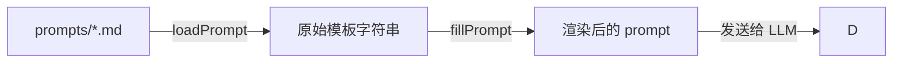
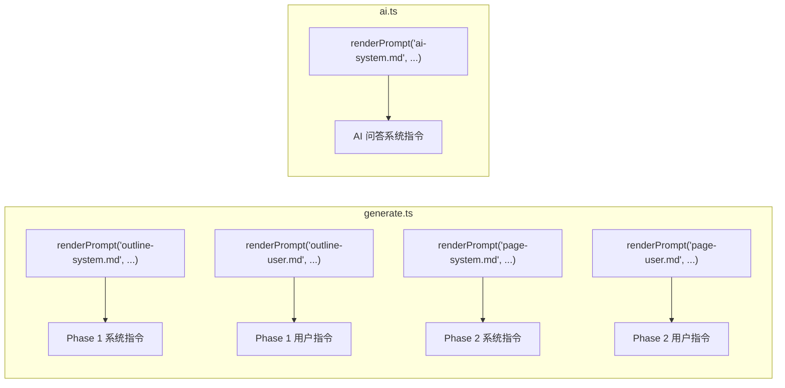

现在所有数据已收集完毕，直接输出正文。

# Prompt 模板系统

生成 Wiki 的质量，最终取决于喂给 LLM 的指令。wiki-cli 没有把 prompt 硬编码在 TypeScript 中，而是将 5 个 Markdown 模板文件存放在独立的 `prompts/` 目录，再通过 `renderPrompt` 函数将其加载并注入变量后送入 LLM。

## 两阶段渲染

`renderPrompt` 是系统的总入口，它的工作流程分两步走——**加载**与**填充**，构成一个清晰的管道：



### 阶段一：loadPrompt 读取文件

`loadPrompt(filename)` 接收一个文件名（如 `"outline-system.md"`），通过 `readFile` 从 `prompts/` 目录读取原始 Markdown 文本。路径解析基于 `import.meta.url` 定位 `src/ai/prompts.ts` 自身所在目录，再上溯两级得到项目根目录下的 `prompts/` 文件夹：

```typescript
const PROMPTS_DIR = resolve(__dirname, '..', '..', 'prompts');
// 实际路径: <project-root>/prompts/
```

[来源](src/ai/prompts.ts#L1-L16)

这一步只做纯文件读入，不做任何替换或转义。如果文件不存在，`readFile` 会抛出 `ENOENT` 错误，框架不提供降级逻辑——调用方需要确保文件名正确。

### 阶段二：fillPrompt 变量注入

`fillPrompt(template, vars)` 接收模板字符串和一个 `PromptVars` 对象（`{ [key: string]: string }`），用**全局正则替换**将所有 `{{varName}}` 占位符替换为对应值：

```typescript
result = result.replace(new RegExp(`\\{\\{${key}\\}\\}`, 'g'), value);
```

[来源](src/ai/prompts.ts#L18-L25)

关键实现细节：
- 使用 `g` 标志，确保**同一变量在模板中出现多次时全部替换**。
- 正则转义了花括号 `\{` `\}`，不会误伤普通 `{` 或 `}` 字符。
- 替换是**逐变量串行的**，后一个变量不会干扰前一个已替换的文本。
- 如果 `vars` 中缺少模板中用到的某个变量，该 `{{var}}` 会保持原样输出到 LLM。调用方需确保提供完整变量集。

### 对外 API

`renderPrompt(filename, vars)` 将上面两步组合为一行调用：

```typescript
export async function renderPrompt(filename: string, vars: PromptVars): Promise<string> {
  const template = await loadPrompt(filename);
  return fillPrompt(template, vars);
}
```

[来源](src/ai/prompts.ts#L27-L30)

---

## 五个模板一览

| 模板文件 | 用途 | 使用场景 | 变量列表 |
|---|---|---|---|
| `outline-system.md` | 大纲阶段系统指令 — 告诉 LLM 扮演资深工程师分析代码库 | [两阶段生成：大纲与页面](两阶段生成-大纲与页面.md) Phase 1 | `workDir`, `os` |
| `outline-user.md` | 大纲阶段用户指令 — 明确要求输出 JSON 目录 | 同上 | `workDir`, `os`, `lang` |
| `page-system.md` | 页面生成系统指令 — 设定写作风格、内容规则 | [两阶段生成：大纲与页面](两阶段生成-大纲与页面.md) Phase 2 | `workDir`, `os`, `pageTitle`, `audienceLevel` |
| `page-user.md` | 页面生成用户指令 — 传入元数据、可用页面列表 | 同上 | `workDir`, `pageTitle`, `audienceLevel`, `pageSlug`, `projectSummary`, `lang`, `availablePages`, `pageTask` |
| `ai-system.md` | AI 问答系统指令 — 让 LLM 读取 Wiki 并回答用户问题 | [AI 问答命令详解](ai-问答命令详解.md) | `workDir`, `os`, `wikiInfo`, `wikiTools` |

### outline-system.md — 大纲阶段的"人格设定"

该模板定义 LLM 在 Phase 1 中扮演的角色：**资深软件工程师兼技术文档专家**。它提供了一套完整的分析框架（高层愿景→架构剖析→受众分析→JSON 输出），并列举了 LLM 可用的 8 个只读工具。变量只有 `workDir` 和 `os`，用于告知 LLM 当前的工作环境。

[来源](prompts/outline-system.md#L1-L50)

### outline-user.md — 大纲阶段的任务指令

相比系统指令的"人格设定"，用户指令更直接：告诉 LLM 要做什么。它嵌入 `workDir`、`os`、`lang` 三个变量，要求 LLM 按系统提示中的框架分析项目并输出 JSON 格式的目录结构。注意该模板特别强调**仅输出 JSON，不要添加任何额外文字或代码块标记**。

[来源](prompts/outline-user.md#L1-L10)

### page-system.md — 页面生成的"写作规范"

这是最复杂的系统指令模板。它定义了 5 条内容原则（Diátaxis 框架、叙事节奏、禁止元注释等）、视觉规范（Mermaid 图表、表格、粗体标记）和严格的证据标准（来源标注格式、禁止臆测）。变量包括 `pageTitle` 和 `audienceLevel`，让 LLM 知道它在写什么标题、写给谁看。

[来源](prompts/page-system.md#L1-L40)

### page-user.md — 页面生成的"任务描述"

用户指令携带最丰富的上下文：`pageSlug`（文件标识）、`projectSummary`（项目简述）、`pageTask`（写作任务说明）、`availablePages`（所有已有页面清单用于交叉引用），以及 `lang`（语言要求）。这些变量共同构成 LLM 在 Phase 2 写单页的全部上下文。

[来源](prompts/page-user.md#L1-L25)

### ai-system.md — AI 问答的"知识库助手"

与前四个模板不同，该模板面向交互式问答场景。它让 LLM 扮演**资深代码分析师**，优先使用 Wiki 工具获取上下文。变量 `wikiInfo` 和 `wikiTools` 动态注入当前项目是否已有 Wiki 及其可用工具列表，使 LLM 能根据实际情况灵活选择查询策略。

[来源](prompts/ai-system.md#L1-L40)

---

## 设计原则：不改代码也能调 Prompt

这是整个系统的核心设计意图：**prompt 与代码分离**。5 个 `.md` 文件存放在独立的 `prompts/` 目录，TypeScript 代码只通过文件名引用它们：

```
wiki-cli/
├── prompts/           ← 纯 Markdown，可独立修改
│   ├── outline-system.md
│   ├── outline-user.md
│   ├── page-system.md
│   ├── page-user.md
│   └── ai-system.md
├── src/
│   └── ai/
│       └── prompts.ts ← 加载逻辑，不包含任何 prompt 文本
└── commands/
    ├── generate.ts    ← 调用 renderPrompt('outline-system.md', ...)
    └── ai.ts          ← 调用 renderPrompt('ai-system.md', ...)
```

带来的好处：
- **非开发者也能调优**：只需编辑 `.md` 文件，无需接触 TypeScript 编译流程。
- **版本化追踪**：prompt 修改随 Git 记录可溯源，回滚时只需 `git checkout` 特定版本的 `.md` 文件。
- **无编译成本**：Markdown 文件在运行时读取，修改后立即生效。

[来源](src/ai/prompts.ts#L1-L30) | [来源](src/commands/generate.ts#L226-L227)

---

## 调用映射

`renderPrompt` 在两处命令中被调用，映射关系如下：



[来源](src/commands/generate.ts#L226-L227) | [来源](src/commands/generate.ts#L526-L527) | [来源](src/commands/ai.ts#L130)

---

## 下一步

- 了解 prompt 如何被消费，阅读 [两阶段生成：大纲与页面](两阶段生成-大纲与页面.md) 和 [LLM 客户端设计与流式通信](llm-客户端设计与流式通信.md)。
- 想调整生成质量？直接编辑 `prompts/` 下的 `.md` 文件，无需触碰源码。
- 查看完整项目架构，阅读 [项目架构全景](项目架构全景.md)。