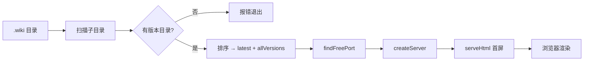

# 浏览命令详解

`wiki-cli browse` 的核心不是简单的静态文件服务器。打开 `src/commands/browse.ts`，你会发现整个浏览体验——从端口发现到源码高亮——都写在一个文件里，大约 510 行代码。本文逐块拆解这些代码的**设计意图和实现机理**。

---

## 入口函数：`browseCommand`

执行 `wiki-cli browse` 时，CLI 调度器调用 `browseCommand` 函数。它会依次做三件事：

```
browseCommand
 ├── 定位 .wiki 目录
 ├── 扫描所有版本（时间戳目录）
 └── 启动 HTTP 服务器
```

### 定位 .wiki 目录

函数根据用户传入的 `--path`、`--url` 或当前工作目录，定位 `.wiki` 文件夹。如果不存在，直接报错退出——这是一种**前置检查**设计，不等到用户访问页面才暴露问题。

```typescript
if (options?.path) {
  wikiDir = resolve(options.path);
  // 如果用户直接传了 .wiki 内部的版本目录，自动回退到父级
  if (existsSync(wikiDir) && basename(dirname(wikiDir)) === '.wiki') {
    wikiDir = dirname(wikiDir);
  }
  // 如果传了项目根目录，自动补全 .wiki 子目录
  if (existsSync(wikiDir) && basename(wikiDir) !== '.wiki') {
    const nested = join(wikiDir, '.wiki');
    if (existsSync(nested)) wikiDir = nested;
  }
}
```

这段代码展示了一个**容错设计**：用户传的路径无论是指向 `.wiki` 内部、外部还是项目根，函数都能智能地找到正确的目录。[来源](src/commands/browse.ts#L14-L37)

### 扫描版本目录

找到 `.wiki` 后，函数读取其下的所有子目录，排除 `temp` 和 `sessions` 两个特殊目录，**按名称降序排列**。因为每次生成创建的目录都以 ISO 时间戳命名（如 `2025-01-15T14-30-22`），字符串降序就是「最新的在最前面」。

```typescript
const entries = await readdir(wikiDir, { withFileTypes: true });
const timestamps = entries
  .filter(e => e.isDirectory() && e.name !== 'temp' && e.name !== 'sessions')
  .map(e => e.name)
  .sort()
  .reverse();
```

`temp` 目录用于生成过程中的临时文件，`sessions` 存储 AI 问答的会话数据，两者都不应出现在版本列表中。[来源](src/commands/browse.ts#L39-L49)

### 整体数据流



[来源](src/commands/browse.ts#L51-L55)

---

## `findFreePort`：端口自动发现

`findFreePort` 实现了一种**尝试-错误-重试**的端口查找策略。它从默认的 3000 开始，逐次递增尝试，直到找到可用端口：

```typescript
async function findFreePort(preferred: number): Promise<number> {
  return new Promise((resolve) => {
    const srv = createServer();
    srv.listen(preferred, () => {           // 尝试监听
      const addr = srv.address();
      if (addr && typeof addr === 'object') {
        srv.close(() => resolve(addr.port)); // 成功 → 返回端口号
      }
    });
    srv.on('error', () => resolve(findFreePort(preferred + 1))); // 失败 → 递归+1
  });
}
```

这个函数的设计巧妙之处在于：它**临时创建一个真实的 HTTP 服务器来探测端口**，而非使用操作系统级的端口扫描 API。如果端口被占用，`listen` 会触发 `error` 事件，函数递归调用自身并传入 `preferred + 1`。整个探测过程对用户完全透明，你永远不用手动指定 `--port` 参数。[来源](src/commands/browse.ts#L312-L322)

---

## 路由分发：服务器如何响应请求

服务器使用 Node.js 原生 `http.createServer`，通过 `req.url` 的路径模式匹配来分发请求。按优先级排列：

| 路径模式 | 处理函数 | 职责 |
|---------|---------|------|
| `/` | `serveHtml` | 返回完整 SPA 页面（含侧栏+首屏内容） |
| `/api/versions` | JSON 响应 | 返回所有版本的时间戳列表 |
| `/api/page/{slug}` | marked 渲染 | 读取 .md 文件，渲染为 HTML |
| `/api/source/{path}` | 源码高亮 | 读取源码文件，返回语法高亮页面 |
| `/*.md` | 302 重定向 | 重定向到 `/api/page/` |
| 其他静态文件 | 直接读取 | 提供图片、CSS 等静态资源 |

这是一个**全手写的路由表**——没有 Express、Koa 等框架，只有 `if/else if` 链。代码按路径长度从短到长匹配，最具体的路由放最后。[来源](src/commands/browse.ts#L82-L183)

---

## `/api/page/`：Markdown → HTML 渲染管线

当你在侧栏点击一个页面标题，前端向 `/api/page/概览.md` 发起请求。服务器端处理流程：

```typescript
if (pathname.startsWith('/api/page/')) {
  const slug = decodeURIComponent(pathname.slice(10).replace(/\.md$/, ''));
  const mdPath = join(wikiPath, `${slug}.md`);
  if (existsSync(mdPath)) {
    const content = await readFile(mdPath, 'utf-8');
    const html = await marked.parse(content);           // 核心渲染
    const fixed = fixContentReferences(html);           // 处理来源链接
    res.end(fixed);
  }
}
```

**`marked.parse`** 是渲染的核心调用。`marked` 是 Node.js 生态中最流行的 Markdown 解析器之一，它把 Markdown 文本直接转换为 HTML 字符串。渲染结果经 `fixContentReferences` 处理后返回给前端。

注意 `pathname.slice(10)` 中的数字 10 是前缀 `/api/page/` 的长度——这是手写路由中常见的偏移量技巧。[来源](src/commands/browse.ts#L105-L117)

---

## `/api/source/`：源码高亮与安全防御

`/api/source/` 的职责是：接受一个文件路径，返回语法高亮后的独立 HTML 页面。它面临一个安全问题——用户传入的路径可能包含 `../../` 等恶意序列。

### 三层路径净化（`sanitizePath`）

```typescript
function sanitizePath(rawPath: string, root: string): string | null {
  const cleaned = rawPath.replace(/^[/\\]+/, '');           // 第1层：移除前导斜杠
  const normalized = normalize(cleaned)
    .replace(/^(\.\.(\/|\\))+/g, '');                       // 第2层：移除 ../ 序列
  const resolved = resolve(root, normalized);               // 第3层：解析为绝对路径
  if (!resolved.startsWith(root + sep) && resolved !== root) return null;
  return normalized;
}
```

三层防御：

| 层级 | 目的 | 示例攻击 | 处理后 |
|------|------|---------|--------|
| 移除前导 `/` | 防止进入系统根目录 | `/etc/passwd` | `etc/passwd` |
| 清除 `../` | 防止路径穿越 | `../../etc/passwd` | `etc/passwd` |
| 前缀检查 | 确保在项目根之内 | 穿越后被 `resolve` 移到外部 | 返回 `null` → 403 |

一旦 `sanitizePath` 返回 `null`，服务器立即响应 `403 Forbidden`，不会继续读取文件。[来源](src/commands/browse.ts#L318-L326)

### 逐行语法高亮

`/api/source/` 的响应是一个**完整的独立 HTML 文档**，而不是代码片段。它包含顶部的粘性头部（返回链接 + 文件路径 + 语言标签）和代码主体。

高亮的方式不是对整个文件调用一次 `hljs.highlight`，而是**逐行高亮**：

```typescript
const rawLines = content.split('\n');
const lineHtml = rawLines.map((raw, i) => {
  const num = i + 1;
  let codeHtml: string;
  if (raw.length > 0) {
    const result = hljs.highlight(raw, { language: langName, ignoreIllegals: true });
    codeHtml = result.value;
  } else {
    codeHtml = '&nbsp;';
  }
  return `<div class="line" data-line="${num}">
    <span class="line-num">${num}</span>
    <span class="line-code">${codeHtml}</span>
  </div>`;
}).join('\n');
```

逐行高亮的原因是什么？为了**行号**。每一行作为一个独立的 `<div>`，左侧是行号（`line-num`），右侧是代码内容（`line-code`）。这样用户可以通过 URL 中的 `#L33-L34` 定位到特定行，浏览器会自动滚动并高亮目标行。[来源](src/commands/browse.ts#L148-L178)

语言推断通过 `extToLang` 函数完成，它维护了一个扩展名 → highlight.js 语言标识的映射表：

```
.ts → typescript    .js → javascript    .json → json
.md → markdown      .yml → yaml         .html → html
.css → css          .sh → bash          其他 → plaintext
```

[来源](src/commands/browse.ts#L328-L335)

---

## `loadSidebar` 与 `parseIndexJson`：侧栏导航的构建

侧栏不是静态 HTML，而是由 `loadSidebar` 函数从索引文件**动态生成**的。

### 两种索引格式，一个统一接口

```typescript
async function loadSidebar(wikiPath: string): Promise<SidebarItem[]> {
  const jsonPath = join(wikiPath, 'index.json');
  if (existsSync(jsonPath)) {
    return parseIndexJson(content);  // 优先 JSON
  }
  const mdPath = join(wikiPath, 'index.md');
  if (existsSync(mdPath)) {
    return parseIndexXml(content);   // 回退 XML
  }
  return [];
}
```

**优先 JSON，回退 XML**——这种设计保证了向后兼容性，旧版本生成的 XML 格式索引仍可被识别。[来源](src/commands/browse.ts#L196-L210)

### `parseIndexJson` 的解析逻辑

```typescript
function parseIndexJson(content: string): SidebarItem[] {
  const cleaned = stripCodeFence(content);      // 去除 ```json 围栏
  const jsonMatch = cleaned.match(/\{[\s\S]*\}/); // 提取 JSON 对象
  let parsed = JSON.parse(jsonMatch[0]);
  
  const items: SidebarItem[] = [];
  for (const section of parsed.sections) {
    for (const topic of section.topics) {
      if (topic.type === 'group') {
        items.push({ title: topic.title, slug: '', level: 'group' });
      } else if (topic.title) {
        items.push({ title: topic.title, slug: slugify(topic.title), level: topic.level });
      }
    }
  }
  return items;
}
```

`SidebarItem` 接口定义了三个字段：

| 字段 | 含义 | 示例 |
|------|------|------|
| `title` | 显示名称 | "浏览命令详解" |
| `slug` | URL 友好的标识 | `浏览命令详解` (中文保留) |
| `level` | 难度等级 | `初学` / `中级` / `高级` 或 `group` |

当 `level === 'group'` 时，该项渲染为灰色的分组标题，不可点击。其他值则生成带 🟢🟡🔴 徽标的导航链接。

`slugify` 函数将中文标题转换为 URL 友好的格式：

```typescript
function slugify(title: string): string {
  return title.toLowerCase()
    .replace(/[^\w\u4e00-\u9fff]+/g, '-')  // 非字母/中文 → 连字符
    .replace(/^-+|-+$/g, '')               // 去掉首尾连字符
    || 'untitled';
}
```

注意正则中包含 `\u4e00-\u9fff`（中文字符范围），这保证了中文标题**保留中文**，只替换标点符号为连字符。[来源](src/commands/browse.ts#L212-L235)

---

## `serveHtml`：HTML 模板结构

`serveHtml` 函数生成完整的 SPA 页面 HTML。它内嵌了全部 CSS 和 JavaScript，没有任何外部依赖（除了 CDN 加载的 highlight.js 和 Mermaid）。

### 暗色主题配色体系

CSS 颜色取自 GitHub Dark 主题：

| 颜色值 | 用途 | 类比 GitHub |
|--------|------|-------------|
| `#0d1117` | 页面背景 | `bg-canvas` |
| `#161b22` | 侧栏/代码块背景 | `bg-subtle` |
| `#30363d` | 边框/分隔线 | `border-default` |
| `#c9d1d9` | 正文颜色 | `text-primary` |
| `#58a6ff` | 链接/交互色 | `text-link` |
| `#8b949e` | 次要文本 | `text-secondary` |

布局采用 **flex 双栏**：左侧 280px 固定侧栏（`#161b22` 背景），右侧内容区弹性伸缩，最大宽度 900px。[来源](src/commands/browse.ts#L409-L450)

### 版本切换 Overlay

侧栏顶部的「历史版本」按钮会触发一个覆盖层（overlay），列出所有版本：

```html
<div class="overlay" id="versionOverlay">
  <div class="overlay-box">
    <span class="close-btn" onclick="hideVersions()">✕</span>
    <h3>历史版本</h3>
    <!-- 动态生成的版本链接 -->
    <a href="#" onclick="switchVersion('2025-01-15T14-30-22')">2025-01-15T14-30-22</a>
    <a href="#" class="current" onclick="switchVersion(...)">2025-01-14T10-15-00</a>
  </div>
</div>
```

overlay 通过 CSS 类 `show` 控制显示（`display: flex` ↔ `display: none`），点击遮罩层背景或按 ESC 键均可关闭。切换版本时调用 `switchVersion(ts)`，将 `window.location.href` 设为 `/?version=<ts>`，触发**全页刷新**——因为不同版本的侧栏结构可能不同，必须重新加载。[来源](src/commands/browse.ts#L451-L471)

---

## 前端 SPA 引擎

内嵌在 HTML 中的 JavaScript 代码实现了完整的单页应用逻辑。

### 页面加载与高亮

```javascript
async function loadPage(encodedSlug) {
  const slug = decodeURIComponent(encodedSlug);
  const res = await fetch('/api/page/' + slug + '.md?version=' + currentVersion);
  const html = await res.text();
  document.getElementById('content').innerHTML = html;
  document.getElementById('content').scrollTop = 0;
  hljs.highlightAll();                       // ← 对代码块重新高亮
  try { await mermaid.run({ nodes: document.querySelectorAll('.mermaid') }); } catch {}
  history.replaceState(null, '', '#' + slug); // ← 更新地址栏 hash
}
```

每次页面切换，代码做三件事：

1. **`hljs.highlightAll()`** — 扫描 DOM 中所有 `<code>` 元素，应用语法高亮。因为 `innerHTML` 替换会清除之前的高亮状态，所以每次加载后必须重新调用。
2. **`mermaid.run(...)`** — 查找所有带有 `.mermaid` 类的元素，将它们渲染为 SVG 图表。`theme: 'dark'` 初始化配置保证了图表颜色与页面暗色主题一致。
3. **`history.replaceState`** — 更新浏览器地址栏的 hash 为当前页面 slug，但不压栈（不产生多余的历史记录）。[来源](src/commands/browse.ts#L479-L491)

### 链接智能拦截

前端通过事件委托拦截内容区中的所有 `<a>` 标签点击：

```javascript
document.getElementById('content').addEventListener('click', function(e) {
  const anchor = e.target.closest('a');
  const href = anchor.getAttribute('href');
  if (!href || href.startsWith('http') || href.startsWith('/api/')
      || href.startsWith('#') || href.startsWith('mailto:')) return;
  e.preventDefault();
  if (href.endsWith('.md')) {
    loadPage(href.replace(/\.md$/, ''));              // Wiki 内部链接 → SPA 加载
  } else {
    window.open('/api/source/' + srcPath, '_blank');  // 其他路径 → 源码新标签
  }
});
```

这个拦截器的路由决策逻辑：

| 链接性质 | 示例 | 行为 |
|---------|------|------|
| 外部链接 | `https://github.com/...` | 不拦截，正常跳转 |
| API 请求 | `/api/versions` | 不拦截 |
| 页面内锚点 | `#标题` | 不拦截 |
| Wiki 内部链接 | `快速开始.md` | 调用 `loadPage`，无刷新切换 |
| 源码路径 | `src/commands/browse.ts` | 在新标签打开 `/api/source/...` |

对于以 `.md` 结尾的 Wiki 内部链接，点击后只替换内容区，不刷新整个页面。对于非 `.md` 路径（如代码文件引用），则视为源码路径，在新标签页中打开语法高亮页面。[来源](src/commands/browse.ts#L493-L510)

---

## `fixContentReferences`：来源链接的魔法

生成阶段，LLM 会在文档中插入类似 `[来源：src/commands/browse.ts#L33-L34]` 的标记。浏览阶段，`fixContentReferences` 函数负责将这些标记转化为可点击的链接：

```typescript
function fixContentReferences(html: string): string {
  return html.replace(
    /\[来源：([^\]]+)\]/g,
    '<a href="/api/source/$1" target="_blank" class="source-ref">[来源]</a>'
  );
}
```

正则 `\[来源：([^\]]+)\]` 匹配 `[来源：...]` 模式，捕获中间的路径作为第一个分组。替换后生成带 `class="source-ref"` 的链接标签，样式为边框圆角按钮，悬浮时变蓝。

这个设计实现了**文档 ↔ 源码的双向追溯**：你在阅读某个功能的文档时，可以一键跳转到对应的实现代码。[来源](src/commands/browse.ts#L346-L353)

---

## Mermaid 图表渲染

Mermaid 的集成非常轻量：

1. **CDN 加载** — 从 `cdn.jsdelivr.net` 加载 `mermaid@11/dist/mermaid.min.js`
2. **初始化** — `mermaid.initialize({ startOnLoad: false, theme: 'dark' })`，`startOnLoad: false` 是因为我们手动控制渲染时机
3. **手动渲染** — 每次页面加载后调用 `mermaid.run({ nodes: document.querySelectorAll('.mermaid') })`

注意 `theme: 'dark'` 让图表配色与 GitHub Dark 主题保持一致。渲染目标通过 CSS 类 `.mermaid` 选择，也就是 Markdown 中的 ````mermaid` 代码块。[来源](src/commands/browse.ts#L473-L476)

---

## 核心数据流全景

将全文串联起来，从用户输入命令到浏览器渲染的完整链路：

```mermaid
flowchart TB
    subgraph 启动阶段
        A[browseCommand] --> B[定位 .wiki]
        B --> C[扫描版本目录]
        C --> D[findFreePort]
        D --> E[createServer]
        E --> F[serveHtml 首屏]
    end

    subgraph 交互阶段
        G[点击侧栏] --> H[/api/page/slug.md]
        H --> I[readFile 读取 .md]
        I --> J[marked.parse → HTML]
        J --> K[fixContentReferences]
        K --> L[hljs.highlightAll]
        L --> M[mermaid.run]
    end

    subgraph 源码查看
        N[点击 [来源] 链接] --> O[/api/source/path]
        O --> P[sanitizePath 安全检测]
        P --> Q[逐行 hljs.highlight]
        Q --> R[返回独立 HTML 页面]
        R --> S[行号定位 L33-L34]
    end

    F --> G
    F --> N
```

[来源](src/commands/browse.ts#L1-L510)

---

## 推荐阅读

- [浏览命令：wiki-cli browse](浏览命令-wiki-cli-browse.md) — 从用户视角看的操作指南，适合先读再来看本文
- [本地 HTTP 服务器与前端](本地-http-服务器与前端.md) — 架构视角的补充分析，包含更多设计权衡细节
- [源码浏览与行号高亮](源码浏览与行号高亮.md) — `/api/source/` 端点的安全与渲染机制
- [侧栏导航与版本管理](侧栏导航与版本管理.md) — index.json 格式的完整规范和版本切换时序
- [生成命令详解](生成命令详解.md) — 理解 LLM 如何在生成阶段创建 `index.json` 和插入 `[来源]` 标记