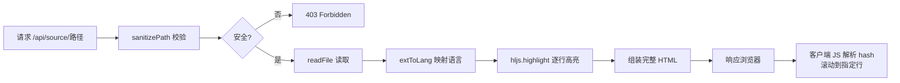

# 源码浏览与行号高亮

当你点击 Wiki 页面中的 `[来源]` 标签，或直接打开一个指向 `/api/source/...` 的链接时，浏览器会展示一个独立的源码预览页面——带有语法高亮、行号、以及基于 URL hash 的行范围高亮。这条管线从路径安全到渲染呈现，涉及四个核心机制。

---

## 整体流程



四个阶段环环相扣：安全校验是第一道防线，语言映射决定高亮质量，逐行渲染保证行号精确，客户端 hash 解析实现定位跳转。

[来源](src/commands/browse.ts#L53-L88)

---

## `sanitizePath`：三层路径穿越防护

`/api/source/` 接受用户提供的文件路径，如果不加限制，攻击者可通过 `../../etc/passwd` 读取任意文件。`sanitizePath` 实现了三层防御：

```typescript
function sanitizePath(rawPath: string, root: string): string | null {
  const cleaned = rawPath.replace(/^[/\\\\]+/, '');
  const normalized = normalize(cleaned).replace(/^(\\.\\.(\\/|\\\\))+/g, '');
  const resolved = resolve(root, normalized);
  if (!resolved.startsWith(root + sep) && resolved !== root) return null;
  return normalized;
}
```

[来源](src/commands/browse.ts#L223-L228)

### 第一层：移除开头斜杠

`rawPath.replace(/^[/\\\\]+/, '')` 去掉路径开头的 `/` 或 `\`。原因在于 Node.js 的 `path.resolve` 遇到以 `/` 开头的路径时会将其视为**绝对路径**，忽略第一个参数 `root`。只要去掉这个前缀，`resolve` 就会以 `root` 为基准拼接。

| 输入 | 经过第一层 | 目的 |
|------|-----------|------|
| `///etc/passwd` | `etc/passwd` | 防止 resolve 当作绝对路径 |
| `src/commands/browse.ts` | `src/commands/browse.ts` | 正常路径不变 |

### 第二层：normalize 折叠 + 清理 `../`

`path.normalize` 折叠冗余的 `..` 和 `.` 段，例如 `foo/../../bar` → `bar`。但 `normalize` 对**前缀**的 `../` 可能保留（如 `../../bar` 被 normalize 为 `../../bar`），因此再用正则 `^(\\.\\.(\\/|\\\\))+` 将前缀 `../` 全部清除。

```text
输入: ../../../../etc/passwd
normalize: ../../../../etc/passwd  (超出根目录的部分无法折叠)
正则清除: etc/passwd
```

### 第三层：resolve + startsWith 最终校验

`resolve(root, normalized)` 将拼接后的路径转为绝对路径。然后校验 `resolved.startsWith(root + sep)` 保证解析结果仍在项目根目录内。这是一个**白名单校验**——不检查"是不是非法路径"，而是检查"是不是合法路径"。

| 场景 | resolved | 校验结果 |
|------|----------|---------|
| `src/commands/browse.ts` | `/home/user/project/src/commands/browse.ts` | ✅ 以 `root + sep` 开头 |
| `etc/passwd` | `/home/user/project/etc/passwd` | ❌ 不在 root 下（实际中不存在该路径） |
| 边界：`resolved === root` | 等于根目录本身 | ✅ 特殊情况放行 |

如果任一检测失败，函数返回 `null`，服务器立即响应 `403 Forbidden`。

[来源](src/commands/browse.ts#L61-L64)

---

## `extToLang`：扩展名到语言标识的映射

语法高亮的质量取决于是否选对了语言。`extToLang` 通过文件扩展名查表：

```typescript
function extToLang(ext: string): string {
  const map: Record<string, string> = {
    '.ts': 'typescript', '.js': 'javascript', '.json': 'json',
    '.md': 'markdown', '.yml': 'yaml', '.yaml': 'yaml',
    '.html': 'html', '.css': 'css', '.sh': 'bash', '.bash': 'bash',
  };
  return map[ext] || 'plaintext';
}
```

[来源](src/commands/browse.ts#L230-L237)

### 映射表全景

| 文件扩展名 | highlight.js 语言标识 | 适用场景 |
|-----------|----------------------|---------|
| `.ts` | `typescript` | TypeScript 源码 |
| `.js` | `javascript` | JavaScript 源码 |
| `.json` | `json` | 配置文件、数据文件 |
| `.md` | `markdown` | Markdown 文档 |
| `.yml` / `.yaml` | `yaml` | YAML 配置文件 |
| `.html` | `html` | HTML 模板 |
| `.css` | `css` | 样式表 |
| `.sh` / `.bash` | `bash` | Shell 脚本 |
| 其他 | `plaintext` | 纯文本，无高亮 |

`plaintext` 作为兜底值，保证不会因为未知扩展名导致 `hljs.highlight` 抛出异常。此表若需扩展，只需增加条目即可——这是典型的**映射优先于分支**设计。

[来源](src/commands/browse.ts#L68-L70)

---

## 逐行渲染：双 span 结构与高亮策略

拿到文件内容和语言标识后，渲染管线将源码分割为行，逐行处理：

```typescript
const rawLines = content.split('\n');
const lineHtml = rawLines.map((raw, i) => {
  const num = i + 1;
  let codeHtml: string;
  if (raw.length > 0) {
    const result = hljs.highlight(raw, { language: langName, ignoreIllegals: true });
    codeHtml = result.value;
  } else {
    codeHtml = '&nbsp;';
  }
  return `<div class="line" data-line="${num}">
    <span class="line-num">${num}</span>
    <span class="line-code">${codeHtml}</span>
  </div>`;
}).join('\n');
```

[来源](src/commands/browse.ts#L71-L78)

### 为什么逐行高亮而非整块高亮？

这是本实现中一个值得注意的设计选择。通常 highlight.js 的用法是 `hljs.highlight(code, { language })` 对整个代码块一次性高亮。但这里对每一行独立调用 `hljs.highlight`。原因在于：

| 策略 | 优点 | 缺点 |
|------|------|------|
| **整块高亮** | 语法分析上下文完整，跨行关键字（如多行注释）识别准确 | 行号需要额外计算，难以独立设置每行样式 |
| **逐行高亮** | 行号与代码 DOM 绑定紧密，每行可独立响应 hover/点击/高亮 | 跨行语法（块注释、多行字符串）可能断裂，部分关键字无法识别 |

当前实现牺牲了**跨行语法完整性**，换取了**行级样式灵活性**——因为 hash 行高亮（`L12-L34`）需要为指定行添加 `hl` class，逐行结构让这个操作变为纯粹的 DOM 选择器操作，不需要重新解析代码。

### CSS 双栏布局

每行生成两个 `<span>`：

- **`line-num`**：行号，固定 56px 宽度，右对齐，灰色（`#484f58`），`user-select: none` 防止误选
- **`line-code`**：高亮后的代码内容，`flex: 1` 自适应剩余宽度

外层 `<div class="line">` 采用 `display: flex`，鼠标悬停时整行背景微亮（`rgba(255,255,255,0.03)`）。空行渲染为 `&nbsp;` 保证行高一致。

[来源](src/commands/browse.ts#L83-L94)

---

## URL Hash 解析与行定位跳转

源码页面的 URL 支持 `#L12`（单行）和 `#L12-L34`（范围）两种格式。这个功能由内嵌在 HTML 中的一段 JavaScript 实现：

```javascript
document.addEventListener('DOMContentLoaded', function(){
  var h = location.hash.slice(1);
  if (!h) return;
  var m = h.match(/^L(\d+)(?:-L(\d+))?$/);
  if (!m) return;
  var s = parseInt(m[1], 10), e = m[2] ? parseInt(m[2], 10) : s;
  var target;
  for (var i = Math.max(1, s); i <= e; i++) {
    var el = document.querySelector('[data-line="' + i + '"]');
    if (el) { el.classList.add('hl'); if (!target) target = el; }
  }
  if (target) target.scrollIntoView({ block: 'center' });
});
```

[来源](src/commands/browse.ts#L100-L116)

### 解析规则

| URL | hash | 匹配结果 | 行为 |
|-----|------|---------|------|
| `...ts#L33` | `L33` | s=33, e=33 | 高亮第 33 行 |
| `...ts#L10-L20` | `L10-L20` | s=10, e=20 | 高亮第 10~20 行 |
| `...ts#L0` | `L0` | s=0 → 修正为 1 | 无匹配行，因 data-line 从 1 开始 |
| `...ts#L99-L5` | `L99-L5` | s=99, e=5 | for 循环无效（s > e），不会出错 |
| `...ts#foo` | `foo` | 正则不匹配 | 静默退出 |

### 实现要点

1. **`Math.max(1, s)`** 防止行号 0 或负数——DOM 中 `data-line` 从 1 开始
2. **`document.querySelector('[data-line="..."]')`** 直接通过属性选择器定位 DOM 元素，时间复杂度 O(1)
3. **`el.classList.add('hl')`** 添加高亮 class，触发 CSS 规则：左侧蓝色边框 + 浅蓝背景 + 行号变蓝
4. **`scrollIntoView({ block: 'center' })`** 将目标行滚动到视口中央，方便查看上下文
5. **范围循环**从 s 到 e 逐个标记，即使行号不连续也能正确高亮

### `hl` 类的 CSS 规则

```css
.line.hl { background: rgba(88,166,255,0.08); border-left: 2px solid #58a6ff; }
.line.hl .line-num { color: #58a6ff; font-weight: 600; }
```

蓝色系高亮与 GitHub Dark 主题的 `#58a6ff` 链接色统一，视觉上一眼就能辨识被标记的行。

[来源](src/commands/browse.ts#L85-L96)

---

## 完整页面结构

最终响应的 HTML 是一个自包含文档，包含以下层次：

```
<!DOCTYPE html>
<html>
  <head>
    ← highlight.js GitHub Dark 主题（CDN）
    ← 内联样式（代码区、行号、头部、高亮规则）
  </head>
  <body>
    ← 粘性头部（"← Wiki" 返回链接 | 文件路径 | 语言标签）
    ← <pre>
         ← <div class="line" data-line="1">
              <span class="line-num">1</span>
              <span class="line-code">...高亮后代码...</span>
            </div>
         ← <div class="line" data-line="2">...</div>
         ← ...
       </pre>
    ← <script> 客户端 hash 解析 + 行高亮逻辑 </script>
  </body>
</html>
```

所有样式和逻辑内嵌，无需额外网络请求（CSS 主题除外）。头部中的「← Wiki」链接调用 `window.close()` 关闭当前标签页回到主文档。

[来源](src/commands/browse.ts#L80-L97)

---

## 设计权衡一览

| 决策 | 理由 | 隐含成本 |
|------|------|---------|
| 逐行 `hljs.highlight` | line-num/line-code 双 span 绑定，hash 高亮 O(1) 定位 | 跨行语法高亮断裂（多行注释、模板字符串） |
| `ignoreIllegals: true` | 防止非法语法导致高亮异常 | 可能掩盖真正的语法错误 |
| `sanitizePath` 返回 `normalized` 而非 `raw` | 统一路径格式，避免双斜杠等歧义 | 路径语义可能发生变化（但安全优先） |
| 客户端 JS 解析 hash | 零服务器开销，纯 DOM 操作 | 不支持首次加载时的 SSR 行高亮 |
| CDN 加载 highlight.js 主题 | 减少服务器负担，利用浏览器缓存 | 离线环境不可用 |

[来源](src/commands/browse.ts#L68-L78)

---

## 相关章节

- [浏览命令：wiki-cli browse](浏览命令-wiki-cli-browse.md) — browse 命令的用户操作流程与参数说明
- [本地 HTTP 服务器与前端](本地-http-服务器与前端.md) — 路由架构、`serveHtml` 内嵌 SPA、侧栏与版本管理
- [生成管线：从大纲到页面的完整流程](生成管线-从大纲到页面的完整流程.md) — 理解 LLM 如何在生成阶段插入 `[来源]` 标记
- [概览](概览.md) — 项目定位与核心功能全景