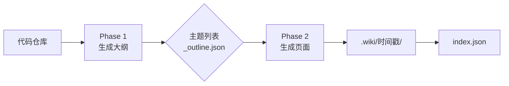
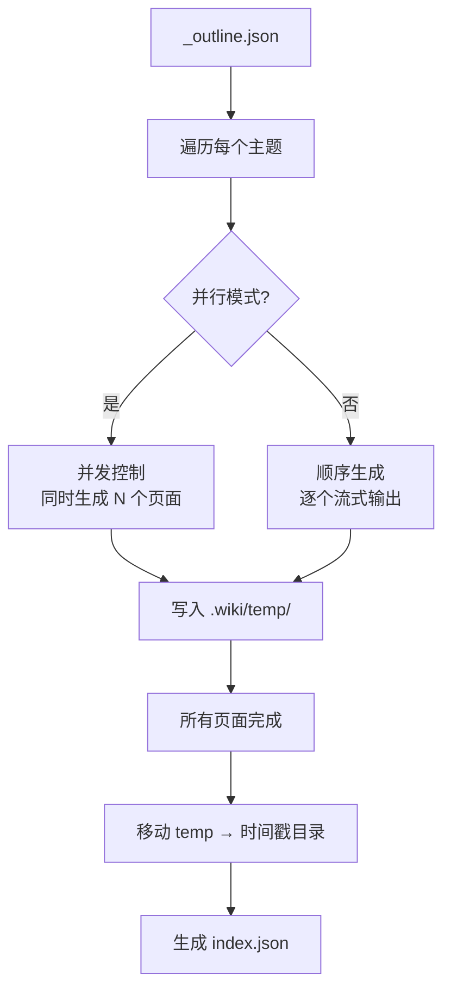

现在我有足够的信息来撰写完整的 Wiki 页面。

# 生成命令详解

`wiki-cli generate` 是整个工具的核心命令。它的使命很简单：**读取你的代码仓库，自动生成一套结构化的 Wiki 文档**。完成这项任务需要经过两个截然不同的阶段——先规划大纲，再填充内容。



[来源](src/commands/generate.ts#L1-L10)

---

## 选项速查

使用 `wiki-cli generate --help` 可以看到所有选项，下面是它们的具体含义：

| 短选项 | 长选项 | 作用 | 适用场景 |
|--------|--------|------|----------|
| `-C` | `--dir <path>` | 指定本地仓库目录（默认当前目录） | 已经有代码仓库在本地 |
| `-u` | `--url <url>` | 提供 Git 远程仓库地址，自动克隆 | 仓库在 GitHub/GitLab 上，想直接生成 |
| `-o` | `--output <path>` | Wiki 输出路径，或与 `--url` 配合指定克隆目标 | 想把 Wiki 生成到特定位置 |
| `-b` | `--branch <name>` | 切换/克隆指定分支 | 只对某个分支生成文档 |
| `-d` | `--depth <n>` | 浅克隆深度（配合 `--url`） | 仓库很大，只要最近几次提交 |
| `-t` | `--temp` | 临时模式：生成完毕后清理克隆（配合 `--url`） | 用完即弃，不留痕迹 |
| `-p` | `--parallel` | 并行生成页面（更快，无流式输出） | 追求速度，不关心逐页预览 |
| `-c` | `--concurrency <n>` | 并行并发数（默认 3，范围 1-10） | 控制同时生成的页面数 |
| `-r` | `--retry <n>` | 失败页面自动重试次数（默认 0） | 网络不稳定，希望自动恢复 |
| `-s` | `--silent` | 静默模式：跳过所有交互式提示 | CI/CD 自动化流水线 |
| `--browse` | 生成完成后自动启动浏览服务器 | 想立即查看结果 |

[来源](src/cli.ts#L47-L68)

---

## 两阶段生成流程

### Phase 1：生成大纲

这是项目理解阶段。工具会加载两个 Prompt 模板——`outline-system.md` 和 `outline-user.md`，然后与 LLM 进行多轮对话。[来源](src/commands/generate.ts#L107-L137)

**核心逻辑：**

1. **注入上下文**：向 LLM 发送工作目录路径（`workDir`）、操作系统信息（`os`）和目标语言（`lang`）。
2. **工具调用**：LLM 可以调用 12 个只读工具来探索代码库，例如 `list_directory`、`read_file`、`search_in_files`。详见 [工具系统：12 个只读工具](工具系统-12-个只读工具.md)。[来源](src/commands/generate.ts#L218-L229)
3. **流式输出**：默认启用流式模式，你在终端能看到 LLM 的思考过程和工具调用结果。[来源](src/commands/generate.ts#L195-L201)
4. **JSON 解析**：最多循环 25 轮对话，直到 LLM 返回一个符合结构的 JSON 对象。这个 JSON 包含 `sections`（章节）和 `topics`（主题），每个主题带有标题、级别、描述和任务。[来源](src/commands/generate.ts#L147-L172)
5. **保存大纲**：解析成功后，大纲以 `_outline.json` 形式写入 `.wiki/temp/` 目录。[来源](src/commands/generate.ts#L142)

大纲 JSON 的结构如下：

```json
{
  "sections": [
    {
      "name": "核心架构",
      "topics": [
        { "title": "CLI 入口", "level": "中级", "description": "...", "task": "..." },
        { "title": "命令层", "level": "中级", "description": "...", "task": "..." }
      ]
    }
  ]
}
```

[来源](src/commands/generate.ts#L160-L186)

### Phase 2：生成页面

大纲就绪后，进入真正的"写作"阶段。工具遍历大纲中的每个主题，为每个主题生成一篇独立的 Markdown 页面。



**页面生成的 Prompt 更精细**：除了工作目录和语言，每个页面还会收到：
- `pageTitle` / `pageSlug`：当前主题的标题和 slug
- `audienceLevel`：读者级别（如"初学/中级/高级"）
- `availablePages`：整个 Wiki 的所有页面列表，用于交叉引用
- `pageTask`：该页面的具体写作任务

[来源](src/commands/generate.ts#L281-L322)

完成所有页面后，工具会将 `.wiki/temp/` 移动到带时间戳的目录（如 `.wiki/2025-01-15T14-30-00/`），并生成 `index.json`——这是 [侧栏导航与版本管理](侧栏导航与版本管理.md) 的基础。[来源](src/commands/generate.ts#L87-L93)

---

## 关键机制详解

### `--url` 远程仓库克隆

当指定 `--url` 时，工作目录解析进入远程模式：

1. **确定目标目录**：
   - 如果同时使用 `--temp`，创建临时目录（`os.tmpdir()` 下）。
   - 如果指定了 `--output`，使用该路径。
   - 如果都没有，使用 `~/.wiki-cli/repos/` 下的缓存目录（根据 URL 自动生成目录名）。[来源](src/utils/workspace.ts#L42-L63)
2. **克隆或更新**：调用 `ensureRepo` 执行 `git clone`；如果目录已存在则执行 `git fetch --all` 更新。[来源](src/utils/git.ts#L13-L43)
3. **网络不可用时的降级**：如果 `git fetch` 失败（网络不通），函数返回 `{ updated: false }`。此时 `generateCommand` 会检查 `.wiki/` 下是否已有历史版本，如果有则询问用户"是否重新生成"或"打开已有文档"。[来源](src/commands/generate.ts#L17-L30)

这就是 `--url` 支持断网离线阅读的关键设计：生成过一次后，即使网络不可用，也能直接打开已缓存的 Wiki。

[来源](src/utils/workspace.ts#L32-L86)

### `--parallel` 并发生成

默认情况下，Phase 2 是**顺序执行**的——逐个生成页面，每个页面都有流式输出（你能看到 LLM 逐字"写"出内容）。[来源](src/commands/generate.ts#L350-L353)

启用 `--parallel` 后：

- **速度大幅提升**：多个页面同时请求 LLM API，不等待前一个完成。
- **无流式输出**：每个页面静默生成，完成后统一打印 `[3/12] Generated: 配置命令详解`。
- **并发控制**：默认并发数为 3，可通过 `--concurrency` 调整（上限 10）。内部使用 `runConcurrent` 函数实现——维护一个任务队列和运行集合，通过 `Promise.race` 控制同时运行的任务数。[来源](src/commands/generate.ts#L357-L367)

```typescript
async function runConcurrent(tasks, concurrency) {
  const running = new Set<Promise<void>>();
  const queue = [...tasks];
  while (queue.length > 0 || running.size > 0) {
    while (running.size < concurrency && queue.length > 0) {
      const task = queue.shift()!;
      const p = task().finally(() => running.delete(p));
      running.add(p);
    }
    if (running.size > 0) await Promise.race(running);
  }
}
```

[来源](src/commands/generate.ts#L369-L379)

### 断点续传机制

生成过程中如果中断（网络问题、终端关闭、LLM 报错），下次运行 `generate` 时会自动检测是否有**残留的临时数据**。

**检测点**：程序检查 `.wiki/temp/` 目录是否存在。[来源](src/commands/generate.ts#L51-L66)

**交互模式**下，会弹出一个选择菜单：

```
Previous generation temp data found. What do you want to do?
  🔄 Resume from last checkpoint
  🗑️  Discard and start fresh
```

选择 `Resume` 后，Phase 2 中每个页面生成前都会检查对应的 `.md` 文件是否已存在：
```typescript
if (!options.retryList && existsSync(pagePath)) {
  logInfo(`Skipping already generated: ${topic.title}`);
  return; // 跳过已生成的页面
}
```

[来源](src/commands/generate.ts#L296-L301)

**静默模式**下（`--silent`），检测到临时数据时直接删除，重新开始。[来源](src/commands/generate.ts#L53-L55)

### 失败重试机制

除了断点续传，`generate` 还提供重试机制：

- **自动重试**：`--retry <n>` 参数指定最多自动重试 N 轮。每轮只重新生成失败的页面，成功的不动。[来源](src/commands/generate.ts#L74-L78)
- **交互重试**：非静默模式下，如果仍有失败页面，会询问用户是否重试，支持反复重试直到全部成功。[来源](src/commands/generate.ts#L80-L86)

### 工作目录解析逻辑

`resolveWorkDir` 函数处理三种场景，返回 `{ workDir, outputDir, updated?, cleanup? }`：

| 场景 | 触发条件 | 行为 |
|------|----------|------|
| **本地目录** | 仅 `-C` 或默认 | 使用指定目录或 `cwd()`，可选切换分支 |
| **远程克隆** | `--url` | 克隆/更新到缓存目录，支持 `--branch`/`--depth`/`--temp` |
| **临时模式** | `--url --temp` | 克隆到系统临时目录，生成完毕后自动清理 |

`--output` 在上述三种场景中含义略有不同：本地模式下，它指定 Wiki 输出目标路径；远程模式下，它既是克隆目的地也是 Wiki 输出路径。[来源](src/utils/workspace.ts#L32-L86)

---

## 典型使用流程

```bash
# 1. 最简用法：为当前目录生成文档（交互式选择并行/串行）
wiki-cli generate

# 2. 指定本地仓库并自动浏览
wiki-cli generate -C ~/projects/my-app --browse

# 3. 远程仓库 + 并行 + 自动重试（适合 CI）
wiki-cli generate -u https://github.com/user/repo.git -p -c 5 -r 2 --silent

# 4. 只生成某个分支，用完即清理
wiki-cli generate -u https://github.com/user/repo.git -b dev -t
```

---

## 下一步

- 生成完成后，使用 [浏览命令详解](浏览命令详解.md) 查看你的 Wiki
- 了解生成质量的核心——[两阶段生成：大纲与页面](两阶段生成-大纲与页面.md) 的架构设计
- 了解 [Prompt 模板系统](prompt-模板系统.md) 如何控制 LLM 的输出质量
- 配置阶段：先阅读 [配置命令详解](配置命令详解.md) 完成 LLM 设置
- 快速开始：不读文档直接上手？试试 [快速开始](快速开始.md)