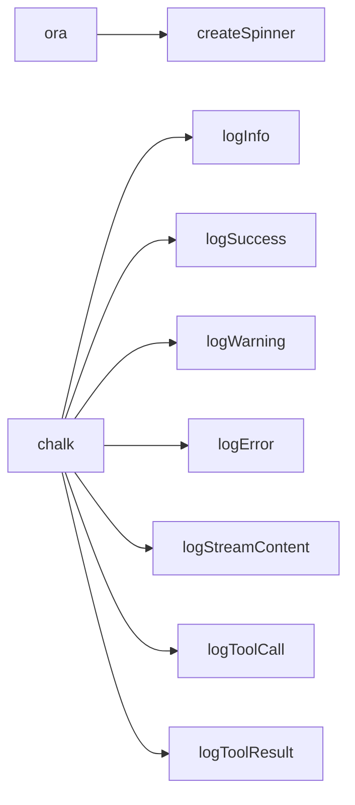

现在开始编写页面。

---

# 进度显示与日志系统

终端用户界面是命令行工具与用户交互的唯一窗口。`src/utils/progress.ts` 将 **ora**（加载动画）和 **chalk**（彩色文本）整合为一组语义化的日志函数，让所有命令模块能以统一的视觉语言输出信息。

整个模块的依赖关系如下：



[来源](src/utils/progress.ts#L1-L37)

---

## 加载动画：createSpinner

```typescript
export function createSpinner(text: string) {
  return ora(text).start();
}
```

[来源](src/utils/progress.ts#L4-L6)

`createSpinner` 是对 [ora](https://github.com/sindresorhus/ora) 的**工厂函数封装**。调用时传入一段文字描述，函数立即创建并启动一个旋转加载动画：

```typescript
const spinner = createSpinner('正在生成页面...');
// 成功后停止
spinner.succeed('页面生成完成');
// 或失败时
spinner.fail('页面生成失败');
```

设计上保留了 **Ora 实例的完全透明性**——调用方可以自由调用 `.succeed()`、`.fail()`、`.stop()`、`.text` 等所有原生方法。

值得注意的是，当前代码库中 `createSpinner` 尚未被任何命令调用，所有命令目前统一使用日志函数而非动画。这个接口的存在为未来可能的长时间阻塞操作（如远程仓库克隆、批量文件写入）预留了接入点。

---

## 四个日志级别与色彩方案

代码定义了四个常规日志函数，每个对应一个语义级别，并配有专属图标和 chalk 颜色。

| 函数 | 语义 | 图标 | chalk 颜色 | 输出方法 |
|------|------|------|------------|----------|
| `logInfo` | 信息提示 | `ℹ` | `chalk.blue` | `console.log` |
| `logSuccess` | 成功确认 | `✔` | `chalk.green` | `console.log` |
| `logWarning` | 警告提醒 | `⚠` | `chalk.yellow` | `console.log` |
| `logError` | 错误报告 | `✖` | `chalk.red` | `console.log` |

[来源](src/utils/progress.ts#L8-L22)

这四种颜色遵循终端领域的通用语义：

- **蓝色** (`chalk.blue`)：中性信息，无正面或负面倾向。
- **绿色** (`chalk.green`)：操作成功，流程正常推进。
- **黄色** (`chalk.yellow`)：需要关注但非致命，流程不中断。
- **红色** (`chalk.red`)：操作失败，但**不终止进程**——是否退出由调用方决定。

函数名与流程影响的解耦是一个关键设计决策。以 `logWarning` 为例，在 [`utils/git.ts`](src/utils/git.ts#L18-L20) 中，当 Git 网络不可达时调用 `logWarning` 告知降级为缓存——这不是错误，流程应继续。而 `logError` 在 [`commands/browse.ts`](src/commands/browse.ts#L12-L14) 中打印后调用 `process.exit(1)`，在 [`commands/generate.ts`](src/commands/generate.ts#L206-L208) 中则只返回空数组。错误输出与错误处理各自独立。

---

## 流式内容输出：logStreamContent

```typescript
export function logStreamContent(content: string): void {
  process.stdout.write(chalk.cyan(content));
}
```

[来源](src/utils/progress.ts#L24-L26)

`logStreamContent` 与另外四个日志函数有**两个根本差异**：

1. **输出通道不同**——使用 `process.stdout.write` 而非 `console.log`，前者不追加换行符，保证流式内容的连续拼接。
2. **颜色不同**——使用 `chalk.cyan`（青色），在终端中与普通文本形成视觉区分。

该函数专为 **LLM 流式响应**设计。当 LLM 逐 chunk 返回内容时，每个 chunk 被传递给 `logStreamContent`，连续写入终端形成完整的流式输出。在 [`commands/generate.ts`](src/commands/generate.ts#L302-L306) 中，流式内容与推理过程、工具调用标记三者混合输出到同一终端，`chalk.cyan` 的青色帮助用户区分" LLM 正在生成的内容"与普通日志信息。

---

## 工具调用可视化：logToolCall 与 logToolResult

这两个函数是进度系统中**视觉层次最丰富**的设计，它们共同构建了 LLM 工具调用循环的可观察性。

### logToolCall：工具调用发起

```typescript
export function logToolCall(name: string, args: any): void {
  console.log(chalk.magenta('🔧'), chalk.bold(`Tool: ${name}`), chalk.gray(JSON.stringify(args)));
}
```

[来源](src/utils/progress.ts#L28-L30)

输出示例：
```
🔧 Tool: read_file {"path":"src/main.ts"}
```

三个视觉元素逐层递进：**🔧 图标**（一眼识别为工具调用）→ **品红 (`chalk.magenta`) + 粗体 (`chalk.bold`) 的工具名**（快速定位调用了哪个工具）→ **灰色 (`chalk.gray`) JSON 参数**（信息密度高且不刺眼）。

### logToolResult：工具结果预览

```typescript
export function logToolResult(name: string, result: any): void {
  const preview = typeof result.data === 'string'
    ? result.data.slice(0, 100) + (result.data.length > 100 ? '...' : '')
    : JSON.stringify(result.data).slice(0, 100);
  console.log(chalk.green('  ↳'), chalk.gray(`Result: ${preview}`));
}
```

[来源](src/utils/progress.ts#L32-L37)

输出示例：
```
  ↳ Result: import { ora } from 'ora';\nimport chalk from 'chalk';\n\nexport f...
```

三个关键设计决策：

- **↳ 箭头加两个前置空格**——让结果行从属于上一行的 `logToolCall`，形成视觉嵌套关系，一眼看出哪个工具产生了哪个结果。
- **100 字符截断**——工具返回的数据可能非常长（如整个文件内容），预览只取前 100 字符加 `...`，防止终端刷屏。这是对可读性的主动保护。
- **数据类型自适应**——若 `result.data` 是字符串直接截取，否则先 JSON 序列化再截取，兼容不同工具的输出格式。

### 调用时机

在 [`commands/generate.ts`](src/commands/generate.ts#L394-L396) 中，`logToolCall` 和 `logToolResult` **仅在流式模式（`stream = true`）下触发**：

```typescript
if (stream) logToolCall(tc.function.name, args);
const result = await executeToolCall(tc.function.name, args);
if (stream) logToolResult(tc.function.name, result);
```

非流式模式下（并行生成），整个工具调用循环完全静默。输出与否由单一 `stream` 标志控制，调用方无需关心具体日志逻辑。

---

## ch Ark 颜色映射速查

chalk 是一个 ANSI 颜色库，`progress.ts` 使用了它的 **5 个颜色方法**和 **1 个样式方法**：

| chalk 方法 | 效果 | 使用场景 |
|-----------|------|---------|
| `chalk.blue(text)` | 蓝色前景 | `logInfo` 的 `ℹ` 图标 |
| `chalk.green(text)` | 绿色前景 | `logSuccess` 的 `✔` 图标、`logToolResult` 的 `↳` 箭头 |
| `chalk.yellow(text)` | 黄色前景 | `logWarning` 的 `⚠` 图标 |
| `chalk.red(text)` | 红色前景 | `logError` 的 `✖` 图标 |
| `chalk.cyan(text)` | 青色前景 | `logStreamContent` 的输出内容 |
| `chalk.magenta(text)` | 品红前景 | `logToolCall` 的 `🔧` 图标 |
| `chalk.gray(text)` | 灰色前景 | 工具参数和结果的 JSON 预览 |
| `chalk.bold(text)` | 粗体 | `logToolCall` 中的工具名 |

所有日志函数**只负责显示，不负责业务逻辑**——不写文件、不修改状态、不决定流程是否退出。这种纯展示的职责边界让调用方可以放心使用，也让测试和替换（如静默模式）变得简单。

[来源](src/utils/progress.ts#L1-L37)

---

## 推荐阅读

- [生成命令：wiki-cli generate](生成命令-wiki-cli-generate.md) — 了解 `logToolCall` 和 `logToolResult` 在流式工具调用循环中的完整上下文
- [AI 交互命令：wiki-cli ai](ai-交互命令-wiki-cli-ai.md) — 对比生成命令，观察 AI 问答如何使用更简洁的日志输出
- [工具系统：LLM 只读探索工具的设计](工具系统-llm-只读探索工具的设计.md) — 理解 `logToolCall`/`logToolResult` 所展示的工具底层实现
- [LLM 客户端设计：流式通信与重试机制](llm-客户端-流式通信与重试机制.md) — `logStreamContent` 输出的流式内容从何而来