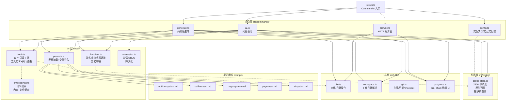
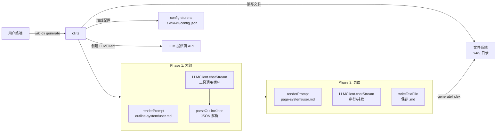
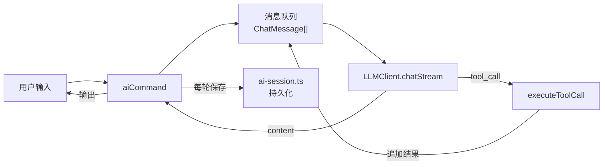

# 项目架构全景

## 目录树：俯瞰全貌

从顶层来看，源码按职责分为四个一级目录，每个目录承担架构中的一个层次。

```
wiki-cli/
├── src/
│   ├── cli.ts                     # 入口，Commander 注册所有命令
│   ├── commands/
│   │   ├── config.ts              # 交互式配置（LLM + Embedding）
│   │   ├── generate.ts            # 两阶段 Wiki 生成
│   │   ├── browse.ts              # 本地 HTTP 浏览服务器
│   │   └── ai.ts                  # AI 问答（会话/工具/Embedding）
│   ├── ai/
│   │   ├── llm-client.ts          # OpenAI 兼容客户端（流式+非流式）
│   │   ├── tools.ts               # 12 个只读工具（文件/git/wiki/search）
│   │   ├── embeddings.ts          # 语义搜索 + 缓存
│   │   ├── ai-session.ts          # 会话 CRUD
│   │   └── prompts.ts             # 渲染 prompt 模板
│   ├── config/
│   │   └── config-store.ts        # 配置持久化 + 模型列表
│   └── utils/
│       ├── file.ts                # 文件/时间戳/路径
│       ├── workspace.ts           # 工作目录解析（-C/-u/-o/-b）
│       ├── git.ts                 # 克隆/更新/checkout
│       └── progress.ts            # 进度显示
├── prompts/                       # prompt 模板（.md 解耦）
├── tests/                         # 71 个测试（vitest）
└── package.json
```

上方的目录树直接引自 README，但它只给出了静态的文件夹布局。模块之间的调用关系和运行时数据流，需要下面的图表来说明。

## 模块依赖关系

下图展示了从 CLI 入口到各层的调用链。箭头方向代表 **依赖/导入关系**，而非数据流。



**关键观察**：`config-store` 被所有四个命令模块直接依赖，是唯一被全局共享的模块。`utils/file.ts` 和 `utils/progress.ts` 则是被最多模块使用的底层工具。

[来源](README.md#L80-L104) | [来源](src/cli.ts#L1-L10)

---

## CLI 入口：Commander 注册中心

`src/cli.ts` 是 Node.js 可执行入口（`#!/usr/bin/env node`），使用 Commander.js 库注册四个顶级命令。

每个命令的定义采用 **链式调用** 模式：`.command()` 定义命令名和描述，`.option()` 声明参数，`.action()` 绑定异步处理函数。

```typescript
// 简化示意
program
  .command('config')
  .option('--provider <provider>')
  .action(async (options) => { await configCommand(options); });
```

四个命令的选项差异体现了各自的使用场景：

| 命令 | 核心参数 | 特有参数 | 退出策略 |
|------|----------|----------|----------|
| `config` | `--provider`, `--model`, `--api-key` | `--llm-only`, `--embedding-only` | 正常返回 |
| `generate` | `-C --dir`, `-u --url`, `-b --branch` | `--parallel`, `--concurrency`, `--retry`, `--browse`, `--silent` | 可选自动启动浏览 |
| `browse` | `-p --path`, `-u --url` | 无 | 服务器常驻，Ctrl+C 退出 |
| `ai` | `-C --dir`, `-u --url` | `--session`, `--list-sessions`, `--answer-only` | 退出时保存会话 |

所有命令的 `.action()` 都包裹在 `try/catch` 中，捕获到错误时调用 `logError` 并以 `process.exit(1)` 终止。这是统一的错误处理策略。

[来源](src/cli.ts#L18-L98)

---

## 命令层：四种执行模式

### `config` — 配置管理

[配置命令详解](配置命令详解.md) 的核心是三层配置体系：**LLM**（必选）、**Embedding**（可选）、**Web Fetch**（可选）。交互式模式下使用 `inquirer` 逐步引导，非交互式模式下通过参数一次性写入。所有配置最终调用 `config-store.ts` 的 `saveConfig()` 写入 `~/.wiki-cli/config.json`。

[来源](src/commands/config.ts#L1-L15)

### `generate` — 两阶段 Wiki 生成

[生成命令详解](生成命令详解.md) 是整个项目最复杂的命令。其执行顺序：

1. **工作目录解析**：调用 `resolveWorkDir()` 处理本地目录/远程 URL/临时模式三种场景
2. **配置加载**：从 `config-store` 读取 LLM 配置
3. **Phase 1 大纲生成**：创建 `LLMClient`，配合 `renderPrompt` 加载 `outline-system.md` 和 `outline-user.md`，让 LLM 输出结构化的 JSON 大纲
4. **Phase 2 页面生成**：逐页或并发生成 Markdown，支持断点续传
5. **索引文件生成**：写入 `index.json` 供浏览时渲染侧栏

[来源](src/commands/generate.ts#L1-L30)

### `browse` — 内置 HTTP 服务器

[浏览命令详解](浏览命令详解.md) 启动一个 Node.js `http.createServer`，监听在自动发现的可用端口上。它解析 `../.wiki/<timestamp>/index.json` 生成侧栏，通过 `/api/page/` 路由渲染 Markdown，通过 `/api/source/` 路由提供源码跳转（含语法高亮和行号）。

与其它命令不同，`browse` 不依赖 `config-store` 和 `ai/` 层的任何模块，只依赖 `utils/progress.ts` 和 `utils/file.ts`。它是架构中 **耦合度最低** 的命令。

[来源](src/commands/browse.ts#L1-L15)

### `ai` — AI 问答

[AI 问答命令详解](ai-问答命令详解.md) 是唯一同时使用 AI 层全部五个模块的命令：`LLMClient` 负责流式通信，`tools.ts` 提供工具执行，`embeddings.ts` 支持语义搜索（如果已配置），`ai-session.ts` 管理会话 CRUD，`prompts.ts` 注入 `ai-system.md` 模板。

它的内部循环是 **Tool Call 主循环**：收到用户输入 → 流式接收 LLM 响应 → 检测 `tool_call` 块 → 执行工具 → 将结果追加到消息队列 → 继续请求 LLM。最多迭代 50 轮。

[来源](src/commands/ai.ts#L1-L20)

---

## AI 层：五个模块的职责划分

AI 层是 `src/ai/` 目录下的五个模块，它们共同构成了与 LLM 交互的全部能力。

### `llm-client.ts` — 通信枢纽

`LLMClient` 类封装了对 OpenAI 兼容 API 的 HTTP 请求，提供 **两种调用模式**：

- `chat()`：非流式，一次请求返回完整响应。用于 `--answer-only` 模式和 Outline 阶段的非流式回退。
- `chatStream()`：异步生成器（`AsyncGenerator<StreamChunk>`），逐块 yield `content`、`reasoning`、`tool_call`、`done`、`error` 五种类型。用于交互式问答和页面生成时的实时输出。

两种模式共享 `buildRequest()` 函数，该函数构建请求体时根据参数决定是否注入 `stream: true`、`tools` 和 `response_format`。

**重试策略**：最多 3 次重试（`MAX_RETRIES = 3`），仅对 5xx 和 429 状态码重试，退避策略为指数增长（`2^(attempt-1) * 1000ms`）。网络错误也会重试。

[来源](src/ai/llm-client.ts#L1-L40)

### `tools.ts` — 工具系统

定义了 **12 个只读工具**，覆盖文件浏览、Git 操作、Wiki 查询和 Web 抓取四大领域。每个工具由两部分组成：

1. **定义**：在 `toolDefinitions` 数组中声明 JSON Schema（名称、描述、参数结构）
2. **执行**：在 `toolHandlers` 映射表中注册具体的异步处理函数

`initTools()` 在运行时注入 Embedding 和 Web Fetch 的配置参数，`getFilteredTools()` 根据配置动态决定是否暴露 `fetch_web_markdown`。这种 **运行时配置注入** 模式是架构中依赖反转的典型例子。

[来源](src/ai/tools.ts#L1-L30)

### `embeddings.ts` — 语义搜索与缓存

为 Wiki 页面计算嵌入向量并执行余弦相似度搜索。缓存策略分三层：

1. **内存缓存**（最快）：`embeddingCache` 变量，检查 `wikiPath` 和 `model` 是否匹配
2. **文件缓存**（次快）：`.embeddings.json` 文件，检查 `_model` 元数据字段——**模型变了自动重算**
3. **无缓存**（最慢）：逐页调用 Embedding API 计算

`cosineSimilarity()` 是纯数学实现，无外部依赖。搜索时只取前 `maxResults` 条结果返回。

[来源](src/ai/embeddings.ts#L1-L30)

### `prompts.ts` — 模板引擎

职责极简：从 `prompts/` 目录加载 `.md` 文件，然后用 `{{variable}}` 占位符模式做字符串替换。`renderPrompt(filename, vars)` 封装了加载和替换两步。

**设计意图**：将 prompt 从代码中分离，使得调整提示词不需要重新编译。所有五个模板文件都是独立的 Markdown，LLM 提供商切换时只需调整模板内容。

[来源](src/ai/prompts.ts#L1-L20)

### `ai-session.ts` — 会话管理

AI 问答会话的 CRUD 操作。会话以 JSON 文件存储在 `.wiki/sessions/<id>.json`，包含 `id`、`created`、`updated`、`summary` 和 `messages`（完整的 `ChatMessage[]` 历史）。

`createSession()` 生成 8 字符 UUID 作为 ID，`listSessions()` 按 `updated` 降序排列。`printSession()` 用于在恢复会话时回放历史对话。

[来源](src/ai/ai-session.ts#L1-L30)

---

## 配置层：依赖注入模式

`config-store.ts` 是整个架构中 **被最多模块依赖** 的模块。四个命令模块和 `LLMClient` 都直接或间接使用它。

它的核心是一个简单的 JSON 文件 `~/.wiki-cli/config.json`，通过 `loadConfig()` 和 `saveConfig()` 读写。`WikiCliConfig` 接口定义了三个配置组的字段：

```
LLM 配置（必选）     Embedding 配置（可选）     Web Fetch 配置（可选）
├── provider          ├── embeddingProvider       ├── webFetchDisabled
├── baseUrl           ├── embeddingModel          ├── webFetchProvider
├── model             ├── embeddingBaseUrl        ├── webFetchBaseUrl
├── apiKey            ├── embeddingApiKey         └── webFetchApiKey
├── jsonMode
└── lang
```

**依赖注入的体现**：调用方（如 `aiCommand`）先 `loadConfig()` 拿到完整的 `WikiCliConfig`，然后将它传给 `LLMClient` 构造函数和 `initTools()`。`LLMClient` 从 config 中读取 `baseUrl`、`model`、`apiKey` 构建请求；`initTools()` 提取 `embeddingApiKey` 等字段初始化 Embedding 工具。调用方在什么时候、用什么配置来初始化各模块，完全由调用方控制。

[来源](src/config/config-store.ts#L1-L40)

---

## 工具层：四个通用模块

工具层位于 `src/utils/`，提供四个被命令层横向复用的基础设施模块：

| 模块 | 职责 | 被谁使用 |
|------|------|----------|
| `file.ts` | 读写文件、创建目录、时间戳、Slug 转换 | `generate`, `browse`, `tools` |
| `workspace.ts` | 三种工作目录场景（本地/远程URL/临时模式） | `generate`, `ai` |
| `git.ts` | `git clone/fetch/checkout/merge` 封装 | `workspace` |
| `progress.ts` | 基于 `ora` 和 `chalk` 的终端 UI | 所有命令模块 |

`progress.ts` 提供 `logInfo`、`logSuccess`、`logWarning`、`logError` 四个着色输出函数，以及 `createSpinner` 旋转加载器和 `logToolCall` 工具调用输出。这是整个 CLI 的 **视觉一致性** 保障。

[来源](src/utils/progress.ts#L1-L12) | [来源](src/utils/file.ts#L1-L10) | [来源](src/utils/workspace.ts#L1-L10)

---

## 数据流全景

从用户输入到 Wiki 页面输出的完整数据流：



对于 `ai` 命令，数据流增加了一个循环：



---

## 推荐阅读

- 深入了解 `generate` 命令的两阶段流程 → [两阶段生成：大纲与页面](两阶段生成-大纲与页面.md)
- 探索 LLM 客户端的流式通信和重试策略 → [LLM 客户端设计与流式通信](llm-客户端设计与流式通信.md)
- 查看 12 个工具的完整实现 → [工具系统：12 个只读工具](工具系统-12-个只读工具.md)
- 理解配置持久化的细节 → [配置存储架构](配置存储架构.md)
- 测试策略与覆盖报告 → [测试策略与覆盖](测试策略与覆盖.md)
- 回到项目概览 → [概览](概览.md)