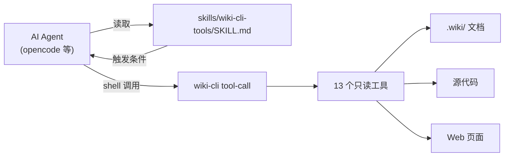
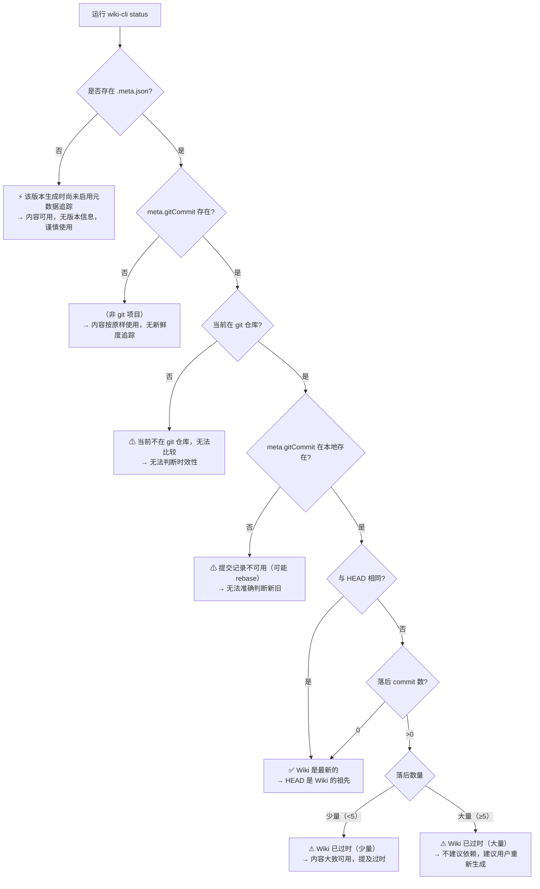

# AI Agent Skill 集成

## 从 Shell 到工具化的桥梁

`wiki-cli` 提供了一组只读工具，任何具备 **Shell 执行能力** 的 AI Agent（如 opencode、Claude Code 等）都可以通过统一的 `tool-call` 子命令与之交互。这套集成方案的核心文件是 `skills/wiki-cli-tools/SKILL.md`——它是一个自描述的 **Skill 定义**，告诉 AI Agent 何时触发、如何调用、什么该做什么不该做。



所有工具输出统一的 JSON 格式：`{"type":"success"|"error","data":...}`。这个契约使得 Agent 无需额外解析库，直接用 shell 取回结构化结果。[来源](src/commands/tool-call.ts#L1-L47)

---

## 技能触发条件

SKILL.md 的 `description` 字段定义了 Agent 的激活场景：

| 触发信号 | 典型用户提问 |
|----------|-------------|
| 代码库理解 | "这个项目的架构是怎么样的？"、"解释一下认证模块" |
| 文档查找 | "有 API 文档吗？"、"README 里怎么说的？" |
| 设计模式/架构 | "用了什么设计模式？"、"目录结构是怎样的？" |
| Web 文档抓取 | 用户贴出文档 URL、GitHub README 链接、API 参考页面 |

当用户提到"Wiki"或代码库相关问题时，Agent 应当优先考虑激活此技能。[来源](skills/wiki-cli-tools/SKILL.md#L1-L12)

---

## 前置依赖检查

Agent 在首次调用前必须验证 `wiki-cli` 命令是否可用：

```bash
# 检查是否已安装
which wiki-cli
# 或
npx wiki-cli --help
```

如果未安装，Agent 应向用户说明情况并请求授权安装：

> wiki-cli 尚未安装。需要执行 `npm install -g wiki-cli` 才能使用 Wiki 工具。是否安装？

用户授权后，Agent 可执行安装。源码仓库位于 https://github.com/epheiamoe/wiki-cli。

此外，特定工具有自己的前置条件：

- **semantic_search**：需要配置 Embedding 模型（通过 `wiki-cli config --embedding-only`）
- **fetch_web_markdown**：需要网络连通，可选配 Jina Reader API Key
- **所有 Wiki 工具**：需要先运行过 `wiki-cli generate` 生成文档

[来源](skills/wiki-cli-tools/SKILL.md#L16-L25)

---

## 13 个工具的 Shell 调用格式

所有工具通过 `wiki-cli tool-call <name> '<json-args>'` 调用。参数必须以 JSON 字符串形式传入。

### Wiki 目录（4 个）

| 工具 | 调用示例 | 用途 |
|------|---------|------|
| `semantic_search` | `wiki-cli tool-call semantic_search '{"query":"authentication flow","max_results":5}'` | 语义搜索，适合概念性问题 |
| `search_wiki` | `wiki-cli tool-call search_wiki '{"query":"OAuth","max_results":5}'` | 关键词搜索，快，适合精确匹配 |
| `list_wiki_pages` | `wiki-cli tool-call list_wiki_pages '{}'` | 列出所有 Wiki 页面 |
| `read_wiki` | `wiki-cli tool-call read_wiki '{"slug":"project-architecture"}'` | 按 slug 读取完整页面内容 |

### 文件系统（4 个）

| 工具 | 调用示例 | 用途 |
|------|---------|------|
| `list_directory` | `wiki-cli tool-call list_directory '{"dir_path":".","max_depth":3}'` | 目录树 |
| `list_files` | `wiki-cli tool-call list_files '{"path":".","extensions":[".ts"]}'` | 按扩展名过滤文件列表 |
| `read_file` | `wiki-cli tool-call read_file '{"file_path":"src/index.ts","start_line":1,"end_line":50}'` | 读取文件（支持行范围） |
| `search_in_files` | `wiki-cli tool-call search_in_files '{"path":".","pattern":"export class","extensions":[".ts"]}'` | 正则搜索文件内容 |

### Git（3 个）

| 工具 | 调用示例 | 用途 |
|------|---------|------|
| `git_log` | `wiki-cli tool-call git_log '{"max_count":10,"path":"src/"}'` | 获取提交历史 |
| `git_show` | `wiki-cli tool-call git_show '{"object":"abc123","path":"src/main.ts"}'` | 查看 Git 对象 |
| `git_remote_info` | `wiki-cli tool-call git_remote_info '{}'` | 获取远程仓库信息 |

### 其他（2 个）

| 工具 | 调用示例 | 用途 |
|------|---------|------|
| `fetch_web_markdown` | `wiki-cli tool-call fetch_web_markdown '{"url":"https://example.com/docs"}'` | 抓取 URL 并转为 Markdown |
| `dotenv_template` | `wiki-cli tool-call dotenv_template '{}'` | 读取 `.env.example` |

所有工具定义在 `src/ai/tools.ts` 中以统一的 `ToolDefinition` 接口注册，包含 name、description 和 JSON Schema 参数定义。[来源](src/ai/tools.ts#L21-L126)

---

## Agent 核心使用场景

### 语义搜索：当关键词不够用时

`semantic_search` 基于 Embedding 向量的余弦相似度匹配，适合回答"这个项目如何处理错误？"、"架构中有哪些关键抽象？"这类需要理解语义而非匹配关键词的问题。

```bash
wiki-cli tool-call semantic_search '{"query":"认证和授权机制","max_results":3}'
```

**实现原理**：将查询文本转为 Embedding 向量，与预计算并缓存的各页面 Embedding 做余弦相似度排序。缓存带 `_model` 元数据，切换模型自动重算。[来源](src/ai/embeddings.ts#L86-L124)

**前置条件**：需要配置 Embedding Provider。Agent 可在调用前检查返回值，如果返回 `"Embedding not configured"` 错误，则应降级使用 `search_wiki`。

### 关键词搜索：快速定位

`search_wiki` 是全表扫描的字符串包含匹配，**不需要 Embedding 配置**，响应更快。适合查找特定 API 名称、错误信息、配置项等。

```bash
wiki-cli tool-call search_wiki '{"query":"token","max_results":5}'
```

返回结果包含 slug、title、snippet（匹配位置前后各截取 60/120 字符）和 score。[来源](src/ai/tools.ts#L310-L349)

### 页面读取：获取完整上下文

`read_wiki` 返回指定页面的完整 Markdown 内容。Agent 应在以下场景中优先使用：

1. 用户询问某个特定话题的细节
2. 语义搜索命中后获取完整页面
3. 需要理解跨多个代码文件的高级抽象

```bash
wiki-cli tool-call read_wiki '{"slug":"llm客户端设计"}'
```

读取时支持 **模糊匹配**：如果精确 slug 未找到，会遍历所有 `.md` 文件查找包含关系。[来源](src/ai/tools.ts#L271-L293)

### Web 抓取：外部分档补全

`fetch_web_markdown` 通过 **Jina Reader** 将 URL 内容转为干净的 Markdown，不保留广告、导航栏等噪音。

```bash
wiki-cli tool-call fetch_web_markdown '{"url":"https://github.com/epheiamoe/wiki-cli"}'
```

**重试策略**：
- 429 限流：指数退避，退避公式 `2^(attempt+1)` 秒
- 5xx 服务端错误：指数退避，`2^attempt` 秒
- 超时：15 秒 AbortController
- 最多重试 3 次

Agent 可以配置自定义 Jina Reader 实例，通过 `wiki-cli config` 的 Web Fetch 设置项配置 base URL 和 API Key。[来源](src/ai/tools.ts#L378-L426)

---

## Wiki 新鲜度判定决策树

在执行任何 Wiki 读取操作前，Agent 应通过 `wiki-cli status` 检查文档时效性。status 命令输出 **5 种可区分的状态**，Agent 应根据状态决定后续行为：



决策规则：

| 状态 | Agent 行为 |
|------|-----------|
| ✅ Wiki 是最新的 | 正常使用，无需提示 |
| ⚠ Wiki 已过时（少量） | 继续使用，在回答末尾注明"注意：Wiki 落后 N 个 commit" |
| ⚠ Wiki 已过时（大量） | **不要依赖 Wiki 内容**。主动告知用户并建议重新生成 |
| ⚡ 无元数据 | 内容可能有用，但无版本信息，使用判断力 |
| （非 git 项目） | 内容按原样使用，告知用户无法追踪 |

Agent 还可以使用 `wiki-cli status --log` 和 `wiki-cli status --stat` 获取变更日志细节。[来源](src/commands/status.ts#L60-L136)

---

## 后台生成与进度轮询

当用户授权重新生成 Wiki 后，Agent 应当以 **后台进程** 方式运行，避免阻塞对话：

```bash
# 在项目根目录运行
wiki-cli generate --silent --parallel > /tmp/wiki-gen.log 2>&1 &
WIKI_PID=$!
```

### 关键参数

| 参数 | 必须？ | 说明 |
|------|--------|------|
| `--silent` | **是** | 无交互提示，否则进程会在等待 stdin 输入时挂起 |
| `--parallel` | 推荐 | 并发生成，大型项目可提速 3-5 倍 |
| `-c <N>` | 可选 | 并发数，默认 3，建议 3-5 |
| `--retry <N>` | 可选 | 失败页面自动重试次数 |

### 进度轮询方案

```bash
# 检查最新输出
tail -20 /tmp/wiki-gen.log

# 检查是否完成（输出中包含 "Wiki generated at" 表示成功）
if grep -q "Wiki generated at" /tmp/wiki-gen.log; then
  echo "Generation complete"
fi

# 检查失败页数
grep -c "Failed:" /tmp/wiki-gen.log
```

**轮询策略**：
- 用户无事可做时：每 **10-15 秒** 检查一次进度
- 用户忙于其他任务时：优先处理用户任务，等空闲时再检查
- 完成时：提取输出中的结果摘要，告知用户有多少页面成功/失败

生成的 Wiki 位于 `.wiki/<timestamp>/` 目录，`--browse` 标志可在完成后自动启动浏览器。[来源](skills/wiki-cli-tools/SKILL.md#L99-L127)

---

## 安全与成本约束

### 绝对不擅自运行 generate

**这是最核心的约束。** `wiki-cli generate` 会调用 LLM API 对代码库进行分析和文档生成，消耗 **API 额度**（Token 费用）。即使 Agent 判断 Wiki 已过期，也必须先向用户解释原因、说明成本、**等待用户明确授权**后才能执行。

建议的沟通模式：

> Wiki 落后当前代码库 N 个 commit，继续使用过时文档可能导致不准确。建议重新生成以保持一致性。这将消耗 LLM API 额度（约 X 个页面 × Y tokens/页 ≈ Z 美元）。是否运行 `wiki-cli generate`？

### API 消耗警告

| 操作 | 潜在消耗 | 说明 |
|------|---------|------|
| `generate` | 高 | 每页调用一次 LLM + 大纲阶段多次调用 |
| `semantic_search` | 中 | 查询文本调 Embedding API（一次），但页面 Embedding 已缓存 |
| `fetch_web_markdown` | 低 | 仅网络请求，无 LLM 调用，但有 Jina Reader 额度 |
| 其余工具 | 无 | 纯本地操作，无 API 调用 |

`fetch_web_markdown` 也有 API 限额（取决于 Jina Reader 的免费层策略），Agent 应避免重复抓取已获取过的 URL。[来源](skills/wiki-cli-tools/SKILL.md#L82-L92)

### 工作目录约束

所有 `wiki-cli` 命令应在项目根目录执行（即包含 `.wiki/` 目录或源代码的地方）。如果 Agent 不在正确目录，可使用 `-C <path>` 参数指定：

```bash
wiki-cli -C /path/to/project status
wiki-cli -C /path/to/project tool-call read_wiki '{"slug":"architecture"}'
```

[来源](skills/wiki-cli-tools/SKILL.md#L129-L132)

---

## 相关页面

- [工具调用接口](工具调用接口.md) — `tool-call` 子命令的详细实现
- [工具系统与Function Calling](工具系统与function-calling.md) — 13 个工具的完整定义、注册和执行架构
- [查看Wiki状态](查看wiki状态.md) — status 命令的版本比对逻辑
- [生成Wiki文档](生成wiki文档.md) — 两阶段生成引擎的完整流程
- [AI代码问答](ai代码问答.md) — AI 问答模式中的工具调用集成