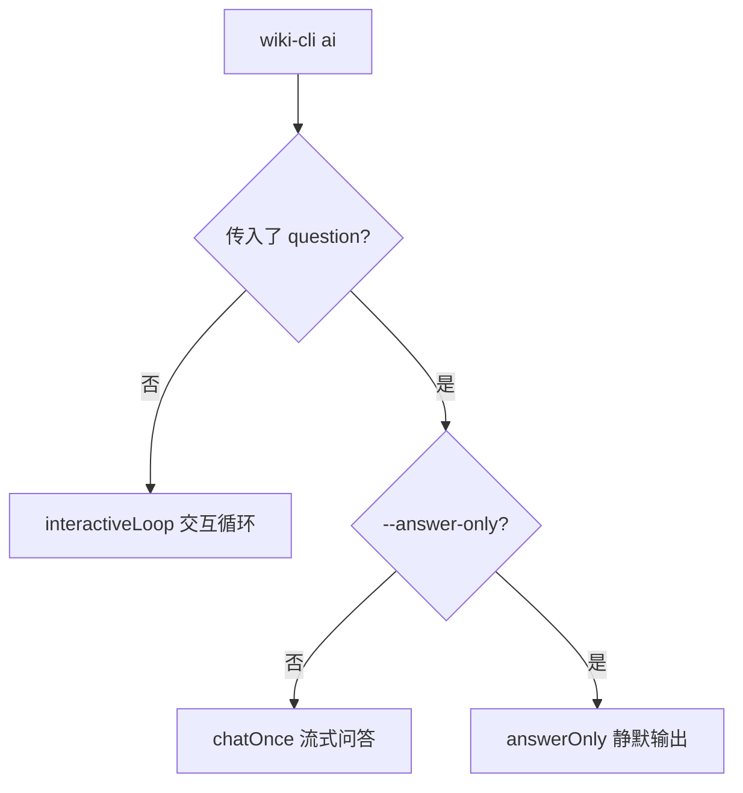

# AI 代码问答

`wiki-cli ai` 是项目的 AI 对话入口——它不是一个简单的聊天机器人，而是一个深度集成代码分析能力的 **AI Agent**。它可以理解项目整体架构、读取 Wiki 文档、搜索源码、调用 Git 历史，还能在你按 `Ctrl+C` 中断后优雅恢复。这一切由三种问答模式、动态工具过滤和会话持久化共同支撑。

---

## 三种问答模式

`ai` 命令根据调用方式的不同进入三种模式，分别对应不同的使用场景。



### 单次问答（chatOnce）

当你在命令行直接传入问题（`wiki-cli ai "这个项目用了什么框架"`）时触发。这是最常用的非交互模式。

执行流程是一个 **工具调用循环**，最多迭代 50 轮：

1. 将用户问题追加到 `messages` 数组
2. 调用 `client.chatStream()` 发起流式请求
3. 逐块处理返回的 StreamChunk：内容块直接 `process.stdout.write` 实时输出；`reasoning` 块用黄色斜体标记 "Thinking:" 前缀；`tool_call` 块按 `index` 归并参数
4. 如果模型返回了工具调用（`hasToolCalls`），逐个执行工具并将结果以 `role: 'tool'` 追加回消息列表，然后进入下一轮迭代
5. 如果没有工具调用，将最终内容存入消息列表并返回

关键设计是 **工具调用的流式归并**：由于模型可能分多次发送同一个工具调用的参数（streaming mode），代码用 `toolCallsMap` 以 `index` 为 key 做增量拼接，确保完整参数传给 `executeToolCall`。[来源](src/commands/ai.ts#L132-L237)

### 静默输出（answerOnly）

通过 `-a` 或 `--answer-only` 标志触发，专为脚本化调用设计。与 `chatOnce` 的核心区别在于：

- 使用非流式 API `client.chat()` 而非流式
- 不在终端打印任何中间过程（无 "Thinking:"、无实时输出）
- 仅在循环结束后返回最终的纯文本结果

迭代逻辑与 `chatOnce` 一致：最多 50 轮工具调用，有工具就执行、无工具就返回。[来源](src/commands/ai.ts#L239-L287)

### 交互循环（interactiveLoop）

不传 `question` 时进入交互模式。核心是一个 `while(true)` 循环配合 `readline/promises` 的 `question` 方法，每次用户输入后调用 `chatOnce` 处理，并在完成后自动保存会话。

其特殊之处在于 **每一步都有状态持久化**：

```typescript
session.messages = messages.slice(1);            // 剔除 system prompt
session.summary = ...;                             // 取第一条用户消息作为摘要
await saveSession(session);                        // 每次问答后自动保存
```

这意味着即使程序崩溃，最多丢失最后一次问答的内容。[来源](src/commands/ai.ts#L289-L398)

---

## AI 系统提示渲染

系统提示并非硬编码在源码中，而是通过 [Prompt 模板系统](prompt模板系统.md) 从外部文件加载。模板文件位于 `prompts/ai-system.md`，核心变量注入由 `renderPrompt` 函数完成。

### 模板变量

| 变量 | 注入值 | 来源 |
|------|--------|------|
| `{{workDir}}` | `resolve(process.cwd())` — 当前工作目录绝对路径 | `src/commands/ai.ts#L63` |
| `{{os}}` | `process.platform + ' ' + process.arch` | `src/commands/ai.ts#L103` |
| `{{wikiInfo}}` | 动态检测 `hasWiki` 后的描述文本 | `src/commands/ai.ts#L70-L78` |
| `{{wikiTools}}` | 根据 `hasWiki` 决定是否展示 Wiki 工具说明 | `src/commands/ai.ts#L107-L111` |

### Wiki 信息检测

代码通过检查 `.wiki/` 目录的存在与否决定 `wikiInfo` 和 `wikiTools` 的内容：

- 有 Wiki：显示版本数量、最新版本号，并列出 `list_wiki_pages` 和 `read_wiki` 两个工具
- 无 Wiki：显示"该项目没有 Wiki 文档"，且工具列表为空

如果检测到没有 Wiki，会询问用户是否要先生成，选"是"则转入 `generateCommand`。[来源](src/commands/ai.ts#L70-L78)

### Prompt 模板逻辑

`prompts/ai-system.md` 中内置了 AI 的行为准则：

1. 先读 Wiki 获取项目全貌，再探源码精确回答
2. 如果 Wiki 信息不足，明确告知用户
3. 回答简洁结构化，关键概念用**粗体**
4. 标注代码来源，路径从项目根目录开始
5. 支持持续对话，可基于历史深入追问

这些规则确保 AI 的输出风格与项目自身的 Wiki 文档风格一致。[来源](prompts/ai-system.md)

---

## 工具过滤逻辑

AI 可用的工具不是固定的 13 个——代码会在运行时动态隐藏不相关的工具，减少模型的选择干扰。

```typescript
// 始终隐藏 Wiki 工具（无 Wiki 时）
const skipTools = new Set(['list_wiki_pages', 'read_wiki', 'search_wiki']);

// 无 Embedding 配置时额外隐藏语义搜索
if (!hasEmbedding) skipTools.add('semantic_search');

// 无 Wiki 时全部隐藏
if (!hasWiki) {
  skipTools.add('list_wiki_pages');
  skipTools.add('read_wiki');
  skipTools.add('search_wiki');
  skipTools.add('semantic_search');
}
```

过滤逻辑的精髓：**条件叠加而非互斥**。

- `list_wiki_pages`、`read_wiki`、`search_wiki` 三剑客只要有 Wiki 就暴露，否则隐藏
- `semantic_search` 需要 Wiki + Embedding 配置**同时存在**才可用
- `fetch_web_markdown` 的显隐由 `getFilteredTools()` 根据 `webFetchConfig.disabled` 决定，不在 `skipTools` 层面处理[来源](src/commands/ai.ts#L82-L98)

最终的工具列表传递给模型的 `tools` 参数，模型只能看到 `allToolDefs` 中的可见工具。[来源](src/ai/tools.ts#L296-L301)

---

## Ctrl+C 打断与恢复

交互模式中，长时间的工具调用循环可能持续数十秒。用户按下 `Ctrl+C` 不会杀死进程，而是触发一个优雅的中断-恢复机制。

### 注册与清理

```typescript
let streamingCancelled = false;
const sigHandler = () => { streamingCancelled = true; };
process.on('SIGINT', sigHandler);
try {
  await chatOnce(client, messages, tools, input, () => streamingCancelled);
} finally {
  process.removeListener('SIGINT', sigHandler);
}
```

关键设计点：**每次问答前注册、结束后立即移除**。这避免了多次问答累积多个监听器导致的内存泄漏或逻辑混乱。[来源](src/commands/ai.ts#L305-L311)

### 两处检查点

`chatOnce` 内部在两个位置检查 `isCancelled` 回调：

1. **迭代开始前** — 检查是否在上一次工具调用执行期间被中断。如果已累积到内容，存入消息列表并返回；否则返回 `null`
2. **流式迭代中** — 检查是否在本次模型响应流中被中断。将已收到的内容追加到 `accumulatedContent`，打印 `⏹ (interrupted)` 标记

两处检查确保无论中断发生在哪个阶段，已收到的内容都不会丢失。[来源](src/commands/ai.ts#L139-L148)

### 中断后的状态

中断返回后，`interactiveLoop` 会照常执行 `session.messages = messages.slice(1)` 和 `saveSession(session)`。这意味着用户可以立即输入下一个问题，AI 会基于已累积的上下文继续对话。[来源](src/commands/ai.ts#L383-L388)

---

## 斜杠命令

交互模式下，输入以 `/` 开头的行触发命令处理。以下 10 个命令按功能分组为 7 类：

| 命令 | 功能 | 实现要点 |
|------|------|----------|
| `/exit` `/quit` | 退出交互并自动保存会话 | 调用 `exitSession()` → `saveSession` + 打印恢复命令 `wiki-cli ai --session <id>` |
| `/save` | 手动保存当前会话 | 将 `messages.slice(1)` 写入 `session.messages`，覆盖保存至 JSON 文件 |
| `/undo` | 撤回上一条用户消息 | 从 `messages` 末尾向前查找最新的一条约 `role: 'user'`，删除该消息及之后的所有消息 |
| `/clear` | 清屏 | `console.clear()` |
| `/session` | 显示当前会话 ID 和摘要 | 打印 `session.id` 和 `session.summary` |
| `/sessions` | 列出所有保存的会话 | `listSessions()` + `showSessionsTable()` |
| `/switch <id>` | 切换到指定会话 | 先 `saveSession` 当前会话，再 `loadSession` 目标会话，重建 `messages`（新 system prompt + 旧消息） |
| `/new` | 创建新会话 | 先 `saveSession` 当前会话，再 `createSession()`，重置 `messages` 为仅含 system prompt |
| `/wiki` | 生成 Wiki 文档 | 动态 `import('./generate.js')` 后调用 `generateCommand()` |
| `/help` | 显示帮助信息 | 打印所有命令列表 |

[来源](src/commands/ai.ts#L326-L394)

每个命令的共性模式是：**修改 `messages` 数组和 `session` 对象但不立即写入磁盘**，真正的持久化发生在每次正常问答结束后的自动保存中。`/save` 和 `/exit` 是显式的保存触发点。

---

## 会话 CRUD

会话的管理由 `src/ai/ai-session.ts` 提供完整的增、删、改、查操作，详见 [AI 会话管理系统](ai会话管理系统.md)。

### 存储结构

每个会话保存为 `.wiki/sessions/{id}.json` 文件：

```json
{
  "id": "a1b2c3d4",
  "created": "2024-01-15T10:30:00.000Z",
  "updated": "2024-01-15T11:45:00.000Z",
  "summary": "如何添加新的工具函数",
  "messages": [
    { "role": "user", "content": "..." },
    { "role": "assistant", "content": "..." }
  ]
}
```

会话 ID 使用 `randomUUID().slice(0, 8)` 生成，确保短且唯一。[来源](src/ai/ai-session.ts#L22-L24)

### 生命周期

```
createSession() → 交互循环 → 自动 saveSession → exit → saveSession
     ↑                                        |
     └────── /new /switch <id> ───────────────┘
```

`aiCommand` 的入口处会检查 `--session <id>` 参数：如果提供，调用 `loadSession` 恢复历史会话并重建 `messages`；否则调用 `createSession` 创建全新的会话。[来源](src/commands/ai.ts#L113-L122)

`--list-sessions` 和 `--delete-session <id>` 则是对会话列表和删除操作的 CLI 快捷入口，不进入问答流程。[来源](src/commands/ai.ts#L28-L42)

---

## 下一步

- 深入了解会话生命周期的完整实现：[AI 会话管理系统](ai会话管理系统.md)
- 了解 AI 可调用的 13 个工具定义与过滤机制：[工具系统与 Function Calling](工具系统与function-calling.md)
- 学习 Prompt 模板的变量注入引擎：[Prompt 模板系统](prompt模板系统.md)
- 探索 LLM 客户端的流式/非流式实现：[LLM 客户端设计](llm客户端设计.md)