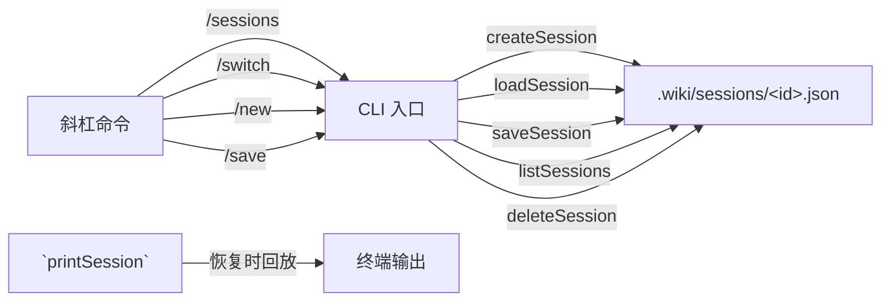

## 设计原理

AI 对话模式的核心资产是**会话历史**。每条消息、每次工具调用都需要持久化，才能支持中断恢复、历史回溯和多会话切换。会话管理模块将这些需求抽象为一组围绕 `Session` 接口的读写操作，全部基于本地文件系统，无需外部数据库。

[来源](src/ai/ai-session.ts#L1-L13)

---

## Session 接口

```typescript
interface Session {
  id: string;       // 8 位随机标识
  created: string;  // ISO 8601 创建时间
  updated: string;  // ISO 8601 最近更新时间
  summary: string;  // 会话摘要（取自第一条用户消息前 60 字符）
  messages: ChatMessage[];  // 完整消息数组（含 system/user/assistant/tool）
}
```

`ChatMessage` 接口兼容 OpenAI 多轮对话格式，包含 `role`、`content`、`reasoning_content` 和 `tool_calls` 等字段，直接来自 [LLM 客户端](llm客户端设计.md) 的定义。工具调用的嵌套结构（`tool_calls` 数组 + 后续 `tool` 角色消息）也被完整保留。

[来源](src/ai/ai-session.ts#L5-L12) | [来源](src/ai/llm-client.ts#L4-L12)

---

## 文件级持久化

所有会话存储在工作目录下的 `.wiki/sessions/` 目录中，每个会话独立为一个 JSON 文件，路径为 `.wiki/sessions/<id>.json`。

### 目录保障

```typescript
// 惰性创建：仅在首次写入前检查目录是否存在
export async function ensureSessionsDir(): Promise<void> {
  if (!existsSync(SESSIONS_DIR)) {
    await mkdir(SESSIONS_DIR, { recursive: true });
  }
}
```

`ensureSessionsDir` 在每个写操作（创建/保存）前被调用，用同步 `existsSync` 检查再异步创建，避免不必要的系统调用。

### 路径映射

```typescript
export function sessionPath(id: string): string {
  return join(SESSIONS_DIR, `${id}.json`);
}
```

常量 `SESSIONS_DIR = '.wiki/sessions'` 硬编码为相对于工作目录的路径。`sessionPath` 是唯一的路由函数，加载、保存、删除都通过它定位文件。

[来源](src/ai/ai-session.ts#L14-L24)

---

## 8 位会话 ID 生成

```typescript
export function generateSessionId(): string {
  return randomUUID().slice(0, 8);
}
```

使用 Node.js 内置 `crypto.randomUUID()` 生成标准 UUID v4，然后截取前 8 个字符。8 位的十六进制字符串提供 **32 位熵**（约 43 亿种组合），在实际使用中碰撞概率可忽略，同时保持了 ID 的视觉紧凑性（如 `a1b2c3d4`）。

[来源](src/ai/ai-session.ts#L26-L29)

---

## 核心操作函数

### 创建会话

```typescript
export async function createSession(): Promise<Session> {
  await ensureSessionsDir();
  const id = generateSessionId();
  const now = new Date().toISOString();
  const session: Session = { id, created: now, updated: now, summary: '新会话', messages: [] };
  await writeFile(sessionPath(id), JSON.stringify(session, null, 2), 'utf-8');
  return session;
}
```

创建时 `created` 和 `updated` 均为同一时间戳，摘要默认为 `'新会话'`，消息数组为空。文件立即写入磁盘，保证即使后续流程失败也不会丢失会话记录。

### 列出会话（按 updated 降序）

```typescript
export async function listSessions() {
  if (!existsSync(SESSIONS_DIR)) return [];
  const files = await readdir(SESSIONS_DIR);
  // 过滤 .json 文件，解析后提取元数据
  sessions.sort((a, b) =>
    new Date(b.updated).getTime() - new Date(a.updated).getTime()
  );
  return sessions;
}
```

读取整个 `sessions` 目录，解析每个 `.json` 文件（跳过解析失败的损坏文件），提取 `id`、`created`、`updated`、`summary` 四个字段。排序使用 `updated` 字段的毫秒时间戳做**降序排列**——最近交互的会话永远排在列表顶部。

### 加载与保存

- **`loadSession(id)`**：通过 `sessionPath(id)` 读取文件，反序列化为 `Session` 对象；文件缺失或 JSON 异常时返回 `null`。
- **`saveSession(session)`**：将 `session.updated` 更新为当前时间（`new Date().toISOString()`），再写回磁盘。这种"写入时刷新时间戳"的策略使得 `listSessions` 的排序天然反映活跃度。

### 删除会话

```typescript
export async function deleteSession(id: string): Promise<boolean> {
  const p = sessionPath(id);
  if (!existsSync(p)) return false;
  await rm(p);
  return true;
}
```

先用同步 `existsSync` 判断文件是否存在，再用 `fs.rm` 删除。返回布尔值供调用方判断操作是否真实生效。

[来源](src/ai/ai-session.ts#L31-L81)

---

## 可视化输出

### 表格列表：`showSessionsTable`

```typescript
export function showSessionsTable(sessions) {
  for (const s of sessions) {
    const date = new Date(s.updated).toLocaleString('zh-CN',
      { month: '2-digit', day: '2-digit', hour: '2-digit', minute: '2-digit' });
    console.log(`  ${s.id}  ${date}  ${s.summary.slice(0, 40)}`);
  }
}
```

输出格式为三列左对齐：

```
  a1b2c3d4  12/25 14:30  如何配置 LLM 的多轮对话参数
  e5f6g7h8  12/24 09:15  新会话
```

行首两个空格缩进，摘要截断至 40 字符防止溢出。日期使用 `zh-CN` 区域格式。

### 会话回放：`printSession`

```typescript
export function printSession(session: Session): void {
  for (const msg of session.messages) {
    if (msg.role === 'user') {
      const text = msg.content || '';
      if (!text.startsWith('/')) {    // 跳过斜杠命令
        console.log(`\n${chalk.green('You >')} ${text}`);
      }
    } else if (msg.role === 'assistant') {
      console.log(`${msg.content || ''}`);
    }
  }
}
```

恢复会话时调用，逐条回放历史消息。**过滤规则**：用户消息中所有以 `/` 开头的斜杠命令被跳过（这些是元操作，不应出现在对话流中）；助手消息直接输出内容。工具调用（`tool_calls`）和工具执行结果（`tool` 角色）不输出——回放聚焦于人机对话本身，不展示内部工具交互细节。

[来源](src/ai/ai-session.ts#L83-L92) | [来源](src/ai/ai-session.ts#L94-L107)

---

## 斜杠命令与会话的绑定

在 [AI代码问答](ai代码问答.md) 的交互式循环中，会话管理通过斜杠命令暴露给用户：

| 命令 | 绑定的会话操作 | 说明 |
|---|---|---|
| `/session` | 读取 `session.id` + `session.summary` | 查看当前会话 ID 和摘要 |
| `/sessions` | `listSessions()` + `showSessionsTable()` | 列出所有已保存会话 |
| `/switch <id>` | `loadSession()` → 替换 `messages` → `saveSession()` | 切换前自动保存当前会话 |
| `/new` | `saveSession()` → `createSession()` | 保存当前会话并创建新会话 |
| `/save` | `saveSession()` | 手动触发持久化 |
| `/exit`, `/quit` | `saveSession()` → 退出循环 | 退出前保存 |

`/switch` 的实现值得注意：加载目标会话后，**保留当前的 system prompt**（从 `messages[0]` 提取），仅替换后续的消息历史。这使得跨会话切换时上下文身份一致。

`/new` 同样先保存当前会话，再创建新的空会话——**不会丢失未保存的对话**。

[来源](src/commands/ai.ts#L143-L164) | [来源](src/commands/ai.ts#L167-L198)

---

## 命名行选项

除了交互式斜杠命令，CLI 入口也提供了两个会话相关的命令行参数：

```typescript
if (options.listSessions) {
  const sessions = await listSessions();
  showSessionsTable(sessions);
  return;
}

if (options.deleteSession) {
  const ok = await deleteSession(options.deleteSession);
  // ...
}
```

通过 `wiki-cli ai --list-sessions` 和 `wiki-cli ai --delete-session <id>` 可以在非交互模式下直接管理会话。

而 `--session <id>` 选项则用于恢复指定会话进入交互模式：

```typescript
const existing = await loadSession(options.session);
session = existing;
restoredSession = existing;
messages = [{ role: 'system', content: systemPrompt }, ...session.messages.slice(1)];
```

`restoredSession` 标记让交互循环在启动时打印历史回放，帮助用户快速回忆之前的对话上下文。

[来源](src/commands/ai.ts#L27-L34) | [来源](src/commands/ai.ts#L80-L92) | [来源](src/commands/ai.ts#L107-L109)

---

## 数据流全景



所有会话操作最终映射到 `.wiki/sessions/` 目录下的 JSON 文件读写，不涉及任何外部服务。会话的完整生命周期——创建、持久化、列表、切换、删除——全部在文件系统层面完成，保持零外部依赖的简洁架构。