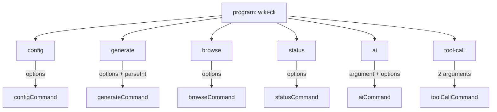

# CLI 入口与命令体系

## 程序入口

`src/cli.ts` 是整个应用的单一入口点，使用 Commander.js v12 构建。顶层配置定义了三个元属性：

```typescript
const program = new Command();
program
  .name('wiki-cli')
  .description('Auto-generate structured Wiki documentation for any local code repository')
  .version('1.0.0');
```

`name` 与 `package.json` 中的 `bin` 字段一致，确保 `--help` 输出时显示正确的可执行文件名。`version` 字符串硬编码于源文件而非从 `package.json` 动态读取，避免了运行时文件系统依赖。

当用户不带任何参数执行 `wiki-cli` 时，程序调用 `program.outputHelp()` 打印帮助信息后静默退出——这是 Commander 未提供原生"无参数时自动显示帮助"行为的替代方案。

[来源](src/cli.ts#L1-L13) | [来源](src/cli.ts#L79-L81)

---

## 命令注册

Commander 的 `.command()` 链式注册了六个子命令，每个命令都绑定一个 Action 回调。回调函数体内采用统一的 `try-catch + logError + process.exit(1)` 错误处理模板。

### Command: config

**签名**: `wiki-cli config [options]`

纯 Option 驱动，无 Argument。7 个选项全部为长格式，其中 `--llm-only` 和 `--embedding-only` 是 **boolean flag**，无参数值。该命令支持两种使用模式：

1. **全参数非交互模式**：同时提供 `--provider`、`--base-url`、`--model`、`--api-key` 时，直接写入配置并返回。
2. **部分/无参数交互模式**：使用 `inquirer` 引导用户逐步配置 LLM、Embedding 和 Web Fetch。

Action 回调接收一个 `options` 参数（Commander 自动将选项名转为驼峰），透传给 `configCommand`。

[来源](src/cli.ts#L15-L33) | [来源](src/commands/config.ts#L20-L38)

### Command: generate

**签名**: `wiki-cli generate [options]`

核心生成命令，定义了 11 个选项，是选项最复杂的命令。其中 8 个拥有短别名：

| 短别名 | 长格式 | 类型 | 默认值 |
|--------|--------|------|--------|
| `-C` | `--dir` | `<path>` | 当前目录 |
| `-u` | `--url` | `<url>` | — |
| `-o` | `--output` | `<path>` | `.wiki/<timestamp>` |
| `-b` | `--branch` | `<name>` | — |
| `-d` | `--depth` | `<n>` | — |
| `-t` | `--temp` | 无值 flag | false |
| `-p` | `--parallel` | 无值 flag | false |
| `-c` | `--concurrency` | `<n>` | `'3'` |
| `-r` | `--retry` | `<n>` | `'0'` |
| `-s` | `--silent` | 无值 flag | false |
| (无) | `--browse` | 无值 flag | false |

**关键是**：`-c` 和 `-r` 的默认值是**字符串**而非数字——Commander 的 `.option()` 默认值以字符串形式存储。Action 回调中通过 `parseInt` 执行手动转型：

```typescript
concurrency: options.concurrency ? parseInt(options.concurrency) : 3,
retry: options.retry ? parseInt(options.retry) : 0,
depth: options.depth ? parseInt(options.depth) : undefined,
```

这种设计是有意为之：Commander 的默认值类型无法覆盖 CLI 字符串输入的类型差异，统一在回调层做显式转换更可靠。

[来源](src/cli.ts#L37-L65) | [来源](src/commands/generate.ts#L42-L118)

### Command: browse

**签名**: `wiki-cli browse [options]`

仅 2 个选项，结构最简洁。`-p` 接受 Wiki 目录或项目根目录（自动检测 `.wiki` 子目录），`-u` 用于远程仓库场景——通过 `defaultRepoDir` 函数映射 URL 到本地缓存路径 [详见](工作目录解析与git集成.md)。

[来源](src/cli.ts#L67-L79)

### Command: status

**签名**: `wiki-cli status [options]`

5 个选项，其中 `-v/--version` 的短别名 `-v` 与 Commander 内置的 `--version` 冲突——但 Commander 对该冲突的处理方式是**优先使用用户自定义**，因此不会报错，但用户需注意 `wiki-cli -v` 仍输出程序版本，而 `wiki-cli status -v <ts>` 则设置 Wiki 版本参数。

`--log` 和 `--stat` 为 boolean flag，控制 `git log` 的输出格式。详见[查看Wiki状态](查看wiki状态.md)。

[来源](src/cli.ts#L81-L101)

### Command: ai

**签名**: `wiki-cli ai [options] [question]`

唯一同时定义了 **Argument 和 Option** 的命令。`[question]` 是可选位置参数，同时存在 `-q/--question <text>` 选项。Action 回调的签名与其他命令不同——Commander 对带 Argument 的命令回调签名为 `(arg1, arg2, ..., options)`，而非 `(options)`：

```typescript
.action(async (question, options) => {
  const q = options.question || question;  // 二选一
  ...
});
```

`options.question` 优先级高于位置参数 `question`。这种冗余设计允许用户自由选择 `wiki-cli ai "你的问题"` 或 `wiki-cli ai -q "你的问题"`。

带有 `-a/--answer-only` 的非流式模式（`answerOnly` 分支走 `client.chat()` 而非 `client.chatStream()`），适用于脚本集成场景。

[来源](src/cli.ts#L103-L132) | [来源](src/commands/ai.ts#L176-L196)

### Command: tool-call

**签名**: `wiki-cli tool-call <name> [args]`

两个 **Argument**：`<name>` 为必选工具名称，`[args]` 为可选 JSON 参数字符串。无 Options。

该命令的 Action 回调签名最为特殊：`(name, args)` ——不含 `options` 参数。这是为 AI Agent 提供的 JSON 输出接口，设计上力求最小化参数解析逻辑。详见[工具调用接口](工具调用接口.md)。

[来源](src/cli.ts#L134-L141)

---

## 错误处理模式

所有六个命令共享同一个错误处理结构：

```typescript
.action(async (...args) => {
  try {
    await commandHandler(...args);
  } catch (err: any) {
    logError(err.message);
    process.exit(1);
  }
});
```

`logError` 来自 `src/utils/progress.ts`，本质是 `console.log(chalk.red('✖'), msg)`，仅做格式化输出，不终止进程。`process.exit(1)` 由各个 Action 回调自行调用，确保错误码 1 传播到 Shell。

这种设计意味着：Commander 自身的 option 解析错误（如缺少必选 option 的值）由 Commander 内部处理并以非零退出；**业务逻辑错误**由 Command 的 Action 回调捕获。两套错误边界互不覆盖。

[来源](src/utils/progress.ts#L17-L19)

---

## Action 回调签名对比

| 命令 | 回调参数 | 是否有 Argument | 特殊处理 |
|------|----------|----------------|----------|
| config | `(options)` | 否 | 无 |
| generate | `(options)` | 否 | `parseInt` 转换 3 个数值选项 |
| browse | `(options)` | 否 | 无 |
| status | `(options)` | 否 | 无 |
| ai | `(question, options)` | 是 (`[question]`) | `options.question` 覆盖位置参数 |
| tool-call | `(name, args)` | 是 (`<name>` + `[args]`) | 无 options 对象 |

其中 `ai` 和 `tool-call` 使用 `.argument()` 方法定义位置参数，其余四个命令完全依靠 option 传参。

[来源](src/cli.ts#L24-L141)

---

## 跨平台注意事项

### 浏览器打开命令

`browse` 命令在启动 HTTP 服务器后需要打开系统默认浏览器，使用了平台判断的三元表达式：

```typescript
const start =
  process.platform === 'win32' ? 'start' :
  process.platform === 'darwin' ? 'open' : 'xdg-open';
```

`execSync` 调用被包裹在 try-catch 中，因为部分无头服务器环境可能缺少图形界面命令。详见[浏览Wiki](浏览wiki.md)。

[来源](src/commands/browse.ts#L117-L123)

### 临时目录

`--temp` 模式使用 `os.tmpdir()` 创建临时目录，Windows 下 `os.tmpdir()` 通常指向 `%TEMP%`，Linux/macOS 指向 `/tmp`。清理操作通过 `fs.promises.rm` 递归删除。

[来源](src/utils/workspace.ts#L42-L43) | [来源](src/utils/workspace.ts#L63-L67)

### Git 命令兼容性

`status` 和 `generate` 命令中通过 `child_process.execSync` 调用 Git 时，使用 `cwd` 选项而非 `chdir`，避免污染全局进程工作目录。分支检出操作在 `resolveWorkDir` 中执行，调用 `git checkout` 前验证目标路径是否为 Git 仓库。

[来源](src/utils/workspace.ts#L72-L80)

### 路径分隔符

`browse` 的路径净化函数 `sanitizePath` 显式处理 Windows 反斜杠和 Linux 斜杠两种分隔符，正则 `replace(/^[/\\\\]+/, '')` 双转义反斜杠以确保跨平台安全。详见[工作目录解析与Git集成](工作目录解析与git集成.md)。

[来源](src/commands/browse.ts#L261-L265)

---

## 元配置总结



Commander 的 `addHelpText` 方法未被使用——项目的帮助信息完全由 Commander 内置的 `description()` 和 `--help` 自动生成。`program.outputHelp()` 的调用发生在 `parse` 之后，利用了 Commander 在解析完成后仍可调用帮助方法这一特性。

[来源](src/cli.ts#L79-L81)

---

## 下一步

- 了解生成命令的内部运行机制：[生成Wiki文档](生成wiki文档.md)
- 分析工作目录解析和 Git 集成逻辑：[工作目录解析与Git集成](工作目录解析与git集成.md)
- 研究 AI 会话管理系统的设计：[AI会话管理系统](ai会话管理系统.md)