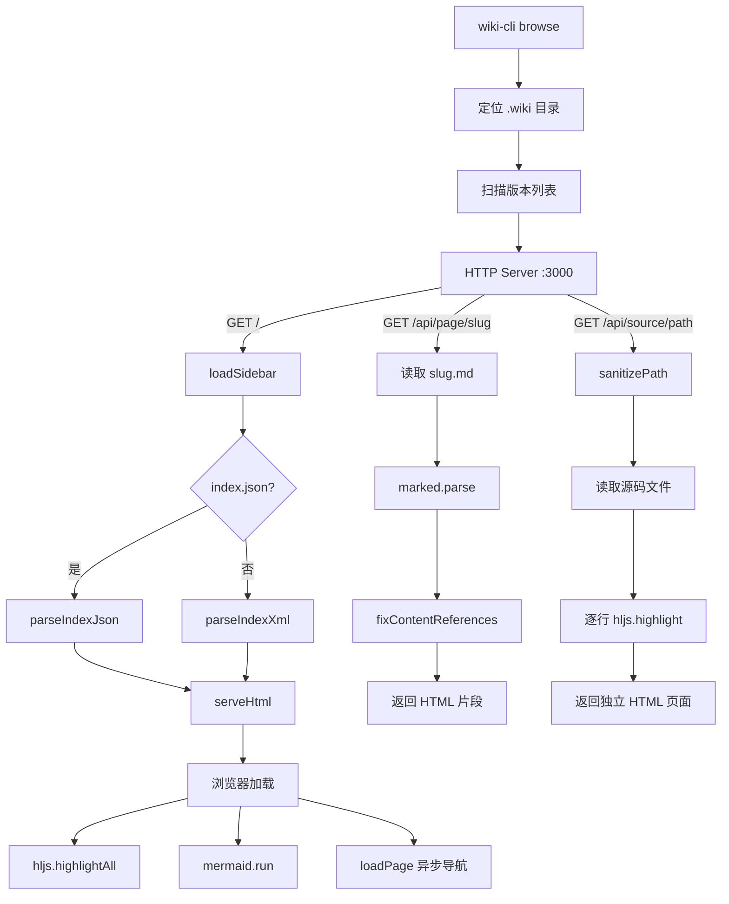

# HTTP 服务器与 Markdown 渲染

`wiki-cli browse` 命令启动一个纯前端 Wiki 浏览器——Node.js HTTP 服务器仅负责路由分发和文件读取，所有渲染（Markdown→HTML、代码高亮、Mermaid 图表）都在浏览器端由 CDN 加载的库完成。这种架构将服务端负载降至最低，同时保留了离线可浏览的可能性。

---

## 启动流程与目录发现

`browseCommand` 函数的首要任务是定位 `.wiki` 目录。它接收三个来源（优先级递减）：
1. `--path` 参数：显式指定的路径，支持直接指向 `.wiki` 子目录或项目根目录（自动探测嵌套的 `.wiki`）
2. `--url` 参数：远程仓库 URL，通过 `defaultRepoDir` 转换为本地缓存路径下的 `.wiki` 目录
3. 默认值：当前工作目录下的 `.wiki`

定位成功后，扫描目录下的所有版本子目录（排除 `temp` 和 `sessions`），按字母降序取首个为**最新版本**。随后通过 `findFreePort` 从 3000 开始寻找可用端口，启动 HTTP 服务并自动调用操作系统命令打开浏览器。

[来源](src/commands/browse.ts#L21-L67)

---

## 路由表：三种核心路径

服务器维护三条主要路由，分别对应 Wiki 浏览器的三个功能层面：

| 路由模式 | 职责 | 返回类型 |
|---|---|---|
| `/` | 渲染完整 HTML 页面（Sidebar + Content + Overlay） | `text/html` |
| `/api/page/:slug` | 返回单个页面的 Markdown 渲染 HTML | `text/html` |
| `/api/source/:path` | 返回源码查看页（行号高亮） | `text/html` |
| `/api/versions` | 返回所有版本的时间戳列表 | `application/json` |

**`/` 路由**：加载侧边栏（通过 `loadSidebar` 解析 `index.json` 或 `index.md`），取第一篇文档的首个页面作为初始内容，调用 `serveHtml` 拼装完整 HTML 响应。

**`/api/page/:slug` 路由**：将 slug 映射到 `{slug}.md` 文件，使用 `marked.parse` 将 Markdown 转为 HTML，再经 `fixContentReferences` 替换来源引用链接后返回纯 HTML 片段（无页面框架，由前端注入到内容区）。

**`/api/source/:path` 路由**：读取源码文件，逐行调用 `hljs.highlight` 实现行级高亮，生成独立 HTML 页面。支持 URL hash 定位（`#L12-L20` 格式），由页面内联的 DOMContentLoaded 脚本解析并高亮对应行。`sanitizePath` 函数通过 `normalize` + `resolve` 校验，防止路径穿越攻击。

此外，纯 `.md` 路径（非 `/api/` 前缀）会被 302 重定向到对应的 `/api/page/` 路由，兼容直接访问 `.md` 文件路径的行为。

[来源](src/commands/browse.ts#L74-L127)

---

## serveHtml：三层布局的完整页面

`serveHtml` 函数（第 389 行）是 Wiki 浏览器的核心——它生成一个**单页应用风格的完整 HTML 文档**，所有交互逻辑由内联 JavaScript 驱动。

### 布局结构

```
┌──────────────────────────────────────────────┐
│  .wrapper (flex, max-width: 1280px)          │
│  ┌──────────────┬───────────────────────────┐│
│  │ .sidebar     │ .content                  ││
│  │ 280px fixed  │ flex: 1, max-width: 900px ││
│  │ ────────     │ 滚动区域                  ││
│  │ 侧边栏标题    │ h1-h3, p, pre, table     ││
│  │ 导航项列表    │ code, blockquote         ││
│  │ 历史版本按钮  │ a.source-ref             ││
│  └──────────────┴───────────────────────────┘│
│                                              │
│  .overlay (position: fixed, z-index: 100)    │
│  ┌──────────────────────────────────────┐    │
│  │ .overlay-box                         │    │
│  │ 版本选择器（历史版本列表）            │    │
│  └──────────────────────────────────────┘    │
└──────────────────────────────────────────────┘
```

- **Sidebar**（左栏，280px）：由 `buildSidebarHtml` 从 `SidebarItem[]` 生成。每个导航项包含难度标记（🟢 初学 / 🟡 中级 / 🔴 高级），分组标题（`nav-group`）用于视觉分割。
- **Content**（右栏）：初始内容为第一篇文档的渲染结果，之后通过 `loadPage()` 函数异步加载和替换。
- **Overlay**（全屏遮罩层）：用于版本切换，CSS 类 `.show` 控制显隐，点击遮罩背景或按 Escape 键关闭。

[来源](src/commands/browse.ts#L389-L397)

### 暗色主题 CSS

整个样式基于 **GitHub Dark 配色方案**：

| 语义 | 色值 | 作用 |
|---|---|---|
| 背景 | `#0d1117` | 页面和 content 背景 |
| 面板 | `#161b22` | sidebar、pre、overlay-box |
| 边框 | `#30363d` | 分割线、表格边框、代码块边框 |
| 文字 | `#c9d1d9` | 正文 |
| 标题 | `#f0f6fc` | h1-h3 |
| 链接 | `#58a6ff` | 可点击元素 |
| 次要文字 | `#8b949e` | 侧边栏链接、引用文字 |
| 行号 | `#484f58` | code block line numbers |

`pre code` 的背景被重置为 `none`，避免双重背景叠加；`.source-ref` 来源引用链接采用边框按钮样式，与正文链接在视觉上区隔。

[来源](src/commands/browse.ts#L418-L461)

### 前端渲染管线

页面底部加载三个 CDN 资源：`highlight.js`、`highlight.js` 的 GitHub Dark 主题 CSS、`mermaid` 图表库。内联 JavaScript 控制完整的交互逻辑：

```javascript
// 初始化
mermaid.initialize({ startOnLoad: false, theme: 'dark' });

// 页面加载完成后
hljs.highlightAll();
mermaid.run({ nodes: document.querySelectorAll('.mermaid') });

// 异步加载页面
async function loadPage(encodedSlug) {
  const res = await fetch('/api/page/' + slug + '.md?version=' + currentVersion);
  const html = await res.text();
  document.getElementById('content').innerHTML = html;
  hljs.highlightAll();            // 重新高亮代码块
  mermaid.run({ ... });           // 渲染 Mermaid 图表
  history.replaceState(null, '', '#' + slug);
}
```

**执行顺序值得注意**：`hljs.highlightAll()` 和 `mermaid.run()` 各被调用两次——首次在 DOMContentLoaded 时作用于初始内容，第二次在 `loadPage()` 中作用于异步加载的新内容。`mermaid.initialize` 设置了 `startOnLoad: false`，因此首次渲染也必须显式调用 `mermaid.run`。

内容区域还注册了一个委托点击事件，拦截所有非外部链接：若链接以 `.md` 结尾，调用 `loadPage` 进行客户端导航；否则视为源码引用路径，通过 `window.open('/api/source/' + path)` 打开源码查看页。

[来源](src/commands/browse.ts#L502-L536)

---

## fixContentReferences：来源链接替换

Markdown 源文档中的来源引用采用 `[来源：src/path/to/file.ts#L10-L20]` 格式。`fixContentReferences` 通过正则将其替换为可点击的 HTML 链接：

```typescript
function fixContentReferences(html: string): string {
  return html.replace(
    /\[来源：([^\]]+)\]/g,
    '<a href="/api/source/$1" target="_blank" class="source-ref">[来源]</a>'
  );
}
```

这个替换出现在两个位置：
1. **首页渲染**：`serveHtml` 中读取第一篇文档后，对 `marked.parse` 的输出调用 `fixContentReferences`
2. **异步加载**：`/api/page/` 路由返回 Markdown 渲染结果前调用

替换后的链接以 `class="source-ref"` 修饰，在前端被内容区的点击委托捕获，打开新标签页展示行号高亮的源码视图。`/api/source/` 路由支持 `#L{line}` 和 `#L{start}-L{end}` 两种定位语法。

[来源](src/commands/browse.ts#L351-L355)

---

## 侧边栏的数据来源

`loadSidebar` 按优先级读取两种格式的索引文件：

1. **`index.json`**（首选）：通过 `parseIndexJson` 解析。先使用 `stripCodeFence` 移除潜在的代码围栏（` ```json ... ``` `），再提取 JSON，遍历 `sections[].topics[]`，从中提取 `title`、`level` 和 `type` 字段。`type === 'group'` 的条目作为分组标题。
2. **`index.md`**（降级）：通过 `parseIndexXml` 解析，扫描 `<section>` 标签内的 `<topic level="...">` 和 `<group>` 标签。

`slugify` 函数将中文标题转为 URL 兼容的 slug：小写化、非字母数字/中文字符替换为连字符、去除首尾连字符。

[来源](src/commands/browse.ts#L259-L334)

---

## 架构总结



这种架构的核心设计决策是：**服务端只做文件 I/O 和 Markdown 转换**，前端承担代码高亮、图表渲染、客户端路由和交互逻辑。这使得服务器实现极轻（单文件 540+ 行），同时允许用户在生成后完全离线浏览（只需将 CDN 资源本地缓存）。

[来源](src/commands/browse.ts#L389-L536)

---

## 推荐阅读

- [浏览Wiki](浏览wiki.md) — `browse` 命令的 CLI 参数与使用流程
- [源码查看与版本切换](源码查看与版本切换.md) — 源码高亮浏览器和 Git 版本切换的深入实现
- [生成Wiki文档](生成wiki文档.md) — 了解 `.wiki` 目录结构和索引文件如何生成
- [CLI入口与命令体系](cli入口与命令体系.md) — Commander.js 命令注册和参数解析