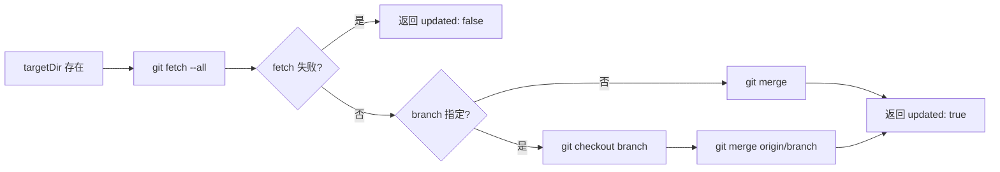
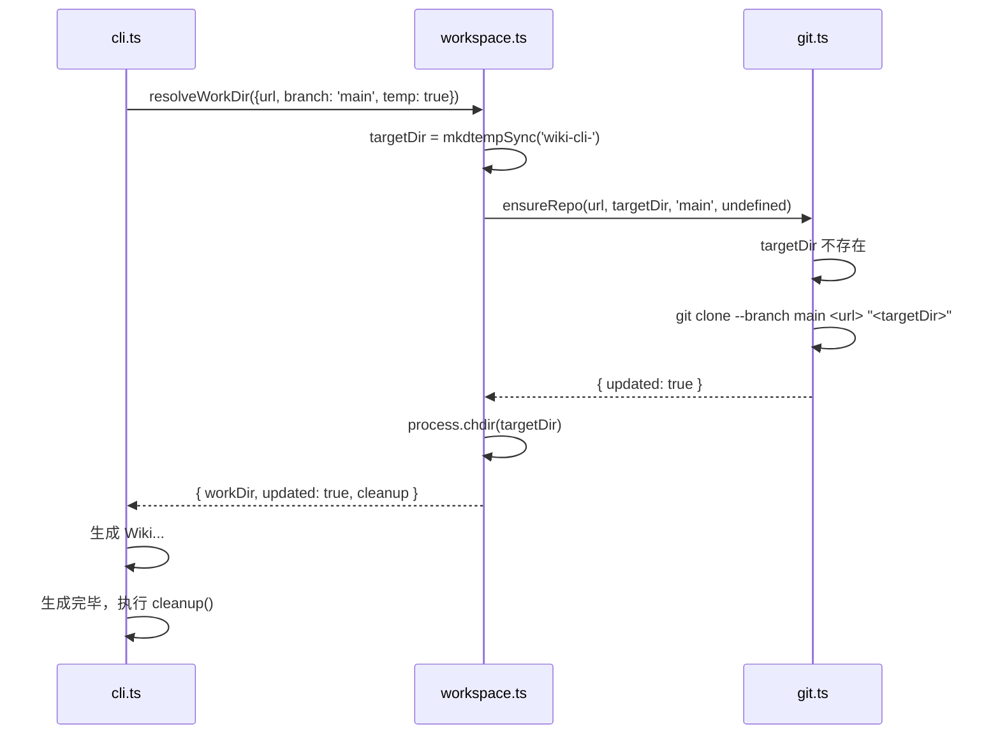

现在我有足够的信息来撰写这篇文档了。

---

# 工作目录解析与Git集成

`resolveWorkDir` 与 `ensureRepo` 构成 Wiki CLI 的**源材料获取层**。这两层函数承担同一个职责：将用户输入（本地路径或远程 URL）转化为一个可用的、已定位到正确分支的 Git 工作目录。从这个目录开始，下游的生成引擎、AI 问答、状态比对等模块才能读取源文件。

## 1. 四分支决策树

`resolveWorkDir`（定义于 `src/utils/workspace.ts`）是一个**基于 `url` 存在性的路由枢纽**。一旦检测到 `url` 参数，所有逻辑跳至远程仓库处理分支；否则走本地路径分支。

其核心结构可用如下决策树概括：

```mermaid
flowchart TD
    A[resolveWorkDir options] --> B{url 存在?}
    B -->|否| C[本地目录模式]
    B -->|是| D{temp?}
    D -->|是| E[临时克隆模式]
    D -->|否| F{output 指定?}
    F -->|是| G[指定路径克隆]
    F -->|否| H[缓存仓库模式]
    C --> I[取 dir 或 cwd]
    I --> J{有 branch?}
    J -->|是| K[git checkout branch]
    J -->|否| L[直接使用]
    E --> M[mkdtemp 创建临时目录]
    G --> N[resolve(output) 并 mkdir]
    H --> O[defaultRepoDir 缓存路径]
    M --> P[ensureRepo 克隆]
    N --> P
    O --> P
    P --> Q[process.chdir(targetDir)]
    Q --> R{temp?}
    R -->|是| S[返回 cleanup 函数]
    R -->|否| T[正常返回]
```

来源：[`src/utils/workspace.ts#L31-L79`](src/utils/workspace.ts#L31-L79)

### 1.1 本地目录模式（`-C`）

无 `url` 时，`workDir` 取自显式 `dir` 参数或 `process.cwd()`。若指定了 `branch`，则直接执行 `git checkout <branch>`——这是唯一不经过 `ensureRepo` 的分支切换路径。

```typescript
const workDir = dir ? resolve(dir) : process.cwd();
if (!existsSync(workDir)) {
  throw new Error(`Directory not found: ${workDir}`);
}
if (branch) {
  execSync(`git checkout ${branch}`, { cwd: workDir, stdio: 'pipe' });
}
```

**关键细节**：本地模式下的 `output` 参数与 `workDir` 独立——`outputDir` 仅作为 Wiki 文档的输出路径，不影响工作目录本身。这允许用户从本地仓库读取代码，将生成的 Wiki 写入另一位置。

来源：[`src/utils/workspace.ts#L62-L77`](src/utils/workspace.ts#L62-L77)

### 1.2 远程缓存仓库模式（`--url`）

当仅指定 `--url`（无 `--temp`、无 `--output`）时，目标目录由 `defaultRepoDir(url)` 计算得出：

```typescript
targetDir = defaultRepoDir(url);                    // ~/.wiki-cli/repos/<encoded-name>
await mkdir(REPOS_DIR, { recursive: true });       // 确保缓存根目录存在
```

该模式下，仓库被克隆/更新到 `~/.wiki-cli/repos/` 下的持久缓存中。后续对同一 URL 再次调用，将触发 `ensureRepo` 的更新分支而非全新克隆。

来源：[`src/utils/workspace.ts#L45-L48`](src/utils/workspace.ts#L45-L48)

### 1.3 临时克隆模式（`--url --temp`）

`--temp` 触发临时目录创建：

```typescript
targetDir = mkdtempSync(join(tmpdir(), 'wiki-cli-'));
```

`ensureRepo` 执行完成后，此模式返回一个 `cleanup` 函数：

```typescript
cleanup: async () => {
  const { rm } = await import('node:fs/promises');
  await rm(targetDir, { recursive: true, force: true });
},
```

调用方（如 [`aiCommand`](ai代码问答.md) 或 [`generateCommand`](生成wiki文档.md)）在生命周期结束时执行 `cleanup()` 即完成临时目录的递归删除。需要注意的是，`process.chdir(targetDir)` 已经在 `resolveWorkDir` 中执行，调用方在 `cleanup` 之前应确保已离开该目录或不再依赖它。

来源：[`src/utils/workspace.ts#L39-L40`](src/utils/workspace.ts#L39-L40)、[`src/utils/workspace.ts#L56-L62`](src/utils/workspace.ts#L56-L62)

### 1.4 指定路径克隆模式（`--url --output`）

当 `--output` 与 `--url` 同时出现（且无 `--temp`）时，`targetDir` 被显式设为用户指定的路径：

```typescript
targetDir = resolve(output);
await mkdir(targetDir, { recursive: true });
```

这意味着用户可以对克隆位置有完全的控制权。与缓存模式不同，此处不会建立任何缓存命名约定，每次调用都是全新的目标目录（如果目录已存在则触发更新逻辑）。

来源：[`src/utils/workspace.ts#L42-L44`](src/utils/workspace.ts#L42-L44)

## 2. 缓存目录命名规则

`urlToDirName` 函数负责将 Git 远程 URL 编码为文件系统安全的目录名：

```typescript
function urlToDirName(url: string): string {
  const cleaned = url
    .replace(/^https?:\/\//, '')    // 移除协议前缀
    .replace(/\.git$/, '')          // 移除 .git 后缀
    .replace(/[\/:]/g, '-');        // 斜杠和冒号替换为横线
  return cleaned;
}
```

转换实例：

| 原始 URL | 编码后目录名 |
|---|---|
| `https://github.com/user/repo.git` | `github.com-user-repo` |
| `https://gitlab.com/group/sub-group/project` | `gitlab.com-group-sub-group-project` |
| `http://localhost:3000/project.git` | `localhost-3000-project` |

该命名通过 `defaultRepoDir` 拼接至 `~/.wiki-cli/repos/` 基路径下：

```typescript
export function defaultRepoDir(url: string): string {
  return join(REPOS_DIR, urlToDirName(url));
}
```

来源：[`src/utils/workspace.ts#L17-L29`](src/utils/workspace.ts#L17-L29)

## 3. `ensureRepo` 双模式

`ensureRepo`（定义于 `src/utils/git.ts`）是仓库获取的核心执行者，透出统一的 `EnsureRepoResult` 接口：

```typescript
export interface EnsureRepoResult {
  updated: boolean;  // false 表示网络不可用，使用已有缓存
}
```

### 3.1 更新已存在（Update）

若 `targetDir` 已存在，执行**更新而非克隆**：



关键行为：

- **网络不可用降级**：`git fetch --all` 失败时捕获异常，记录警告并返回 `{ updated: false }`，而非抛出错误。调用方（如 [`generateCommand`](生成wiki文档.md)）据此判断是否使用已有的 Wiki 缓存。
- **分支同步**：当指定 `branch` 时，先后执行 `git checkout <branch>` 和 `git merge origin/<branch>`，确保本地分支与远程同步。
- **无分支参数**：当不指定 `branch` 时，执行裸 `git merge`，其行为等价于 `git merge @{upstream}`，即合并当前分支的远程跟踪分支。

来源：[`src/utils/git.ts#L9-L42`](src/utils/git.ts#L9-L42)

### 3.2 全新克隆（Clone）

若 `targetDir` 不存在，执行完整克隆：

```typescript
const cmd = `git clone ${depthFlag} ${branchFlag} ${url} "${targetDir}"`
  .replace(/\s+/g, ' ').trim();
execSync(cmd, { stdio: 'inherit' });
```

`depthFlag` 和 `branchFlag` 仅在用户显式传入时附加。`stdio: 'inherit'` 使克隆进度直接输出到终端。任何错误会被包装为包含 URL 的友好异常。

来源：[`src/utils/git.ts#L31-L41`](src/utils/git.ts#L31-L41)

## 4. 分支切换逻辑汇总

系统中有两处分支切换逻辑，分别对应不同场景：

| 场景 | 执行位置 | 执行命令 | 是否含 merge |
|---|---|---|---|
| 本地目录 `-C -b` | `workspace.ts` | `git checkout <branch>` | 否 |
| 远程仓库 `--url -b` | `git.ts` `ensureRepo` 更新分支 | `git checkout <branch>` + `git merge origin/<branch>` | 是 |
| 远程仓库 `--url -b` | `git.ts` `ensureRepo` 克隆分支 | `git clone --branch <branch>` | 克隆即定位 |

本地目录模式只切换不合并，假设用户拥有仓库的完整本地控制权；远程仓库模式则确保与远程完全同步。

来源：[`src/utils/workspace.ts#L68-L73`](src/utils/workspace.ts#L68-L73)、[`src/utils/git.ts#L18-L27`](src/utils/git.ts#L18-L27)

## 5. 调用链路举例

以 `generate --url https://github.com/user/repo.git -b main -t` 为例的完整流程：



来源：[`src/commands/generate.ts#L44-L50`](src/commands/generate.ts#L44-L50)

## 下一步

工作目录解析完成后，下游调用方开始实际工作。推荐阅读：

- [生成Wiki文档](生成wiki文档.md)：两阶段生成引擎如何从解析后的工作目录读取源文件
- [远程仓库支持](远程仓库支持.md)：基于 `resolveWorkDir` 的远程仓库全流程解析
- [AI代码问答](ai代码问答.md)：AI 问答命令如何利用临时克隆模式实现零残留交互
- [查看Wiki状态](查看wiki状态.md)：状态比对命令如何利用 `resolveWorkDir` 获取工作目录